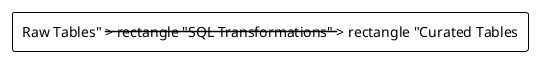
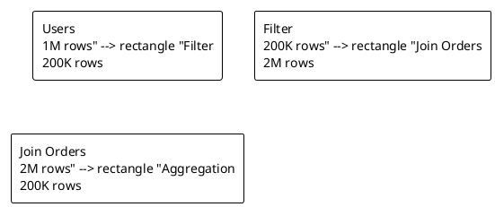
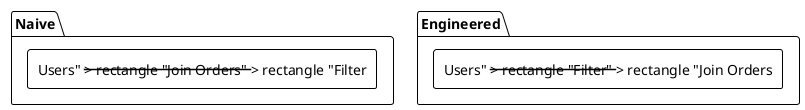
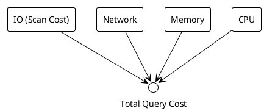

# Agent Instructions: Refining Weeks 1–2 (Data Engineering Course)

## Goal
Refine **Weeks 1 and 2** into engaging, scientific, and example-driven lecture material.
The output should be **slide-ready**, with **small slides** (one core idea per slide),
clear narrative flow, and visual explanations using **PlantUML diagrams**.

The agent should act as:
- A senior data engineering instructor
- A scientific explainer (precise but accessible)
- A slide designer (clarity > density)

---

## General Slide Principles
- One *idea* per slide
- Max 5–6 bullet points per slide
- Prefer diagrams over text when explaining systems
- Always answer: *Why does this matter in practice?*
- Each section should end with a short takeaway slide

---

## Week 1 – Foundations of Data Engineering

### Learning Narrative
**From SQL statements → data pipelines → cost-aware systems**

### Required Sections

#### 1. Why Data Engineering Exists
**Purpose**
Explain why SQL alone is insufficient in modern systems.

**Slide Guidance**
- One slide: problem statement
- One slide: system-level view

**PlantUML Diagram**
```plantuml
@startuml
!theme plain
rectangle "Data Sources\n(APIs, Logs, Apps)" as S
rectangle "Ingestion" as I
rectangle "Raw Storage" as R
rectangle "Transformation\n(SQL / Spark)" as T
rectangle "Analytics / BI" as A

S --> I --> R --> T --> A
@enduml
```

---

#### 2. Data Engineer vs Data Scientist
**Purpose**
Clarify responsibility boundaries early.

**Slide Guidance**
- One comparison slide
- One boundary diagram slide

**PlantUML Diagram**
```plantuml
@startuml
!theme plain
rectangle "Raw Data" --> rectangle "Clean Data" --> rectangle "Features" --> rectangle "Models"
note top of "Clean Data" : Data Engineer
note top of "Features" : Data Scientist
@enduml
```

---

#### 3. SQL as a Transformation Layer
**Purpose**
Reframe SQL as part of a pipeline, not the full system.

**Slide Guidance**
- One conceptual slide
- One pipeline slide

**PlantUML Diagram**


---

#### 4. Query as a Dataflow
**Purpose**
Make execution and intermediate sizes explicit.

**Slide Guidance**
- One slide per logical step
- Explicit row/size annotations

**PlantUML Diagram**


---

#### 5. Naive vs Engineered Queries
**Purpose**
Introduce engineering thinking.

**Slide Guidance**
- Side-by-side comparison
- One takeaway slide

**PlantUML Diagram**


---

## Week 2 – Thinking Like a Data Engineer

### Learning Narrative
**From writing queries → reasoning about cost**

---

#### 1. What Makes a Query Expensive?
**Purpose**
Demystify cost beyond syntax.

**Slide Guidance**
- One slide: cost components
- One slide: real numbers example

**PlantUML Diagram**


---

#### 2. Cost-Aware Query Design
**Purpose**
Teach students how engineers think before coding.

**Slide Guidance**
- One checklist slide
- One applied example slide

**Checklist**
- What is the largest table?
- Can I filter earlier?
- What is the biggest intermediate?
- Where does data move?

---

#### 3. Practical Example (End-to-End)
**Purpose**
Tie concepts together.

**Slide Guidance**
- One slide: problem
- One slide: naive solution
- One slide: engineered solution
- One slide: cost comparison

---

## Output Requirements
The refined content should be delivered as:
- Markdown files (Pandoc-compatible)
- Each section clearly marked with slide breaks (`---`)
- PlantUML blocks included inline
- No slide should feel crowded

---

## Success Criteria
A student should be able to:
- Explain *why* data engineering exists
- Draw a data pipeline from memory
- Explain why one SQL query is more expensive than another
- Think about cost *before* writing SQL

