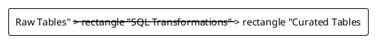
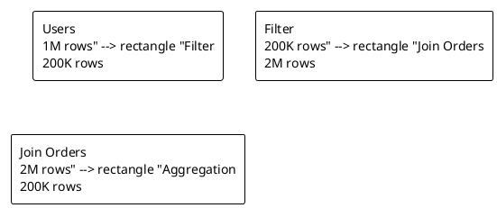
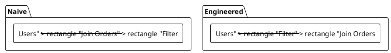

# Week 1: Foundations of Data Engineering  
**From SQL Statements → Data Pipelines → Cost-Aware Systems**

---

## Purpose
- Understand why data engineering exists
- Place SQL inside a broader system
- Start thinking in pipelines and costs

---

## Learning Objectives
By the end of this lecture, students will be able to:
- Explain why SQL alone is insufficient in modern data systems
- Draw a basic data pipeline from memory
- Distinguish data engineering vs data science responsibilities
- Treat SQL as a transformation layer in a pipeline
- Reason about dataflow and intermediate sizes
- Identify naive vs engineered SQL patterns

---

## Why Data Engineering Exists (Problem Statement)
- SQL answers *questions*; systems must move and organize *data*
- Real data comes from many sources, formats, and speeds
- Reliability, cost, and latency live outside a single query
- Pipelines must run daily, not just once

**Why this matters:** production data must be repeatable and efficient.

---

## Why Data Engineering Exists (System View)
```plantuml
@startuml
!theme plain
rectangle "Data Sources\n(APIs, Logs, Apps)" as S
rectangle "Ingestion" as I
rectangle "Raw Storage" as R
rectangle "Transformation\n(SQL / Spark)" as T
rectangle "Analytics / BI" as A

S --> I --> R --> T --> A
@enduml
```

---

## Takeaway: SQL Is One Layer
- Data engineering is the system around SQL
- Pipelines connect sources to decisions
- Systems make SQL useful at scale

---

## Data Engineer vs Data Scientist (Comparison)
- **Data Engineer:** pipelines, reliability, scale, cost
- **Data Scientist:** features, models, experiments, accuracy
- Both depend on clean, trusted data

**Why this matters:** unclear roles create broken pipelines.

---

## Boundary Diagram
```plantuml
@startuml
!theme plain
rectangle "Raw Data" --> rectangle "Clean Data" --> rectangle "Features" --> rectangle "Models"
note top of "Clean Data" : Data Engineer
note top of "Features" : Data Scientist
@enduml
```

---

## Takeaway: Clear Handoffs
- Engineers deliver *clean, reliable data*
- Scientists build *useful models* on top
- Boundaries prevent blame and rework

---

## SQL as a Transformation Layer (Concept)
- SQL shapes raw data into curated tables
- It is not ingestion, storage, or serving
- Pipelines include many steps around SQL

**Why this matters:** query design depends on what comes before and after.

---

## SQL in a Pipeline


---

## Takeaway: SQL Is a Stage
- Treat SQL like a stage in a production line
- Upstream affects cost; downstream affects format

---

## Query as a Dataflow (Step 1: Filter)
- Start with 1M users
- Filter to a subset (e.g., country = 'US')
- Output size drops to 200K

**Why this matters:** early filters reduce cost.

---

## Query as a Dataflow (Step 2: Join)
- Join 200K users to 2M orders
- Intermediate grows to millions of rows
- Joins often dominate cost

---

## Query as a Dataflow (Step 3: Aggregate)
- Group by user_id
- Output shrinks back to 200K rows
- Aggregation depends on join size

---

## Dataflow With Sizes


---

## Takeaway: Intermediate Size = Cost
- The biggest intermediate defines memory and network pressure
- Dataflow thinking exposes hidden cost

---

## Naive vs Engineered Queries (Side-by-Side)


---

## Why Engineered Wins
- Filter early to shrink join input
- Smaller joins = less memory + network
- Cost-aware order beats syntactic convenience

---

## Takeaway: Think Like an Engineer
- Query order changes system cost
- Engineers optimize *data movement*, not just SQL syntax

