# Week 1: Introduction to Data Engineering

## Purpose
- Why data engineering matters in modern systems
- Engineering problems that require data engineering
- Scale, reliability, and cost as first-class concerns

## Learning Objectives
- **Frame** data engineering as constraints (scale, reliability, cost)
- Calculate data volume growth and storage requirements
- Design basic data pipeline architectures
- Estimate pipeline costs (time, storage, network)
- Identify failure modes and why systems break
- Reason about trade-offs: batch vs streaming, SQL vs NoSQL

## What is Data Engineering?

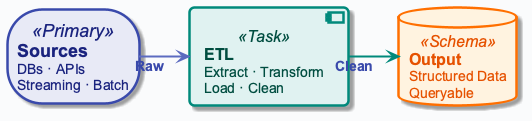

## Constraints, Not Definitions
- **Constraint:** data lives in many systems; consumers need one place
- **Constraint:** volume and velocity grow; single machines break
- **Constraint:** failures happen; pipelines must be rerunnable
- **Output:** clean, queryable data at the right latency and cost
- **Not:** building ML models or dashboards — we build plumbing

## Core Problem Statement
- Data exists in many sources (databases, APIs, files)
- Consumers need unified, reliable access
- **Scale:** millions of records, terabytes daily
- **Time:** batch (hours) vs real-time (seconds)
- **Quality:** missing, duplicate, inconsistent data

## Formal Volume Model
- Let \(V_d\) = daily raw volume (GB/day)
- Retention \(R\) days, compression factor \(c\), replication \(r\)
$$
S = \frac{V_d \cdot R \cdot r}{c}
$$
- Interpretation: total storage footprint across the cluster
- Engineering implication: cost scales linearly in volume and replication

## Business Intelligence Context

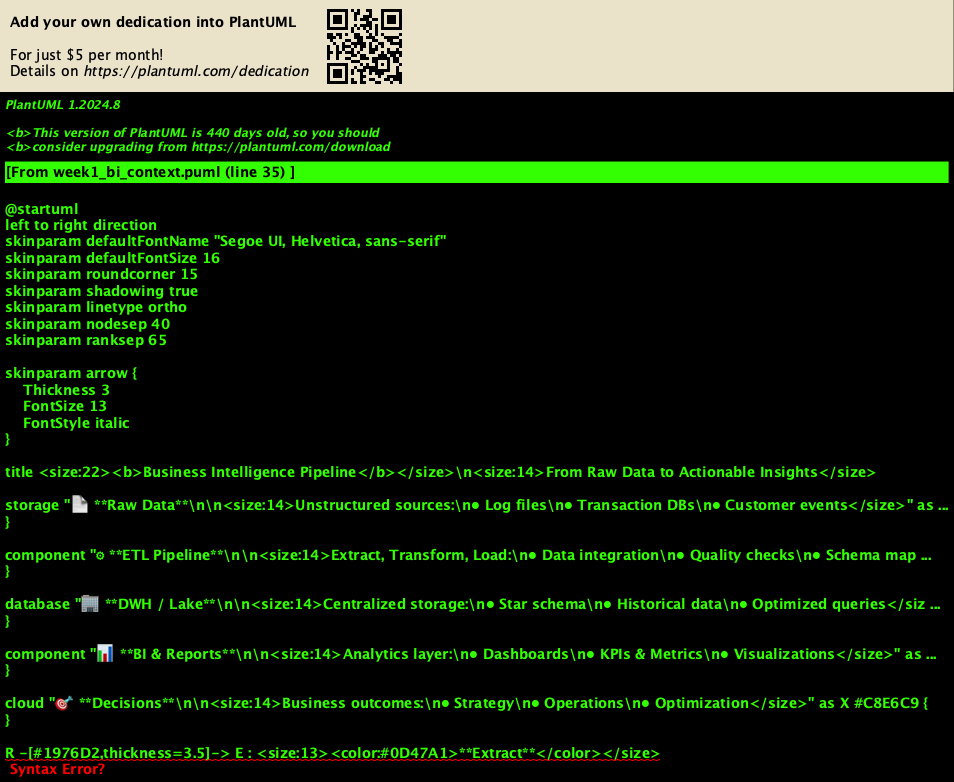

## What is Business Intelligence?- **Definition:** methodologies and technologies transforming raw data
- Converts raw data into significant business information
- Enables decision-making, not replaces it
- Use technology as a tool for business purpose

## What is Business Intelligence?- **Benefits:** handle large amounts of data efficiently
- Identify and evolve new opportunities
- Provide comparable market benefit and long-term stability
- Enable data-driven decision making

## Data to Wisdom Pyramid

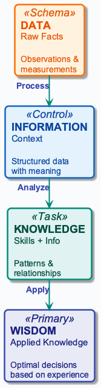
- **Data:** raw facts describing event characteristics
- Example: 51, 77, 58, 82, 64, 70
- **Information:** data converted into meaningful insights
- Example: "Test scores; average is 67"

## Data to Wisdom Pyramid- **Knowledge:** skills and experience coupled with information
- Creates intellectual resources from information
- **Wisdom:** applied knowledge — knowing what to do
- Example: "I better stop the car!" at red light
- **DE builds:** pipeline from raw data to information

## Data Mining in Data Engineering- **Definition:** computational process discovering patterns in data
- Uses AI, ML, statistics, and database systems
- Operates on large data sets

## Data Mining in Data Engineering- **Tasks:** classification, estimation, prediction
- **Tasks:** affinity grouping, description (finding patterns)
- **Techniques:** market basket, clustering, PCA, decision trees
- **Role in DE:** provides clean data that mining consumes

## Knowledge Discovery in Databases- **Definition:** automatic extraction of hidden knowledge
- Extracts non-obvious patterns from large data volumes
- **Process:** Cleaning → Integration → Selection → Mining → Evaluation

## Knowledge Discovery in Databases- **Intersecting fields:** databases, statistics, machine learning
- Databases store and provide access
- Statistics infer information from samples
- ML provides algorithms that improve through experience
- **DWH role:** integrated data; OLAP enables KDD at scale

## Data Engineering vs Data Science

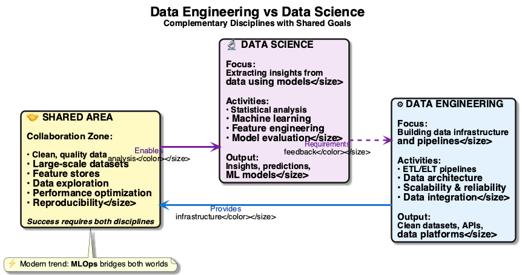

## Data Science Focus
- Build predictive models
- Statistical analysis
- Experimentation
- Output: insights, predictions, recommendations

## Data Engineering Focus
- Build data pipelines
- Infrastructure and reliability
- Scale and performance
- Output: datasets, APIs, data products

## Overlap
- Both need clean data
- Both work with large datasets
- Engineering enables science
- Science informs engineering requirements

## Data Engineering vs Analytics


## Analytics Focus
- Answer business questions
- Create reports and dashboards
- Ad-hoc exploration
- Output: charts, tables, insights

## Data Engineering Focus (Analytics Context)
- Make analytics possible
- Provide reliable data infrastructure
- Automate data preparation
- Output: data platforms, pipelines

## Relationship
- Analytics consumes engineering output
- Engineering builds what analytics needs
- Both serve business stakeholders
- Clear separation of concerns

## Why Data Engineering Exists

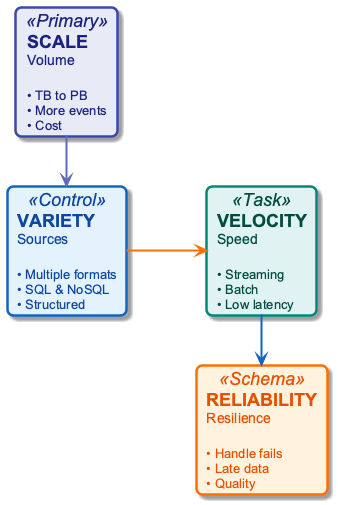

## The Scale Problem
- 2010: 1 TB/day typical company
- 2020: 1 PB/day at scale
- Growth: ~10× every 5 years
- Linear scripts and single-node DBs hit a wall
- **Cost of naïveté:** 20-hour runs, then failures

## The Variety Problem
- Sources: databases, APIs, logs, files
- Formats: JSON, CSV, Parquet, Avro
- Schemas: structured, semi-structured, unstructured
- **Constraint:** integration is complex and error-prone

## The Velocity Problem
- Batch: process once per day
- Streaming: process in real-time
- Latency: seconds to hours; throughput: 100K–1M events/sec
- **Trade-off:** lower latency ⇒ more complexity and cost

## The Reliability Problem
- Data: missing, wrong, late
- Systems: nodes crash, network partitions
- **Production reality:** pipelines fail
- Business impact: wrong decisions, lost revenue
- **Design for failure from day one**

## Data Engineering Lifecycle


## Ingestion
- Extract data from sources
- Handle failures and retries
- Validate basic structure
- Store raw data (immutable)

## Storage
- Choose storage format
- Partition by time/keys
- Replicate for availability
- Optimize for access patterns

## Data Context: Social Media Platform
- Posts: 500M rows; 2.1 KB/row
- Interactions: 10B rows; 33 bytes/row
- Users: 100M rows; 1.2 KB/row
- Raw: JSON; Processed: Parquet (5× compression)
- Retention: 90 days raw; 365 days processed
- Replication: 3×

## In-Lecture Exercise 1: Storage Sizing Warm-up
- Compute raw storage for posts, interactions, users
- Compute Parquet size with 5× compression
- Compute 90-day raw retention storage
- Compute total with 3× replication

## In-Lecture Exercise 1: Solution- Posts raw: 500M × 2.1 KB ≈ 1,050 GB
- Interactions raw: 10B × 33 B ≈ 330 GB
- Users raw: 100M × 1.2 KB ≈ 120 GB
- Total raw ≈ 1,500 GB (1.5 TB)

## In-Lecture Exercise 1: Solution- Parquet 5×: 1,500 GB / 5 ≈ 300 GB
- 90-day raw: 27.6 GB/day × 90 ≈ 2.5 TB
- Replication 3×: raw 7.5 TB; processed 0.9 TB
- Total with replicas ≈ 8.4 TB

## In-Lecture Exercise 1: Takeaway
- Storage sizing must include compression, retention, replication
- Raw and processed layers have very different footprints
- Early sizing prevents cost surprises later

## Processing
- Transform raw to processed
- Clean, deduplicate, enrich
- Aggregate and join
- Apply business logic

## Consumption
- Serve to analytics tools
- Provide APIs for applications
- Generate reports
- Feed ML models

## Lifecycle Diagram

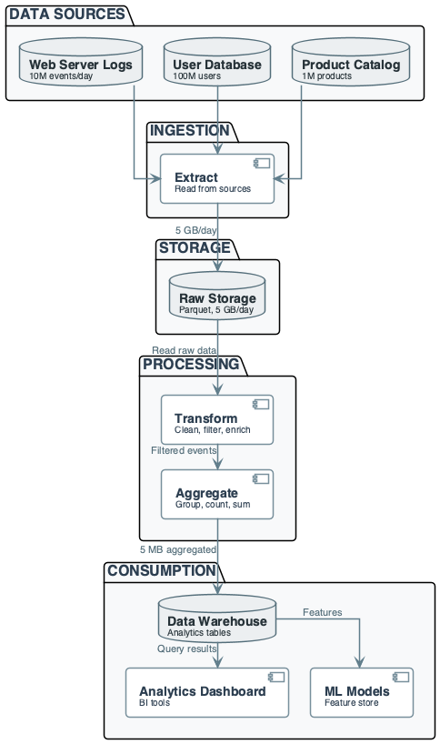


## Core Concepts

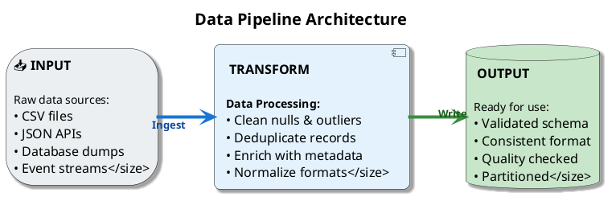

## Data Pipeline
- Sequence of processing steps: Input → Transform → Output
- Each step: independent, testable
- **Failure in one step must not leave partial state**
- **Constraint:** design so reruns produce same result (idempotency)

## ETL vs ELT- **ETL:** Extract → Transform → Load
- Transform before load; smaller storage, faster queries
- **ELT:** Extract → Load → Transform
- Load raw first; preserve raw data, flexible analytics later

## ETL vs ELT- **ETL cost:** compute up front + less storage
- **ELT cost:** more storage + compute on demand
- ETL: good when schema and consumers are stable
- ELT: good when requirements change
- **Opinion:** keep raw immutable; prefer ELT-style raw layer

## Core Concepts

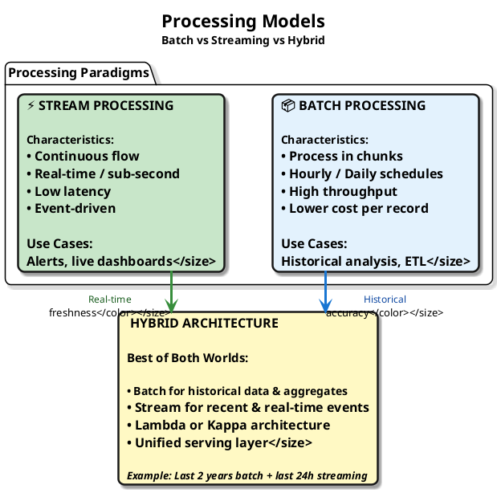

## Batch vs Streaming
- **Batch:** chunks; hourly/daily; latency minutes–hours
- Simpler, cheaper; **breaks when** latency drops to seconds
- **Streaming:** continuous; real-time; latency ms–sec
- Complex, expensive; **breaks when** throughput spikes
- **Hybrid:** batch for history, stream for recent

## In-Lecture Exercise 2: Batch vs Streaming Trade-off
- Trending posts needed within 5 minutes
- Batch: run every 5 minutes; $0.10 per run
- Streaming: always on; $2.00 per hour
- Compute daily cost for batch vs streaming
- Decide approach if latency < 1 minute

## In-Lecture Exercise 2: Solution- Batch daily cost: 288 runs × $0.10 = $28.80
- Streaming daily cost: 24 hours × $2.00 = $48.00
- Streaming costs $19.20 more per day

## In-Lecture Exercise 2: Solution- Latency < 1 minute: batch fails; streaming required
- If cost dominates: batch is cheaper
- Hybrid: stream recent, batch history for lower cost

## In-Lecture Exercise 2: Takeaway
- Latency targets can force streaming despite higher cost
- Cost math makes trade-offs explicit and defensible
- Hybrid designs often balance speed and budget

## Schema-on-Write vs Schema-on-Read
- Schema-on-write: validate at ingestion (warehouse)
- **Fails fast**, rigid
- Schema-on-read: validate at query time (lake)
- **Flexible**, risk of garbage-in
- **Trade-off:** strict schema vs agility

## Core Concepts- **One clear choice per pipeline:** ETL or ELT
- Choose batch or stream; schema-on-write or -read
- Mixing without boundaries leads to cost overruns
- Results in unmaintainable pipelines

## Cost of Naïve Design — What Goes Wrong Without Discipline- **Naïve:** "one script, one DB, run nightly"
- Works until volume doubles; then 20-hour runs
- Timeouts, no observability

## What Goes Wrong Without Discipline- **Naïve:** no raw layer — cannot reprocess on schema change
- **Cost:** full re-ingestion or lost history
- **Naïve:** no idempotency — rerun doubles counts
- **Takeaway:** constraints force pipeline design

## Running Example — Data & Goal: Scenario (E-commerce Clickstream)
- Source: web server logs
- Volume: 10M events/day
- Format: JSON, 500 bytes/event
- Content: user_id, page, timestamp, action

## Goal
- Calculate daily page views per product
- Serve to analytics dashboard
- Latency: data available within 1 hour
- Reliability: 99.9% success rate

## Constraints
- Storage: 5 GB/day raw logs
- Processing: 1 hour window acceptable
- Cost: minimize compute hours
- Quality: handle missing user_ids

## Running Example — Step-by-Step: Ingestion
- Read log files from S3
- Parse JSON events
- Validate: timestamp, page present
- Write to raw storage (Parquet)
- Output: 10M events, 5 GB

## Ingestion Diagram

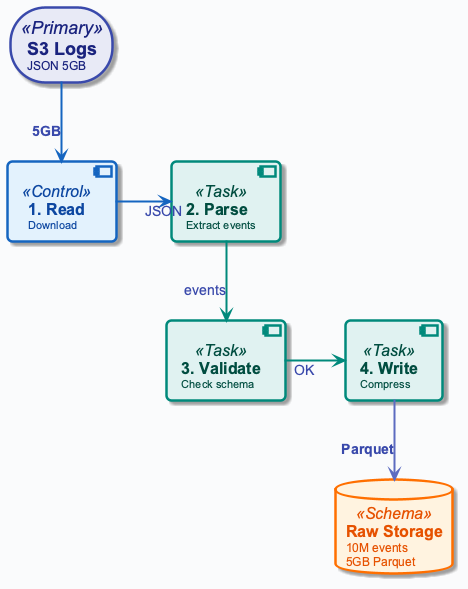

## Running Example — Step-by-Step: Transformation
- Filter: only "page_view" events
- Extract: product_id from page URL
- Clean: remove invalid product_ids
- Group: by (date, product_id)
- Count: events per group

## Transformation Logic
```
Input: {user_id, page, timestamp, action}
Filter: action == "page_view"
Extract: product_id = parse(page)
Group: (date(timestamp), product_id)
Output: (date, product_id, view_count)
```

## Running Example — Step-by-Step: Aggregation
- Input: filtered events (8M after filter)
- Group by: (date, product_id)
- Aggregate: count(*) as views
- Output: 50K products × 1 day = 50K rows

## Aggregation Example
```
Raw: 8M page_view events
Group: by (2024-01-15, product_123)
Result: 1,250 views for product_123
Output row: (2024-01-15, product_123, 1250)
```

## Running Example — Step-by-Step: Load to Analytics
- Write aggregated results
- Format: Parquet, partitioned by date
- Destination: data warehouse
- Size: 50K rows × 100 bytes = 5 MB

## Engineering Interpretation
- Reduction: 5 GB → 5 MB (1000×)
- Latency: 45 minutes end-to-end
- Cost: $0.50 per day (compute)
- Reliability: 99.95% success rate
- Trade-off: 1-hour delay acceptable

## Cost & Scaling Analysis: Time Model
- Ingestion: 10 minutes (I/O bound)
- Transformation: 20 minutes (CPU bound)
- Aggregation: 10 minutes (CPU bound)
- Load: 5 minutes (I/O bound)
- Total: 45 minutes

## Scaling Time
- 2× data: 90 minutes (linear)
- 10× data: 7.5 hours (linear)
- Parallelization: divide by N workers
- Example: 10 workers → 4.5 minutes

## Time Cost Formula
```
T_total = T_ingest + T_transform + T_aggregate + T_load
T_parallel = T_sequential / N_workers
Bottleneck: max(T_ingest, T_transform, T_aggregate, T_load)
```

## Cost & Scaling Analysis: Memory Model
- Raw data: 5 GB (compressed)
- Intermediate: 2 GB (after filter)
- Final output: 5 MB (aggregated)
- Peak memory: 5 GB (during ingestion)

## Storage Cost
- Raw: 5 GB/day × 30 days = 150 GB/month
- Processed: 5 MB/day × 30 days = 150 MB/month
- Retention: 90 days raw, 365 days processed
- Cost: $0.023/GB/month = $3.45/month raw

## Storage Scaling
- 10× volume: 1.5 TB/month raw
- Cost: $34.50/month
- Compression: 5× reduction possible
- Compressed: $6.90/month

## Cost & Scaling Analysis: Network Model
- Ingestion: 5 GB from source
- Processing: 0 GB (local)
- Output: 5 MB to warehouse
- Total: 5.005 GB transferred

## Network Cost
- Ingress: $0.00 (free)
- Egress: $0.09/GB = $0.45/day
- Monthly: $13.50
- Scaling: 10× volume = $135/month

## Throughput Limits
- Network: 1 Gbps = 125 MB/s
- Transfer time: 5 GB / 125 MB/s = 40s
- Bottleneck: network if > 1 Gbps needed
- Solution: parallel transfers

## Pitfalls & Failure Modes: Missing Data
- Problem: user_id null in 5% of events
- Impact: undercounted page views
- Detection: count nulls, alert if > 1%
- Mitigation: use session_id as fallback

## Duplicate Events
- Problem: same event processed twice
- Impact: double-counted views
- Detection: check event_id uniqueness
- Mitigation: deduplicate by (event_id, timestamp)

## Schema Drift
- Problem: new field added to logs
- Impact: pipeline fails or ignores field
- Detection: schema validation errors
- Mitigation: schema evolution, versioning

## Pitfalls & Failure Modes: Pipeline Failure Scenario
- Step 1 (ingestion): succeeds
- Step 2 (transform): fails at 50%
- Step 3 (aggregate): never runs
- Step 4 (load): never runs
- Result: partial data, inconsistent state

## In-Lecture Exercise 3: Failure Impact & Checkpointing
- Pipeline processes 10,000 posts and 100,000 interactions
- Failure at 30 minutes; 50% processed, 50% lost
- Manual investigation + rerun takes 2 hours
- Add checkpoints every 10 minutes; recompute loss and recovery

## In-Lecture Exercise 3: Solution- Data loss: 5,000 posts and 50,000 interactions
- Recovery time: 30 min + 120 min + 60 min = 210 min
- Hourly cadence delays about 3–4 runs

## In-Lecture Exercise 3: Solution- Checkpoint at 20 min: 10 minutes of data lost
- Loss with checkpoints: 1,667 posts; 16,667 interactions
- Recovery time: resume 40 minutes, no investigation

## In-Lecture Exercise 3: Takeaway
- Checkpointing cuts loss and recovery time dramatically
- Failure math drives reliability investment decisions
- Design for recovery, not just success

## Failure Propagation Diagram

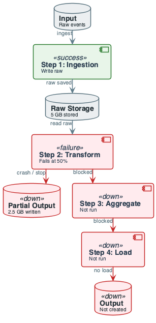

## Recovery Strategies
- Retry: automatic, 3 attempts
- Checkpoint: save state after each step
- Rollback: delete partial outputs
- Manual: investigate, fix, rerun

## Pitfalls & Failure Modes: Late Data
- Problem: events arrive 2 hours late
- Impact: yesterday's report incomplete
- Detection: watermark, late event metrics
- Mitigation: reprocess window, alert

## Resource Exhaustion
- Problem: memory full during aggregation
- Impact: pipeline crashes, no output
- Detection: OOM errors, monitoring
- Mitigation: increase memory, partition data

## Cost Overruns
- Problem: 10× data volume, 10× cost
- Impact: budget exceeded
- Detection: cost alerts, daily reports
- Mitigation: optimize queries, compress data

## Best Practices: Start with Business Questions
- What decisions need data? Who consumes it?
- What latency is acceptable?
- **Don't build pipelines without purpose**

## Store Raw Data & Idempotency
- **Raw data:** never delete; immutable; enables reprocessing
- Keep cost low with compression
- **Idempotent operations:** rerun ⇒ same output
- Deterministic transforms; avoid time-dependent logic

## Monitor & Version
- **Monitor:** success/failure, data quality, latency, cost
- **You can't fix what you don't measure**
- **Version:** code (Git), schema (versioned), data (timestamped)

## Best Practices: CRISP-DM Methodology- **Cross-Industry Standard Process for Data Mining**
- Most widely-used analytics model
- **Six phases:** Business → Data Understanding → Preparation
- Continues: Modeling → Evaluation → Deployment

## CRISP-DM Methodology- Data preparation is often 60-80% of work
- Data engineering enables all phases
- **Iterative nature:** phases cycle back
- Pipelines must support reprocessing and iteration

## Proof of Concept (POC)
- **Definition:** realization demonstrating feasibility
- Small and may not be complete
- Test feasibility of business concepts
- Accelerate business innovation goals

## POC Tips
- Use your own data — external data proves nothing
- Limit scope of data sources; use samples
- Don't get distracted by pretty visuals
- Address future and present requirements
- Demand one solid report before financial commitment

## Test & Design for Failure
- **Test:** unit (functions), integration (pipeline), data (outputs)
- Simulate failure scenarios
- **Design for failure:** assume components fail
- Retry, checkpoints, recovery procedures

## Document Assumptions & Optimize Last
- **Document:** sources, formats, business rules
- Include expected volumes/latencies, failure modes
- **Optimize last:** first make it work, then reliable, then fast
- **Premature optimization wastes time and hides bugs**

## Recap: Data Engineering — Constraints, Not Definitions
- **Constraints:** scale, reliability, cost
- **Output:** clean, accessible data at the right latency
- **Judgment:** ETL vs ELT, batch vs stream
- Each choice has cost and failure modes

## Engineering Mindset (Non-Negotiable)
- **Calculate** costs and trade-offs before scaling
- **Design for failure** — pipelines and nodes will break
- **Monitor and measure** — no blind spots
- **Start simple, optimize later**

## What's Next
- Distributed databases (Week 2)
- Parallel processing (Week 3)
- ETL pipelines (Week 4)
- Data warehousing (Week 5)

## Pointers to Practice
- Calculate pipeline costs from volumes
- Design pipeline for given requirements
- Identify failure modes and mitigations
- Choose batch vs streaming based on latency
- Estimate storage and network costs

## Additional Diagrams
### Practice: Architecture

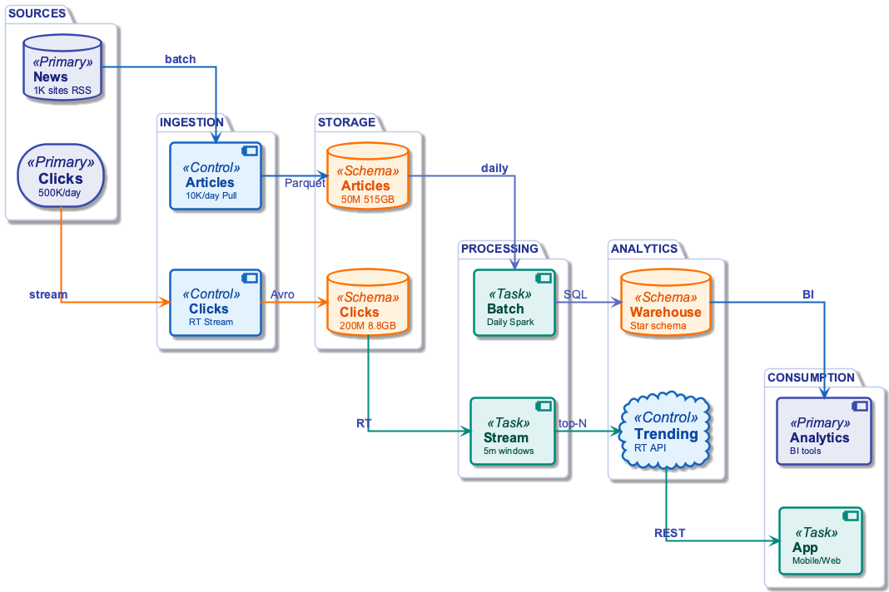
