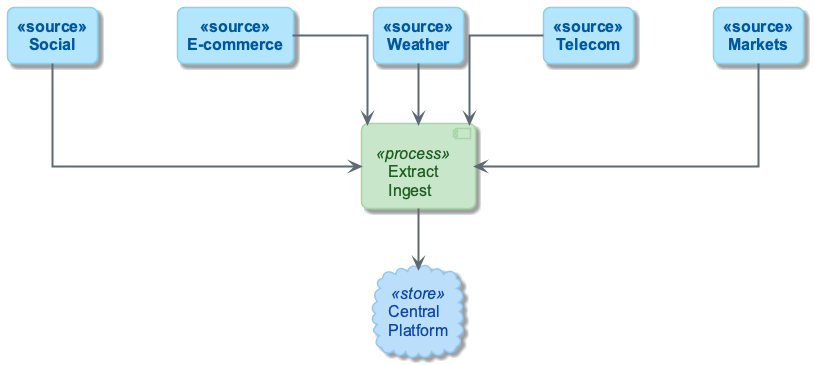
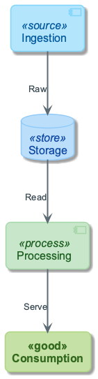
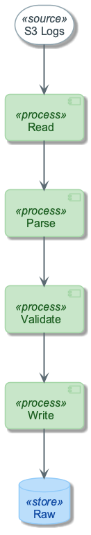
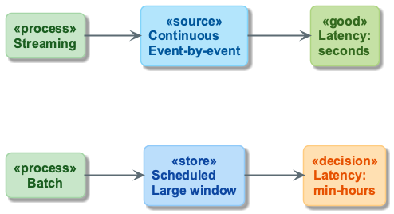
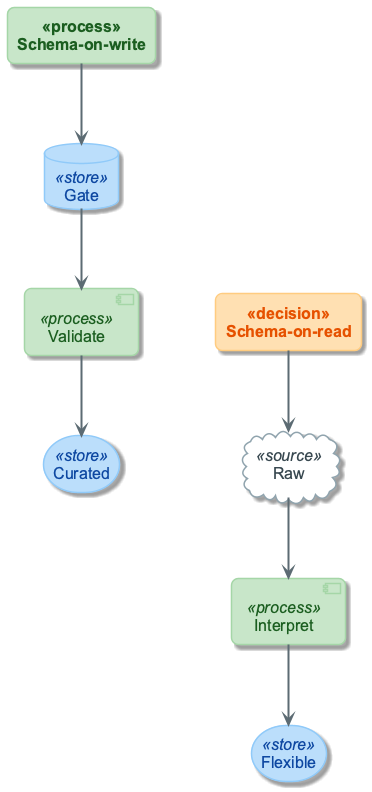
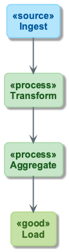
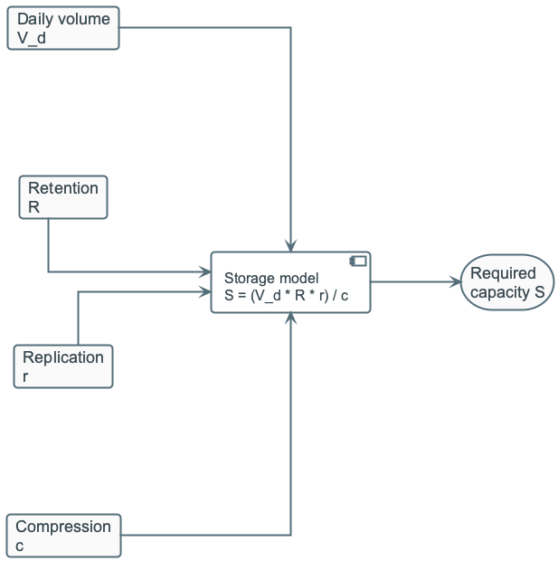
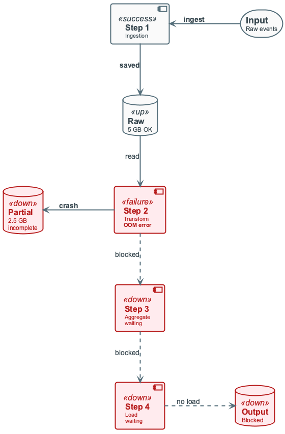

# Week 1: Introduction to Data Engineering

## Course Logistics
- 2 weekly hours
- 15% assignments
- 85% final exam

---

## Prerequisites
- SQL query design and implementation
- Basic data structures (hash table, binary tree)
- Complexity and running-time intuition
- Algorithmic foundations: merge-sort, quick-sort, binary search
- Introductory probability (expectation, variance, conditional probability)

---

## Learning Outcomes
- Explain core data engineering constraints
- Design a basic source-to-consumer pipeline
- Estimate storage, runtime, and network costs
- Identify failure modes and mitigation patterns

---

## Why This Course Matters
- Modern systems generate data continuously
- Business decisions depend on trusted pipelines
- Scale, latency, and reliability create trade-offs
- Data engineering turns raw data into usable products

---

## Business Intelligence Context
- BI encompasses data warehousing, reporting, and analytics
- BI supports decision making in organizations
- Data engineers build the platform that feeds BI dashboards and reports

---

## What Is Big Data?
- Large datasets that cannot be processed using traditional computing techniques
- Defined by scale, speed, and complexity
- Not a single tool or product

---

## Big Data in Practice
- User behavior tracking
- Mobile and web application logs
- IoT and sensor streams
- Media and social network content

---

## Sources of Big Data
- Databases, APIs, applications, logs, sensors, media
- Concrete domains: social networks, e-commerce, weather stations, telecom, stock markets

{width=78%}

---

## The 3Vs of Big Data
- **Velocity**: data arrives continuously and quickly
- **Variety**: structured, semi-structured, unstructured
- **Volume**: very large scale (TB to PB)

---

## Cloud Service Models
- **SaaS**: ready-to-use applications
- **PaaS**: managed platform for development
- **IaaS**: virtual compute, storage, networking

---

## Data Scientist vs Data Engineer
- Data scientists create models and insights
- Data engineers build reliable data platforms
- Both roles are interdependent in production systems

---

## Data Engineer: Core Responsibility
- Build and maintain the data platform
- Ensure reliable ingestion and transformation
- Deliver trusted datasets for analytics and ML

---

## Data Engineer: Daily Operations
- Monitor jobs, freshness, and quality
- Handle failures, retries, and reruns
- Improve cost-performance over time

---

## What Is Data Engineering?
- Design systems that move and transform data
- Serve dependable data for analytics, apps, and ML
- Optimize for correctness, latency, and stability

---

## Data Engineering Is Constraint Management
- Sources are fragmented and heterogeneous
- Data volume outgrows single-node capacity
- Pipelines fail and must recover safely
- Cost, latency, and reliability must be balanced

---

## Core Problem Statement
- Many producers, one consistent data view
- Fresh data with clear quality guarantees
- Scalable architecture without uncontrolled costs
- Repeatable pipelines instead of ad-hoc scripts

---

## Why Single Scripts Break
- Runtime grows with data size
- Limited observability slows incident response
- Missing raw layer blocks safe replay
- Non-idempotent writes corrupt outputs on rerun

---

## Lifecycle Overview
- Ingestion
- Storage
- Processing
- Consumption

{width=75%}

---

## Ingestion (Raw Layer)
- Collect from DBs, APIs, files, and logs
- Validate envelope schema and metadata
- Persist immutable raw data for replay
- Add retries and backpressure controls

{width=75%}

---

## Storage Design
- Pick format by workload (e.g., Parquet for analytics)
- Partition by date or high-value keys
- Replicate for durability and availability
- Model hot vs cold storage costs explicitly

---

## Processing
- Clean, deduplicate, standardize
- Enrich with reference dimensions
- Apply deterministic business rules
- Preserve auditable intermediate outputs

---

## Consumption
- Publish tables for BI and dashboards
- Expose data products and APIs
- Feed ML feature pipelines
- Track freshness and data-quality SLAs

---

## Data-Driven Projects and KPIs
- A data-driven approach means strategic decisions based on data analysis
- Key Performance Indicators (KPIs) measure business outcomes
- CRISP-DM and similar frameworks start with business understanding
- Data pipelines must align with business goals and metrics

---

## From Data to Knowledge (KDD)
- **Data**: raw bits, numbers, symbols we collect
- **Information**: data stripped of redundancy, characterized
- **Knowledge**: integrated information with facts and relations
- KDD extracts non-obvious knowledge from large volumes of data
- Data engineering feeds data warehousing and data mining pipelines

---

## ETL vs ELT
- **ETL**: transform before load
- **ELT**: load raw, transform downstream
- ETL favors strict control
- ELT favors flexibility and replayability

---

## Batch vs Streaming
- **Batch**: simpler, cheaper, higher latency
- **Streaming**: lower latency, higher complexity
- Hybrid is common in production
- Decision should follow business SLA

{width=82%}

---

## Schema Strategies
- **Schema-on-write** catches errors early
- **Schema-on-read** speeds source onboarding
- Strict mode improves trust
- Flexible mode improves agility

{width=82%}

---

## Running Example: E-Commerce Clickstream
- Input: 10M events/day (~500 bytes each)
- Goal: daily product page-view aggregates
- SLA: data available within 1 hour
- Reliability target: 99.9% successful runs

---

## Example Step 1: Ingestion
- Read and parse raw event logs
- Validate required fields
- Write immutable partitioned raw data
- Record accepted/rejected counts

---

## Example Step 2: Transformation
- Keep only `page_view` events
- Extract `product_id` from URL
- Drop invalid records with reason codes
- Produce normalized event dataset

---

## Example Step 3: Aggregation
- Group by `(event_date, product_id)`
- Compute `view_count`
- Persist daily aggregates
- Keep lineage to raw source partitions

---

## Example Outcome
- Raw volume: ~5 GB/day
- Aggregate output: ~5 MB/day
- Runtime target: ~45 minutes
- Deterministic reruns are supported

---

## Pipeline Time Model
$$
T_{total} = T_{ingest} + T_{transform} + T_{aggregate} + T_{load}
$$
- Bottleneck stage dominates total runtime
- Parallelism lowers wall-clock time
- Late-arriving data can trigger recomputation

{width=78%}

---

## Storage Capacity Model
$$
S = \frac{V_d \cdot R \cdot r}{c}
$$
- `V_d`: daily volume, `R`: retention days
- `r`: replication factor, `c`: compression factor
- Plan with growth margin, not current usage only

{width=84%}

---

## Network Cost Model
- Ingestion traffic is often the largest share
- Cross-region transfer can dominate cost
- Replication multiplies write bandwidth
- Monitor throughput and queue lag continuously

---

## Common Failure Modes
- Missing or malformed records
- Duplicate events caused by retries
- Schema drift from upstream changes
- Late-arriving data beyond reporting cutoff

---

## Failure Handling Patterns
- Send bad records to DLQ
- Backfill late data safely
- Rerun jobs idempotently
- Preserve audit trail and lineage

{width=74%}

---

## Recovery Strategy
- Idempotent writes and deterministic transforms
- Stage checkpoints for restart safety
- Dead-letter queues for invalid records
- Controlled backfills for corrected data

---

## Minimum Production Monitoring
- Pipeline success/failure rate
- Freshness and end-to-end latency
- Data quality on key fields
- Cost and resource trend tracking

---

## Practical Design Rules
- Start from business questions and SLA
- Keep raw data immutable and replayable
- Prefer simple designs until limits are proven
- Optimize after correctness and reliability

---

## Recap
- Data engineering is system design under constraints
- Reliable pipelines balance latency, quality, and cost
- Failure behavior is part of architecture design
- Next week: distributed databases at scale
