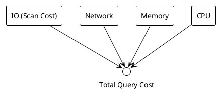

# Week 2: Thinking Like a Data Engineer  
**From Writing Queries → Reasoning About Cost**

---

## Purpose
- Understand what makes queries expensive
- Learn to design queries with cost in mind
- Apply cost reasoning end-to-end

---

## Learning Objectives
By the end of this lecture, students will be able to:
- Identify the main components of query cost
- Estimate cost using data sizes and movement
- Apply a cost-aware checklist before writing SQL
- Compare naive vs engineered solutions
- Explain cost differences using intermediate sizes

---

## What Makes a Query Expensive? (Cost Components)
- **IO:** how much data is scanned
- **Network:** how much data moves between nodes
- **Memory:** how large intermediate results get
- **CPU:** how complex the operators are

---

## Cost Components Diagram


---

## Cost Example (Real Numbers)
- Scan users: **50 MB**
- Scan orders: **1 GB**
- Join intermediate: **500 MB**
- Network shuffle: **500 MB**
- Minimum memory: **500 MB**

**Why this matters:** cost is about *data movement*, not syntax.

---

## Takeaway: Cost Is Physical
- Cost scales with bytes scanned and moved
- Bigger intermediates = bigger bills

---

## Cost-Aware Query Design (Checklist)
- What is the largest table?
- Can I filter earlier?
- What is the biggest intermediate?
- Where does data move?

---

## Applied Example (Checklist in Action)
- Largest table: **orders (1 GB)**
- Filter users to 200K first
- Join smaller input to orders
- Reduce shuffle volume early

---

## Takeaway: Think Before You Code
- A 30-second checklist can save hours of compute
- Cost-aware ordering is a core engineering skill

---

## Practical Example: Problem Statement
**Question:** “How many orders did US users place last month?”

Inputs:
- users (1M rows)
- orders (10M rows)

---

## Practical Example: Naive Solution
```sql
SELECT u.user_id, COUNT(o.order_id)
FROM users u
JOIN orders o ON u.user_id = o.user_id
WHERE u.country = 'US'
  AND o.order_date >= '2024-01-01'
  AND o.order_date < '2024-02-01'
GROUP BY u.user_id;
```

---

## Practical Example: Engineered Solution
```sql
WITH us_users AS (
  SELECT user_id
  FROM users
  WHERE country = 'US'
),
jan_orders AS (
  SELECT user_id, order_id
  FROM orders
  WHERE order_date >= '2024-01-01'
    AND order_date < '2024-02-01'
)
SELECT u.user_id, COUNT(o.order_id)
FROM us_users u
JOIN jan_orders o ON u.user_id = o.user_id
GROUP BY u.user_id;
```

---

## Practical Example: Cost Comparison
- **Naive:** join 1M users × 10M orders
- **Engineered:** join 200K users × 1M orders
- Smaller intermediates → lower IO + network

---

## Takeaway: Cost-Aware Wins
- Filter early, join smaller, aggregate later
- Engineered queries scale with growth

