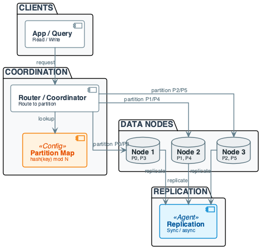
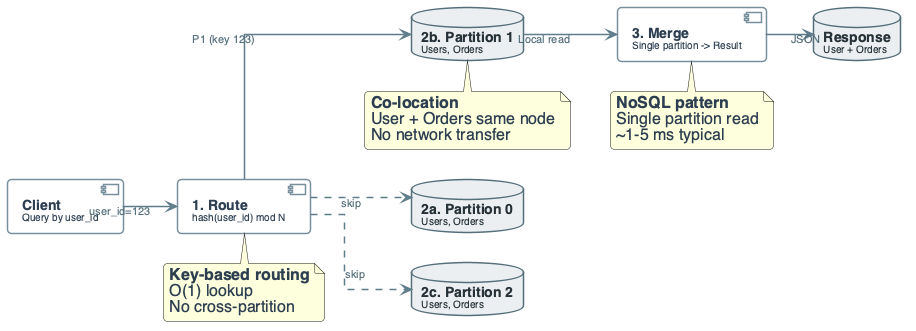
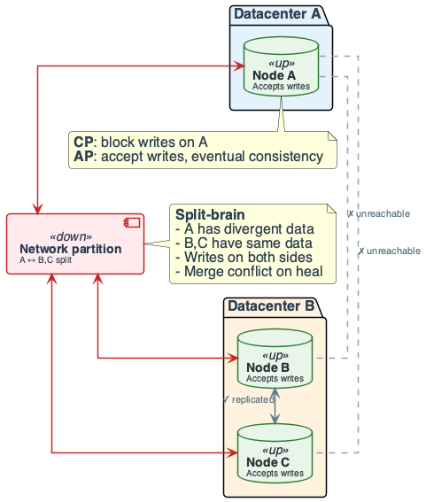
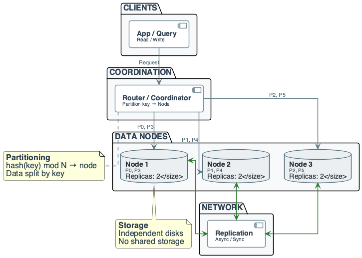
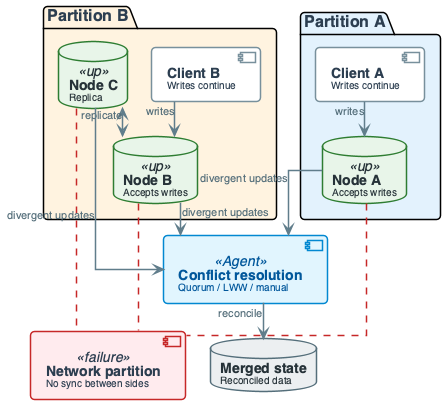
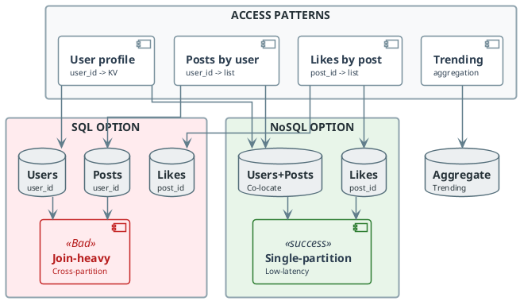

# Week 2: Distributed Databases: SQL vs NoSQL

## Purpose
- Why this topic matters in data engineering
- Distributed storage as foundation for scale
- Trade-offs drive architecture choices

## Learning Objectives
- Define distributed DB concepts: partitioning, replication
- Compare SQL vs NoSQL models and guarantees formally
- Calculate single-node limits (storage, throughput, availability)
- Design partitioning strategies with numeric constraints
- Reason about replication factor and write amplification
- Analyze CAP trade-offs in concrete scenarios
- Identify failure modes and detection or mitigation

## Core Concepts (1/2): Constraints, Not Definitions
- **Constraint:** data and compute must spread across nodes
- Single machine hits storage or throughput limits
- **Partition:** subset of data on one or more nodes
- **Replication:** copies for availability and durability

## Partition and Replication Trade-offs
- **Design choice** (how to split) drives scale and failure
- **Replication cost:** write amplification, consistency trade-offs
- **Coordinator:** routes requests, may run consensus
- Single point of failure if not designed for it

## Formal Partition and Replication Model
- Let total data size \(D\), nodes \(N\), replication factor \(r\)
$$
S_{\text{node}} = \frac{D \cdot r}{N}
$$
- Interpretation: balanced per-node storage target
- Engineering implication: larger \(r\) increases storage and write cost
- Node failure probability \(p\) (independent)
$$
P_{\text{avail}} \approx 1 - p^r
$$
- Interpretation: more replicas improve availability but not free
- Engineering implication: choose \(r\) to meet SLA vs cost

## Data Context: E-Commerce Platform
- Users: 50M rows ≈ 25 GB
- Orders: 500M rows ≈ 150 GB
- Products: 1M rows ≈ 1 GB
- Partition key: `user_id` for users and orders
- Target: 10 nodes, balanced load
- Peak: 100K ops/sec

## In-Lecture Exercise 2: Partitioning Sizing
- Hash partition users and orders by `user_id`
- Compute data per node on 10 nodes
- Check capacity for 100K peak at 10K ops/sec/node
- Decide co-location vs separate clusters
- Estimate transfer for full user+orders scan

## In-Lecture Exercise 2: Solution (1/2)
- Users: 25/10 = 2.5 GB per node
- Orders: 150/10 = 15 GB per node
- Total ≈ 17.5 GB per node
- Peak: 100K / 10 = 10K ops/sec per node

## In-Lecture Exercise 2: Solution (2/2)
- Capacity at limit; prefer 12–15 nodes headroom
- Co-locate for single-partition “orders by user”
- Separate ⇒ cross-partition scan ≈ 175 GB transfer

## In-Lecture Exercise 2: Takeaway
- Partitioning math ties directly to capacity planning
- Co-location can cut latency for dominant access paths
- Cross-partition scans explode network costs

## Formal Models (Access Patterns First)
- **Relational (SQL):** tables, keys, joins, ACID
- **Breaks when** cross-partition joins dominate
- **Key-value:** get/put by key, no joins
- **Scales when** access is key-based only
- **Document / wide-column:** nested or clustering keys

## SQL vs NoSQL — Engineering Choice
- SQL: fixed schema, normalized, declarative
- **Good for** complex queries and strong consistency
- NoSQL: schema-flexible, key-centric
- **Good for** key-scale and horizontal partitioning
- **Choose from access patterns and latency/cost**

## Core Concepts (2/2): Guarantees — Why Systems Break (1/2)
- **ACID:** strong consistency
- **Cost:** cross-partition coordination, blocking, lower throughput

## Guarantees — Why Systems Break (2/2)
- **BASE:** basically available, eventual consistency
- **Cost:** stale reads, conflict resolution
- **Wrong assumption** ⇒ wrong business outcomes

## What Breaks at Scale (1/2)
- **Cross-partition joins:** data movement and latency explode
- **Single-node mental model fails**
- **Cross-partition transactions:** 2PC blocks on any failure
- **Throughput can drop to near zero**

## What Breaks at Scale (2/2)
- **Single partition:** hot keys and skew
- One partition throttles; others idle
- **Network:** latency, partitions, partial failure
- **Design for split-brain and stale reads**

## Why Single-Node Databases Break: Storage Limits
- Single machine: max ~100 TB disk typical
- 1B users × 1 KB ≈ 1 TB
- Growth 10%/month ⇒ 100 GB/month
- **Practical limit ~10 TB** with headroom
- **"We'll add disk"** — then you hit I/O limits

## Throughput Limits
- Single machine: ~10K writes/sec order of magnitude
- Example: 100M users, 1 write/user/day ⇒ ~1,157 writes/sec avg
- Peak 5× ⇒ ~6K/sec
- **Single node:** insufficient headroom; systems break on spikes

## In-Lecture Exercise 1: Single-Node Limits
- 100M users, 500 B per record
- Single node max 5,000 writes/sec
- Compute storage size and load time
- Compute nodes needed for 50,000 writes/sec

## In-Lecture Exercise 1: Solution (1/2)
- Storage: 100M × 500 B ≈ 50 GB
- Load time: 100M / 5,000 s ≈ 20,000 s
- 20,000 s ≈ 5.56 hours

## In-Lecture Exercise 1: Solution (2/2)
- 50,000 / 5,000 = 10 nodes with linear scaling
- Still need headroom for peaks and failures

## In-Lecture Exercise 1: Takeaway
- Single-node limits appear quickly at real scale
- Simple math exposes when distribution becomes necessary
- Always plan for headroom, not average load

## Availability Limits
- Single machine: 99.9% ⇒ 8.76 h/year downtime
- E-commerce $10K/h ⇒ **$87,600/year lost**
- Distributed 99.99% ⇒ $8,760
- **Distribution improves availability**
- Adds network and partial-failure complexity

## What "Distributed" Really Means: Multiple Machines
- Data split across nodes
- Each node: own storage, own compute
- Coordination over network
- Example: 3 nodes, ~33% data each

## Partial Failures
- One node fails; others continue
- Network partition ⇒ split-brain risk
- Replica lag ⇒ stale reads possible
- No single point of failure; complexity increases

## In-Lecture Exercise 3: Replication Trade-offs
- 3-node cluster, 100 GB per node
- Compare RF=2 vs RF=3
- Write size 1 KB; 1 Gbps network
- Compute storage, write traffic, failure tolerance
- Estimate P(two failures) with 1%/year per node

## In-Lecture Exercise 3: Solution (1/2)
- RF=2: 100 GB × 2 × 3 = 600 GB
- RF=3: 100 GB × 3 × 3 = 900 GB
- Write traffic: 2 KB vs 3 KB per write

## In-Lecture Exercise 3: Solution (2/2)
- RF=2 tolerates 1 failure; RF=3 tolerates 2
- P(two failures) ≈ 0.01 × 0.01 = 0.0001
- Prefer RF=3 for availability and lower loss risk

## In-Lecture Exercise 3: Takeaway
- Replication multiplies storage and write bandwidth
- Higher RF buys failure tolerance and read capacity
- Small failure probabilities still matter at scale

## Network Uncertainty
- Latency 1–100 ms between nodes
- Bandwidth 1–10 Gbps shared
- Packet loss 0.1–1% typical
- Example: 3-node write ⇒ 3× network cost
- Cannot assume instant communication

## Distributed System Overview


## SQL in a Distributed World: Joins Across Machines
- Table A on node 1 (100M rows), B on node 2 (50M rows)
- Join ⇒ must move data
- Transfer: 100M × 200 B ≈ 20 GB
- At 1 Gbps ⇒ 160 s + compute

## In-Lecture Exercise 4: SQL vs NoSQL Latency
- Use case: orders for user X by category
- SQL join moves 5 GB across partitions
- NoSQL co-located read ≈ 3 KB
- Compute SQL transfer time at 1 Gbps
- Compare latency and choose the better fit

## In-Lecture Exercise 4: Solution (1/2)
- SQL transfer: 5 GB × 8 = 40 Gb
- 40 Gb / 1 Gbps ≈ 40 seconds plus join time
- NoSQL single-partition read ≈ 1–5 ms

## In-Lecture Exercise 4: Solution (2/2)
- NoSQL fits low-latency, user-scoped serving
- SQL fits heavy aggregation and ad-hoc analysis
- Choose based on access pattern and SLA

## In-Lecture Exercise 4: Takeaway
- Cross-partition joins are latency killers
- Co-location enables millisecond user-scoped queries
- Use SQL for analytics, NoSQL for serving paths

## Transactions at Scale
- ACID ⇒ all-or-nothing; 2PC used across nodes
- Coordinator blocks on any failure
- Example: 5 nodes, 1 fails ⇒ block until timeout (30 s)
- Throughput can drop to near zero

## Cost Explosion
- Single node: 1 disk read per local op
- 3 nodes: 3 disk reads + network
- Network ~10× slower than disk
- Example: 1M queries/day; 1 ms vs 10 ms

## SQL Optimization Fundamentals: SQL DML and DDL
- **DML:** SELECT, INSERT, UPDATE, DELETE — operate on data
- **DDL:** CREATE, DROP, ALTER — operate on schema
- **In distributed:** DML cost scales with data distribution
- DDL requires schema coordination across nodes

## JOIN Types and Semantics (1/2)
- **INNER JOIN:** rows where condition matches in both tables
- Default when using just `JOIN`
- **LEFT OUTER JOIN:** all rows from left table
- Plus matched rows from right; unmatched are NULL

## JOIN Types and Semantics (2/2)
- **RIGHT OUTER JOIN:** all rows from right table
- Plus matched rows from left; unmatched are NULL
- **FULL OUTER JOIN:** all rows from both tables
- Unmatched columns are NULL on either side
- **ON vs USING:** `ON` when names differ; `USING(column)` when same

## JOIN vs Subquery — When to Use Which: Advantages of JOIN
- Executes faster than subquery (retrieval time)
- Maximize calculations on the database
- Multiple types available for different scenarios
- Native support in optimizer

## Disadvantages of JOIN
- Not as easy to read as subqueries
- More joins means more work for server
- Can be confusing which type yields correct result
- Cannot be avoided when retrieving from normalized DB

## Advantages of Subquery
- Divide complex query into isolated parts
- Easy to understand and maintain
- Use results of another query in outer query
- Can replace complex joins in some cases

## Disadvantages of Subquery
- Optimizer more mature for joins (especially MySQL)
- Subquery often more efficient if rewritten as join
- Cannot modify and select from same table

## Handling NULL Values
- **NULL is not a string:** use `IS NULL` not `= 'NULL'`
- **NULL propagation:** NULL in arithmetic yields NULL
- **Common sources:** OUTER JOIN, missing data, explicit NULL
- **Detection:** `IS NULL`, `IS NOT NULL` predicates
- **Engineering:** NULL handling affects query correctness

## Window Functions Overview: What are Window Functions?
- Perform calculations on an aggregate value based on a set of rows and return multiple rows for each group.
- The **window** represents the group of rows on which the function operates.
- Window functions calculate like aggregate functions but keep each row’s distinct identity.

## Window Function Syntax
```sql
window_function_name([ALL] expression)
OVER (
  [PARTITION BY columns]
  [ORDER BY columns]
)
```
- **window_function_name:** the function being applied.
- **ALL (optional):** count all values, including duplicates. (Window functions do not allow `DISTINCT`.)
- **expression:** column used for the aggregated value.
- **OVER:** specifies the window clause for the function.
- **PARTITION BY:** divides rows into partitions; the window function runs per partition.
- **ORDER BY:** ordering within the partition. When omitted, SQL Server uses the table-level `ORDER BY`.

## Window Function Types
### Aggregate Window Functions
- Operate on multiple rows: `SUM()`, `MAX()`, `MIN()`, `AVG()`, `COUNT()`, etc.

### Ranking Window Functions
- Rank each row within a partition.
- `RANK()`, `DENSE_RANK()`, `ROW_NUMBER()`, `NTILE()`, etc.

### Value Window Functions
- Access values from other rows.
- `LAG()`, `LEAD()`, `FIRST_VALUE()`, `LAST_VALUE()`, etc.

## Example Dataset
```sql
CREATE TABLE Sales(
  Employee VARCHAR(45) NOT NULL,
  Year INT NOT NULL,
  Country VARCHAR(45) NOT NULL,
  Product VARCHAR(45) NOT NULL,
  Amount DECIMAL(12,2) NOT NULL,
  PRIMARY KEY(Employee, Year)
);
```

## Aggregate Window Functions
### Example – Sum
```sql
SELECT Employee, Year, Country, Product, Amount,
  SUM(Amount) OVER(PARTITION BY Country) AS Total
FROM Sales;
```
Result: aggregates data for each country and adds a `Total` column while preserving each row.

| Employee | Year | Country | Product | Amount | Total |
| --- | --- | --- | --- | --- | --- |
| Or Peretz | 2017 | Israel | Computer | 15000 | 45000 |
| Or Peretz | 2018 | Israel | Computer | 10000 | 45000 |
| Or Peretz | 2019 | Israel | TV | 20000 | 45000 |
| Omer Doron | 2018 | USA | TV | 20000 | 30000 |
| Omer Doron | 2019 | USA | Mobile | 10000 | 30000 |

### Example – Avg
```sql
SELECT Employee, Year, Country, Product, Amount,
  AVG(Amount) OVER(PARTITION BY Country, YEAR(Year)) AS AvgSales
FROM Sales;
```
Result: average sales for each country and year (multiple fields in the partition list).

| Employee | Year | Country | Product | Amount | AvgSales |
| --- | --- | --- | --- | --- | --- |
| Or Peretz | 2017 | Israel | Computer | 15000 | 15000 |
| Or Peretz | 2018 | Israel | Computer | 10000 | 15000 |
| Or Peretz | 2019 | Israel | TV | 20000 | 15000 |
| Omer Doron | 2018 | USA | TV | 20000 | 15000 |
| Omer Doron | 2019 | USA | Mobile | 10000 | 15000 |

### Example – Count
`COUNT()` returns the number of rows in the table or group. Unlike standard aggregates, window `COUNT()` does not support `DISTINCT`.
```sql
SELECT Employee, Year, Country, Product, Amount,
  COUNT(Product) OVER(PARTITION BY Country) AS TotalProduct
FROM Sales;
```

### Example – Max
Returns the maximum value in each group (or in the full table if no partition is defined).
```sql
SELECT Employee, Year, Country, Product, Amount,
  MAX(Product) OVER(PARTITION BY Country) AS TotalProduct
FROM Sales;
```

## Ranking Window Functions
Ranking functions categorize values by rank.

Supported in SQL Server: `RANK()`, `DENSE_RANK()`, `ROW_NUMBER()`, `NTILE()`.

**Data for examples**

| FirstName | LastName | City |
| --- | --- | --- |
| Luisa | Evans | Texas |
| Paul | Ward | Alaska |
| Peter | Bennett | California |
| Carlos | Patterson | New York |
| Rose | Huges | Florida |
| Marielia | Simmons | Texas |
| Antonio | Butler | New York |
| Diego | Cox | California |

### Example – Rank
Generates a rank for each row. Ties share a rank and the next rank is skipped.
```sql
SELECT FirstName, LastName, City,
  RANK() OVER (ORDER BY City) AS RankNo
FROM table;
```

| FirstName | LastName | City | RankNo |
| --- | --- | --- | --- |
| Paul | Ward | Alaska | 1 |
| Peter | Bennett | California | 2 |
| Diego | Cox | California | 2 |
| Rose | Huges | Florida | 4 |
| Carlos | Patterson | New York | 5 |
| Antonio | Butler | New York | 5 |
| Luisa | Evans | Texas | 7 |
| Marielia | Simmons | Texas | 7 |

### Example – Dense Rank
Same as `RANK()` but does not skip ranks.
```sql
SELECT FirstName, LastName, City,
  DENSE_RANK() OVER (ORDER BY City) AS RankNo
FROM table;
```

| FirstName | LastName | City | RankNo |
| --- | --- | --- | --- |
| Paul | Ward | Alaska | 1 |
| Peter | Bennett | California | 2 |
| Diego | Cox | California | 2 |
| Rose | Huges | Florida | 3 |
| Carlos | Patterson | New York | 4 |
| Antonio | Butler | New York | 4 |
| Luisa | Evans | Texas | 5 |
| Marielia | Simmons | Texas | 5 |

### Example – Ntile
Distributes rows into a predefined number (N) of approximately equal groups.
```sql
SELECT FirstName, LastName, City,
  NTILE(3) OVER (ORDER BY City) AS RankNo
FROM table;
```

| FirstName | LastName | City | RankNo |
| --- | --- | --- | --- |
| Paul | Ward | Alaska | 1 |
| Peter | Bennett | California | 1 |
| Diego | Cox | California | 1 |
| Rose | Huges | Florida | 2 |
| Carlos | Patterson | New York | 2 |
| Antonio | Butler | New York | 2 |
| Luisa | Evans | Texas | 3 |
| Marielia | Simmons | Texas | 3 |

## Value Window Functions
`LEAD()` and `LAG()` return succeeding or preceding values within a partition.

### Example – Lead
```sql
SELECT Year, Product, Country, Amount,
  LEAD(Amount, 1) OVER (PARTITION BY Year ORDER BY Country) AS NextAmount
FROM Sales;
```
Result: returns the amount and next amount detail per employee by year, ordered by country.

| Year | Product | Country | Amount | NextAmount |
| --- | --- | --- | --- | --- |
| 2017 | Computer | Canada | 15000 | 10000 |
| 2017 | Laptop | Israel | 10000 | 20000 |
| 2017 | TV | Israel | 20000 | NULL |
| 2018 | TV | Canada | 20000 | 10000 |
| 2018 | Mobile | USA | 10000 | NULL |

### Example – Lag
```sql
SELECT Year, Product, Country, Amount,
  LAG(Amount, 1) OVER (PARTITION BY Year ORDER BY Country) AS PrevAmount
FROM Sales;
```
Result: returns the amount and previous amount detail per employee by year, ordered by country.

| Year | Product | Country | Amount | NextAmount |
| --- | --- | --- | --- | --- |
| 2017 | Computer | Canada | 15000 | NULL |
| 2017 | Laptop | Israel | 10000 | 15000 |
| 2017 | TV | Israel | 20000 | 10000 |
| 2018 | TV | Canada | 20000 | NULL |
| 2018 | Mobile | USA | 10000 | 20000 |

### First and Last Values
Used to find the first and last records in the table or a partition (requires `ORDER BY`).
```sql
SELECT Year, Product, Country, Amount,
  FIRST_VALUE(Amount) OVER(PARTITION BY Country ORDER BY Country) AS FirstAmount,
  LAST_VALUE(Amount) OVER(PARTITION BY Country ORDER BY Country) AS LastAmount
FROM Sales;
```

| Year | Product | Country | Amount | FirstAmount | LastAmount |
| --- | --- | --- | --- | --- | --- |
| 2017 | Computer | Canada | 15000 | 15000 | 10000 |
| 2018 | Laptop | Canada | 10000 | 15000 | 10000 |
| 2017 | TV | Israel | 10000 | 10000 | 20000 |
| 2018 | TV | Israel | 15000 | 10000 | 20000 |
| 2019 | Mobile | Israel | 20000 | 10000 | 20000 |

## Window Functions in Distributed Systems
- **Local execution:** window on partition key executes per node
- **Global execution:** window across partition keys requires shuffle
- PARTITION BY partition_key keeps computation local
- PARTITION BY non-partition-key forces data movement
- **Design queries to align with data distribution**

## Why NoSQL Exists: Relaxed Guarantees
- No cross-partition transactions
- Eventual consistency allowed
- No joins; single-partition access
- Example: key-value get/put by key

## Simplified Access Patterns
- Key-based access only; predefined paths
- Example: user_id → profile
- Latency 1–5 ms (local)
- Throughput ~100K ops/sec/node

## Predictable Scaling
- Add nodes; partition by key (e.g. hash(user_id))
- Example: 3 → 6 nodes ⇒ 2× throughput, 2× storage
- No cross-partition coordination for key-based ops

## Visual Comparison: SQL vs NoSQL

| Aspect | SQL | NoSQL |
|--------|-----|-------|
| Consistency | Strong (ACID) | Eventual (BASE) |
| Transactions | Cross-partition | Single-partition |
| Joins | Supported | Not supported |
| Schema | Fixed (schema-on-write) | Flexible (schema-on-read) |
| Scaling | Vertical (hard) | Horizontal (easier) |
| Latency | 10–100 ms (joins) | 1–5 ms (key lookup) |
| Use case | Complex queries | Simple lookups |

## Partitioning Intuition: Horizontal Partitioning
- Split table by rows; each partition holds a subset
- Example: users → partition 1 (1–333K), 2 (334K–666K), 3 (667K–1M)

## Key-Based Distribution
- Hash(key) mod N ⇒ partition id; N = number of partitions
- Example: hash(user_id) mod 3
- User 123 → 0, user 456 → 1, user 789 → 2

## Replication Intuition: Replicas
- Same partition copied to multiple nodes
- Example: 3 replicas per partition
- Write: update all replicas; read: any replica
- One replica down ⇒ two remain

## Read/Write Paths
- Write: primary first, then async to secondaries
- Read: any replica
- Example: 3 replicas; write latency ~50 ms, read ~5 ms

## CAP Intuition (Engineering View): CAP Theorem
- Consistency: all nodes see same data
- Availability: every request gets a response
- Partition tolerance: system works despite network splits
- Can only guarantee two of three in practice

## Concrete Scenario: E-Commerce Cart
- User adds item; network partition splits two datacenters
- CP: block writes until heal ⇒ cart update fails
- AP: accept writes both sides ⇒ cart works, eventually consistent

## Trade-offs Explained
- CP: strong consistency, possible downtime
- AP: always available, possible stale reads
- CA: not realistic in distributed systems
- Bank ⇒ CP; social feed ⇒ AP

## Cost of Naïve Design (Distributed DB): What Goes Wrong (1/2)
- **Naïve:** "use SQL for everything"
- Cross-partition joins and 2PC **kill** latency and throughput
- **Cost:** timeouts, rewrites

## What Goes Wrong (2/2)
- **Naïve:** "one partition key for all access patterns"
- E.g. partition by user_id but query by item_id ⇒ **full scan**
- **Naïve:** ignore hot keys
- Celebrity user **throttles one partition**; rest idle
- **Takeaway:** access patterns drive design

## Running Example — Data & Goal: Scenario (Recommendation / Activity Log)
- 10M users; 100M events/day (clicks, views, likes)
- Events: user_id, item_id, action, timestamp
- ~200 B/event ⇒ ~20 GB/day raw

## Engineering Objective
- Store events and support two access patterns
- "All events for user X" and "all events for item Y"
- Latency: p99 < 50 ms for key-based reads
- Throughput: 100M writes/day sustained

## Running Example — Step-by-Step (1/4): Scale and Access Patterns
- 100M events/day ⇒ ~1,157 writes/sec avg; peak ~6K/sec
- Two access patterns: by user_id, by item_id
- Single-node: storage and throughput insufficient
- Need partitioning and clear access design

## Running Example — Step-by-Step (2/4): SQL Design and Join Cost
- Tables: users, items, events (user_id, item_id, action, ts)
- "Events for user X" ⇒ filter by user_id; optional join to items
- If users and events on different partitions ⇒ cross-partition read
- Transfer ~2 GB for 10M events ⇒ 16 s at 1 Gbps + compute

## Query Execution Flow


## Running Example — Step-by-Step (3/4): NoSQL Design and Partitioning
- Partition by user_id: hash(user_id) mod N
- Store events co-located with user (document or wide-column)
- "Events for user X" ⇒ single-partition read ⇒ 1–5 ms
- "Events for item Y" ⇒ different access path needed
- Trade-off: denormalize or maintain two views

## Running Example — Step-by-Step (4/4): Output and Engineering Interpretation
- NoSQL key-based: ~5 ms for "events for user X"
- SQL cross-partition: tens of seconds
- NoSQL avoids cross-partition joins for primary access
- Trade-off: complex analytics harder in NoSQL
- Decision: NoSQL for serving, batch/SQL for analytics

## Cost & Scaling Analysis (1/3): Time Model
- Single-node: T ∝ data size / disk bandwidth
- Distributed: T ∝ data size / bandwidth + network latency × stages
- Join: add shuffle time; shuffle often dominates
- Example: 1M queries, 1 ms vs 10 ms ⇒ 1,000 s vs 10,000 s

## Numeric Example: Nodes for Social Posts
- 100M users; 10 posts/user/day ⇒ 1B posts/day
- ~11,574/sec avg; peak 5× ⇒ ~57,870 writes/sec
- Single node: ~10K writes/sec ⇒ need 6 nodes for writes
- Partition by user_id; 6 partitions ⇒ ~16.7M users each
- With RF 3: 18 nodes total; 3× storage, 2 node failures OK

## Cost & Scaling Analysis (2/3): Memory and Storage
- Per-node memory: limit working set, sorts, joins
- Storage: data size × replication factor
- Example: 100 GB × RF 3 ⇒ 300 GB total
- Growth: plan for 2× in 12–18 months

## Cost & Scaling Analysis (3/3): Network, Throughput, Latency
- Throughput: ops/sec ≈ min(disk, network, CPU) per node × nodes
- Latency: local read ~1–5 ms; cross-partition ~10–100 ms
- Write amplification: 1 write ⇒ RF copies over network
- Example: 1 KB write, RF 3 ⇒ 3 KB network per write

## Pitfalls & Failure Modes (1/3): Common Pitfall — Hot Partitions
- Single key gets disproportionate load (e.g. celebrity user)
- One partition throttled; others idle
- Mitigation: salt keys, cache, or split heavy keys

## Pitfalls & Failure Modes (2/3): Failure Scenario — Network Partition (Split-Brain)
- Nodes A and B,C in separate partitions
- A cannot reach B,C
- Writes accepted in both sides ⇒ divergent state
- Merge on heal: conflicts, last-writer-wins, or manual resolution

## Failure Propagation


## Pitfalls & Failure Modes (3/3): Detection and Mitigation
- Monitor: latency p99, error rates, replica lag
- Alerts: lag > threshold, partition events, node down
- Mitigation: quorum writes, failover, idempotent producers
- Run chaos or partition drills in non-prod

## Best Practices (1/2)
- **Design for failure:** test failover and partition scenarios
- **Partition for hot paths:** avoid cross-partition joins
- Choose key from access pattern
- **Replication factor:** durability vs write amplification
- **Single-partition ops** for latency-sensitive APIs

## Best Practices (2/2)
- Use SQL/analytics store for complex ad-hoc queries
- Use NoSQL for serving key-based traffic
- **Monitor:** latency p99, throughput, replica lag
- **Document trade-offs:** CAP, cost, complexity for your use case
- Avoid "we chose X because it's popular"

## Recap (Engineering Judgment)
- Single-node hits storage, throughput, availability limits
- Distributed adds network and partial failure complexity
- **SQL** for joins and transactions
- **NoSQL** for key-scale and horizontal partitioning
- Partitioning and replication enable scale
- **Both have cost and failure modes**
- **CAP:** explicit trade-offs; design for requirements

## Pointers to Practice
- Compute partition sizes from data volume and key distribution
- Reason about replication factor and write amplification
- Compare SQL vs NoSQL for given access patterns
- Analyze CAP trade-offs in concrete scenarios
- Design partitioning schemes and justify choices
- Evaluate failure modes and mitigation strategies

## Additional Diagrams
### System Overview (slide 14)

### Query Flow (slide 24)

### Failure Partition (slide 45)

### Practice: Architecture

