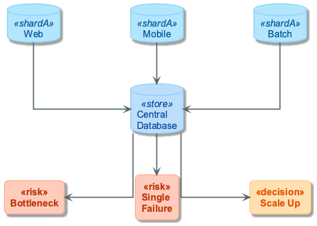
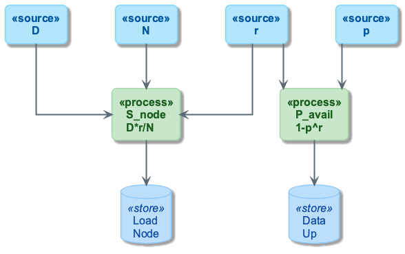
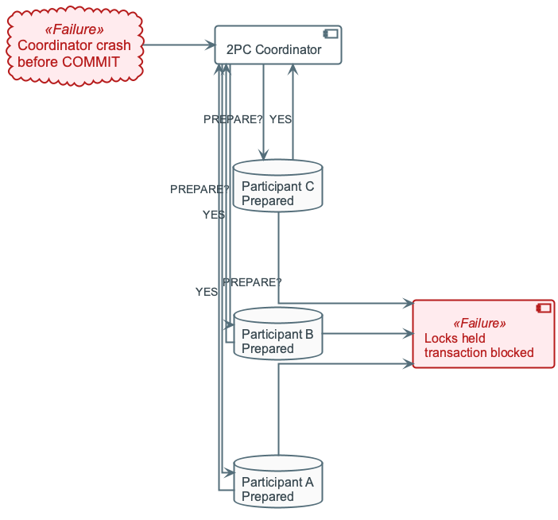
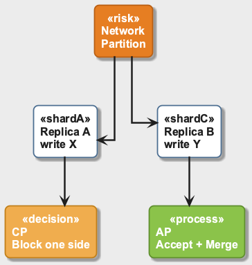
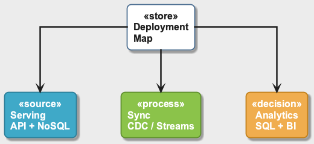
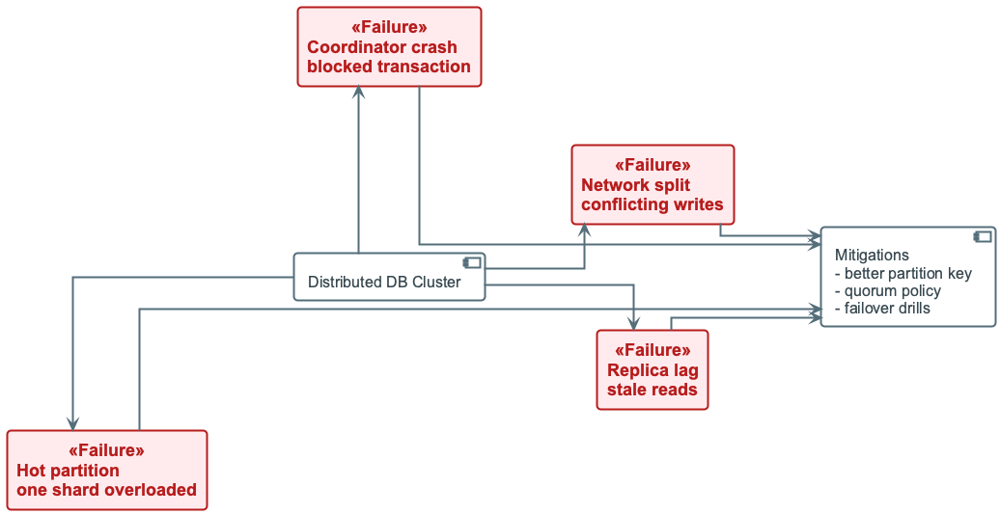

# Week 2: Distributed Databases: SQL vs NoSQL

## Purpose
- Understand why single-node databases fail at scale
- Learn how partitioning and replication enable growth
- Choose SQL, NoSQL, or hybrid architecture from workload needs

---

## Learning Objectives
- Calculate per-node data load under partitioning/replication
- Explain ACID, BASE, and CAP in engineering terms
- Design partition keys for dominant read/write paths
- Identify distributed failure modes and practical mitigations

---

## Flow for Today
- Why we distribute databases
- Partitioning + replication mechanics
- SQL vs NoSQL decision framework
- Consistency trade-offs and failure handling
- End-to-end design example

---

## Why Single-Node Databases Break
- Storage, throughput, and availability have hard ceilings
- Vertical scaling becomes expensive and eventually plateaus
- Maintenance windows and failures become business risks
- Growth requires horizontal architecture

---

## Single-Node Limits — Architecture

{width=90%}

---

## Single-Node Limits (Quick Numbers)
- Storage headroom shrinks as data and indexes grow
- Write throughput saturates during traffic spikes
- 99.9% uptime still means hours of downtime per year
- Recovery time often dominates incident impact

---

## From Centralized to Distributed
- Centralized DBMS: simple operations, one main failure domain
- Distributed DBMS: multiple nodes, higher scale and resilience
- User goal remains the same: one logical database view

---

## GFS: Motivation for Distributed Storage
- Google File System (GFS) pioneered scalable distributed storage for large data-intensive applications
- Key observations: component failures are the norm; huge files (multi-GB) are common; files often mutated by appending
- Design principles: constant monitoring, fault tolerance, co-design of applications and APIs
- Files are broken into 64 MB chunks; each chunk replicated on multiple servers (default 3)

---

## Centralized DBMS

{width=90%}

---

## Distributed DBMS

{width=90%}

---

## Distributed Database: User View
- Application queries a single logical database
- Distribution details are hidden by the DB layer
- Engineering complexity moves from app code into data platform

---

## User View — Logical vs Physical

{width=90%}

---

## Distributed Database Basics
- Partitioning splits data across nodes for scale
- Replication copies data for durability and availability
- Coordination happens over an unreliable network
- Partial failures are expected, not exceptional

---

## Partitioning + Replication Model
$$
S_{node} = \frac{D \cdot r}{N}
$$
$$
P_{avail} \approx 1 - p^r
$$
- `D`: total data, `N`: nodes, `r`: replication factor, `p`: node-failure probability
- Higher `r` improves availability but increases write and storage cost

{width=84%}

---

## Worked Sizing Example
- Given: `D = 24 TB`, `N = 12`, `r = 3`
- Per-node data: `S_node = (24 * 3) / 12 = 6 TB`
- If node failure probability is `p = 0.02`, then
- Availability of a replicated item: `1 - 0.02^3 = 99.9992%`

---

## Partitioning and Replication Visual

{width=90%}

---

## Time and Cost Intuition
- Local key lookups have low, stable latency
- Cross-partition operations add network and coordination latency
- Replication multiplies write traffic
- Stronger consistency usually increases p99 latency and cost

---

## Partitioning Strategy
- Choose partition key from dominant access pattern
- Keep common reads/writes single-partition when possible
- Avoid skewed keys that create hot partitions
- Revisit partition key as traffic shape changes

---

## Partition Key Example: Good vs Bad
- Good for user feed service: partition by `user_id`
- Bad for same workload: partition by `country` (few hot values)
- Symptom of bad key: one node has high CPU/queue lag while others are idle
- Typical mitigation: key salting or sub-sharding for hot values

---

## Key Distribution Visual

{width=90%}

---

## Replication Read/Write Path
- Writes typically flow leader -> followers
- Reads may be leader-only or replica-enabled
- Replica reads improve scale and often reduce latency
- Replica lag can return stale reads

---

## Stale Read Example
- User updates profile picture at `10:00:00`
- Replica lags by 2 seconds
- Read at `10:00:01` from replica returns old image
- If this is unacceptable, route that read to leader

{width=88%}

---

## Replication Visual

{width=90%}

---

## SQL vs NoSQL: Decision Lens
- SQL: relational model, joins, mature transactional tooling
- NoSQL: key-centric model, simpler horizontal scaling for serving paths
- Choose from access patterns, SLA, and consistency requirements
- Hybrid is common when serving and analytics needs diverge

---

## SQL vs NoSQL — Architecture

{width=90%}

---

## SQL in Distributed Systems: Strengths and Costs
- Strong guarantees are useful for money and inventory workflows
- Cross-partition joins require expensive data movement
- Distributed transactions add coordination latency
- Best fit for correctness-critical multi-entity operations

---

## NoSQL in Distributed Systems: Strengths and Costs
- Key-based reads/writes are fast and predictable
- Denormalization removes many runtime joins
- Eventual consistency requires reconciliation logic
- Best fit for high-throughput serving workloads

---

## ACID (Transactional Guarantees)
- **Atomicity**: all operations commit or none do
- **Consistency**: constraints remain valid after commit
- **Isolation**: concurrent transactions do not leak partial state
- **Durability**: committed writes survive crashes

---

## BASE (Scale-Oriented Guarantees)
- **Basically available**: system responds despite some failures
- **Soft state**: replicas may temporarily diverge
- **Eventually consistent**: replicas converge when updates stop

---

## CAP (Under Network Partition)
- **Consistency**: read returns latest write
- **Availability**: every request gets a response
- **Partition tolerance**: system continues despite network splits
- During partition, you choose **CP** or **AP**, not both

{width=88%}

---

## CAP Scenario: Shopping Cart Partition
- CP option: block conflicting updates until partition heals
- AP option: accept writes in both partitions and merge later
- CP reduces inconsistency risk but impacts UX availability
- AP protects UX but requires clear merge policy

---

## Distributed Transactions: 2PC Risk
- Two-phase commit enforces atomicity across nodes
- Coordinator failure can block participants
- Valuable for strict consistency, expensive operationally

---

## 2PC — Blocking Risk

{width=90%}

---

## CAP in Practice

{width=90%}

---

## Running Example: Activity Log Service
- 100M events/day (~20 GB/day raw)
- Query A: feed by `user_id`
- Query B: analytics by `item_id`
- SLA: p99 read latency under 50 ms for serving API

---

## SQL-Oriented Design (Example)
- Normalized tables: `users`, `items`, `events`
- Great for flexible analytics and relational queries
- Feed query may require cross-partition join + sort
- Latency degrades under heavy fan-out

---

## NoSQL-Oriented Design (Example)
- Partition `events_by_user` by `user_id`
- Feed query stays single-partition and predictable
- `item_id` analytics needs separate materialized view
- Better serving latency, higher modeling complexity

---

## Recommended Hybrid Architecture
- NoSQL store for online serving paths
- SQL warehouse/lakehouse for analytics
- Stream or batch sync between serving and analytics stores
- Clear ownership per workload and data contract

{width=90%}

---

## Hybrid Architecture — Overview

{width=90%}

---

## Common Failure Modes
- Hot partitions from skewed keys
- Replica lag causing stale reads
- Network partitions causing split-brain risk
- Coordinator failure in multi-node workflows

---

## Failure Scenario Visual

{width=90%}

---

## Mitigation Playbook
- Define quorum and consistency per endpoint
- Add salting/sharding for hot keys
- Monitor p99 latency, replication lag, and error rate
- Rehearse failover, partition, and recovery drills

---

## Design Checklist
- What are your top 3 read/write paths?
- Which operations require strong consistency?
- What stale-read window is acceptable?
- How will node count and cost change in 12 months?

---

## 60-Second Decision Heuristic
- If correctness-critical cross-entity transactions dominate -> start SQL/CP
- If ultra-low-latency key access dominates -> start NoSQL/AP-aware
- If both are critical -> hybrid with explicit sync boundaries
- Re-evaluate quarterly as workload shape changes

---

## Recap
- Distributed databases trade simplicity for scale and resilience
- Partition-key quality is your strongest performance lever
- SQL and NoSQL solve different workload segments
- Next: parallel processing and distributed compute patterns
