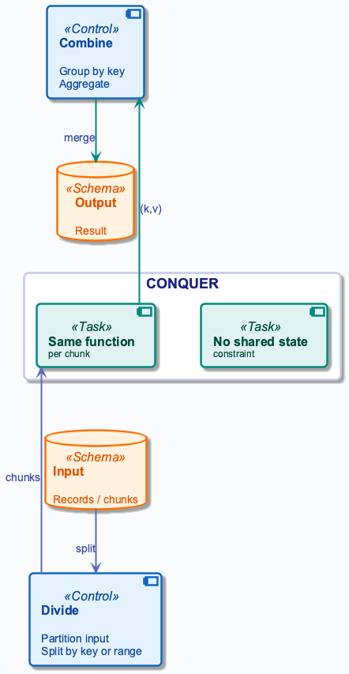
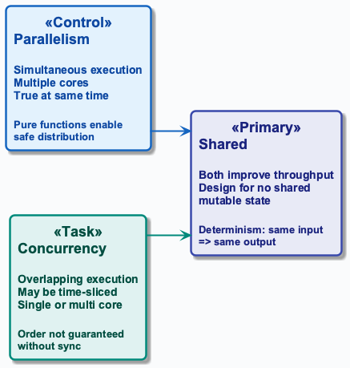
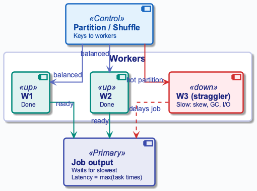
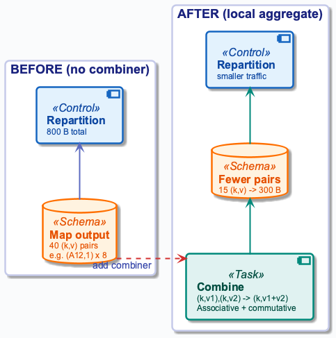

# Week 3: Parallelism and Divide-and-Conquer

## Purpose
- Why parallelism and divide-and-conquer matter in data engineering
- Single-node limits force distribution of work
- Foundation for distributed batch and streaming processing

## Learning Objectives
- Define divide-and-conquer and its three phases
- Distinguish parallelism from concurrency
- Express pure functions and independence for distribution
- Trace a parallel dataflow job (partition → group → merge)
- Compute work, span, and speedup
- Identify data skew and hot keys as failure modes
- Describe mitigations: local aggregation, partitioning, salting

## Core Concepts — Constraints: Divide-and-Conquer
- Split problem into subproblems, solve independently, combine
- **Constraint:** no shared state across chunks
- **Divide:** partition input
- **Conquer:** same function per chunk
- **Combine:** group by key

## Parallelism vs Concurrency
- **Parallelism:** simultaneous execution on multiple cores
- **Concurrency:** overlapping (may be time-sliced)
- **Pure functions** enable safe distribution

## Processes, Threads, and Virtualization
- **Process:** isolated memory + OS resources; higher startup cost
- **Thread:** shared memory within a process; cheaper to spawn
- **Context switch:** OS saves/restores state to share CPU among tasks
- **Scheduler:** decides which threads run on which cores
- **Virtualization:** abstract hardware for isolation
  - **VMs:** full OS per guest; strong isolation, more overhead
  - **Containers:** shared host kernel; lighter isolation, faster startup
- **Practical impact:** thread-heavy workloads need careful locking; process-heavy workloads need efficient IPC and batching

## Core Concepts — Why Systems Break: Determinism and Scalability
- **Determinism:** same input ⇒ same output
- **Violation** (shared state, time-dependent logic) ⇒ wrong results
- **Scalability:** more workers ⇒ more throughput
- **Until** repartition or skew dominates

## Formal Work and Span
- Let \(W\) = total work, \(S\) = span (critical path), \(p\) = workers
$$
T_p \ge \max\left(\frac{W}{p}, S\right)
$$
- Interpretation: parallel time bounded by work and critical path
- Engineering implication: low \(S\) is required for near-linear scale
- Speedup is limited by the sequential fraction
$$
\text{Speedup} \le \frac{W}{S}
$$
- Interpretation: Amdahl-style bound on parallel benefit
- Engineering implication: remove sequential bottlenecks first

## Repartitioning and Coordination
- **Repartitioning cost:** network and disk I/O to group by key
- **Skew:** one key ⇒ one worker overloaded ⇒ OOM
- **Coordination:** fault tolerance, stragglers, partial failures
- **Design for them**

## Cost of Naïve Design (Parallelism): What Goes Wrong
- **Naïve:** "just add more workers"
- **Repartitioning** and **skew** often dominate
- More workers ⇒ more repartition traffic
- **Cost explosion**

## What Goes Wrong
- **Naïve:** shared state or order-dependent logic
- ⇒ **Non-determinism**, wrong results on rerun
- **Naïve:** ignore key distribution
- Hot key **overloads one worker**; job latency = slowest task
- **Takeaway:** minimize repartition, balance partitions, pure functions

## Running Example — Data & Goal
- **Input:** order lines with product IDs
- Sample: "A12 B07 C33"; "A12 B07 D44"
- "B07 C33 A12"
- **Goal:** product frequency — (product_id, count)

## Running Example — Step-by-Step
- **Step 1: Local tokenize & count** — each record independently
- Emit `(product_id, 1)` per product from each record
- R1: (A12,1),(B07,1),(C33,1)
- R2: (A12,1),(B07,1),(D44,1)
- R3: (B07,1),(C33,1),(A12,1)

## Running Example — Step-by-Step
- **Step 2: Repartition** — framework sends same key to same worker
- **Grouped:** A12→[1,1,1], B07→[1,1,1], C33→[1,1]
- D44→[1]
- Main network and I/O cost in this phase

## Data Context: Order Input (Records 1–3)
- R1: "A12 B07 C33"
- R2: "A12 B07 D44"
- R3: "B07 C33 A12"
- Local emit produces (product_id, 1) per token

## Running Example — Step-by-Step
- **Step 3: Merge** — each worker gets one key and values
- Sum the values for the final count
- **Output:** (A12,3), (B07,3), (C33,2), (D44,1)

## Running Example — Step-by-Step
- **Result:** product-count table; correct and deterministic
- **Trade-off:** repartition moves data
- Skew can overload one worker
- Pattern scales to TB in distributed batch systems

## From Example to Pipeline
- Same pattern: divide → conquer → combine
- Next: system view of parallel pipeline
- Then cost and failure

## Parallel Pipeline Overview
- Divide: split input into chunks; assign to workers
- Parallel workers: local compute (or local aggregate) on each chunk
- Combine: repartition groups by key; workers aggregate

## Cost & Scaling Analysis: Time Model
- **Work \(W\):** total operations over all workers
- **Span \(S\):** critical path; longest dependency chain
- **Speedup:**
$$
W/S
$$
with enough workers
- Upper bound = number of workers

## Cost & Scaling Analysis: Memory and Storage
- **Local compute:** each task holds one record + emitted (k,v)
- Bounded per task
- **Repartition:** all (k,v) written to disk/network
- Peak ≈ size of local output
- **Merge:** one key's values in memory; skew ⇒ OOM

## Cost & Scaling Analysis: Network and Throughput
- **Repartition traffic:** ≈ size of local output
- **Bottleneck:** link bandwidth and disk I/O
- Often limits scale more than CPU
- **Latency:** job time ≈ local compute + repartition + merge
- Repartition usually dominates

## Example: Work and Span
- 1B records, 10 items each ⇒ 10B local emits
- 1M distinct products ⇒ 1M merge tasks
- Local compute takes 100 ns/record ⇒ 100 s work
- With 1000 workers ⇒ ~0.1 s local phase (ideal)

## Repartition Size and Network Cost
- Repartition bytes ≈ local output size
- Every (k,v) sent over network to responsible worker
- Example: 10B emits × 20 B/pair ⇒ 200 GB repartition
- At 10 Gbps ⇒ ~160 s minimum
- Local aggregation reduces local output before repartition

## Worker Memory and Skew Risk
- Each worker holds one key's value list in memory
- Skew ⇒ one list huge ⇒ OOM
- Mitigation: local aggregation, salting, custom partitioning

## Cost Summary
- **Work:** total CPU
- **Span:** critical path
- **Repartition:** network and disk I/O
- **Skew:** one partition dominates
- Engineering: minimize repartition, balance partitions

## Execution Flow: Partition–Group–Merge
- Local compute reads records, emits (k,v)
- Repartition groups by key
- Merge aggregates per key

## Pitfalls & Failure Modes: Shared State and Stragglers
- Task logic with global state is not deterministic
- One slow worker (straggler) delays the whole job
- Causes: skew, GC, network, disk
- Mitigation: speculative execution, better partitioning

## Pitfalls: Non-determinism
- Reruns must yield same result
- Shared state breaks this
- Design: pure task functions, deterministic key derivation
- Idempotent writes

## Stragglers: Causes and Impact
- One task runs much longer than others
- Job latency = slowest task
- Causes: data skew, GC pauses, network, disk contention
- Mitigation: speculative execution, partition balance

## Skew: Hot Key and Hot Partition
- **Hot key:** one key has majority of values
- E.g. bot user_id, null bucket
- **Real data is often Zipfian**
- **Hot partition:** one worker gets most data ⇒ OOM
- **Job latency = slowest worker**

## Skew Detection
- Per-partition size after repartition
- Worker runtimes
- Alert if max ≫ median
- P99 worker time, spill count

## Mitigation 1: Local Aggregation
- Local pre-aggregation before repartition
- For sum/count: combine (k,v1),(k,v2) → (k,v1+v2)
- Reduces repartition size
- Only when merge is associative and commutative

## Mitigation 2: Salting (Split Hot Key)
- Append random suffix: (k,v) → (k-salt,v)
- Spread across workers
- Small table: replicate key to all salt buckets
- Second pass to combine results per original key

## Mitigation 3: Custom Partitioning
- Default: hash(key) mod R
- Custom: route hot keys to dedicated workers or spread
- Combine with salting for hot key splits
- Trade-off: more workers, more merge logic

## Skew Mitigation Trade-offs
- Local aggregation: free if merge is associative
- Salting: increases replication and merge cost
- Custom partitioning: requires key knowledge

## Failure in Production
- **Worker OOM:** one key's value list exceeds heap
- Fix: salting or increase memory
- **Timeout:** single worker runs too long
- Fix: split partition, local aggregation, salting
- **Detection:** monitor heap, GC, task duration

## Failure Scenario: Data Skew (Hot Key)
- Hash partitioning sends same key to same worker
- Hot key ⇒ one worker gets huge input ⇒ OOM
- Other workers finish quickly; job waits or fails

## Pitfalls & Failure Modes: Detection and Mitigation
- **Detection:** per-partition sizes and worker runtimes
- **Local aggregation:** pre-aggregation before repartition
- **Custom partitioning / salting:** spread hot key across workers

## Best Practices
- Keep task logic pure (no shared mutable state)
- Minimize repartition size: reduce key size, use local aggregation
- Partition by key so related data lands together
- Avoid skew via salting if needed
- Design for idempotency and reruns
- Monitor skew and stragglers
- Prefer smaller, bounded merge groups
- Document key schema and partitioning strategy

## Recap (Engineering Judgment)
- **Divide-and-conquer:** divide → conquer → combine
- **Constraint:** no shared state; pure functions
- **Repartition is the bottleneck** — network and disk I/O
- **Skew and hot keys** cause worker OOM
- **Design for Zipfian key distribution**
- **Cost reasoning:** work, span, repartition size
- **Constraints drive design**

## Pointers to Practice
- Run full manual partition-group-merge on 8–12 input records
- Compute repartition size and worker input size
- Solve one skew scenario and mitigation
- Reason about cost when one key dominates

## Additional Diagrams
### Practice: Skew Mitigation

