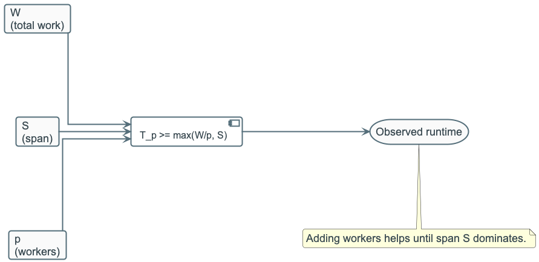
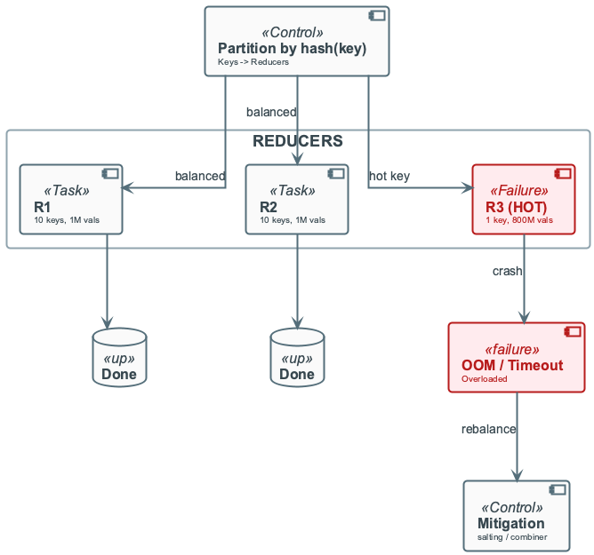

# Week 3: Parallelism and Divide-and-Conquer

## Purpose
- Understand why single-worker data jobs fail at scale
- Learn divide-conquer-combine as a production pattern
- Reason about runtime, bottlenecks, and failure behavior

---

## Learning Objectives
- Distinguish process/thread and parallelism/concurrency
- Choose multithreading vs multiprocessing by workload type
- Model runtime using work (`W`) and span (`S`)
- Apply divide-and-conquer with skew-aware design

---

## Lecture Flow
- Parallel execution foundations
- Process vs thread execution models
- Divide-and-conquer deep dive
- Performance limits and skew mitigation
- Failure handling and design checklist

---

## Why Parallelism Matters
- Data volume grows faster than single-node throughput
- SLA targets require lower end-to-end latency
- Reliability needs retry-safe independent tasks
- Cost depends on balancing compute and data movement

---

## Running Context (This Week)
- Workload: count product views from large event logs
- Scale: billions of records, many repeated keys
- Constraint: finish within fixed batch window
- Goal: scalable, deterministic, and rerunnable pipeline

---

## Process vs Thread
- **Process**: independent memory space and OS resources
- **Thread**: lightweight execution unit inside one process
- Processes isolate failures better
- Threads share memory, so coordination is cheaper but riskier

{width=82%}

---

## Process vs Thread: Practical Trade-offs
- Process startup is heavier than thread startup
- Inter-process communication is slower than shared-memory access
- One crashing process usually does not kill others
- One crashing thread can crash the whole process

---

## Multiprocessing vs Multithreading
- **Multiprocessing**: multiple processes on multiple cores
- **Multithreading**: multiple threads within process(es)
- Use multiprocessing for CPU-heavy parallel tasks
- Use multithreading for I/O overlap (network, disk, APIs)

---

## Example: Which One to Pick?
- CPU-heavy parsing/compression/hash joins -> multiprocessing
- API calls and file/network waits -> multithreading
- Mixed workloads often combine both patterns
- Rule: optimize for bottleneck, not for ideology

---

## Parallelism vs Concurrency
- **Parallelism**: tasks execute simultaneously
- **Concurrency**: tasks make progress in overlapping time
- Parallelism improves throughput/latency for compute
- Concurrency improves utilization during waits

{width=82%}

---

## Divide-and-Conquer Pattern
- **Divide**: partition input into independent chunks
- **Conquer**: run identical pure logic per chunk
- **Combine**: group and aggregate partial outputs
- Core execution shape of MapReduce and Spark jobs

{width=76%}

---

## Divide Step: Partition Design
- Partition by keys aligned to dominant read/aggregate path
- Keep partition sizes balanced to avoid stragglers
- Preserve locality when possible
- Bad partitioning creates skew and long-tail latency

---

## Conquer Step: Local Compute Rules
- Keep transformations pure and deterministic
- Avoid shared mutable state across workers
- Emit compact intermediate records
- Use local pre-aggregation to cut shuffle size

---

## Combine Step: Global Merge Rules
- Route same key to same reducer/consumer
- Use associative operations for stable merges
- Make final writes idempotent
- Keep lineage for replay and auditing

---

## Drill-Down Example: Product Frequency
- Input record: `order_id, product_id`
- Divide: split log files by block
- Conquer: each worker emits `(product_id, 1)`
- Combine: reducers sum counts per `product_id`

---

## Drill-Down Example: Before vs After Local Aggregation
- Without local combine: 10M events -> 10M shuffled pairs
- With local combine: 10M events -> ~200K shuffled pairs
- Benefit: lower network traffic and reducer load
- Constraint: operation must be associative/commutative

{width=76%}

---

## Divide-and-Conquer Anti-Patterns
- Partitioning on low-cardinality hot keys
- Non-deterministic transforms (`now()`, random seeds)
- Large object payloads in shuffle keys/values
- Non-idempotent output writes on retries

---

## Correctness First: Determinism
- Same input must produce same output on rerun
- Shared mutable state breaks deterministic behavior
- Time/random-dependent logic causes divergence
- Idempotent writes are mandatory in production

---

## Work and Span Model
$$
T_p \ge \max\left(\frac{W}{p}, S\right)
$$
$$
\text{Speedup} \le \frac{W}{S}
$$
- `W`: total work, `S`: critical path, `p`: workers
- Lower span is required for near-linear scaling

{width=76%}

---

## Where Time Actually Goes
- Local compute is usually not the main bottleneck
- Repartition/shuffle often dominates runtime
- Disk spill and network congestion increase tail latency
- End-to-end duration is bounded by slowest stage/task

---

## Execution Flow
{width=76%}

---

## Core Bottleneck: Data Skew
- One hot key can overload one partition
- Most workers finish quickly while one lags
- End-to-end latency equals slowest worker
- Real datasets are often skewed (Zipf-like)

---

## Stragglers
- Causes: skew, GC pauses, noisy neighbors, slow disks
- One straggler can delay the whole job
- Retries help only when cause is transient
- Persistent skew requires design changes

{width=74%}

---

## Mitigation 1: Local Aggregation
- Pre-aggregate identical keys before shuffle
- Reduces network bytes and reducer pressure
- Usually highest ROI optimization
- Works only for associative/commutative operations

---

## Mitigation 2: Key Salting
- Split hot key into subkeys (`key#0`, `key#1`, ...)
- Distributes heavy load across workers
- Add second-stage merge to unsalt
- Trade-off: more pipeline complexity

---

## Mitigation 3: Custom Partitioning
- Route known hot keys intentionally
- Use domain knowledge beyond `hash(key) % N`
- Isolate heavy tenants/users/regions
- Requires continuous monitoring and tuning

{width=76%}

{width=76%}

---

## Failure Scenario: Hot Key OOM
- Repartition sends huge key-group to one worker
- Worker repeatedly spills, then fails/OOM
- Job retries and fails again
- Fix is skew mitigation, not more retries

{width=76%}

---

## Monitoring Signals
- Max partition size vs median partition size
- Task p95/p99 duration and retry count
- Spill bytes, GC time, and OOM events
- Shuffle read/write throughput and saturation

---

## Design Checklist
- Is task logic deterministic and side-effect-safe?
- Are partitions balanced for real key distribution?
- Can local aggregation reduce shuffle volume?
- Are outputs idempotent under reruns?

---

## Best Practices
- Start with simple keys and pure transformations
- Optimize shuffle volume before adding workers
- Treat skew as default, not edge case
- Test with production-like key distributions

---

## Recap
- Process/thread choice affects reliability and overhead
- Divide-and-conquer scales only with good partition design
- Shuffle and skew are primary bottlenecks
- Next: ETL ingestion reliability and idempotent loading
