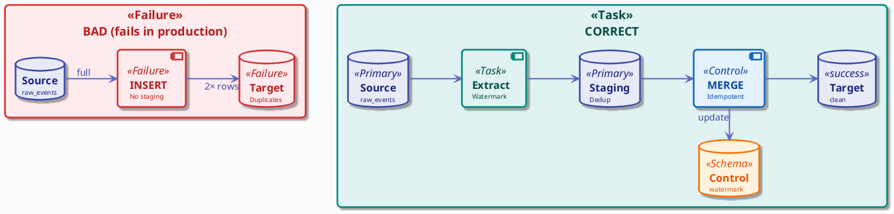
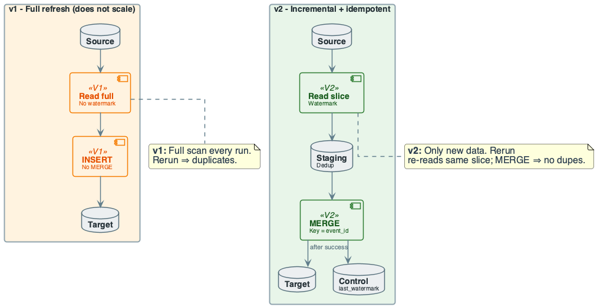
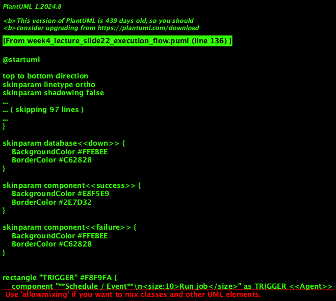
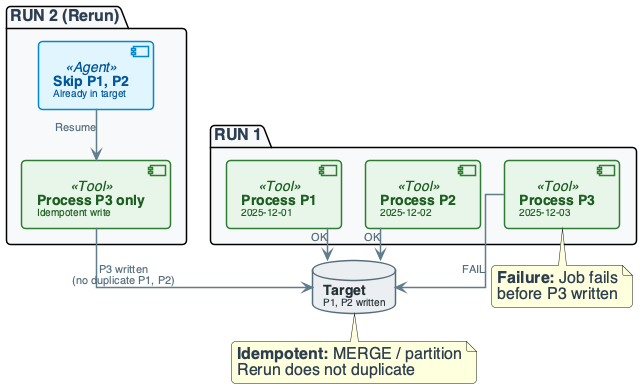
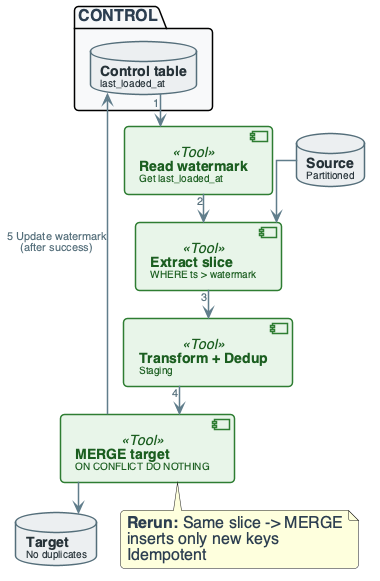

# Week 4: Data Ingestion and ETL Pipelines

## Purpose
- Ingestion is the first mile of data: source → storage
- ETL/ELT pipelines are the backbone of analytics and DWH
- Failures and reruns must not corrupt or duplicate data

## Learning Objectives
- Define ETL vs ELT and when to use each
- Classify ingestion: batch vs incremental; full vs delta
- Apply idempotency and watermark for safe reruns
- Design staging, dedup, and MERGE for incremental load
- Handle failure: partition-based resume, DLQ, no duplicates
- Reason about cost: I/O, network, latency vs consistency

## The Real Problem This Lecture Solves

## Revenue Duplication Incident
- **Failure:** company ran nightly revenue loads with plain INSERT
- No watermark; job failed mid-run
- Operator re-ran the full job
- Same day's data was inserted again

## Consequences
- Revenue dashboards showed 2× real revenue
- Finance and execs lost trust in "the number"
- **Root cause:** non-idempotent load; no staging or dedup
- **Takeaway:** bad ingestion breaks trust, not just pipelines

## The System We Are Building

## Domain Overview
- **Domain:** event analytics (clicks, views, purchases)
- Feeds BI and product dashboards
- **Data source:** raw_events (DB or log export)
- Partitioned by date; ~100M rows/day

## Pipeline Design
- **Extract:** with watermark; upper_bound = NOW() - 5 min
- **Staging:** one batch per run; schema-on-read; dedup by event_id
- Invalid rows → DLQ
- **Transform:** filter event_type; cast to proper types
- **Load:** MERGE into events_clean; key = event_id

## Diagram Manifest
- Slide 13 → week4_lecture_slide13_pipeline_overview.puml
- Slide 14 → week4_lecture_bad_architecture.puml
- Slide 15 → week4_lecture_evolution_v1_v2.puml
- Slide 22 → week4_lecture_slide22_execution_flow.puml
- Slide 38 → week4_lecture_slide38_failure_rerun.puml

## Core Concepts (1/2)
- **ETL:** Extract → Transform → Load
- **ELT:** Extract → Load → Transform (SQL in place)
- **Batch:** periodic bulk load (e.g. nightly)
- **Incremental:** only new/changed rows

## Core Concepts (2/2)
- **Idempotency:** running job N times = running once
- **Watermark:** last_loaded_at or max(id)
- Next run reads only data after watermark
- **CDC:** change data capture; apply from source log

## In-Lecture Exercise 1: Idempotency Check
- Define idempotency for a load job
- Explain why reruns must be idempotent

## In-Lecture Exercise 1: Solution (1/2)
- Idempotency: running the job N times equals running once
- Output is identical regardless of retries

## In-Lecture Exercise 1: Solution (2/2)
- Failures require reruns of the same slice
- Without idempotency, duplicates or double counts appear

## In-Lecture Exercise 1: Takeaway
- Reruns are normal in production pipelines
- Idempotency is a core safety property

## Source to Target Mapping (STTM)

## What is STTM?
- **Definition:** instructions for source-to-target data transfer
- Guidelines for ETL process
- Handles data types, unknown members, default values
- Addresses FK relationships and metadata
- Source and target almost never have same schema

## Why STTM is Essential
- **Data Integration:** moving data from operational DB to DWH
- Defines how sources relate; handles duplicates
- **Data Migration:** one-time movement for consistency
- **Data Transformation:** conversion of data format
- Includes type transformation, filtering, aggregating

## Steps in Source to Target Mapping
- Define attributes: which tables to transfer; frequency
- Map attributes: to destination system's attributes
- Transform data: convert to DWH-suitable form
- Test mapping: on sample data
- Deploy mapping: schedule on live data
- Maintain mapping: update for new sources

## STTM Techniques

## Manual Mapping
- Manually code connection between source and destination
- Use when mapping few sources with limited data
- **Advantages:** flexible, completely customizable
- **Disadvantages:** time-consuming, error-prone

## Automated Mapping
- Use when sources and volume increase with each round
- **Advantages:** fast, easy to scale, eliminates human error
- **Disadvantages:** training required; in-house solutions expensive

## Architectural Fork: ETL vs ELT

## Option A — ETL
- Transform in pipeline (Spark, Python); then load cleaned data
- **Pros:** target sees only clean data; smaller load volume
- **Cons:** transform logic outside DWH; more moving parts

## Option B — ELT
- Load raw into lake/DWH; transform with SQL (views, dbt)
- **Pros:** one copy of raw; transform scales with engine
- **Cons:** raw can be large; governance must control curated
- **Decision rule:** choose by engine power and governance needs

## ETL vs ELT Comparison

| Parameter | ETL | ELT |
|-----------|-----|-----|
| Process | Transform before load | Transform after load |
| Data Volume | Small to medium | Large-scale |
| Speed | Depends on transform | Speed independent of size |
| Maintenance | High | Low |
| Implementation | Easier early stage | Requires expertise |
| Cost | High for SMB | Low entry costs (SaaS) |
| Unstructured Data | Relational only | Supports unstructured |

## ETL Pipelining Concept
- ETL uses pipelining: extract while transforming
- During transformation, new data can be obtained
- When loading, already extracted data can transform
- **Benefit:** overlapping phases reduce total time

## Building Batch ETL Pipeline

## Step 1: Reference Data
- Create set of data defining permissible values
- Example: allowed country codes
- Acts as validation and standardization reference

## Step 2: Extract from Data Sources
- Combine data from multiple source systems
- Relational DB, non-relational DB, XML, JSON, CSV
- After extraction, convert to single format
- Choose method: date/time stamps, log tables, hybrid

## Step 3: Data Validation
- Automated process confirms expected values
- Example: transaction dates within past 12 months
- Rejected data analyzed regularly
- Correct source or modify extraction for next batches

## Step 4: Transform Data
- Remove extraneous or erroneous data
- Apply business rules
- Check data integrity (ensure not corrupted by ETL)
- Example: summarize invoices into daily totals

## Step 5: Stage
- Enter data into staging database first
- Makes it easier to roll back if something goes wrong
- Provides checkpoint for recovery

## Step 6: Publish to Data Warehouse
- Load data to target tables
- Some DWH overwrites; others append
- ETL loads new batch based on schedule

## Architectural Fork: MERGE vs Overwrite

## Option A — MERGE (Upsert)
- ON key match update/insert; rerun safe
- **Pros:** idempotent; handles duplicates and late updates
- **Cons:** cost = join source vs target; needs index

## Option B — Partition Overwrite
- Replace whole partition (e.g. by date)
- **Pros:** simple; no join; good for full day reload
- **Cons:** only idempotent at partition level
- **Decision:** MERGE for row-level upsert; overwrite for full partitions

## Data Context: daily_sales → sales
- daily_sales: 5M rows/day; duplicates by sale_id
- sales: PRIMARY KEY sale_id; upsert needed
- Goal: dedup in staging, then MERGE into sales

## In-Lecture Exercise 2: Batch Sales Upsert
- Deduplicate daily_sales by sale_id
- Keep latest record per sale_id
- Upsert into sales by sale_id

## In-Lecture Exercise 2: Solution (1/2)
- Use ROW_NUMBER() PARTITION BY sale_id ORDER BY sale_date DESC
- Keep rn = 1 as the deduped batch

## In-Lecture Exercise 2: Solution (2/2)
- MERGE on sale_id; insert if not matched
- Update if matched and source is newer

## In-Lecture Exercise 2: Takeaway
- Dedup in staging before touching the target
- MERGE provides idempotent upserts for batch loads

## Architectural Fork: Schema-on-Read vs Write

## Option A — Schema-on-Write
- Validate and type on load; bad row fails load
- **Pros:** target is always typed; simpler queries
- **Cons:** one bad row fails whole batch

## Option B — Schema-on-Read
- Load raw (VARCHAR/JSON); apply schema at query
- **Pros:** bad rows can go to DLQ; pipeline doesn't crash
- **Cons:** consumers must handle types
- **Decision:** schema-on-read at staging; schema-on-write at target

## Running Example — Data & Goal
- **Source:** raw_events (event_id, user_id, event_type, event_timestamp)
- **Sample:** (1,101,'click','2025/12/01 08:00:00','{...}')
- Duplicate event_id 1 in source
- **Target:** events_clean; event_time TIMESTAMP; no duplicates
- **Goal:** load raw → clean; dedup by event_id; idempotent rerun

## Running Example — Step-by-Step (1/4)
- **Step 1: Extract** — read raw_events with watermark
- Filter event_type IN ('click','view','purchase')
- Cast event_timestamp → TIMESTAMP; validate format
- Output: rows with event_time; invalid rows → DLQ

## Data Context: Incremental Events Load
- raw_events: append-only; duplicates possible
- events_clean: PRIMARY KEY event_id
- etl_control: job_key, last_watermark, last_run_ts
- Upper bound: NOW() - 5 minutes

## In-Lecture Exercise 3: Incremental Watermark Load
- Read last_watermark from etl_control
- Extract slice after watermark and before upper_bound
- Dedup by event_id; MERGE into events_clean
- Update watermark only after successful load
- Explain the 5-minute buffer

## In-Lecture Exercise 3: Solution (1/2)
- SELECT last_watermark for job_key = 'events_sync'
- upper_bound = NOW() - 5 minutes
- Extract where event_time > last_watermark AND <= upper_bound

## In-Lecture Exercise 3: Solution (2/2)
- Dedup by event_id; MERGE into events_clean
- Update last_watermark only after commit
- Buffer avoids missing late-arriving events

## In-Lecture Exercise 3: Takeaway
- Watermarks plus MERGE enable safe incremental loads
- Update control state only after success
- Buffers trade latency for correctness

## Running Example — Step-by-Step (2/4)
- **Step 2: Dedup (in-batch)** — one row per event_id
- ROW_NUMBER() OVER (PARTITION BY event_id ORDER BY event_time)
- Keep WHERE rn = 1; drop rest
- Ensures staging does not insert duplicate keys

## Running Example — Step-by-Step (3/4)
- **Step 3: Load (MERGE)** — MERGE INTO events_clean
- ON target.event_id = source.event_id
- WHEN NOT MATCHED THEN INSERT
- WHEN MATCHED AND newer THEN UPDATE (optional)
- Rerun with same source: no new rows inserted (idempotent)

## Running Example — Step-by-Step (4/4)
- **Result:** events_clean has one row per event_id
- Correct types; no duplicates
- **Trade-off:** MERGE cost = join; index on event_id critical
- **Conclusion:** staging + dedup + MERGE = safe ingestion

## From Example to Pipeline
- Same pattern: extract → dedup → merge
- Scales to many sources
- Next: system view; then cost and failure

## ETL Pipeline Overview
- Sources (DB, files, API) → Extract → Staging → Transform → Load
- Staging allows schema-on-read and validation

## Bad Architecture: Why This Fails

## Anti-Pattern
- Source → direct INSERT into target
- No staging; no watermark; no MERGE
- Rerun inserts same rows again ⇒ 2× counts
- Dashboard shows duplicated data

## Partial Failure
- Job fails after writing half the partitions
- Rerun re-inserts those partitions ⇒ duplicates
- **No dedup:** upstream retry sends same batch twice

## Cost of Naïve Design (Ingestion)

## Naïve Choices and Costs
- **Naïve:** plain INSERT; no staging; no watermark
- **Cost:** rerun duplicates rows
- Finance sees 2× revenue; trust collapses
- Root-cause takes days (which run inserted what?)

## Engineering Rule
- Idempotency and watermark are not optional
- Design for rerun from day one
- Wrong data drives wrong decisions

## Evolution: v1 to v2

## v1: Full Refresh
- Full table read every run; INSERT into target
- No watermark; fails at scale
- Full scan each run; rerun duplicates everything

## v2: Incremental + Idempotent
- Watermark; read only new slice
- Staging + dedup; MERGE
- Update watermark only after success
- Safe rerun; partition-level resume

## Cost & Scaling Analysis (1/3)
- **Time model:** T ≈ read + transform + write
- Read: I/O and network from source
- Write: target load (indexes, constraints)
- Batch size vs latency: larger = fewer runs, higher per-run time

## Cost & Scaling Analysis (2/3)
- **Memory / storage:** staging holds one batch
- Target grows monotonically
- Peak disk = max(staging size, target write buffer)
- Partition target by date for pruning

## Cost & Scaling Analysis (3/3)
- **Network / throughput:** extract and load move bytes
- Compression (Parquet, gzip) reduces transfer
- Trade CPU for bandwidth
- Incremental load reduces data vs full refresh

## Cost Intuition: What Changes at 10× Scale
- **10M → 100M rows/day:** staging 1 GB → 10 GB
- Memory and network 10×; MERGE scales with target size
- Index on key is mandatory
- **Daily vs hourly:** 24× more runs
- Watermark and partition pruning essential
- **Full scan vs partitioned:** hours vs minutes

## Cost Summary
- Read: source I/O and network
- Write: target load and indexes
- Transform: CPU and memory
- Incremental + partition pruning cut volume per run

## Storage and Partitioning
- Staging: one batch at a time; truncate per run
- Target: partition by date for pruning and safe rerun
- Control table: small; stores watermark and job state

## Incremental Load: Watermark
- Store last_loaded_at in control table
- Next run: SELECT WHERE modified_at > last_loaded_at
- Update watermark only after successful load
- Rerun skips already-loaded data

## Watermark and Late-Arriving Data
- Safety buffer: upper_bound = NOW() - 5 min
- Ensures committed transactions are included
- Trade latency (5 min old) for consistency (no loss)

## Execution Flow: Steps
- Trigger → read source with watermark → transform → write
- After successful write: update watermark in control table
- On failure: do not update; next run re-reads (idempotent)

## Failure Story 1: Rerun Duplicates Revenue

## Incident
- Nightly job failed after loading 2 of 3 partitions
- Operator re-ran full job
- Revenue showed ~2× for two partitions

## Root Cause and Fix
- INSERT without MERGE; no partition tracking
- **Fix:** MERGE on sale_id; track completed partitions
- On rerun skip completed; process only remaining
- Update watermark only after successful commit

## Failure Story 2: One Bad Row Kills Batch

## Incident
- Source sent integer instead of string for one partner
- One row failed cast; whole nightly load failed
- Next morning: dashboards had no new data

## Root Cause and Fix
- Schema-on-write only; no staging; no DLQ
- **Fix:** ingest to staging with schema-on-read
- Validate in transform; valid → target; invalid → DLQ
- Pipeline stays green; fix schema from DLQ analysis

## Pitfalls & Failure Modes (1/3)
- **Non-idempotent load:** INSERT without dedup ⇒ duplicates
- **No watermark:** full scan every run ⇒ slow and risky
- **Overwrite instead of merge:** reprocessing overwrites good data

## Pitfalls: Partial Failure and Resume
- Job processes P1, P2, P3; fails after P2
- Rerun from start: without idempotent write, P1 and P2 duplicated
- **Fix:** partition-level writes + MERGE or ON CONFLICT

## Pitfalls: Duplicate Source Data
- Upstream retries send same batch twice
- Or file re-delivered
- Dedup in staging then MERGE into target
- Processing same batch again changes nothing

## Pitfalls: Bad Data and DLQ
- One bad row can fail whole batch in schema-on-write
- Schema-on-read: load raw to staging
- Valid rows → target, invalid → DLQ
- Pipeline does not crash; bad rows auditable

## Pitfalls & Failure Modes (2/3)
- **Summary:** partial run, duplicate source, bad data
- All need design for rerun and validation
- Next: diagram of partial failure and idempotent rerun

## Pitfalls: Non-idempotent Write
- INSERT without key check: rerun inserts same rows
- **Fix:** MERGE or INSERT ON CONFLICT DO NOTHING
- Key by business key (event_id)
- Watermark alone insufficient if source resends batch

## Pitfalls: Partition-level Resume
- Track which partitions (dates) are completed
- On failure: skip completed; process only remaining
- Write per partition or MERGE so rerun does not duplicate

## Pitfalls: Duplicate Source and Dedup
- Upstream retries: same event_id appears twice in batch
- In-staging dedup: ROW_NUMBER() PARTITION BY event_id
- Keep rn=1; MERGE into target
- No duplicate keys in target

## Pitfalls: DLQ and Observability
- Invalid rows → Dead Letter Queue table
- DLQ columns: raw row, error_reason, ingest_ts
- Analyze patterns (e.g. one broken device)
- Do not drop bad rows silently

## Pitfalls: Detection
- Monitor: rows read vs written; watermark lag; DLQ count
- Alert: duration spike; zero rows (possible bug); DLQ growth
- Metrics: per-partition counts; control table last_updated

## Pitfalls: Mitigation Summary
- Idempotent write (MERGE/ON CONFLICT)
- Partition-level watermark and commit
- Staging + dedup + DLQ
- Update watermark only after success

## Engineering Judgment
- **Never plain INSERT into keyed target**
- Unless 100% sure source is append-only
- **Never update watermark before write commits**
- **Use safety buffer for late data**
- **Default to staging for bad or duplicate rows**

## CDC and Deletes
- Watermark on table scan detects inserts/updates
- Deletes leave no row
- To capture deletes: log-based CDC (WAL, binlog)
- Or soft-delete column
- Trade-off: complexity vs accepting no delete sync

## Control Table Design
- Columns: job_key, last_watermark, last_run_ts, status
- Read before run; update only after successful commit
- Partition-level: store completed partition list

## Rerun Scenario: What We Want
- Job processes P1, P2, P3; fails after P2
- Rerun processes only P3
- Target must not contain duplicate rows for P1, P2

## Failure Scenario: Summary
- Job runs for 12-01, 12-02, 12-03; fails after 12-02
- Rerun: only process 12-03; no re-insert of 12-01, 12-02
- Control table: mark 12-01 and 12-02 completed

## Pitfalls & Failure Modes (3/3)
- **Detection:** row counts, watermark lag, DLQ size
- **Mitigation:** idempotent writes; watermark + buffer
- **CDC for deletes:** use log-based CDC if deletes matter

## Best Practices (1/2)
- Use staging for raw load; validate and dedup before target
- Design for idempotency: MERGE or INSERT ON CONFLICT
- Watermark incremental loads; update only after commit
- Partition target by date for pruning and safe rerun
- Route bad rows to DLQ; do not fail entire batch

## Best Practices (2/2)
- Use transactions so partial write does not leave half-state
- Document schema, keys, and expected volumes
- Monitor load duration, row counts, watermark lag
- **Never advance watermark before commit**
- **Never INSERT into keyed target without MERGE**

## Recap (Engineering Judgment)
- **ETL vs ELT:** Choose ETL for clean target and staging
- Choose ELT when DWH/lake is the transform layer
- **Idempotency is non-negotiable**
- Partial failure and duplicate source are the norm
- **Cost:** I/O and network dominate
- Incremental + partition pruning cut scope
- **One bad row must not kill the batch**

## Pointers to Practice
- Write SQL: raw → clean with dedup and MERGE
- Incremental slice by watermark
- Reason about rerun: job fails after 2/3 partitions
- Design: staging schema, DLQ, and control table

## Additional Diagrams
### Practice: Incremental Rerun

