# Week 4: DWH + ETL (Part 1)

## Purpose
- Build ingestion pipelines that keep analytics trustworthy
- Connect ETL/ELT choices to DWH and lake architecture
- Design for retries, late data, and schema drift by default


---

## Learning Objectives
- Choose ETL vs ELT using workload and governance constraints
- Design incremental pipelines with watermarks and control tables
- Implement deterministic deduplication and idempotent loads
- Handle late data, bad data, and reruns without KPI corruption


---

## Lecture Flow
- Storage and ingestion context
- ETL/ELT and CDC design choices
- Incremental load mechanics in detail
- Idempotent publish patterns and failure recovery
- Monitoring, runbooks, and production checklist

---

## Why This Topic Is Critical
- Most BI outages begin in ingestion, not dashboards
- Small ingestion bugs create silent KPI drift
- Source systems change faster than analytics models
- Reliability requires explicit policies, not assumptions


---

## Incident: Revenue Doubled After Rerun
- Nightly pipeline failed at 02:10 after loading 2 of 3 partitions
- Operator reran full job with plain `INSERT`
- Same transactions loaded again, revenue KPI jumped ~2x
- Root cause: no checkpoint + no idempotent target write


---

## What a Reliable Ingestion Contract Includes
- Declared business key and event-time semantics
- Accepted lateness window (for example, 48 hours)
- Quality thresholds (null rate, type errors, duplicates)
- Recovery policy for rerun, backfill, and schema changes

---

## Ingestion Contract Hierarchy

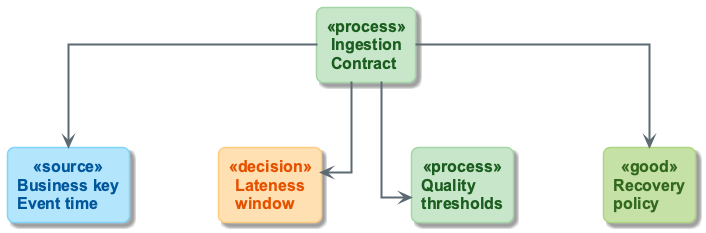{width=74%}

---

## Core Stores: Warehouse vs Lake
- **Warehouse**: curated, schema-on-write, BI-first
- **Lake**: raw + processed zones, schema flexibility
- Warehouse optimizes consistency and discoverability
- Lake optimizes ingestion agility and storage economics


---

## Data Warehouse Definition (Inmon)
- Inmon: a subject-oriented, integrated, time-variant, nonvolatile data store for decision support
- **Subject-oriented**: organized around major subjects (customer, product, sales)
- **Integrated**: multiple heterogeneous sources, cleaned and consistent naming/encoding

---

## Data Warehouse Definition (Inmon) — Time and Volatility
- **Time-variant**: historical perspective (past 5–10 years) vs operational current-value data
- **Nonvolatile**: physically separate; operational updates do not occur in the warehouse

---

## DWH vs Lake

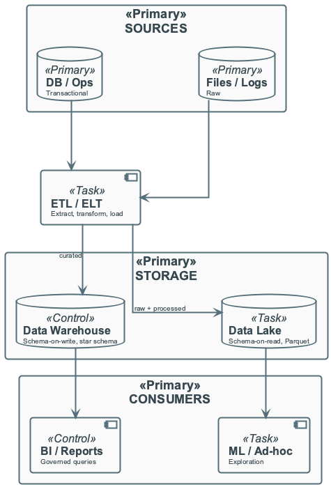{width=76%}

---

## Schema-on-Write vs Schema-on-Read
- Write-time schema validation catches issues earlier
- Read-time schema validation supports source variability
- Schema-on-write reduces BI surprise and metric drift
- Schema-on-read speeds onboarding but needs stronger governance

---

## Schema-on-Write vs Schema-on-Read — Visual

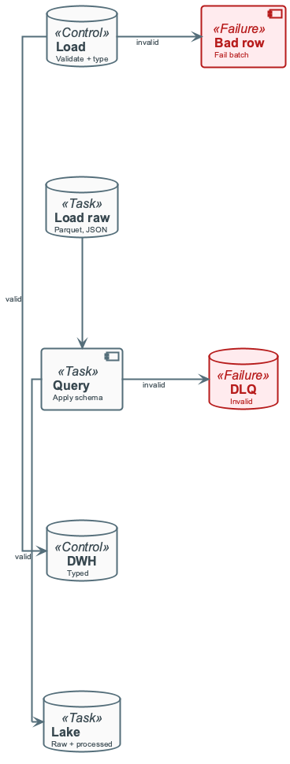{width=76%}

---

## Modeling Context for Ingestion
- Facts carry measurable events (`amount`, `qty`, `views`)
- Dimensions carry context (`customer`, `product`, `date`)
- Ingestion must preserve keys, timestamps, and lineage
- Ingestion quality defects propagate to all downstream marts

---

## Star Schema Context

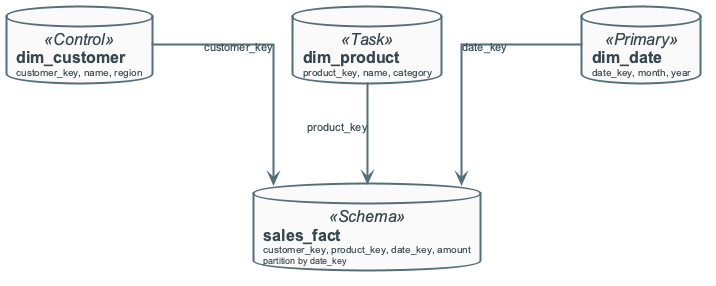{width=74%}

---

## ETL vs ELT
- **ETL**: transform then load curated target
- **ELT**: load raw first, transform in target compute engine
- ETL gives stronger pre-load control
- ELT gives better replay and faster iteration

---

## ETL vs ELT — Visual

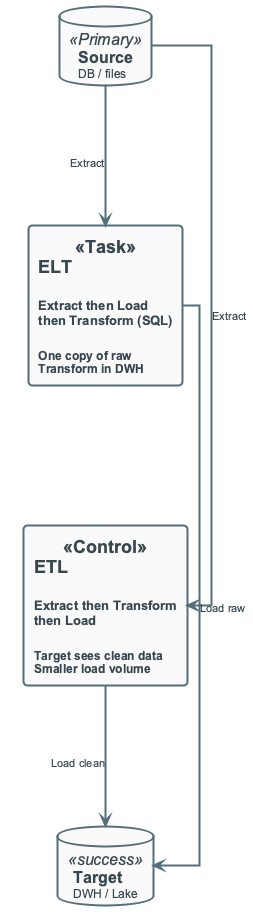{width=76%}

---

## Source-to-Target Mapping (STTM)
- Source and target schemas rarely match when moving data between systems
- STTM: a set of instructions defining how structure and content transfer from source to target
- Critical when integrating multiple sources with different schemas into a central warehouse

---

## STTM: What It Covers
- Multiple data types and encodings
- Unknown members and default values
- Foreign keys and referential integrity
- Metadata and lineage

---

## STTM Mapping Flow

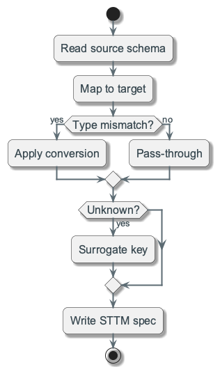{width=76%}

---

## STTM Process Types
- **Data Integration**: operational sources -> warehouse targets
- **Data Migration**: one-time movement between systems
- **Data Transformation**: convert formats, datatypes, and encodings


---

## ETL vs ELT Decision Table (1/2)
- Strict regulatory filters before persistence → **ETL**
- Fast-changing source schema → **ELT** with raw bronze layer

---

## ETL vs ELT Decision Table (2/2)
- Expensive source DB reads → **ELT** batched extracts
- Low tolerance for malformed curated rows → **ETL** gates + quarantine


---

## CDC Options (How Changes Are Captured)
- Full snapshot compare: simple, expensive at scale
- Timestamp/`updated_at` filter: easy, misses hard deletes unless modeled
- Log-based CDC: best fidelity, higher operational complexity
- Trigger-based CDC: accurate but can burden source DB

---

## CDC Options Comparison

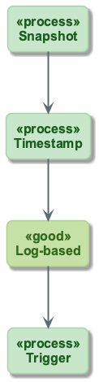{width=88%}

---

## CDC Example: Orders Table
- Inserts: new orders must appear once
- Updates: status changes from `PENDING` to `PAID`
- Deletes: canceled rows may need tombstone semantics
- Policy must specify how each change type maps to analytics


---

## DWH Back-End Tools (1/2)
- **Extraction**: get data from multiple, heterogeneous sources
- **Cleaning**: detect and rectify errors
- **Transformation**: convert from legacy/host format to warehouse format

---

## DWH Back-End Tools (2/2)
- **Load**: sort, summarize, consolidate, check integrity, build indices and partitions
- **Refresh**: propagate updates from sources to warehouse

---

## Ingestion Modes
- Full refresh: easiest correctness, worst cost/latency at scale
- Incremental batch: standard for most BI pipelines
- Micro-batch: lower latency with bounded complexity
- Streaming: lowest latency, highest operational discipline


---

## Watermark Mechanics (Precise)
- Store `last_successful_watermark` per job
- Compute `upper_bound = now() - safety_buffer`
- Read `(watermark, upper_bound]`
- Advance watermark only after successful target commit

---

## Watermark Incremental — Visual

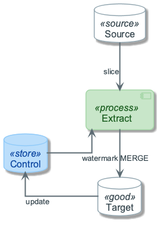{width=76%}

---

## Why Safety Buffer Is Needed
- Source commits may arrive late relative to extractor clock
- Without buffer, late commits are skipped permanently
- Typical buffer: 5-15 minutes for OLTP sources
- Monitor late-arrival rate to tune buffer size


---

## Late Data Handling Policy
- Define accepted lateness (example: 48 hours)
- Late but accepted rows trigger targeted backfill
- Too-late rows go to quarantine with reason code
- Publish a freshness metric that includes late-adjustment delay


---

## Incremental Rerun Example
- Run #101 processes `10:00-11:00`, fails before publish
- Run #102 retries same interval
- Final curated state must match exactly one successful run
- This requires deterministic dedup + idempotent merge

---

## Incremental Rerun — Visual

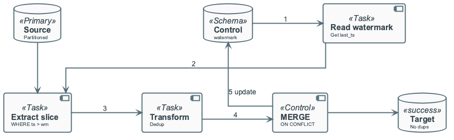{width=76%}

---

## Idempotency Rule
$$
f(f(D)) = f(D)
$$
- Reprocessing same input cannot change final target state
- Requires stable keys and deterministic transformation rules
- Implement with conflict-safe `MERGE`/upsert patterns

---

## Idempotency — Visual

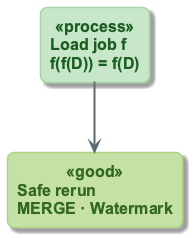{width=74%}


---

## Deterministic Dedup Rule (Example)
- Business key: `event_id`
- Tie-breaker: latest `ingest_ts`, then highest `source_seq`
- Exactly one survivor per key per run
- Persist dedup reason for auditability


---

## SQL Pattern: Dedup in Staging
```sql
WITH ranked AS (
  SELECT *,
         ROW_NUMBER() OVER (
           PARTITION BY event_id
           ORDER BY ingest_ts DESC, source_seq DESC
         ) AS rn
  FROM stg_events
)
SELECT *
FROM ranked
WHERE rn = 1;
```


---

## SQL Pattern: Idempotent MERGE
```sql
MERGE INTO events_clean t
USING stg_events_dedup s
ON t.event_id = s.event_id
WHEN MATCHED AND t.hash_diff <> s.hash_diff THEN
  UPDATE SET event_type = s.event_type, event_time = s.event_time
WHEN NOT MATCHED THEN
  INSERT (event_id, user_id, event_type, event_time)
  VALUES (s.event_id, s.user_id, s.event_type, s.event_time);
```


---

## MERGE vs Partition Overwrite
- `MERGE`: row-level precision, higher CPU and index pressure
- Overwrite partition: simple full-slice rebuild
- Use `MERGE` for mixed insert/update streams
- Use overwrite for controlled historical backfills

---

## MERGE vs Overwrite — Visual

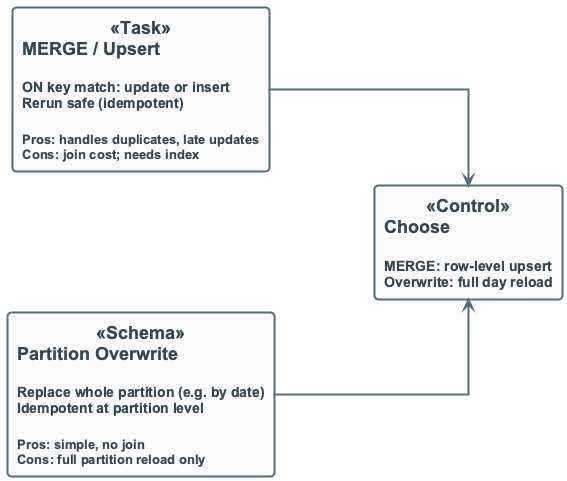{width=76%}

---

## Reference Pipeline Architecture (1/2)
- Source → Extract → Stage → Validate → Transform → Load → Publish
- Staging isolates raw variability from curated contracts

---

## Reference Pipeline Architecture (2/2)
- Invalid records routed to DLQ, not analytics tables
- Control table captures run state and window boundaries

---

## Pipeline Overview

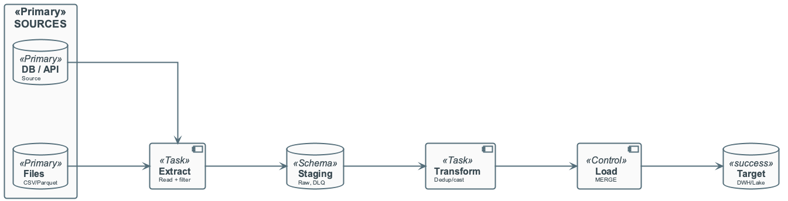{width=78%}


---

## Pipeline Execution (1/2)
- Extract window by watermark and buffer
- Stage data with run metadata
- Validate schema, types, and business rules

---

## Pipeline Execution (2/2)
- Dedup and transform into curated shape
- Merge/publish and then checkpoint watermark

---

## Execution Flow

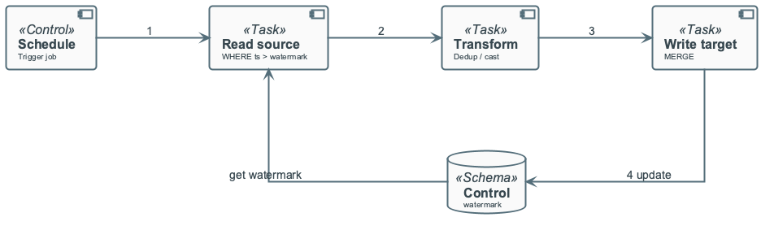{width=76%}


---

## Running Example: `raw_events` -> `events_clean`
- Volume: 120M rows/day
- Expected duplicate rate: ~0.7%
- SLA: publish by `HH:30` every hour
- Late events accepted up to 24 hours


---

## Quality Checks for the Example
- Required fields: `event_id`, `user_id`, `event_type`, `event_time`
- Valid enum: `event_type` in approved set
- Time sanity: `event_time <= ingest_ts + 5m`
- Uniqueness: post-dedup `event_id` distinct count

---

## Failure Mode: Bad Architecture
- Source writes directly into curated target
- No stage, no quality gates, no replay boundary
- Mid-run failures leave partial visible state
- Reruns duplicate rows and break KPI trust

---

## Bad Architecture — Visual

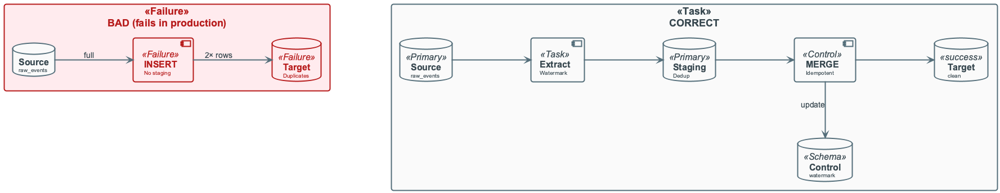{width=76%}


---

## Failure Mode: Partial Rerun Duplication
- P1/P2 loaded, P3 failed
- Full rerun reloads P1/P2
- KPI inflation may be silent
- Fix: partition-level checkpoint + idempotent load

---

## Failure Rerun — Visual

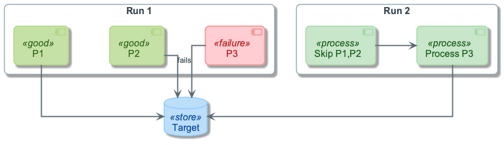{width=76%}


---

## Failure Mode: Bad Row Kills Batch
- One malformed timestamp causes cast failure
- Entire batch misses freshness SLA
- Fix: staging validation and DLQ routing
- Alert on DLQ spikes by reason and source

---

## DLQ Flow

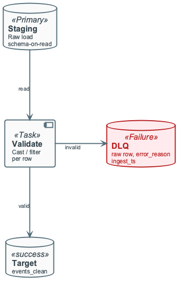{width=74%}


---

## Schema Drift Failure Mode
- Source adds or renames columns unexpectedly
- Parser silently drops or mis-maps fields
- Downstream dimensions lose attributes
- Fix: schema registry or contract checks + explicit evolution policy

---

## Control Table Design (1/2)
- **Identity and bounds**: `job_key`, `run_id`, `watermark`, `upper_bound`
- **Status and counts**: `status`, `rows_read`, `rows_loaded`, `rows_dlq`

---

## Control Table Design (2/2)
- **Timing and errors**: `started_at`, `finished_at`, `error_code`
- Optional: per-partition completion markers


---

## Control Table State Machine
- `STARTED` -> `VALIDATED` -> `LOADED` -> `PUBLISHED`
- Any failure transitions to `FAILED`
- Restart reads last `PUBLISHED` watermark only
- Avoid advancing watermark on partial success

---

## Control Table State Machine — Visual

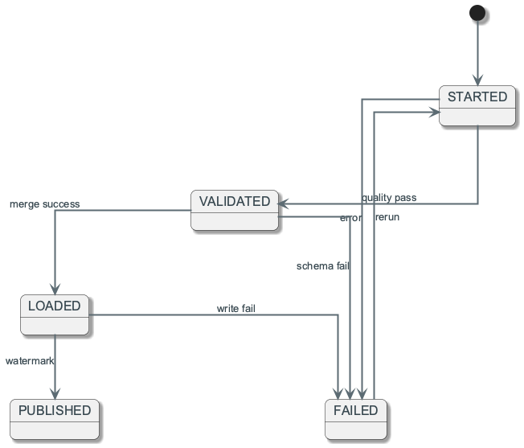{width=74%}


---

## Monitoring and SLOs (1/2)
- Freshness lag (`now - published_watermark`)
- Data quality pass rate and DLQ percentage

---

## Monitoring and SLOs (2/2)
- Duplicate-key conflict rate
- Runtime p50/p95 and failure-retry counts


---

## Production Runbook Checklist (1/2)
- Is late-data window documented and monitored?
- Is rerun path tested on same input window?

---

## Production Runbook Checklist (2/2)
- Can you recover one failed partition without full reload?
- Are quality failures observable by reason code?


---

## Recap
- Reliable ingestion is contract-driven engineering
- Watermark + deterministic dedup + idempotent load are core controls
- DLQ and checkpointing make failure recoverable, not catastrophic
- Next: dimensional modeling and query-cost engineering
