# Week 5: Data Warehousing and Data Lakes

## Purpose
- DWH and Data Lake are primary stores for analytics and BI
- Schema-on-read vs schema-on-write drives cost and flexibility
- Partitioning and pruning determine query cost at scale

## Learning Objectives
- Define Data Warehouse (DWH) vs Data Lake
- Explain schema-on-read vs schema-on-write trade-offs
- Model analytical data with star schema (fact + dimensions)
- Apply partitioning and partition pruning
- Reason about join size and query cost in OLAP
- Connect DWH/Lake to ETL output and BI consumers

## The Real Problem This Lecture Solves

## Full Scan Incident
- Company put all analytics in one huge table
- No partition key; BI built "revenue by region" with no date filter
- Table grew to 1 TB; query scanned full table every time

## Consequences
- Dashboards started timing out
- Finance and sales could not refresh reports
- Teams exported to Excel and duplicated logic
- Governance collapsed

## Root Cause and Takeaway
- No partition key in the model
- No governance requiring partition filter
- **Takeaway:** bad warehouse design breaks trust

## The System We Are Building

## Domain Overview
- **Domain:** e-commerce sales analytics
- Revenue by region, by category, by time
- **Sources:** operational DB and/or ETL output from Week 4

## Partition Pruning Cost Model
- Fact table size \(|F|\), partition selectivity \(s\) (fraction scanned)
$$
\text{ScanCost} = s \cdot |F|
$$
- Interpretation: pruning reduces I/O linearly with \(s\)
- Engineering implication: choose partition keys aligned with filters
- Star join with dimension sizes \(|D_i|\)
$$
\text{JoinWork} = O(|F| + \sum_i |D_i|)
$$
- Interpretation: fact table dominates join cost
- Engineering implication: keep dimensions small; broadcast when possible

## Architecture
- **Raw:** Lake raw zone or DWH staging; schema-on-read
- **Curated:** DWH star schema: sales_fact + dimensions
- sales_fact partitioned by date_key
- **Consumers:** BI tools (Tableau, Looker); analysts

## Core Concepts
- **Data Warehouse (DWH):** centralized store for analytical data
- Schema-on-write; optimized for SQL/OLAP
- **Data Lake:** store for raw and processed data
- Often schema-on-read; files (Parquet, ORC)
- **OLAP:** aggregations, joins, reporting over large datasets

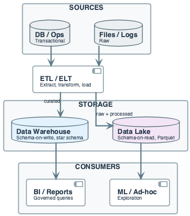

## Core Concepts
- **Star schema:** one fact table + dimension tables
- Denormalized for query speed
- **Partitioning:** data split by key (e.g. date)
- **Partition pruning:** skips irrelevant partitions
- **DWH:** typically ACID; **Lake:** often eventual consistency

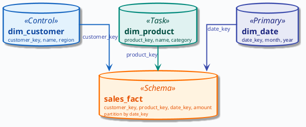

## Data Context: Star Schema (Sales)
- sales_fact: 1 TB/year, partitioned by date_key
- dim_customer: ~10K rows; region attribute
- dim_product: ~1K rows; category attribute
- dim_date: date_key, month, year

## In-Lecture Exercise 1: Partition Pruning Check
- Define partition pruning in one sentence
- Why is a query without date_key filter expensive?

## In-Lecture Exercise 1: Solution
- Pruning skips partitions that fail the WHERE predicate
- Only relevant partitions are scanned

## In-Lecture Exercise 1: Solution
- No date_key filter forces a full scan of all partitions
- I/O scales with total table size, not query scope

## In-Lecture Exercise 1: Takeaway
- Partition filters are mandatory for large fact tables
- Missing filters convert OLAP into full scans

## Data Warehouse Definition (Formal)

## Bill Inmon's Definition
- "A data warehouse is subject-oriented, integrated, time-variant, and nonvolatile"
- Collection of data supporting decision-making

## Key Characteristics
- **Subject Oriented:** organized around major subjects
- Customer, product, sales
- Focusing on modeling and analysis for decision makers

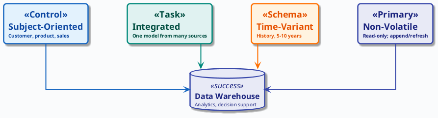

## Key Characteristics
- **Integrated:** multiple heterogeneous data sources
- Consistent naming conventions and encoding
- **Time Variant:** provides historical perspective (5-10 years)
- **Non-Volatile:** physically separate; operational updates don't occur

## Why Separate Data Warehouse?
- **Missing data:** DS requires historical data
- Operational DBs don't typically maintain history
- **Data consolidation:** DS requires aggregation and summarization
- **Data quality:** different sources use inconsistent representations
- **Performance:** analytical queries shouldn't impact operations

## DWH Back-End Tools and Utilities

## Data Processing Steps
- **Data extraction:** get data from multiple external sources
- **Data cleaning:** detect errors and rectify when possible
- **Data transformation:** convert from legacy to warehouse format
- **Load:** sort, summarize, consolidate, compute views
- **Refresh:** propagate updates from sources to warehouse

## DWH Process Architectures
- **Centralized:** single centralized storage and processing
- Huge structure (memory, processor, storage)
- **Distributed:** information across data centers
- Processing localized; results grouped centrally
- **Trade-off:** centralized simpler; distributed better for scale

## Multidimensional Modeling

## What is Multidimensional Modeling?
- Technique for structuring data around business concepts
- **ER models:** entities and relationships (operational focus)
- **Multi-dimensional:** measures and dimensions (analytical focus)

## Measures and Dimensions
- **Measures:** numerical data being tracked
- Can be analyzed and examined (e.g., sales amount, quantity)
- **Dimensions:** business parameters defining a transaction
- E.g., time, product, store, customer

## Dimensional Hierarchy
- Dimensions are organized into hierarchies
- **Time example:** days → weeks → quarters → years
- **Product example:** product → line → brand → category
- Dimensions have attributes (date, month, year; id, city, state)
- Hierarchies enable drill-down and roll-up in OLAP

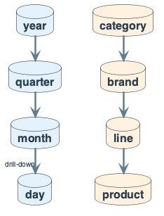

## DWH Schema Types

## The Star Schema
- **Definition:** relational model with one-to-many relationships
- Between dimension tables and fact table
- Single fact table with detail and summary data
- Fact table PK has one key column per dimension
- Each dimension is a single, denormalized table

## The Star Schema
- **Benefits:** easy to understand; intuitive mapping
- Easy to define hierarchies; reduces joins
- **Drawbacks:** summary data can yield poorer performance
- Huge dimension tables can be a problem

## Star Schema Example
```
Sales Fact Table:           time Dimension:
- time_key (FK)             - time_key (PK)
- item_key (FK)             - day, day_of_week
- branch_key (FK)           - month, quarter, year
- location_key (FK)
- units_sold                item Dimension:
- dollars_sold              - item_key (PK)
- avg_sales                 - item_name, brand, type
```

## In-Lecture Exercise 2: Join Size Reasoning
- Query: revenue by region for December 2025
- sales_fact pruned to December; dim_customer is small
- Decide which side to broadcast in a distributed join
- What if dim_customer were 10 GB instead of 10 MB?

## In-Lecture Exercise 2: Solution
- Fact slice is far larger than dim_customer
- Broadcast dim_customer; keep fact partitions local

## In-Lecture Exercise 2: Solution
- If dim_customer is 10 GB, broadcast is too large
- Use shuffle/hash join on customer_key instead

## In-Lecture Exercise 2: Takeaway
- Join strategy depends on relative table sizes
- Small dimensions should be broadcast when possible
- Size shifts can flip the optimal strategy

## The Snowflake Schema
- **Definition:** some dimensions don't connect directly to fact
- Must join through other dimension tables
- **Snowflaking:** normalizing dimension tables in star schema
- Low cardinality attributes form separate tables

## Snowflake Schema Trade-offs
- **Suitable for:** many-to-many and one-to-many relationships
- **Result:** more complex queries; reduced performance
- **Advantages:** small storage savings; easier to maintain
- **Disadvantages:** less intuitive; difficult to browse

## The Galaxy Schema (Fact Constellation)
- **Definition:** two or more fact tables sharing dimensions
- **Use case:** multiple business processes share common dimensions
- **Example:** sales fact and shipping fact sharing time, item, location

## Which Schema Design is Best?
- **Performance benchmarking** determines best for your use case
- **Snowflake:** easier when dimension tables very large
- **Star:** more effective for data cube browsing (fewer joins)
- **Engineering rule:** start with star; snowflake if proven bottleneck

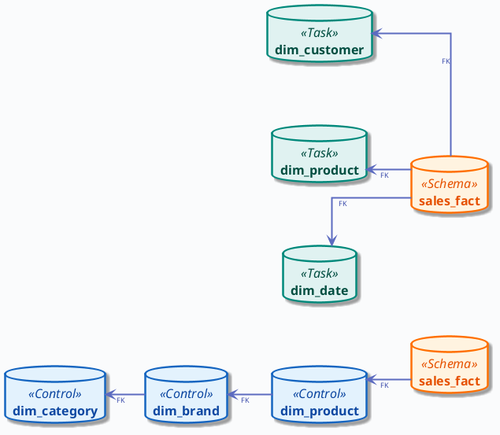

## Architectural Fork: Lake First vs DWH First

## Option A — Lake First
- Ingest raw to Lake; process in Lake (Spark)
- Sync curated tables to DWH or query Lake with SQL engine
- **Pros:** raw preserved; flexibility for ML; storage cheap
- **Cons:** two places to govern; small-file issues in Lake

## Option B — DWH First
- Ingest (or ETL) directly into DWH; star schema in DWH
- BI only on DWH
- **Pros:** one place for BI; strong consistency
- **Cons:** raw may be limited; less flexibility for ML
- **Decision:** Lake for raw + ML; DWH for governed reporting

## Schema-on-Read vs Schema-on-Write

## Schema-on-Write (DWH Default)
- Data validated and typed on load
- Bad row fails load
- **Pros:** predictable types; simple queries
- **Cons:** one bad row fails batch; schema change = migration

## Schema-on-Read (Lake Default)
- Load raw (Parquet/JSON); apply schema when querying
- **Pros:** flexibility; schema evolution without reload
- **Cons:** consumers handle types; consistency is eventual
- **Decision:** schema-on-write for curated; schema-on-read at landing

## DWH vs Data Lake
- **DWH:** structured; schema enforced on load
- SQL engines (Snowflake, BigQuery, Redshift)
- Best for curated reporting
- **Lake:** raw + processed; schema applied at read
- File-based (S3, HDFS); best for flexibility and cost

## DWH vs Data Lake
- **Cost model:** DWH compute + storage often coupled
- Lake: storage cheap, compute on demand
- **Hybrid:** Lakehouse (Delta, Iceberg) combines both
- **What breaks:** DWH = large single table scans
- Lake = small-file problem; both: skew and hot partitions

## Star Schema and OLAP (This System)

## Fact Table
- `sales_fact(sale_id, customer_key, product_key, date_key, quantity, amount)`
- Partitioned by date_key
- BI queries always filter by date_key

## Dimension Tables
- `dim_customer(customer_key, name, region)`
- `dim_product(product_key, name, category)`
- `dim_date(date_key, date, month, year)`
- **Benefit:** simple joins; predictable query patterns

## Partitioning and Pruning

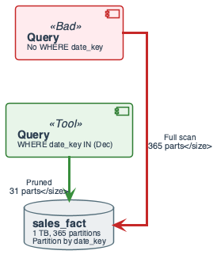

## Partition Key
- E.g. `date_key`; data stored in directories per partition
- Query with `WHERE date_key BETWEEN 20251201 AND 20251231`
- Reads only those partitions

## Pruning Cost
- Scan size ≈ (selected partitions / total) × table size
- Pruning reduces I/O significantly
- Engineering: require partition filter in WHERE

## In-Lecture Exercise 3: Pruning Cost Math
- 365 partitions/year; total size 1 TB
- December query uses date_key between 20251201 and 20251231
- Compute partitions read and bytes scanned
- What if the date filter is missing?

## In-Lecture Exercise 3: Solution
- Partitions read: 31 (one per day in December)
- Size per partition: 1 TB / 365 ≈ 2.7 GB
- Bytes scanned: 31 × 2.7 GB ≈ 84 GB

## In-Lecture Exercise 3: Solution
- Without date filter: all 365 partitions scanned
- Full 1 TB scan for every report
- Cost and latency explode

## In-Lecture Exercise 3: Takeaway
- Partition pruning is the main cost lever in OLAP
- Always enforce date filters in BI queries
- Full scans break dashboards at scale

## DWH and Lake: Pipeline Overview
- Sources (DB, logs) → ETL/ELT → DWH (star) and/or Lake (raw + processed)
- BI and analytics query DWH or Lake via SQL engines

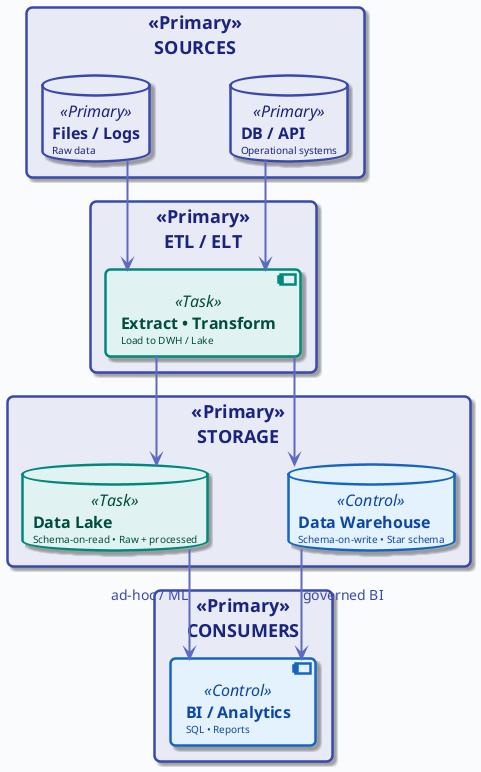

## Bad Architecture: Why This Fails

## Anti-Pattern
- One huge fact-like table; no partition key
- BI reports with no date filter
- Every query does full table scan
- At 1 TB, queries timeout; dashboards break

## Hot Partition Problem
- If partitioned but only by date, "today" gets all writes and reads
- ⇒ throttle and skew

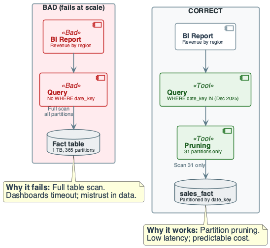

## Cost of Naïve Design (DWH / Lake)

## Naïve Choices
- **Naïve:** one big table; no partition key
- "We'll add filters in the query"
- **Cost:** full scan at 1 TB ⇒ 15+ min or timeout

## Real Cost
- Dashboards fail; teams export to Excel
- Duplicate logic; governance collapses
- **Engineering rule:** partition by time; require filter in WHERE

## Evolution: v1 Single Table → v2 Star + Partitioned

## v1: Single Table
- One big table; no partition key; ad-hoc WHERE
- Fails at scale: full scan; unpredictable join cost

## v2: Star + Partitioned
- Star schema; fact partitioned by date_key
- Dimensions small; BI required to filter by date_key
- Pruned scan; predictable cost; governance


## Running Example — Data & Goal
- **Domain:** e-commerce sales analytics
- **Fact:** `sales_fact(sale_id, customer_key, product_key, date_key, quantity, amount)`
- Partitioned by date_key
- **Dimensions:** dim_customer, dim_product, dim_date
- **Goal:** revenue by region and by category with pruning

## Running Example — Step-by-Step
- **Step 1:** Fact table partitioned by date_key (one partition per day)
- Sample: (1, 101, 201, 20251201, 2, 19.98)
- Dimensions: small; not partitioned

## Running Example — Step-by-Step
- **Step 2:** Query: revenue by region for December 2025
- Join sales_fact → dim_customer on customer_key
- Filter date_key between 20251201 and 20251231
- Partition pruning: only December partitions scanned

## Revenue by Region Query
```sql
SELECT c.region, SUM(f.amount) AS total_revenue
FROM sales_fact f
JOIN dim_customer c ON f.customer_key = c.customer_key
WHERE f.date_key BETWEEN 20251201 AND 20251231
GROUP BY c.region ORDER BY total_revenue DESC;
```

## Running Example — Step-by-Step
- **Step 3:** Same fact, different dimension: revenue by category
- Join sales_fact → dim_product on product_key
- Same date filter; same partition pruning
- Different dimension join; same fact scan

## Running Example — Step-by-Step
- **Output:** (region, total_revenue) and (category, total_revenue)
- **Conclusion:** star schema + partition by date = predictable joins
- **Trade-off:** denormalization duplicates attributes; acceptable for analytics

## Cost & Scaling Analysis
- **Time model:** query time ≈ scan + join + aggregate
- Scan time ∝ rows read; partition pruning reduces rows
- Formula:
$$
T \propto R_{\text{scan}} / \text{throughput}
$$

## Cost & Scaling Analysis
- **Memory / storage:** fact table dominates; dimensions small
- Partition fact to bound scan per query
- DWH often columnar (compress well); Lake: Parquet/ORC
- Peak memory: join buffers or hash tables for large joins

## Cost & Scaling Analysis
- **Network / throughput:** in distributed DWH, shuffle for joins
- Partition pruning reduces data moved
- Co-location by key reduces shuffle
- Latency: BI queries often 1–30 s

## Cost Intuition: What Changes at 10× Scale

## Fact Table Growth
- **10M → 1B rows:** full scan 100× more I/O than 10M
- Without pruning, dashboards time out
- With 31-day filter, scan ≈ 1/12 of year ⇒ ~30M rows

## Partition Strategy
- **Daily vs hourly partitions:** more partitions = smaller size
- Avoid 10K+ tiny files in Lake (coalesce to 100 MB–1 GB)
- **Rule of thumb:** at 10× data, enforce partition filter

## Query Flow: From BI to Result

## Query Execution Steps
- BI tool issues SQL → query planner
- Partition pruning (filter by partition key)
- Scan only selected partitions
- Join fact to dimensions (broadcast small dims)
- Aggregate; return result

## Query Flow Diagram
- 1) Parse query; extract partition filter
- 2) List partitions to read; skip others
- 3) Scan fact partitions; join to dimensions; aggregate

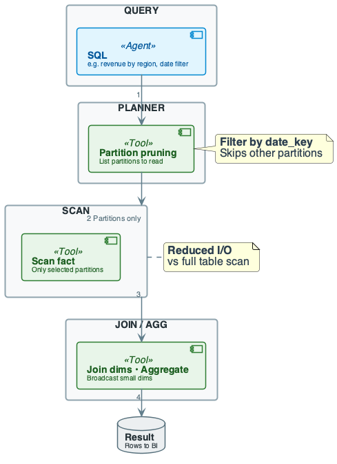

## Join Size and Cost Intuition
- **Fact–dim join:** fact has FK; dimension small
- Cost ≈ scan fact (pruned) + lookup dim (in memory)
- **Large join:** if dimension huge, shuffle dominates
- **Best practice:** partition fact by time; keep dimensions small

## Failure Story 1: Full Scan Kills Dashboards

## Incident
- Table grew to 1 TB; "revenue by region" had no date filter
- New analyst copied old query without WHERE date_key
- Report ran 15+ minutes or timed out

## Root Cause and Fix
- No partition filter; optimizer scanned all partitions
- **Fix:** enforce partition filter above size threshold
- BI template requires date range; monitor bytes read

## Failure Story 2: Small-File Explosion

## Incident
- Streaming inserts wrote one small file per micro-batch
- Partition "2025-12-01" had 50K files
- Queries over that partition took minutes

## Root Cause and Fix
- Many small files; scan cost = file open + read
- 50K files ⇒ 50K× metadata overhead
- **Fix:** compaction job; coalesce to 100 MB–1 GB per file
- Use table formats (Delta, Iceberg) with automatic compaction

## Pitfalls & Failure Modes
- **No partition key in query:** full table scan
- High latency and cost; common in ad-hoc SQL
- **Schema evolution:** new columns in Lake
- DWH requires ALTER or new version
- **Small-file problem (Lake):** many tiny files; overhead per file

## Pitfalls: Full Scan When Pruning Missed
- Query "revenue by region" without WHERE on date
- Engine scans all partitions ⇒ full scan
- **Fix:** require partition filter in critical reports

## Pitfalls: Hot Partition and Skew
- One partition (today) gets most writes and reads
- Can throttle writes and slow queries
- Many small files in one partition
- **Mitigation:** partition by date + bucket by key

## Pitfalls: Dimension Too Large
- If dimension is huge, join causes large shuffle
- **Options:** pre-aggregate; keep only needed attributes
- Or partition dimension
- Join size ≈ O(|fact scan|) if dim fits in memory

## Pitfalls: Detection
- Monitor: query scan size (rows/bytes); partitions read
- Alert: full table scan; long-running joins; OOM on dim join
- Metrics: per-query bytes read; partition count; join spill

## Pitfalls: Mitigation Summary
- Always use partition filter where possible
- Coalesce small files in Lake; size partitions for 100MB–1GB

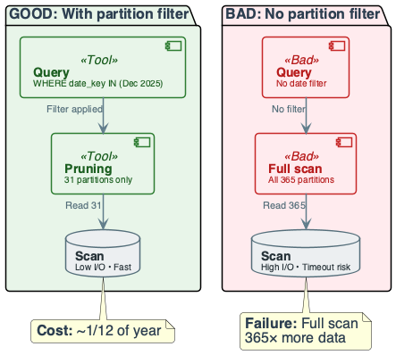

## Engineering Judgment

## Key Rules
- **Never expose large fact table without partition key**
- Default: partition by date; require date range in WHERE
- **In Lake, never leave small-file problem unaddressed**
- Target 100 MB–1 GB per file per partition
- **Choose DWH for governed BI, Lake for raw + ML**

## Rerun and Idempotency
- Incremental load into fact: watermark on date
- Same pattern as Week 4 ETL
- Rerun must not duplicate fact rows
- Use MERGE or partition-level overwrite

## Control Table
- last_loaded_date; update only after successful load

## Lake: Small-File and Compaction
- Many small writes create many small files per partition
- Each file has metadata and open overhead
- Compaction: coalesce small files into larger ones

## DWH: Partition Key in Every Query
- Critical reports must filter by partition key
- Without filter: optimizer may scan all partitions
- **Governance:** require filter for tables above size threshold

## Cost Recap: Pruning vs Full Scan
- **Pruned:** scan size = (selected / total) × table size
- E.g. 1/365 of year
- **Full scan:** 365× more I/O and time
- **Enforce filters in BI; document partition key**

## Failure: What We Want
- Query with date filter → few partitions → low latency
- Query without date filter → all partitions → high latency


## Pitfalls & Failure Modes
- **Detection:** scan size, partition count, join spill
- **Mitigation:** enforce partition filters; coalesce files
- **Lake + DWH:** Lake for raw and ML; DWH for governed BI

## BI Consumers and Dashboards

## What is a Dashboard?
- **Stephen Few (2004):** visual display of most important information
- Needed to achieve one or more objectives
- Consolidated on a single screen
- Can be monitored at a glance

## What is a Dashboard?
- **Big Book of Dashboards (2017):** visual display of data
- Used to monitor conditions and/or facilitate understanding
- **Key insight:** dashboards are primary DWH consumers
- Design DWH for dashboard query patterns

## What Makes a Good Dashboard?
- Answers a set of questions
- Follows a flow and invites interactivity
- Primarily summaries and exceptions
- Specific to and customized for audience
- Makes strategic use of color

## UI/UX Design Principles for BI
- **User familiarity:** user-oriented terms
- **Consistency:** appropriate level in display
- **Minimal surprise:** predictable operation
- **User guidance:** help systems, online manuals
- **User diversity:** different interaction preferences

## Human Factors in Dashboard Design
- **Limited short-term memory:** ~7 items maximum
- Presenting more increases mistakes
- **People make mistakes:** inappropriate alarms increase stress
- **Different preferences:** some like pictures, some like text

## Color Use Guidelines
- Limit the number of colors used
- Use color change to show status change
- Use color coding to support the task
- Be consistent; be careful about color pairings

## Information Presentation Types

## Static vs Dynamic Information
- **Static:** initialized at session start; does not change
- **Dynamic:** changes during session; must communicate changes
- **Engineering implication:** DWH must support batch and near-real-time

## BI Tools Connection to DWH
- BI tools connect via SQL, stored procedures, or APIs
- Common: SQL Server, Excel, Tableau, Power BI, Looker
- **Architecture:** DWH → Stored Procedures → BI Tool → Reports
- All tools assume clean, well-modeled data in DWH

## Best Practices
- Model analytics with star schema; partition fact by date
- Always include partition key in WHERE for large tables
- Use surrogate keys in fact for dimensions (SCD Type 2)
- Keep dimensions small or partitioned
- In Lake: store in columnar format (Parquet/ORC)
- Coalesce small files; schema evolution with care

## Best Practices
- Document partition key and expected query patterns
- Monitor query cost (bytes read, partitions read)
- Alert on full scans
- Separate raw, processed, and curated zones
- Govern access to curated layer
- **Enforce:** no fact query without partition filter above size threshold

## Recap (Engineering Judgment)
- **DWH vs Lake:** DWH for governed BI; Lake for raw and ML
- Hybrid when you need both
- **Partition pruning is the lever:** full scan kills dashboards
- **Star schema + partition by time:** predictable joins and pruning
- **Cost:** at 10× data, enforce partition filter
- Monitor bytes/partitions read; alert on full scan

## Pointers to Practice
- Build star schema (fact + ≥2 dimensions) with sample rows
- Write OLAP query with partition filter
- Show partition pruning: which partitions are read
- Reason about join size and cost
- Optional: incremental load into fact from Week 4

## Additional Diagrams
### Practice: Star Query Flow

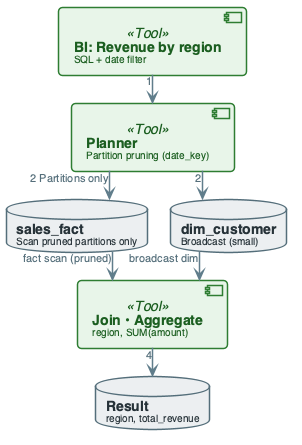
