# Week 5: DWH + ETL (Part 2)

## Purpose
- Design analytical models that keep BI fast and trustworthy
- Control OLAP cost using partition-aware modeling and querying
- Choose warehouse, lake, or hybrid architecture with clear contracts


---

## Learning Objectives
- Define fact grain and dimension strategy for accurate metrics
- Compare star, snowflake, and galaxy schemas using workload evidence
- Quantify partition pruning and join-cost effects on performance
- Apply governance controls that prevent full scans and metric drift


---

## Lecture Flow
- Fact and dimension design fundamentals
- Schema patterns and when to use each
- Query planning, pruning, and cost mechanics
- Hybrid architecture and semantic governance
- Failure modes and operational controls

---

## Why This Topic Is Core to the Course
- Most analytics cost/latency issues are modeling issues
- Wrong grain or keys creates incorrect KPIs
- Partition mistakes can multiply compute cost by 100x+
- Governance must be encoded in data model and tooling


---

## Incident: Full-Scan Dashboard Outage
- Dashboard ran every 5 minutes on a 1 TB fact table
- Missing date predicate caused full scans each refresh
- Concurrent scans saturated cluster slots
- Root cause: no guardrail for partition-filter enforcement

---

## Fact and Dimension Fundamentals
- **Fact table**: measurable events at declared grain
- **Dimension table**: descriptive context for slicing metrics
- **Measures**: additive or semi-additive numeric fields
- **Hierarchy**: drill path (day -> month -> quarter -> year)


---

## Multidimensional Modeling
- Technique for structuring data around business concepts
- ER models describe entities and relationships; multidimensional models describe measures and dimensions
- **Measures**: numerical data tracked in business, analyzed and examined
- **Dimensions**: business parameters that define a transaction (e.g., time, product, store)
- Dimensions organized into hierarchies (e.g., time: days -> weeks -> quarters; location: city -> country -> region)

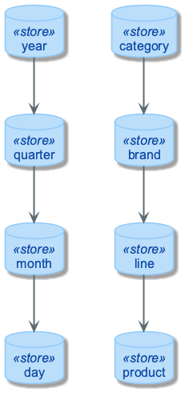{width=74%}


---

## Declaring Fact Grain (Non-Negotiable)
- Example grain: one row per sold order line
- Grain determines valid aggregations and uniqueness
- If grain is ambiguous, double counting is likely
- Document grain and keys before writing ETL


---

## Running Model: E-Commerce Sales
- `sales_fact(sale_line_id, customer_key, product_key, date_key, amount, qty)`
- `dim_customer(customer_key, region, segment, valid_from, valid_to)`
- `dim_product(product_key, category, brand)`
- `dim_date(date_key, date, week, month, quarter, year)`


---

## Measure Types and Aggregation Rules
- Additive: `revenue`, `qty` (sum across all dimensions)
- Semi-additive: `inventory_balance` (sum across product, not across time)
- Non-additive: ratios like `conversion_rate`
- Define aggregation semantics in semantic layer

---

## Star Schema (Default)
- Central fact with denormalized dimensions
- Simple joins and strong analyst usability
- Usually best first model for BI dashboards
- Preferred when dimension sizes are manageable

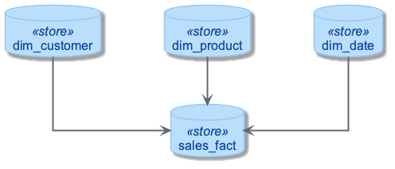{width=74%}


---

## Snowflake Schema
- Dimensions normalized into sub-dimensions
- "Snowflaking" = normalizing dimension tables in a star schema
- Reduces redundancy in large hierarchical dimensions
- More joins and potentially higher latency
- Useful when large hierarchical dimensions dominate maintenance and storage cost


---

## Galaxy (Fact Constellation)
- Multiple facts share conformed dimensions
- Example: sales, shipping, returns share `dim_date` and `dim_product`
- Enables cross-process analytics with consistent dimensions
- Requires strict metric ownership and naming conventions


---

## Star vs Snowflake vs Galaxy (Decision)
- Fast delivery + dashboard-heavy workload -> star
- Massive, volatile dimensions -> snowflake selectively
- Multi-domain enterprise analytics -> galaxy
- Validate with benchmark queries, not preference

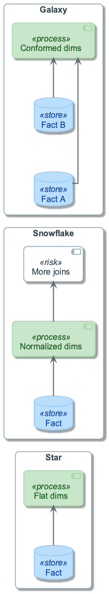{width=84%}

---

## Slowly Changing Dimensions (SCD)
- Type 1: overwrite old value (no history)
- Type 2: keep history with validity window
- Type 3: limited history in extra columns
- Choose by business need for historical truth


---

## SCD Example: Customer Region Change
- Customer moves from `North` to `Center`
- Type 1: all past sales appear as `Center`
- Type 2: past sales remain `North`, new sales `Center`
- BI finance usually requires Type 2 for auditability

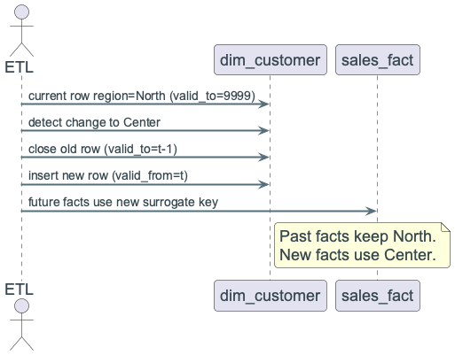{width=82%}


---

## Surrogate Keys and Natural Keys
- Natural key: source identifier (`customer_id`)
- Surrogate key: warehouse-managed key (`customer_key`)
- Surrogates isolate BI model from source key changes
- Facts should join dimensions by surrogate key

---

## Partitioning Strategy
- Partition large facts by dominant time filter (`date_key`)
- Keep partition granularity aligned to query patterns
- Use clustering/sorting on secondary filters (`customer_key`, `product_key`)
- Avoid over-partitioning into tiny files


---

## Partition Pruning Cost Model
$$
\text{ScanCost} = s \cdot |F|
$$
- `|F|`: total fact size, `s`: selected partition fraction
- Example: `|F|=1 TB`, one-day filter over 365 days -> `s=1/365`
- Scan drops from `1 TB` to about `2.74 GB`
- Cost and runtime often drop proportionally

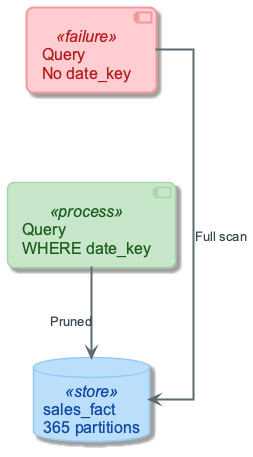{width=76%}


---

## Join Cost Intuition
$$
\text{JoinWork} \approx O(|F_{pruned}| + \sum |D_i|)
$$
- Pruned fact size is usually dominant term
- Broadcast joins help when dimensions fit memory
- Large dimensions force shuffle and spill
- Model dimensions to stay compact and conformed


---

## Query Flow: BI to Result
- Planner checks partition predicates
- Engine prunes fact partitions
- Joins conformed dimensions
- Aggregates and returns compact result

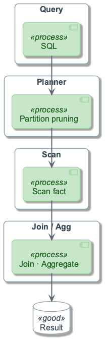{width=76%}


---

## Running Query: Revenue by Region
```sql
SELECT c.region, SUM(f.amount) AS total_revenue
FROM sales_fact f
JOIN dim_customer c ON f.customer_key = c.customer_key
WHERE f.date_key BETWEEN 20251201 AND 20251231
GROUP BY c.region;
```
- Date filter enables pruning
- Fact scan dominates runtime
- Region aggregation cost is relatively small


---

## SQL for DWH: Joins and Optimization
- Use `ON` when join column names differ; use `USING (col)` when equal
- INNER JOIN: only matching rows; OUTER JOIN (LEFT/RIGHT/FULL) for preserving non-matching
- Push filters into `WHERE` to enable partition pruning before joins


---

## Query Anti-Pattern Example
```sql
SELECT c.region, SUM(f.amount)
FROM sales_fact f
JOIN dim_customer c ON f.customer_key = c.customer_key
GROUP BY c.region;
```
- Missing partition filter forces full scan
- Unsafe for production dashboard refresh loops
- Must be blocked by SQL guardrails

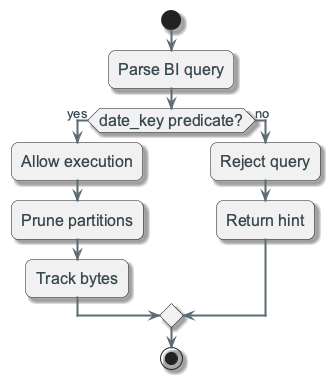{width=76%}

---

## Warehouse vs Lake
- **Warehouse**: curated semantics, strict governance, BI-first
- **Lake**: raw/processed zones for flexibility and ML use cases
- Warehouse gives consistency and metric trust
- Lake gives ingestion agility and lower storage cost

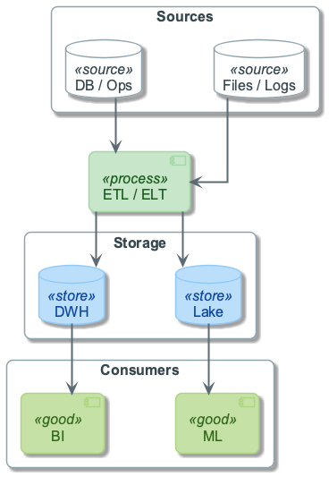{width=76%}


---

## Classic DWH Characteristics (Inmon)
- Subject-oriented
- Integrated
- Time-variant
- Non-volatile

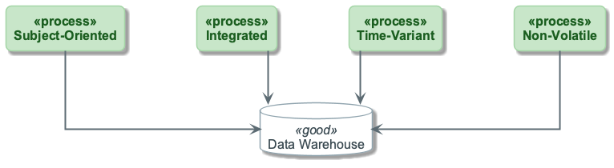{width=74%}


---

## Hybrid Architecture (Common Pattern)
- Raw events land in lake (bronze)
- Standardized cleaned layer (silver)
- Curated business marts/semantic models (gold)
- BI must query gold only for consistent KPIs

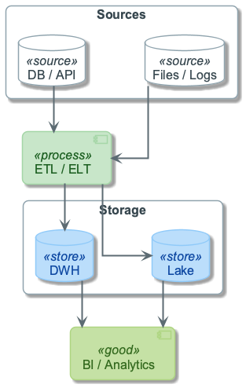{width=76%}


---

## Architecture Evolution (v1 -> v2)
- v1: one fact, few dimensions, manual definitions
- v2: conformed dimensions, semantic contracts, cost guardrails
- Add complexity only where workload proves need
- Plan migration path to avoid breaking dashboards

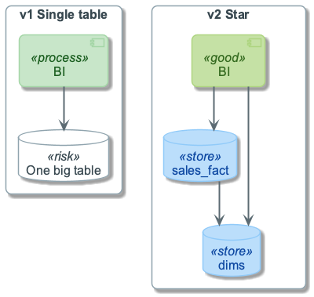{width=76%}

---

## Failure Mode: No Partition Filter
- Analyst query omits `date_key` predicate
- Full fact scan drives high latency and cost
- Concurrent dashboards amplify impact
- Fix: enforce required partition predicates


---

## Failure Mode: Small-File Explosion
- Streaming ingestion creates many tiny files per partition
- Metadata and file-open overhead dominates runtime
- Pruning helps less than expected
- Fix: compaction jobs with target file-size bands

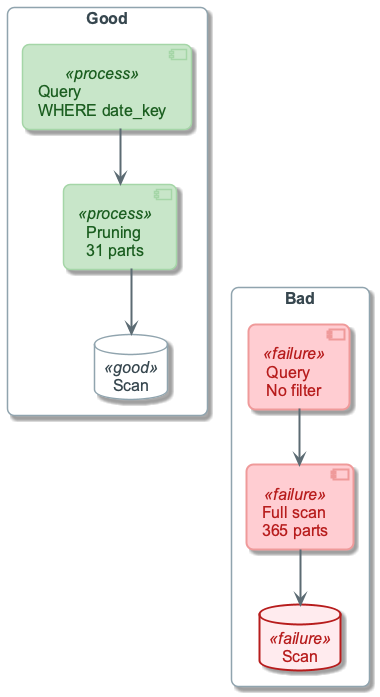{width=76%}


---

## Failure Mode: Metric Drift Across Teams
- Teams define `revenue` differently (gross vs net)
- Dashboards disagree despite same source tables
- Root cause: no governed semantic metric layer
- Fix: central metric definitions and review workflow


---

## Failure Mode: Weak Curated Boundaries
- BI queries raw/silver tables directly
- Inconsistent joins and filters create KPI instability
- Reconciliation becomes weekly manual effort
- Fix: restrict BI access to curated models

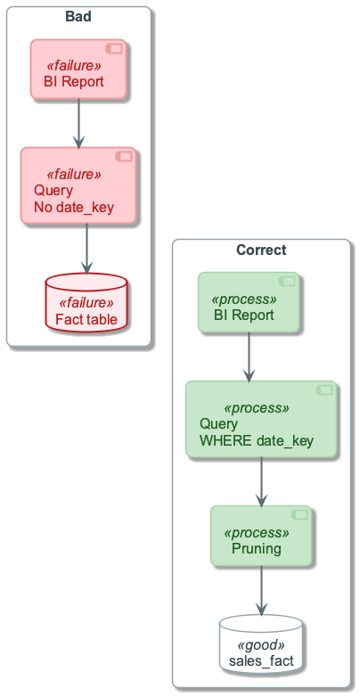{width=76%}

---

## Governance Controls
- SQL guardrail: block large-fact queries without time filter
- Semantic layer: certified metric definitions
- Data contracts: required fields and grain constraints
- Cost monitoring: bytes scanned, slots consumed, partitions read

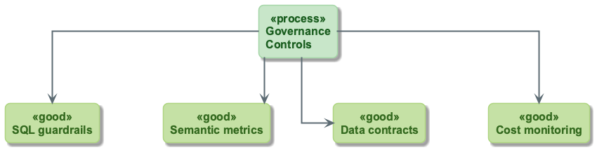{width=76%}


---

## Operational Metrics
- Bytes scanned per dashboard refresh
- Partitions scanned per query
- Query latency p50/p95 and queue time
- Compaction backlog and small-file count


---

## Design Checklist
- Is fact grain explicitly documented?
- Are SCD policies defined per critical dimension?
- Is partition key aligned with top BI predicates?
- Are metric definitions centralized and versioned?


---

## Recap
- Correct grain and dimension design protect metric accuracy
- Partition pruning is the main OLAP cost lever
- Hybrid architecture works only with strong semantic governance
- Next: MapReduce and shuffle-driven scaling mechanics
