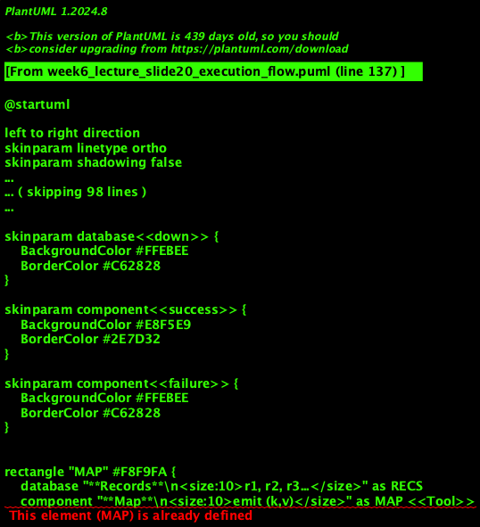
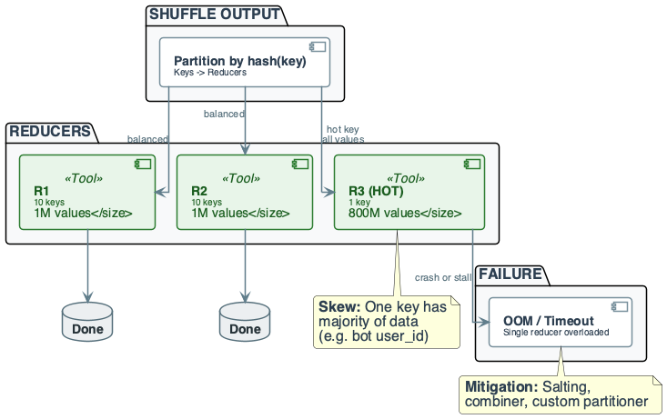
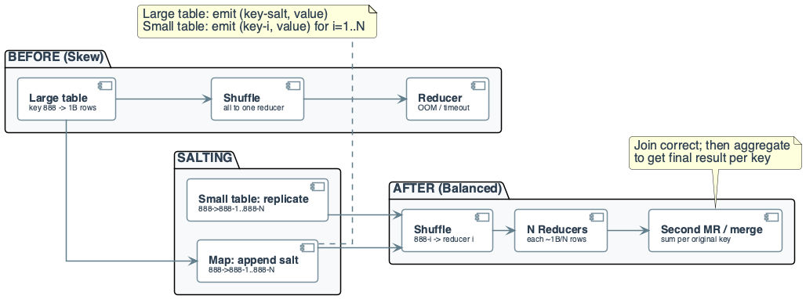

# Week 6: MapReduce Fundamentals

## Purpose
- MapReduce is the execution model for distributed batch processing
- Shuffle cost and data skew dominate failure at scale
- Engineering: design keys, minimize shuffle, handle skew

## Learning Objectives
- Define MapReduce: map, shuffle, reduce
- Write map and reduce functions for aggregation
- Trace a full job: map emits, shuffle groups, reduce aggregates
- Compute shuffle size and reducer input size
- Identify data skew and hot keys as failure modes
- Describe combiner and salting
- Reason about cost: work, span, network

## The Real Problem This Lecture Solves

## Production Failure
- Team ran "clicks per user_id" at 1B events
- One bot user_id had 800M clicks
- Hash partitioning sent that user_id to one reducer

## Consequences
- Reducer received ~800M values; OOM
- Job failed or blocked the cluster
- No combiner; shuffle moved 800M pairs
- **Root cause:** naïve key design; no combiner; no salting

## Takeaway
- MapReduce scales only if key distribution designed for it
- Skew and shuffle cost are main failure modes at scale

## The System We Are Building

## Domain Overview
- **Domain:** event analytics (clicks, views, purchases)
- Aggregate by key for BI and product
- **Input:** event log or ETL output (events_clean)
- (event_id, user_id, event_type, event_time, …); partitioned by date

## Job Design
- **Map:** emits (user_id, 1) or (session_id, 1)
- **Shuffle:** groups by key
- **Reduce:** sums ⇒ (user_id, count)
- **Output:** aggregates for dashboards and downstream pipelines
- Same key → same reducer; hot key can kill one reducer

## Diagram Manifest
- Slide 17 → week6_lecture_slide17_system_overview.puml
- Slide 20 → week6_lecture_slide20_execution_flow.puml
- Slide 29 → week6_lecture_slide29_failure_skew.puml

## Why MapReduce in Data Engineering
- Batch processing at scale: single node cannot process TB
- MapReduce: divide input; map in parallel; shuffle; reduce
- Foundation for Hadoop, Spark, and distributed SQL
- Enables aggregation, join, and indexing at cluster scale

## Core Concepts (1/2)
- **MapReduce:** programming model
- Map (emit (k,v)) → Shuffle (group by k) → Reduce (aggregate)
- **Map:** pure function per record; no cross-record state
- Emits zero or more (key, value) pairs
- **Shuffle:** framework sends same key to same reducer
- Sort/group by key

## Core Concepts (2/2)
- **Reduce:** receives one key and iterator of values
- Emits final (key, aggregate)
- **Key constraint:** same key lands on one reducer
- hash(key) mod R determines reducer
- **Guarantees:** deterministic if map/reduce pure
- **What breaks:** shuffle I/O; skew ⇒ OOM

## Formal Model: Input and Output Types
- **Input:** (key_in, value_in) or split of raw records
- **Map:** (k_in, v_in) → list of (k_out, v_out)
- k_out is the grouping key for reduce
- **Shuffle:** groups all (k_out, v_out) by k_out
- **Reduce:** (k, list of v) → one or more (k, result)

## Formal Model: Key and Partitioning
- **Partition function:** partition(k, R) = hash(k) mod R
- R = number of reducers
- Same k ⇒ same partition ⇒ same reducer
- **Implication:** design k so load is balanced
- Hot k ⇒ one partition overloaded

## Pseudocode: Map and Reduce (Word Count)
- **Map:** `map(line_id, text): for word in split(text): emit(word, 1)`
- **Reduce:** `reduce(word, values): emit(word, sum(values))`
- Map: no cross-line state
- Reduce: one key, aggregate over values; deterministic

## Data Context: Sales by Product (10 Records)
- Records: (transaction_id, product_id, amount)
- product_id keys: 101, 102, 103
- Goal: total sales per product_id

## In-Lecture Exercise 1: Sales Map and Shuffle
- Write map outputs (product_id, amount)
- Group by product_id after shuffle

## In-Lecture Exercise 1: Solution (1/2)
- Map emits amounts keyed by product_id
- 101→[10.0,7.5,2.0,11.0]
- 102→[5.5,4.5,6.0]
- 103→[3.0,8.0,1.5]

## In-Lecture Exercise 1: Solution (2/2)
- Three shuffle groups: 101, 102, 103
- Total map emits = 10 (one per record)

## In-Lecture Exercise 1: Takeaway
- Map output key defines the reduce grouping
- Shuffle groups are the reducer inputs

## Running Example — Data & Goal
- **Input:** log lines (record = line)
- Sample 4 lines: "a b a", "b a c", "a c", "b b a"
- **Goal:** word count — (word, count)
- **Schema:** input (line_id, text); map emits (word, 1)

## Running Example — Input Table

| line_id | text    |
|--------:|---------|
| 1       | a b a   |
| 2       | b a c   |
| 3       | a c     |
| 4       | b b a   |

- Distinct keys after map: a, b, c
- Total map emits = 11

## Running Example — Step-by-Step (1/4)
- **Step 1: Map** — each line independently; emit (word, 1)
- R1: (a,1),(b,1),(a,1)
- R2: (b,1),(a,1),(c,1)
- R3: (a,1),(c,1)
- R4: (b,1),(b,1),(a,1)
- Total map emits: 3+3+2+3 = 11 pairs

## Running Example — Step-by-Step (2/4)
- **Step 2: Shuffle** — group by key
- All (a,1) → reducer for "a"; same for "b", "c"
- **Grouped:** a→[1,1,1,1,1], b→[1,1,1,1], c→[1,1]
- Shuffle moves 11 (k,v) pairs over network

## Running Example — Step-by-Step (3/4)
- **Step 3: Reduce** — each reducer gets one key and values
- Sum the values
- Reducer "a": sum([1,1,1,1,1]) = 5
- Reducer "b": 4; Reducer "c": 2
- **Output:** (a, 5), (b, 4), (c, 2)

## Running Example — Step-by-Step (4/4)
- **Result:** word-count table; correct and deterministic
- **Conclusion:** map emits (word,1); shuffle groups; reduce sums
- **Trade-off:** shuffle size = map output size
- Skew would overload one reducer

## Cost of Naïve Design (MapReduce)

## Naïve Choices
- **Naïve:** emit (user_id, 1) for every event; no combiner
- "Shuffle will handle it"
- **Cost:** hot key gets 80% of values
- One reducer OOM or 10× slower

## Real Cost
- Job fails or blocks cluster
- Debugging "which reducer?" and "why so slow?"
- Re-run with same design fails again
- **Engineering rule:** design key for balance; use combiner

## MapReduce Pipeline Overview
- Input (files/blocks) → split → Map tasks
- Map emits (k,v) → Shuffle (sort & transfer) → Reduce tasks → output

## Execution Flow: Map Phase
- Each map task reads one split (block or line range)
- For each record, map emits (k,v) pairs to buffer
- Buffer may spill to local disk; sorted by k
- No communication between map tasks
- Parallelism = number of splits

## Execution Flow: Shuffle Phase
- Map output partitioned by key (hash(k) mod R)
- Each partition sent to one reducer
- On reducer side: fetch from all mappers; merge-sort by key
- **Cost:** network = total map output size
- Disk I/O for sort and spill

## Execution Flow: Reduce Phase
- Reducer receives merged stream of (k, iterator of values)
- Reduce function aggregates and writes output
- One output partition per reducer

## Cost & Scaling Analysis (1/3)
- **Time model:** T_job ≈ T_map + T_shuffle + T_reduce
- T_shuffle often dominates
- **Work W:** total CPU over all tasks
- **Span S:** critical path
- **Speedup:** upper bound min(workers, map_tasks)

## Cost & Scaling Analysis (2/3)
- **Memory:** map task: input chunk + output buffer
- Reducer: one key's value list (skew risk)
- **Storage:** map output and shuffle spill on disk
- Output = reduce write
- **Reducer OOM:** one key with huge value list

## Cost & Scaling Analysis (3/3)
- **Network / shuffle:** bytes shuffled ≈ map output
- Every (k,v) sent once
- **Formula:** shuffle_bytes ≈ N_emits × avg_size_per_pair
- Throughput limited by network
- **Latency:** shuffle often bottleneck

## Shuffle Size Calculation
- **Example:** 10^9 records, 10 words each ⇒ 10^10 emits
- 20 B per (word, count) ⇒ 200 GB shuffle
- At 10 Gbps: 200 GB / 1.25 GB/s ≈ 160 s minimum
- **Reduction:** combiner cuts map output

## In-Lecture Exercise 2: Shuffle Size Math
- 4 lines, 15 map emits total
- Each (word,1) pair is 20 bytes
- Compute total shuffle size
- With 3 reducers, estimate bytes per reducer
- "the" appears in 3 lines: how many pairs for that key?

## In-Lecture Exercise 2: Solution (1/2)
- Total map output: 15 × 20 B = 300 B
- Shuffle size equals map output: 300 B
- Even split: 300 / 3 ≈ 100 B per reducer

## In-Lecture Exercise 2: Solution (2/2)
- "the" appears 3 times ⇒ 3 (k,v) pairs
- All 3 pairs go to one reducer for key "the"

## In-Lecture Exercise 2: Takeaway
- Shuffle size scales with number of map emits
- Hot keys concentrate bytes on one reducer
- Even distribution is a best-case assumption

## Reducer Memory and Skew
- Each reducer holds one key's value list in memory
- **Skew:** one key has 10^9 values ⇒ list size huge ⇒ OOM
- **Mitigation:** spread hot key (salting); increase memory

## Pitfalls & Failure Modes (1/3)
- **Data skew:** one key has most records
- One reducer gets most data ⇒ OOM or timeout
- **Non-deterministic map/reduce:** breaks replay and debugging
- **Shuffle storm:** too many/large map outputs; no combiner

## Pitfalls & Failure Modes (2/3)
- **Hot key:** e.g. user_id 888 (bot) has 1B clicks
- hash(888) mod R → one reducer
- That reducer receives ~1B records; others finish quickly

## Pitfalls & Failure Modes (3/3)
- **Detection:** partition sizes after shuffle; reducer runtimes
- Alert if max ≫ median
- **Combiner:** local pre-aggregation before shuffle
- **Salting:** append random suffix; replicate small side in join

## Failure: Hot Reducer (Skew)
- Hash partitioning sends same key to same reducer
- Hot key ⇒ one reducer gets huge input
- That reducer: OOM or timeout

## In-Lecture Exercise 4: Hot Key Skew
- user_id 888 has 1B clicks; others < 1K
- Hash partition to 1,000 reducers
- Each click is 100 B
- Compute data volume for reducer handling 888
- Why does it fail?

## In-Lecture Exercise 4: Solution (1/2)
- Reducer for 888 gets ~1B records
- Data size: 1B × 100 B = 100 GB

## In-Lecture Exercise 4: Solution (2/2)
- 100 GB exceeds reducer memory and spill budgets
- One reducer becomes the straggler and times out

## In-Lecture Exercise 4: Takeaway
- Hot keys create single-reducer bottlenecks
- Detect skew early and apply salting or custom partitioning

## Combiner: When and Why
- **When:** reduce function is associative and commutative
- E.g. sum, count, max
- **Effect:** combine (k,v1),(k,v2) on map side → (k, v1+v2)
- Fewer pairs sent in shuffle
- **Correctness:** same as running reduce on full value list
- **Trade-off:** not all reducers support (e.g. median)

## In-Lecture Exercise 3: Combiner Impact
- Word count: 15 map emits drop to 8 after combining
- Each (k,v) is 20 bytes
- Compute new shuffle size
- Why does the final reduce output stay correct?

## In-Lecture Exercise 3: Solution (1/2)
- New shuffle size: 8 × 20 B = 160 B
- Reduction from 300 B to 160 B

## In-Lecture Exercise 3: Solution (2/2)
- Sum is associative and commutative
- Local sums equal global sum after shuffle

## In-Lecture Exercise 3: Takeaway
- Combiners reduce shuffle without changing results
- Use only with associative, commutative reduces

## Custom Partitioner and Salting

## Custom Partitioner
- **Default:** hash(k) mod R; even spread only if key distribution even
- **Custom:** override to control which reducer gets which keys
- E.g. range partition, avoid known hot keys
- **Contract:** deterministic; same key always same partition

## Salting
- For hot key k, emit (k||salt, v) with random salt
- N reducers get 1/N of hot key
- **Join:** small table row replicated to all salt buckets
- Second pass to combine results per original key
- **Trade-off:** more reducers and merge logic

## Best Practices (1/2)
- Design map output key for balanced distribution
- Avoid single dominant key
- Use combiner when reduce is sum/count/max
- Monitor shuffle size and per-partition sizes
- Alert on skew (max/median ratio)
- Prefer smaller, bounded reduce groups

## Best Practices (2/2)
- Keep map and reduce pure (no shared mutable state)
- Deterministic for replay
- Minimize map output size: smaller keys/values; filter early
- Test with skewed input (one key 80% of data)
- Document partition function and key design

## MapReduce vs SQL Aggregation
- SQL: GROUP BY key → aggregate; optimizer chooses plan
- MapReduce: map emits (k,v); shuffle = distributed group by
- Reduce = aggregate
- Same logical result; MapReduce explicit about shuffle cost
- Use MapReduce when: scale beyond single node; need control

## Summary: Phases and Cost
- **Map:** read split, emit (k,v); cost ∝ input size
- **Shuffle:** group by key, transfer; cost ∝ map output; bottleneck
- **Reduce:** aggregate per key; skew ⇒ one reducer slow

## Relation to Parallelism (Week 3)
- Divide: split input into chunks (splits)
- Conquer: map per chunk in parallel
- Combine: shuffle groups by key; reduce aggregates
- Pure map/reduce and key design carry over
- Skew and combiner from Week 3 apply here

## Recap (Engineering Judgment)
- **MapReduce:** Map emits (k,v); shuffle groups; reduce aggregates
- Same key → same reducer; key distribution is main design lever
- **Shuffle is the bottleneck:** at 10^9 records, shuffle dominates
- Use combiner when reduce is sum/count
- **Skew is first-class failure:** one hot key ⇒ OOM
- Design for balance; use salting for hot keys
- **Cost:** work, span, shuffle bytes

## Pointers to Practice
- Run full manual MapReduce on 8–12 input records
- Compute shuffle size and reducer input size
- Solve one skew case: hot key and mitigation
- Diagram required

## Additional Diagrams
### Practice: Skew Mitigation

