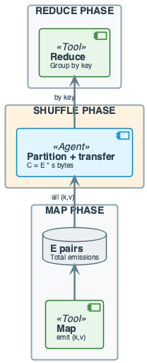
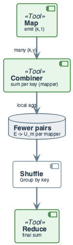
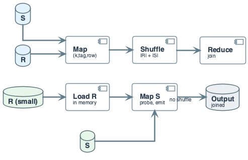

# Week 6: MapReduce Fundamentals

## Purpose
- MapReduce is the computational model for distributed batch processing
- Formalizes divide-and-conquer for data-parallel computation
- Engineering: shuffle cost and data skew dominate failure at scale

## Learning Objectives
- Define MapReduce formally: map, shuffle, reduce as operators
- State the computational model and constraints
- Analyze shuffle complexity and network cost
- Identify why exact global aggregation fails at scale
- Design keys for balanced partitioning
- Describe combiner correctness requirements

---

# Part I: The Computational Problem

## The Problem We Are Solving
- **Input:** Dataset $D$ with $n$ records distributed across $M$ machines
- **Goal:** Compute aggregate $A = \bigoplus_{r \in D} f(r)$ for associative $\oplus$
- **Constraint:** No single machine can hold all of $D$
- **Output:** Result available at coordinator or distributed across reducers

## Why Exact Centralized Solutions Fail

## The Impossibility Argument
- Dataset size $|D| = n$ records, each of size $s$ bytes
- Total data: $n \cdot s$ bytes
- Single machine memory: $M_{\text{max}}$ bytes
- **Constraint:** $n \cdot s \gg M_{\text{max}}$
- **Consequence:** Cannot load all data into one machine's memory

## Concrete Example
- $n = 10^{12}$ records (1 trillion events)
- $s = 100$ bytes per record
- Total: $10^{14}$ bytes = 100 TB
- Single machine RAM: $10^{12}$ bytes = 1 TB
- **Gap:** 100× larger than memory
- **Conclusion:** Must process in parallel across machines

## The Communication Bottleneck
- Even if we had infinite compute, data must move
- Network bandwidth $B$ bytes/second
- Moving 100 TB at 10 Gbps: $\frac{10^{14}}{1.25 \times 10^9} \approx 80{,}000$ seconds
- **Insight:** Minimizing data movement is the optimization target

---

# Part II: Formal MapReduce Model

## MapReduce: Formal Definition
- **Map:** $\text{map}: (k_1, v_1) \rightarrow [(k_2, v_2)]$
- Per-record function; emits zero or more key-value pairs
- **Shuffle:** $\text{shuffle}(k_2) = \{v_2 \mid (k_2, v_2) \text{ emitted}\}$
- Groups all values by key; same key → same reducer
- **Reduce:** $\text{reduce}: (k_2, [v_2]) \rightarrow [(k_3, v_3)]$
- Aggregates values per key

## The Shuffle as Distributed GROUP BY
- Shuffle implements: `GROUP BY key`
- **Partition function:** $\pi(k) = h(k) \mod R$
- $h$: hash function; $R$: number of reducers
- **Guarantee:** All $(k, v)$ with same $k$ reach same reducer
- **Cost:** All map outputs cross the network

## Formal Constraints
- **Map:** No cross-record state; pure function
- **Reduce:** Receives complete group for one key
- **Memory:** Reducer must hold all values for one key
- **Determinism:** Same input → same output (enables retry)

## Diagram: MapReduce Pipeline
- Input splits → Map tasks → Shuffle (partition + sort) → Reduce tasks → Output
- (see Diagram: week6_lecture_slide17_system_overview.puml)

---

# Part III: Cost Model and Complexity

## Cost Model: Work, Span, Communication
- **Work $W$:** Total computation across all machines
- **Span $S$:** Critical path (longest sequential chain)
- **Communication $C$:** Total bytes transferred in shuffle

## Shuffle Cost Formula
- Let $E$ = total map emissions (key-value pairs)
- Let $s$ = average size per pair (bytes)
$$
C_{\text{shuffle}} = E \cdot s
$$
- **Interpretation:** Communication cost scales with map output size
- **Engineering:** Reduce $E$ via filtering, combining, smaller keys

## Time Complexity
- **Map phase:** $T_{\text{map}} = O\left(\frac{n}{P_m}\right)$ with $P_m$ mappers
- **Shuffle phase:** $T_{\text{shuffle}} = O\left(\frac{E \cdot s}{B}\right)$ with bandwidth $B$
- **Reduce phase:** $T_{\text{reduce}} = O\left(\frac{E}{P_r}\right)$ with $P_r$ reducers
$$
T_{\text{total}} = T_{\text{map}} + T_{\text{shuffle}} + T_{\text{reduce}}
$$
- **Bottleneck:** Shuffle dominates at scale

## Space Complexity
- **Map:** $O(|split|)$ per mapper + output buffer
- **Reduce:** $O(\max_k |values(k)|)$ — must hold all values for one key
- **Failure mode:** One key with $10^9$ values → reducer OOM

---

# Part IV: Why Exact Solutions Require Full Shuffle

## The Aggregation Problem
- **Goal:** Compute $\sum_{i=1}^{n} x_i$ where $x_i$ distributed across machines
- **Exact solution:** All $x_i$ must reach the aggregator
- **Communication:** $\Omega(n)$ — cannot do better for exact result

## The Distinct Count Problem
- **Goal:** Count distinct elements in stream $S$
- **Exact solution:** Must track all seen elements
- **Space:** $\Omega(|S|)$ for exact count
- **MapReduce:** Shuffle all (element, 1) → reducer counts unique keys
- **Cost:** Still $\Omega(n)$ communication

## The Join Problem
- **Tables:** $R$ with $|R|$ rows, $S$ with $|S|$ rows
- **Join:** $R \bowtie_k S$ on key $k$
- **Shuffle:** All of $R$ and $S$ must be grouped by $k$
$$
C_{\text{join}} = |R| \cdot s_R + |S| \cdot s_S
$$
- **Skew:** If one key $k^*$ appears in 80% of $S$, one reducer gets 80% of data

## The Fundamental Trade-off
- **Exact computation** → Full data movement
- **Reduced communication** → Approximation or pre-aggregation
- **Engineering choice:** Combiner for associative operations

---

# Part V: Data Skew and Partitioning

## Data Skew: Formal Definition
- Let $n_i$ = values sent to reducer $i$, total $R$ reducers
- Total values: $N = \sum_i n_i$
$$
\text{Skew} = \frac{\max_i n_i}{\frac{N}{R}} = \frac{R \cdot \max_i n_i}{N}
$$
- **Interpretation:** Ratio of hottest reducer to average load
- **Balanced:** Skew $\approx 1$
- **Skewed:** Skew $\gg 1$ (e.g., 100×)

## Skew Causes Stragglers
- Job completion time: $T = \max_i T_i$
- If reducer $i^*$ has $100\times$ average load:
$$
T_{i^*} \approx 100 \cdot T_{\text{avg}}
$$
- **Result:** Job takes 100× longer than balanced case
- **Or:** Reducer $i^*$ runs out of memory → job fails

## Why Skew Happens
- **Zipf's Law:** Frequency $f(r) \propto r^{-\alpha}$ for rank $r$
- Top 1% of keys may contain 80% of values
- **Real example:** Bot user_id has 800M clicks; others have 1K

## Skew Detection
- Monitor partition sizes after shuffle
- Alert if $\frac{\max_i n_i}{\text{median}_i n_i} > \theta$ (e.g., $\theta = 10$)

---

# Part VI: Combiner — Local Pre-Aggregation

## Combiner: Formal Definition
- **Combiner:** $\text{combine}: (k, [v_1, v_2, \ldots]) \rightarrow (k, v')$
- Applied on map output before shuffle
- **Correctness requirement:** $\oplus$ must be associative and commutative
$$
v_1 \oplus v_2 \oplus v_3 = (v_1 \oplus v_2) \oplus v_3 = v_1 \oplus (v_2 \oplus v_3)
$$

## Combiner Impact on Shuffle
- Without combiner: emit $E$ pairs, shuffle $E \cdot s$ bytes
- With combiner: emit $U_m$ unique keys per mapper $m$
$$
C_{\text{with combiner}} = \left(\sum_m U_m\right) \cdot s
$$
- **Reduction ratio:** $\frac{\sum_m U_m}{E}$
- **Example:** 1M occurrences of 10K words → 10K pairs after combine

## When Combiner is Valid
| Operation | Associative? | Commutative? | Combiner Valid? |
|-----------|--------------|--------------|-----------------|
| Sum       | ✓            | ✓            | ✓               |
| Count     | ✓            | ✓            | ✓               |
| Max/Min   | ✓            | ✓            | ✓               |
| Average   | ✗            | ✗            | ✗ (use sum,count) |
| Median    | ✗            | ✗            | ✗               |
| Distinct  | ✗            | ✗            | ✗ (needs set)   |

---

# Part VII: Manual Execution Example

## Running Example — Word Count
- **Input:** 4 lines of text
- **Goal:** Count occurrences of each word

## Input Data

| line_id | text      |
|--------:|-----------|
| 1       | a b a     |
| 2       | b a c     |
| 3       | a c       |
| 4       | b b a     |

- Total tokens: 11
- Distinct words: 3 (a, b, c)

## Step 1: Map Phase
- **Map function:** `map(line_id, text) → [(word, 1) for word in split(text)]`
- Line 1: (a,1), (b,1), (a,1) — 3 emissions
- Line 2: (b,1), (a,1), (c,1) — 3 emissions
- Line 3: (a,1), (c,1) — 2 emissions
- Line 4: (b,1), (b,1), (a,1) — 3 emissions
- **Total map emissions:** 11 pairs

## Step 2: Shuffle Phase (No Combiner)
- Partition by $h(\text{word}) \mod 3$
- All (a, 1) → reducer 0; (b, 1) → reducer 1; (c, 1) → reducer 2
- **Shuffle groups:**
  - a → [1, 1, 1, 1, 1] — 5 values
  - b → [1, 1, 1, 1] — 4 values
  - c → [1, 1] — 2 values
- **Shuffle size:** 11 pairs × 20 B = 220 B

## Step 3: Reduce Phase
- **Reduce function:** `reduce(word, values) → (word, sum(values))`
- Reducer 0: a → sum([1,1,1,1,1]) = 5
- Reducer 1: b → sum([1,1,1,1]) = 4
- Reducer 2: c → sum([1,1]) = 2
- **Output:** (a, 5), (b, 4), (c, 2)

## With Combiner: Cost Reduction
- **Combiner on each mapper:** sum 1s for same word
- Line 1 after combine: (a, 2), (b, 1)
- Line 2 after combine: (a, 1), (b, 1), (c, 1)
- Line 3 after combine: (a, 1), (c, 1)
- Line 4 after combine: (a, 1), (b, 2)
- **Total after combine:** 8 pairs (down from 11)
- **Shuffle size:** 8 × 20 B = 160 B (27% reduction)

---

# Part VIII: Joins in MapReduce

## Reduce-Side Join: Algorithm
- **Input:** Tables $R(k, v_R)$ and $S(k, v_S)$
- **Map (R):** emit $(k, (\text{"R"}, v_R))$
- **Map (S):** emit $(k, (\text{"S"}, v_S))$
- **Shuffle:** Group by $k$
- **Reduce:** For each $k$, cross-product $R$ values with $S$ values

## Reduce-Side Join: Cost
$$
C_{\text{shuffle}} = |R| \cdot s_R + |S| \cdot s_S
$$
- **Both tables shuffled entirely**
- **Skew risk:** Hot key $k^*$ sends most of $R$ and $S$ to one reducer

## Map-Side Join (Broadcast)
- **Condition:** One table fits in memory (e.g., $|R| < M$)
- **Algorithm:** Broadcast $R$ to all mappers; stream $S$
- **Cost:** $C = |R| \cdot P_m$ (replicate to each mapper)
- **No shuffle of $S$**
- **When to use:** $|R| \ll |S|$ and $|R| < \text{mapper memory}$

## Join Cost Comparison

| Join Type | Shuffle Cost | Skew Risk | Memory Requirement |
|-----------|--------------|-----------|-------------------|
| Reduce-side | $\|R\| + \|S\|$ | High | $O(\max_k \|R_k\| \cdot \|S_k\|)$ |
| Map-side (broadcast) | $0$ | None | $O(\|R\|)$ per mapper |

---

# Part IX: Production Failure Case Study

## The Problem
- **Job:** Count clicks per user_id on 1B events
- **Key design:** Emit $(user\_id, 1)$ for each click
- **Reducers:** 1,000

## What Happened
- Bot user_id 888 generated 800M clicks
- $h(888) \mod 1000 = 42$
- Reducer 42 received 800M values
- **Memory:** $800M \times 100$ B = 80 GB
- **Result:** OOM crash

## Root Cause Analysis
- **Skew:** $\frac{800M}{1M} = 800$ (vs. average 1M per reducer)
- **No combiner:** All 800M (888, 1) pairs shuffled
- **No salting:** Hot key not distributed

## The Fix
1. **Combiner:** Map-side sum reduces 800M to 1 pair per mapper
2. **Salting:** Emit $(user\_id || salt, 1)$ with $salt \in [0, 99]$
3. **Two-phase:** First reduce by salted key; second reduce by original key

---

# Part X: Best Practices and Engineering Judgment

## Key Design Principles
- Design map output key for balanced distribution
- Use combiner when reduce is associative + commutative
- Monitor shuffle size and partition variance
- Test with skewed input (synthetic hot key)

## Cost Optimization Checklist
| Lever | Action | Impact |
|-------|--------|--------|
| Filter early | Drop irrelevant records in map | Reduce $E$ |
| Smaller keys | Use hash or ID instead of string | Reduce $s$ |
| Combiner | Pre-aggregate before shuffle | Reduce $E$ |
| Broadcast join | Load small table in memory | Eliminate shuffle |

## Failure Detection
- **Metric:** $\frac{\max \text{ reducer input}}{\text{median reducer input}}$
- **Alert:** Ratio > 10 indicates skew
- **Action:** Investigate key distribution; apply salting

---

# Summary

## Recap — Engineering Judgment
- **MapReduce:** Formal model for distributed batch computation
- Map emits $(k, v)$; shuffle groups by $k$; reduce aggregates
- **Communication dominates:** $C = E \cdot s$; minimize shuffle
- **Skew is first-class failure:** One key with most values → OOM
- **Combiner:** Valid only for associative + commutative ops
- **Join cost:** $|R| + |S|$ for reduce-side; $0$ for broadcast

## Pointers to Practice
- Trace full MapReduce on 8–12 records by hand
- Compute shuffle size with and without combiner
- Identify skew scenario and propose mitigation
- Draw execution flow diagram

## Additional Diagrams
### Shuffle cost, combiner, join
- week6_shuffle_cost.png, week6_combiner_flow.png, week6_join_reduce_vs_broadcast.png
### System Overview

### Execution Flow

### Failure: Skew

### Practice: Skew Mitigation

