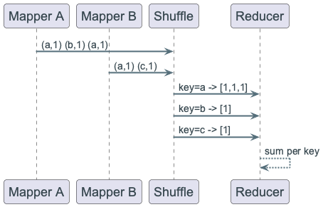
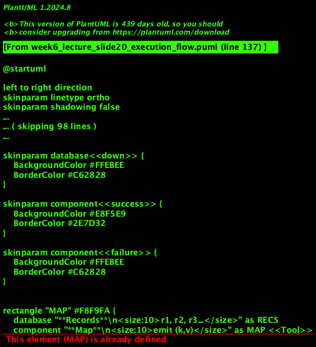
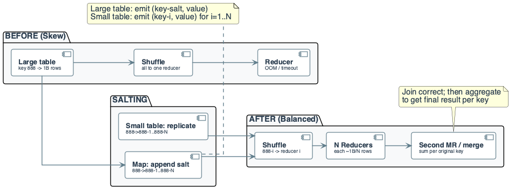

# Week 6: MapReduce Fundamentals

## Purpose
- Learn the core model behind distributed batch processing
- Understand why shuffle dominates cost at scale
- Design jobs that are correct under retries and skew

---

## Learning Objectives
- Explain map, shuffle, and reduce as formal operators
- Estimate runtime and communication bottlenecks
- Detect and mitigate skew/hot-key failures
- Use combiners and partitioning strategies safely

---

## Why MapReduce Matters
- Single-node processing cannot handle very large datasets
- Distributed jobs need a deterministic execution model
- MapReduce gives a predictable structure for scaling
- The hard part is data movement, not local compute

---

## Traditional Approach: Limits
- Centralized DB: user interacts with application, which handles storage and analysis
- Works for smaller datasets within single-DB limits
- Example: 10 TB documents (20 KB avg) → ~200 TB total; word-count via simple loop ≈ 1 month on single machine

---

## Traditional Approach: Why It Breaks at Scale
- At Google scale (≈24 PB/day in 2009), one machine cannot serve all data
- Conventional algorithms are not designed for memory-independence across nodes
- MapReduce divides work into small tasks, distributes them, and integrates outputs

{width=90%}

---

## The Core Problem
- Input: huge dataset split across many machines
- Goal: compute aggregate results over all records
- Constraint: one machine cannot store/process full input
- Need: parallel processing plus coordinated aggregation

---

## MapReduce Model
- **Map:** `(k1, v1) -> [(k2, v2)]`
- **Shuffle:** group all values by key `k2`
- **Reduce:** `(k2, [v2]) -> [(k3, v3)]`
- Same key must always reach same reducer

---

## Why Shuffle Is the Bottleneck
- All map output must be redistributed by key
- Network + disk spill often dominate total runtime
- CPU can be mostly idle while waiting on shuffle
- Shuffle size determines cluster pressure

---

## Shuffle Cost Formula
$$
C_{shuffle} = E \cdot s
$$
- `E`: emitted key-value pairs from map
- `s`: average serialized pair size
- Reduce `E` or `s` to reduce cost

---

## Runtime Decomposition
$$
T_{total} = T_{map} + T_{shuffle} + T_{reduce}
$$
- Map scales well with more workers
- Shuffle scales with bandwidth and spill behavior
- Reduce phase is limited by largest key-group
- End-to-end latency is bounded by slowest stage

{width=82%}

---

## Determinism and Correctness
- Map/reduce logic should be pure and deterministic
- Retries must produce same output
- Output writes should be idempotent
- Non-deterministic logic breaks trust in results

{width=74%}

---

## Running Example: Word Count
- Input lines are tokenized in map phase
- Map emits `(word, 1)` pairs
- Shuffle groups values by word
- Reduce sums counts per word

---

## Word Count: Step 1 (Map)
- Line `a b a` -> `(a,1),(b,1),(a,1)`
- Repeat for all lines
- Total emissions equals total token count
- Local phase is highly parallel

---

## Word Count: Step 2 (Shuffle)
- Partition by `hash(word) % R`
- All `a` values go to one reducer, same for `b`, `c`
- Network traffic spikes in this phase
- Skewed token frequency causes imbalance

{width=88%}

---

## Word Count: Step 3 (Reduce)
- Reducer receives list of counts per word
- Summation produces final count per key
- Output is compact and query-friendly
- Correctness depends on complete grouping

---

## Combiner (Local Pre-Aggregation)
- Runs after map, before shuffle
- Reduces duplicate keys per mapper
- Greatly reduces shuffle bytes for count/sum/max/min
- Must preserve correctness globally

---

## Combiner Validity Rule
- Safe when operation is associative and commutative
- Valid: sum, count, min, max
- Not directly valid: median, exact distinct, naive average
- For average, combine `(sum, count)` tuples instead

---

## Joins in MapReduce
- **Reduce-side join:** shuffle both tables by join key
- Flexible but expensive (`|R| + |S|` moved)
- **Broadcast/map-side join:** replicate small table to mappers
- Prefer broadcast when one side is small enough

---

## Failure Mode: Data Skew
- One hot key sends huge volume to one reducer
- That reducer spills heavily, becomes straggler, may OOM
- Whole job waits for this reducer
- Retries fail if skew is structural

---

## Skew Detection Signals
- Max reducer input vs median reducer input
- Reducer runtime p99 vs median
- Spill bytes and retry counts per reducer
- Alert when imbalance ratio crosses threshold

---

## Skew Mitigations
- Better key design and partitioning
- Combiner to shrink shuffle volume early
- Key salting for hot keys + second aggregation stage
- Custom partitioner for known heavy keys

---

## Engineering Checklist
- Is map output key aligned with desired grouping?
- Is combiner safe for this reduce function?
- Is shuffle size estimated before production run?
- Are skew/straggler metrics monitored by default?

---

## Best Practices
- Filter early in map to reduce emissions
- Keep keys compact to reduce serialized size
- Test jobs with skewed synthetic data
- Design for retries and idempotent sink writes

---

## Recap
- MapReduce scales compute, but shuffle drives cost
- Deterministic logic and idempotent writes protect correctness
- Skew is a first-class production risk
- Combiner and partition strategy are key optimization levers
