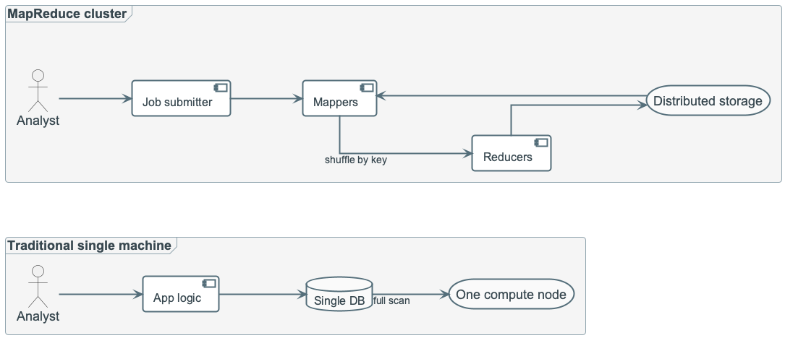
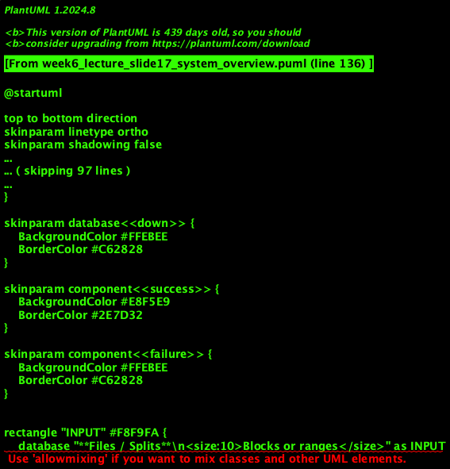
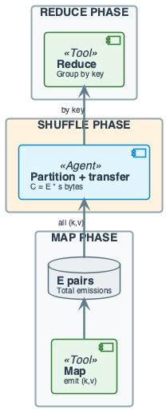
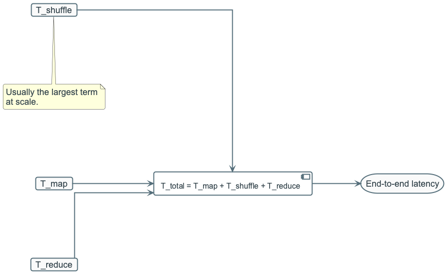
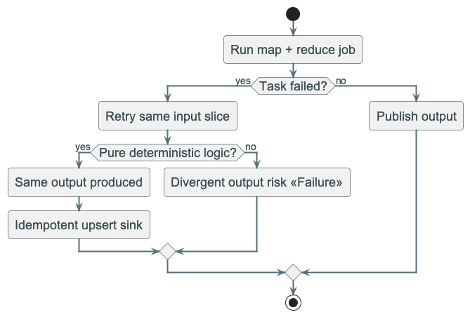
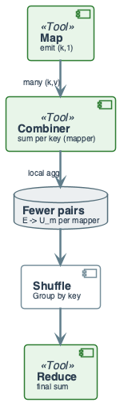
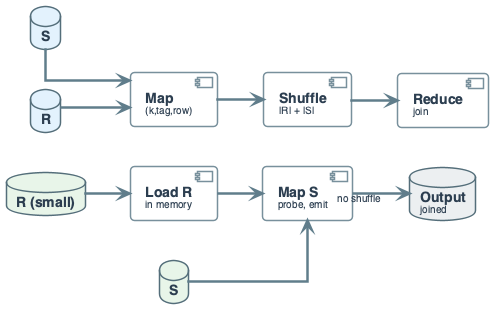
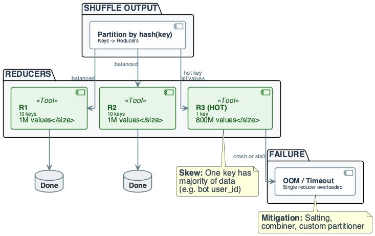

# MapReduce for IEM: Week 6 (Fundamentals) + Week 7 (Advanced)

---

## Audience Framing: Why IEM Should Care
- You already optimize flow, queues, and bottlenecks—MapReduce is the same logic at data scale.
- Every batch job is a production system: throughput, WIP (in-flight data), and a critical path.
- Cost is dominated by transfer and coordination (the “shuffle”), not local compute.
- Determinism under retries is the data equivalent of repeatable SOPs in operations.
- Skew is a classic bottleneck problem: one “hot” key can stall the whole line.
- SQL logic (GROUP BY, JOIN) still applies—but scale forces different tactics.

---

# Week 6: MapReduce Fundamentals (IEM Adaptation)

## Purpose & Learning Objectives
- **Purpose:** Learn the core model behind distributed batch processing; understand why shuffle dominates cost at scale; design jobs that are correct under retries and skew.
- **Learning Objectives:**
  - Explain map, shuffle, and reduce as formal operators
  - Estimate runtime and communication bottlenecks
  - Detect and mitigate skew/hot-key failures
  - Use combiners and partitioning strategies safely

---

## Why MapReduce Matters (IEM Lens)
- Single-node processing is like a single workstation: it cannot handle enterprise-scale WIP.
- MapReduce turns a huge batch into parallel micro-batches with controlled aggregation.
- The real “cost center” is moving and consolidating data (shuffle), not local computation.
- **SQL lens:** MapReduce is a physical execution model for `GROUP BY` and `JOIN` at scale.

> **Managerial takeaway:** Treat shuffle as the main bottleneck. Most optimization effort should reduce intermediate data volume.

---

## Traditional Approach: Why It Breaks at Scale
- Centralized processing: one machine handles storage and analysis—fine until data outgrows capacity.
- Example: 10 TB of documents (20 KB avg) → single-machine word-count loop ≈ 1 month.
- At web scale (e.g. tens of PB/day), one node cannot serve all data; algorithms must be memory-independent across nodes.
- **IEM lens:** Like a single workstation trying to process enterprise-scale WIP—MapReduce divides work into parallel tasks and integrates outputs.

{width=90%}

---

## The Core Problem
- **Input:** massive dataset distributed across many machines
- **Goal:** compute aggregate results over all records
- **Constraint:** no single machine can store/process full input
- **Need:** parallel processing plus coordinated aggregation
- **SQL lens:** This is `SELECT ... GROUP BY ...` on a table too large for one database server.

---

## MapReduce Model (Operational View)
- **Map:** `(k1, v1) -> [(k2, v2)]` transforms each record into key-value pairs.
- **Shuffle:** groups all values by key `k2` across the cluster.
- **Reduce:** `(k2, [v2]) -> [(k3, v3)]` aggregates each group into final output.
- **Invariant:** Same key must always reach the same reducer (ensures correct aggregation).
- **SQL lens:** `Map = SELECT key, value FROM table`, `Shuffle = GROUP BY key`, `Reduce = aggregate per group`.

## Why Shuffle Is the Bottleneck
- All map outputs must be redistributed by key.
- Network + disk spill dominate total runtime.
- CPU can be idle while waiting for shuffle.
- **SQL lens:** This is like a global `GROUP BY` needing a full data repartition.

---

## Shuffle Cost Formula (Simple Model)
\[
C_{shuffle} = E \cdot s
\]
- `E`: number of emitted key-value pairs from map
- `s`: average serialized pair size
- Reduce `E` (via combiner) or `s` (via compact encoding) to reduce cost.

---

> **Managerial takeaway:** Estimate shuffle cost before running jobs. If the shuffle is huge, the job will be slow and expensive regardless of CPU.

## Runtime Decomposition (Bottleneck Focus)
\[
T_{total} = T_{map} + T_{shuffle} + T_{reduce}
\]
- Map scales well with more workers.
- Shuffle scales with bandwidth and spill behavior.
- Reduce is limited by the largest key-group.
- **SQL lens:** Large `GROUP BY` jobs are constrained by data movement, not just SQL compute.

{width=82%}

---

## Determinism and Correctness
- Map/reduce logic should be pure and deterministic.
- Retries must produce the same output (idempotent behavior).
- Non-deterministic logic breaks trust in KPIs.
- **SQL lens:** Imagine a `GROUP BY` that changes results on re-run—unacceptable for financial reporting.

{width=74%}

---

> **Managerial takeaway:** Treat deterministic logic as a quality control requirement. If it can’t be re-run reliably, it’s not production-ready.

## Worked Example 1: Order Counts by Customer — Scenario & Input
**Scenario (Orders):** Count orders per customer.

**Input (Orders)**

| OrderID | CustomerID | Amount |
|---|---|---|
| O1 | C1 | 120 |
| O2 | C2 | 80 |
| O3 | C1 | 50 |
| O4 | C3 | 200 |
| O5 | C1 | 30 |

---

## Worked Example 1 (continued): Map, Shuffle, Reduce
**Map output** (emit `(CustomerID, 1)`): O1→(C1,1), O2→(C2,1), O3→(C1,1), O4→(C3,1), O5→(C1,1)

**Shuffle grouping:** C1→[1,1,1], C2→[1], C3→[1]

**Reduce output:** (C1,3), (C2,1), (C3,1)

**SQL equivalent:** `SELECT CustomerID, COUNT(*) FROM Orders GROUP BY CustomerID;`

**Mini cost:** `E=5`, `s=16` bytes → `C_shuffle ≈ 80` bytes; dominant stage is shuffle.

---

## Combiner (Local Pre-Aggregation)
- Runs after map, before shuffle.
- Reduces duplicate keys per mapper.
- Greatly reduces shuffle bytes for count/sum/max/min.
- **SQL lens:** This is like partial aggregation at each shard before a global `GROUP BY`.

---

## Combiner Validity Rule
- Safe when operation is **associative** and **commutative**.
- Valid: sum, count, min, max.
- Not directly valid: median, exact distinct, naive average.
- For average, combine `(sum, count)` tuples instead.

---

## Worked Example 2: Inventory Movement Totals — Scenario & Input
**Scenario (InventoryMovements):** Total units moved per product.

**Input (InventoryMovements)**

| MovementID | ProductID | Qty |
|---|---|---|
| M1 | P1 | +10 |
| M2 | P2 | -4 |
| M3 | P1 | +6 |
| M4 | P2 | +3 |

---

## Worked Example 2 (continued): Combiner, Shuffle, Reduce
**Map output** (emit `(ProductID, Qty)`): (P1,+10), (P2,-4), (P1,+6), (P2,+3)

**Combiner output:** (P1,16), (P2,-1). **Shuffle:** P1→[16], P2→[-1]. **Reduce:** (P1,16), (P2,-1)

**SQL:** `SELECT ProductID, SUM(Qty) FROM InventoryMovements GROUP BY ProductID;`

**Mini cost:** Without combiner E=4; with combiner E=2 (shuffle halves). `s=16` bytes → 64→32 bytes.

> **Managerial takeaway:** Use combiners whenever the metric is additive. It’s the easiest “free” cost reduction.

---

## Worked Example 3: Call Center Avg Handle Time — Scenario & Naive (Wrong)
**Scenario (CallCenterLogs):** Average handle time per agent.

**Input (CallCenterLogs)**

| CallID | AgentID | HandleTime |
|---|---|---|
| C1 | A1 | 6 |
| C2 | A1 | 4 |
| C3 | A2 | 10 |
| C4 | A1 | 20 |

**Naive map:** emit `(AgentID, HandleTime)` → (A1,6), (A1,4), (A2,10), (A1,20)

**Naive combiner (WRONG):** mapper1 A1:[6,4]→avg=5, mapper2 A1:[20]→avg=20 → shuffle A1→[5,20] → reduce avg=12.5 ❌

---

## Worked Example 3 (continued): Correct (sum, count) Approach
**Correct map:** emit `(AgentID, (sum, count))` → (A1,(6,1)), (A1,(4,1)), (A2,(10,1)), (A1,(20,1))

**Combiner:** (A1,(10,2)), (A2,(10,1)), (A1,(20,1)). **Shuffle:** A1→[(10,2),(20,1)], A2→[(10,1)]

**Reduce:** A1 sum=30, count=3→avg=10; A2 sum=10, count=1→avg=10 ✓

**SQL:** `SELECT AgentID, AVG(HandleTime) FROM CallCenterLogs GROUP BY AgentID;`

**Mini cost:** (sum,count) doubles pair size but enables safe combiner; `C_shuffle ≈ 128` bytes—cheaper than wrong results.

---

## Joins in MapReduce (SQL Lens)
- **Reduce-side join:** shuffle both tables by join key.
- **Broadcast/map-side join:** replicate small table to mappers.
- **SQL lens:** Both implement `SELECT ... FROM R JOIN S ON key` with different execution plans.

---

## Worked Example 4: Reduce-Side Join — Scenario & Inputs
**Scenario:** Enrich orders with customer segment when both tables are large.

**Input (Orders):** (O1,C1,120), (O2,C2,80) | **Input (Customers):** (C1,Enterprise), (C2,SMB)

---

## Worked Example 4 (continued): Map, Shuffle, Reduce
**Map (tagged):** Orders→(C1,("O",O1,120)), (C2,("O",O2,80)); Customers→(C1,("C",Enterprise)), (C2,("C",SMB))

**Shuffle:** C1→[O1,120],[Enterprise]; C2→[O2,80],[SMB]

**Reduce:** (O1,C1,120,Enterprise), (O2,C2,80,SMB)

**SQL:** `SELECT o.OrderID, o.CustomerID, o.Amount, c.Segment FROM Orders o JOIN Customers c ON o.CustomerID = c.CustomerID;`

**Cost:** Shuffle ∝ |Orders|+|Customers|; at 10^8+10^7 rows, shuffle dominates.

---

## Failure Mode: Data Skew (Bottleneck Risk)
- One hot key sends huge volume to one reducer.
- That reducer spills heavily, becomes straggler, may OOM.
- Whole job waits for this reducer.
- **SQL lens:** A `GROUP BY` where one group is 90% of all rows.

---

## Skew Detection Signals
- Max reducer input vs median reducer input.
- Reducer runtime p99 vs median.
- Spill bytes and retry counts per reducer.
- Alert when imbalance ratio crosses threshold.

> **Managerial takeaway:** Skew is a production risk, not a corner case. Monitor reducer balance like you monitor utilization in a factory line.
