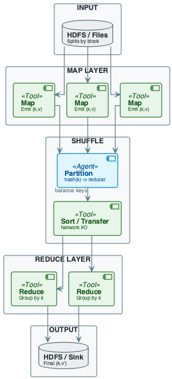
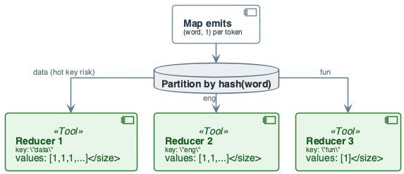
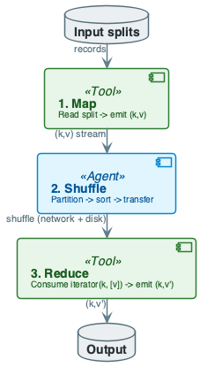
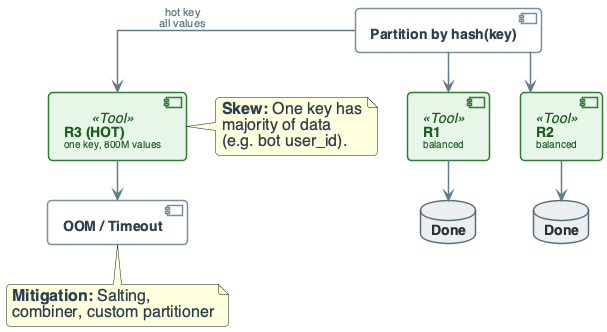

# Week 7: Advanced MapReduce and Data Skew

## Purpose
- Real-world MapReduce jobs fail due to skew and shuffle cost
- Engineers must reason about partition balance, combiners, salting
- Bridges theory (Week 6) and production debugging/tuning

## Learning Objectives (1/2)
- Define data skew and why it causes OOM and stragglers
- Describe the shuffle: partition, sort, transfer
- Explain when and how a combiner reduces I/O
- State the contract of a custom partitioner

## Learning Objectives (2/2)
- Design a salted-key scheme to mitigate hot key in joins
- Estimate intermediate data size and shuffle cost
- Recognize skew from job metrics (reducer variance, duration)
- List failure modes: OOM, timeout, straggler

## Diagram Manifest
- Slide 12 → week7_lecture_slide12_system_overview.puml
- Slide 19 → week7_lecture_slide19_example_shuffle.puml
- Slide 24 → week7_lecture_slide24_execution_flow.puml
- Slide 28 → week7_lecture_slide28_failure_skew.puml

## The Real Problem This Lecture Solves

## Production Failure
- MapReduce jobs fail or stall not because logic is wrong
- One reducer gets most data (skew)
- Or shuffle dominates runtime (data movement)

## Hot Key Problem
- One key with huge value set → one reducer OOM
- Job latency = that reducer's time

## Shuffle Cost
- Intermediate (k,v) size can match input
- No combiner ⇒ network and disk I/O dominate

## The System We Are Building
- **Context:** Week 6 gave MapReduce model
- Here we make it production-ready for skewed data
- **Same pipeline:** event analytics by user_id or session_id
- Word count; join Users (small) with Clicks (large)
- **Engineering goal:** balance keys; cut shuffle; detect skew

## Cost of Naïve Design (Advanced MapReduce)

## No Combiner
- Emit (word, 1) for every occurrence
- Shuffle size ≈ map output
- For 1 TB text, intermediate data is similar scale
- Combiner cuts bytes sent and spilled

## Default Partitioner on Skewed Key
- Join on user_id; one bot has 1B clicks
- All 1B (user_id, click) go to one reducer ⇒ OOM

## No Salting on Hot Key
- Same join; without splitting hot key
- Job cannot scale; salting trades replication for balance

## Production Cost
- Job retries, SLA misses, on-call
- Fixing skew post-incident is expensive

## Core Concepts (1/2)
- **Shuffle:** framework groups all (k,v) by k
- Same key → same reducer
- **Partition function:** `partition_id = hash(k) mod R`
- R = number of reducers
- **Sort:** within each partition, keys sorted before reduce

## Core Concepts (2/2)
- **Guarantees:** all pairs with same key reach one reducer
- Order of values undefined unless secondary sort
- **What breaks at scale:** one key with huge value set
- **Cost:** shuffle dominates when intermediate data is large

## Combiner Cost Impact
- Let \(E\) = total map emits, \(s\) = bytes per pair
$$
B_{\text{shuffle}}^{\text{no comb}} = E \cdot s
$$
- Interpretation: shuffle cost scales with total emits
- Engineering implication: heavy hitters inflate network and disk
- With combiner, \(U_m\) = unique keys per mapper \(m\)
$$
B_{\text{shuffle}}^{\text{comb}} = \left(\sum_m U_m\right) s
$$
- Interpretation: local aggregation reduces bytes if repeats are common
- Engineering implication: safe only for associative + commutative ops

## Salting Hot Keys
- Hot key with \(n\) values, salt into \(S\) subkeys
$$
\text{Load}_{\text{per reducer}} \approx \frac{n}{S}
$$
- Interpretation: salting splits a hot key across reducers
- Engineering implication: reduces skew at cost of extra combine step

## Shuffle Anatomy
- **Partition:** each map output (k,v) sent to reducer `hash(k) mod R`
- **Sort:** reducer receives key and sorted iterator of values
- **Transfer:** map-side spill to disk; fetch by reducers; merge-sort

## In-Lecture Exercise 2: Shuffle Size Estimate
- Assume 1B lines, ~10 words/line ⇒ 10B emits
- Each (word,1) is ~20 bytes
- Estimate shuffle bytes and average per reducer (R = 100)

## In-Lecture Exercise 2: Solution (1/2)
- Total emits ≈ 10B pairs
- Shuffle size ≈ 10B × 20 B = 200 GB

## In-Lecture Exercise 2: Solution (2/2)
- Average per reducer: 200 GB / 100 ≈ 2 GB
- Hot keys make per-reducer load uneven

## In-Lecture Exercise 2: Takeaway
- Shuffle bytes scale with map output volume
- Average load hides hot-key skew risk

## Combiner
- **Role:** optional local reduce on map output before shuffle
- Must be associative and commutative where used
- **Effect:** reduces bytes sent over network and disk
- **Example:** word count: combiner sums per map task

## Data Context: Word Count + Clicks
- Word count: keys = {data, eng, fun}
- Clicks–Users join on user_id
- Hot key example: one user has far more clicks

## In-Lecture Exercise 1: Combiner Check
- Define a combiner in one sentence
- Why is combiner safe for word count but risky for count distinct?

## In-Lecture Exercise 1: Solution (1/2)
- Combiner = local reduce on map output before shuffle
- It reduces bytes sent over network and disk

## In-Lecture Exercise 1: Solution (2/2)
- Word count sum is associative and commutative
- Count distinct needs set logic; naïve sum overcounts

## In-Lecture Exercise 1: Takeaway
- Only use combiners when reduce is associative/commutative
- Wrong combiner logic corrupts results

## Partitioner
- **Default:** `hash(key) mod numReducers`
- Uniform hash spreads keys
- **Custom:** override to control which reducer gets which keys
- E.g. range partition, avoid known hot keys
- **Contract:** deterministic; same key always same partition

## Data Skew Definition
- **Skew:** unequal distribution of data per key
- Some keys have far more values than others
- **Zipfian:** many real distributions are heavy-tail
- Few keys dominate
- **Metric:** max reducer size / mean → high implies skew

## In-Lecture Exercise 3: Skew Case — Clicks Join
- Clicks–Users join on user_id; R = 3 reducers
- user_id 101 has 5 clicks; 102 has 2; 103 has 1
- Which reducer gets key 101? How many clicks land there?
- At scale, 101 has 1B clicks: what failure occurs?
- One sentence: what does salting do to the key?

## In-Lecture Exercise 3: Solution (1/2)
- Reducer for key 101 gets 5 click records in sample
- With 1B clicks, one reducer receives 1B values
- That reducer becomes the straggler or OOMs

## In-Lecture Exercise 3: Solution (2/2)
- Salting appends a random suffix to hot keys
- Hot key values spread across N reducers

## In-Lecture Exercise 3: Takeaway
- Skew turns parallel jobs into single-reducer bottlenecks
- Salting trades small replication for balance

## System / Pipeline Overview
- Input splits → Map (emit (k,v)) → Partition → Shuffle → Reduce
- Skew mitigation: at partition, map (combiner), or key design (salting)

## Guarantees and What Breaks
- **Guarantee:** same key → same reducer; complete grouping
- **No guarantee:** order of values per key; load balance
- **Break:** skew causes one reducer to get most data

## Running Example — Data & Goal
- **Input:** short lines of text ("data eng", "data fun", "eng data")
- Block-sized splits
- **Goal:** word count: (word, total_count)
- **Schema:** input (line_offset, line_text); map emit (word, 1)

## Running Example — Step-by-Step (1/4)
- **Map:** read split; tokenize each line
- For each word emit (word, 1)
- Example: ("data eng", "data fun") → ("data",1), ("eng",1), ("data",1), ("fun",1)

## Running Example — Step-by-Step (2/4)
- **Shuffle:** partition by hash(word)
- E.g. "data"→P0, "eng"→P1, "fun"→P2
- All ("data", 1) go to same reducer
- Reducers receive (key, iterator of values)

## Running Example — Step-by-Step (3/4)
- **Reduce:** for each key, sum the values
- Emit (key, sum)
- Reducer for "data": values [1,1,...] → ("data", 2)
- Reducer for "eng": [1] → ("eng", 1)

## Running Example — Step-by-Step (4/4)
- **Output:** ("data", 2), ("eng", 1), ("fun", 1)
- With combiner: map-side pre-aggregation
- Could emit ("data", 2) once per map; less shuffle

## Running Example — Shuffle Groups (Diagram)
- Map emits (word, 1); partition by hash(word)
- Skew: if one word appears in most lines, one reducer gets most

## Running Example — Engineering Conclusion
- **Trade-off:** combiner reduces shuffle; adds CPU
- Must be semantically valid (sum ok; distinct count not)
- **Scale:** for 1 TB text, combiner cuts network and spill

## Cost & Scaling Analysis (1/3)
- **Time model:** T ≈ T_map + T_shuffle + T_reduce
- T_shuffle often dominant
- **Map:** O(input size / parallelism)
- **Reduce:** O(intermediate size per reducer)
- **Bottleneck:** reducer that receives most data (skew)

## Cost & Scaling Analysis (2/3)
- **Memory:** map output buffer → spill when full
- Reduce fetches partitions → merge
- **Storage:** intermediate (k,v) written to local disk
- Read by reducers over network
- **Spill:** multiple spills merged with sort

## Cost & Scaling Analysis (3/3)
- **Network:** shuffle bytes ≈ map output (minus combiner)
- **Throughput:** limited by disk and network
- Skew causes one reducer to receive most traffic
- **Latency:** job latency = max(reducer finish times)

## Execution Flow — Map to Reduce
- 1. Map: read split → emit (k,v)
- 2. Shuffle: partition → sort → transfer
- 3. Reduce: consume (k, [v]) → emit (k,v')

## Pitfalls & Failure Modes (1/3)
- **Skew:** one or few keys get majority of values
- One reducer OOM or very slow
- **Straggler:** one task runs much longer; job waits
- **Hot key:** same key in join or group-by

## Pitfalls & Failure Modes (2/3)
- **OOM:** reducer receives more (k,v) than heap can hold
- No spill on reduce side for values
- **Timeout:** single reducer exceeds allowed time
- **Default partitioner:** hash(key) can still concentrate keys

## Pitfalls & Failure Modes (3/3)
- **Detection:** monitor reducer input sizes, task durations
- High variance → skew
- **Mitigation:** combiner, custom partitioner, salting

## Failure Scenario — Hot Key to OOM
- **Scenario:** join Users (small) with Clicks (large)
- user_id 888 is bot with 1B clicks
- Default partition: all 1B (888, click) go to one reducer
- ⇒ OOM

## Skew Detection
- **Metrics:** reducer input bytes or record count
- Max / mean or standard deviation
- **Logs:** task duration per partition
- **Sampling:** sample keys to estimate per-key cardinality

## Skew Mitigation — Salting (Concept)

## Salting Approach
- For hot key K, emit (K-1, v), (K-2, v), ... (K-N, v)
- Replicate small-table row for K to all N partitions
- Each reducer gets 1/N of hot key data
- Join still correct after grouping by K

## Salting Cost
- Small table row replicated N times for hot key
- Acceptable if small table is small

## Skew Mitigation — Combiner and Partitioner

## Combiner
- Reduces map output size
- Use when reduce is associative (sum, max)

## Custom Partitioner
- Send known hot keys to dedicated reducers or spread
- **Trade-off:** combiner is transparent to logic
- Partitioner and salting require key design

## Best Practices (1/2)
- Use combiners when reduce is associative and commutative
- Sample or profile key distribution before large jobs
- Prefer salting for joins with one very large side
- Set reducer count based on data size
- Avoid too few (skew) or too many (overhead)

## Best Practices (2/2)
- Monitor reducer input size variance; alert on high skew
- Document partition strategy when using custom partitioner
- Test with skewed samples (inject hot key)
- Prefer engine features (Spark AQE) when available
- Understand underlying MR semantics

## Recap — Engineering Judgment
- **Shuffle is the bottleneck:** think in data movement
- Intermediate size and partition balance determine success
- Combiner is the first lever when reduce is associative
- **Skew is first-class failure:** one key with most values
- One reducer OOM or straggler
- Design partition strategy and salting
- **Measure before and after:** reducer variance, duration
- Use combiners; profile hot keys; test with skewed samples

## Pointers to Practice
- Manual walkthrough: 8–12 input records → Map → Shuffle → Reduce
- One skew case: skewed key; one mitigation: combiner or salting
- Cost exercise: estimate intermediate size and shuffle bytes

## Additional Diagrams
### System Overview (slide 13)

### Example Shuffle (slide 20)

### Execution Flow (slide 28)

### Failure Skew (slide 42)

### Practice: Skew Salting

