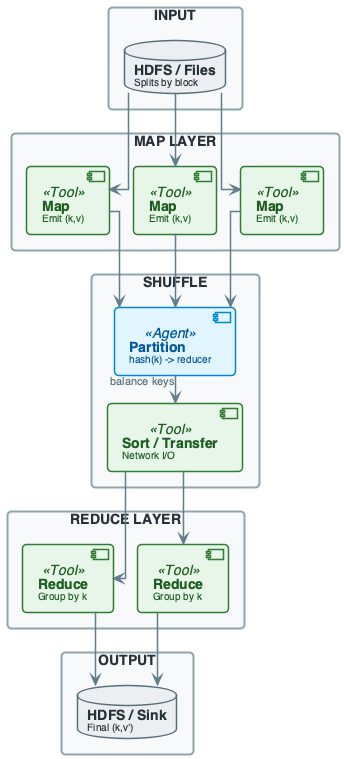
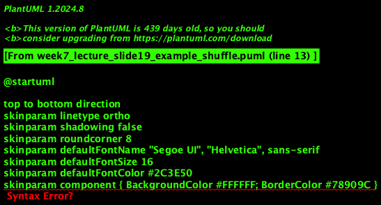
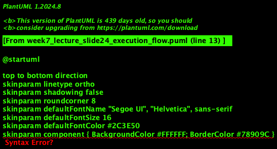
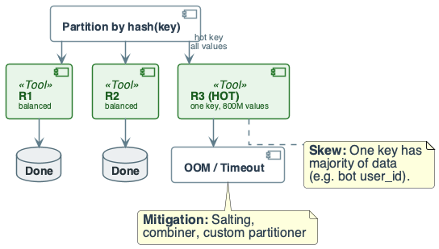
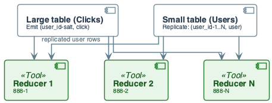

# Week 7: Advanced MapReduce — Skew, Joins, and Cost Optimization

## Purpose
- Production MapReduce fails due to skew and shuffle cost
- Formal analysis of partitioning, combiners, and salting
- Engineers must reason about load balance and communication

## Learning Objectives
- Formalize data skew and its impact on job latency
- Analyze combiner correctness and communication reduction
- Design salted-key schemes for hot key mitigation
- Estimate intermediate data size and shuffle cost
- Implement join algorithms in MapReduce

---

# Part I: The Skew Problem — Formal Treatment

## Skew: Mathematical Definition
- $R$ reducers, $N$ total values to process
- $n_i$ = values received by reducer $i$
- **Perfectly balanced:** $n_i = \frac{N}{R}$ for all $i$

## Skew Ratio
$$
\sigma = \frac{\max_i n_i}{N/R} = \frac{R \cdot \max_i n_i}{N}
$$
- **Interpretation:** Factor by which hottest reducer exceeds average
- $\sigma = 1$: Perfect balance
- $\sigma = 100$: Hottest reducer has 100× average load

## Impact on Job Completion Time
- Reducer $i$ runtime: $T_i = \alpha \cdot n_i$ for constant $\alpha$
- Job completion: $T_{\text{job}} = \max_i T_i = \alpha \cdot \max_i n_i$
- With skew $\sigma$:
$$
T_{\text{job}} = \sigma \cdot T_{\text{balanced}}
$$
- **Insight:** Skew directly multiplies job latency

## Skew and Memory Failure
- Reducer memory limit: $M$ bytes
- Value size: $s$ bytes
- **Constraint:** $n_i \cdot s \leq M$
- **Failure condition:** $\max_i n_i > \frac{M}{s}$
- Hot key with $n^* = 10^9$ values, $s = 100$ B → needs 100 GB

---

# Part II: Why Skew Emerges — Zipf's Law

## Zipf Distribution
- Frequency of $r$-th most common key:
$$
f(r) = \frac{C}{r^\alpha}
$$
- $\alpha \approx 1$ for natural language, web traffic, user behavior
- **Implication:** Top 1% of keys → 50%+ of values

## Example: User Click Distribution
- 10M users, 1B clicks total
- Zipf with $\alpha = 1$:
- Top user: $\frac{1B}{\ln(10M)} \approx 62M$ clicks
- Top 100 users: ~40% of all clicks
- **Consequence:** Hash partitioning concentrates hot users

## The Long Tail Problem
- Most keys have few values (easy to process)
- Few keys have many values (cause OOM/stragglers)
- **Cannot assume uniform distribution**

---

# Part III: Combiner — Formal Analysis

## Combiner Contract
- **Input:** Stream of $(k, v)$ pairs from map
- **Output:** $(k, v')$ where $v' = v_1 \oplus v_2 \oplus \cdots$
- **Requirement:** $\oplus$ is associative and commutative
$$
(a \oplus b) \oplus c = a \oplus (b \oplus c)
$$
$$
a \oplus b = b \oplus a
$$

## Communication Reduction Analysis
- Without combiner: $E$ total map emissions
- With combiner on mapper $m$: $U_m$ unique keys
- **Shuffle without combiner:** $C_0 = E \cdot s$
- **Shuffle with combiner:** $C_1 = \left(\sum_m U_m\right) \cdot s$

## Reduction Factor
$$
\rho = \frac{C_0}{C_1} = \frac{E}{\sum_m U_m}
$$
- **High $\rho$:** Many duplicates per mapper (word count)
- **Low $\rho$:** Few duplicates (distinct keys per mapper)

## Example: Word Count on 1B Lines
- 1B lines, 10 words/line → $E = 10B$ emissions
- 100K unique words, 10K mappers
- Without combiner: shuffle 10B pairs
- With combiner: ~1B unique (key, count) pairs
- **Reduction:** $\rho \approx 10\times$

## Combiner Validity Examples

| Operation | Formula | Associative | Commutative | Valid? |
|-----------|---------|-------------|-------------|--------|
| Sum | $a + b$ | ✓ | ✓ | ✓ |
| Product | $a \times b$ | ✓ | ✓ | ✓ |
| Max | $\max(a, b)$ | ✓ | ✓ | ✓ |
| Mean | $\frac{a+b}{2}$ | ✗ | ✓ | ✗ |
| Variance | — | ✗ | ✗ | ✗ |
| Distinct | $|A \cup B|$ | ✗ | — | ✗ |

## Computing Mean with Combiner
- **Trick:** Emit $(k, (sum, count))$ instead of $(k, value)$
- Combiner: $(sum_1, count_1) \oplus (sum_2, count_2) = (sum_1 + sum_2, count_1 + count_2)$
- Reduce: $mean = \frac{sum}{count}$
- **Now associative and commutative**

---

# Part IV: Salting — Hot Key Distribution

## Salting Algorithm
- **Problem:** Key $k^*$ has $n^*$ values; all go to one reducer
- **Solution:** Append random salt $s \in [0, S-1]$
- **Emit:** $(k^* || s, v)$ instead of $(k^*, v)$
- **Effect:** Values distributed across $S$ reducers

## Salted Key Distribution
- Original: reducer $\pi(k^*)$ gets all $n^*$ values
- Salted: each reducer $\pi(k^* || s)$ gets $\approx \frac{n^*}{S}$ values
$$
\text{Load per salted reducer} = \frac{n^*}{S}
$$

## Two-Phase Aggregation
- **Phase 1:** Aggregate by salted key
  - Emit $(k || s, \oplus_s v)$ for each salt $s$
- **Phase 2:** Aggregate by original key
  - Emit $(k, \oplus_s (\oplus_s v))$
- **Correctness:** Requires $\oplus$ associative

## Salting Cost Trade-off
- **Benefit:** Load balance; no OOM
- **Cost:** Two MapReduce jobs instead of one
- **Break-even:** When hot key would cause failure

## Salting for Joins
- **Problem:** Join $R \bowtie S$ on key $k$; key $k^*$ has 1B rows in $S$
- **Solution:**
  1. Salt $S$: emit $(k || s, v_S)$ for $s \in [0, S-1]$
  2. Replicate $R$: emit $(k || s, v_R)$ for all $s \in [0, S-1]$
- **Reducer:** Each gets $\frac{1}{S}$ of hot key from $S$, all of $R$ for that key

## Salting Join Cost
- Without salting: $C = |R| + |S|$; one reducer gets $|S_{k^*}|$
- With salting ($S$ buckets for hot key):
$$
C = |R_{hot}| \cdot S + |R_{cold}| + |S|
$$
- **Trade-off:** Replicate small table rows for hot keys

---

# Part V: Join Algorithms in MapReduce

## Reduce-Side Join (Repartition Join)

### Algorithm
1. **Map R:** $(k, v_R) \rightarrow (k, ("R", v_R))$
2. **Map S:** $(k, v_S) \rightarrow (k, ("S", v_S))$
3. **Shuffle:** Group by $k$
4. **Reduce:** Cross-product R-tagged and S-tagged values

### Cost Analysis
$$
C_{\text{shuffle}} = |R| + |S|
$$
$$
T_{\text{reduce}} = O\left(\sum_k |R_k| \cdot |S_k|\right)
$$

### Memory Requirement
- Must buffer one side for each key
- **Failure:** Key $k$ with $|R_k| = 10^6$, $|S_k| = 10^6$ → $10^{12}$ output pairs

## Map-Side Join (Broadcast Join)

### Condition
- One table fits in mapper memory: $|R| \leq M$

### Algorithm
1. Load $R$ into hash table on each mapper
2. Stream $S$; for each $(k, v_S)$, probe $R[k]$
3. Emit $(k, v_R, v_S)$ for each match

### Cost Analysis
$$
C_{\text{shuffle}} = 0
$$
$$
C_{\text{broadcast}} = |R| \cdot P_m
$$
- No shuffle of $S$; broadcast $R$ to all mappers

### When to Use
- $|R| \ll |S|$ (orders of magnitude)
- $|R| < \text{mapper memory}$
- Join selectivity doesn't explode output

## Semi-Join (Filter Join)

### Use Case
- Large $S$, small $R$, but only need $S$ rows matching $R$

### Algorithm
1. **Job 1:** Extract distinct keys from $R$: $K_R = \{k \mid k \in R\}$
2. **Job 2:** Broadcast $K_R$; filter $S$ to rows where $k \in K_R$
3. **Job 3:** Standard join on filtered $S$

### Cost
- Reduces $|S|$ before expensive shuffle
- Useful when join selectivity is low

## Join Algorithm Decision Tree

| Condition | Algorithm | Shuffle Cost |
|-----------|-----------|--------------|
| $\|R\| < M$ | Broadcast | $0$ |
| Skewed key $k^*$ | Salted reduce-side | $\|R_{hot}\| \cdot S + \|R\| + \|S\|$ |
| Low selectivity | Semi-join | $\|K_R\| + \|S_{filtered}\| + \|R\|$ |
| General case | Reduce-side | $\|R\| + \|S\|$ |

---

# Part VI: Cost Estimation Formulas

## Shuffle Size Estimation
$$
B_{\text{shuffle}} = N_{\text{emit}} \times s_{\text{pair}}
$$
- $N_{\text{emit}}$: Total map emissions
- $s_{\text{pair}}$: Average bytes per (key, value) pair

## Example Calculation
- 1B records, 10 words/record → 10B word occurrences
- Each $(word, 1)$: 20 bytes
- **Without combiner:** $10B \times 20 = 200$ GB shuffle
- **With combiner:** $\sim 1B$ unique pairs → 20 GB shuffle

## Reducer Memory Estimation
$$
M_{\text{reducer}} = \max_k |V_k| \times s_{\text{value}}
$$
- $|V_k|$: Number of values for key $k$
- **Constraint:** $M_{\text{reducer}} < M_{\text{heap}}$

## Network Time Estimation
$$
T_{\text{network}} = \frac{B_{\text{shuffle}}}{B_{\text{bandwidth}} \times P}
$$
- $B_{\text{bandwidth}}$: Per-node bandwidth
- $P$: Degree of parallelism

## Worked Example
- **Input:** 1TB of logs, 100B per record → 10B records
- **Map:** Emit $(user\_id, 1)$; 10B emissions
- **Pair size:** 20 bytes
- **Shuffle:** $10B \times 20 = 200$ GB
- **Bandwidth:** 10 Gbps = 1.25 GB/s per node; 100 nodes
- **Time:** $\frac{200}{1.25 \times 100} = 1.6$ seconds (theoretical minimum)
- **With skew:** Hottest reducer has 10× average → 16 seconds

---

# Part VII: Shuffle Internals

## Shuffle Phases
1. **Partition:** Map output → bucket by $h(k) \mod R$
2. **Spill:** Buffer full → sort → write to disk
3. **Merge:** Multiple spills → single sorted file per mapper
4. **Transfer:** Reducer fetches partitions from all mappers
5. **Merge-sort:** Reducer merges fetched partitions

## Shuffle Cost Components
- **Disk I/O:** Spill writes + merge reads + reducer reads
- **Network:** Transfer from mappers to reducers
- **CPU:** Sorting and merging
$$
T_{\text{shuffle}} = T_{\text{spill}} + T_{\text{transfer}} + T_{\text{merge}}
$$

## Optimization Levers
| Lever | Impact | Trade-off |
|-------|--------|-----------|
| Larger buffer | Fewer spills | More memory per mapper |
| Combiner | Less data to spill/transfer | CPU overhead |
| Compression | Less transfer bytes | CPU for compress/decompress |
| More reducers | More parallelism | More shuffle connections |

---

# Part VIII: Running Example — Skewed Join

## Scenario
- **Users table:** 10M users, 100 bytes/row → 1 GB
- **Clicks table:** 1B clicks, 50 bytes/row → 50 GB
- **Join:** `Users ⋈ Clicks ON user_id`
- **Skew:** user_id 888 (bot) has 800M clicks

## Reduce-Side Join Analysis
- **Shuffle:** 1 GB (Users) + 50 GB (Clicks) = 51 GB
- **Reducer for 888:** 800M clicks × 50 B = 40 GB
- **Other reducers:** Average $\frac{200M}{999} \approx 200K$ clicks each
- **Skew ratio:** $\frac{800M}{200K} = 4000\times$
- **Result:** Reducer 888 OOMs or takes 4000× longer

## Broadcast Join Analysis
- **Condition:** Users (1 GB) fits in mapper memory
- **Algorithm:** Load Users; stream Clicks; probe and emit
- **Shuffle:** 0 GB
- **Memory:** 1 GB hash table per mapper
- **Result:** No skew; each mapper processes Clicks partition independently

## Salted Join Analysis
- **Hot key:** user_id 888 with 800M clicks
- **Salt buckets:** S = 100
- **Users:** Replicate 888's row 100 times; emit $(888||s, user\_data)$ for $s \in [0,99]$
- **Clicks:** Emit $(888||hash(click\_id) \mod 100, click\_data)$
- **Per-reducer load:** $\frac{800M}{100} = 8M$ clicks
- **Memory:** 8M × 50 B = 400 MB (manageable)

---

# Part IX: Failure Modes and Detection

## Failure Mode 1: Reducer OOM
- **Cause:** Hot key with too many values
- **Detection:** Monitor reducer heap usage
- **Mitigation:** Salting, combiner, increase memory

## Failure Mode 2: Straggler
- **Cause:** Skew → one reducer much slower
- **Detection:** Reducer duration variance; $\frac{\max T_i}{\text{median } T_i} > 5$
- **Mitigation:** Salting, speculative execution

## Failure Mode 3: Shuffle Timeout
- **Cause:** Map output too large; disk/network saturated
- **Detection:** Shuffle progress stalls
- **Mitigation:** Combiner, compression, more reducers

## Failure Mode 4: Incorrect Results
- **Cause:** Invalid combiner (non-associative operation)
- **Detection:** Results differ with/without combiner
- **Mitigation:** Verify combiner correctness mathematically

## Monitoring Dashboard
| Metric | Healthy | Investigate | Critical |
|--------|---------|-------------|----------|
| Skew ratio | < 2 | 2–10 | > 10 |
| Reducer duration CV | < 0.5 | 0.5–1.0 | > 1.0 |
| Shuffle bytes/record | < 100 | 100–500 | > 500 |

---

# Part X: Best Practices

## Design Checklist
1. **Profile key distribution** before running large jobs
2. **Use combiner** when operation is associative + commutative
3. **Salt hot keys** when skew ratio > 10
4. **Prefer broadcast join** when one table fits in memory
5. **Set reducer count** proportional to shuffle size / target partition size

## Cost Reduction Priority
1. Filter early (reduce input size)
2. Combiner (reduce shuffle size)
3. Broadcast join (eliminate shuffle)
4. Salting (balance load)
5. Compression (reduce network)

## Testing with Skew
- Inject synthetic hot key (80% of data)
- Verify job completes without OOM
- Measure duration increase vs. uniform case

---

# Summary

## Recap — Engineering Judgment
- **Skew is the primary failure mode:** $\sigma \gg 1$ multiplies latency or causes OOM
- **Combiner is the first lever:** Valid for associative + commutative; reduces $E$ to $\sum U_m$
- **Salting distributes hot keys:** Two-phase aggregation; trades replication for balance
- **Broadcast join eliminates shuffle:** When small table fits in memory
- **Cost model:** $C = E \cdot s$; $T \propto \max_i n_i$

## Pointers to Practice
- Compute skew ratio from key frequency distribution
- Trace join execution with and without salting
- Estimate shuffle size for real-world parameters
- Diagram combiner and salting data flow

## Additional Diagrams
### System Overview

### Example Shuffle

### Execution Flow

### Failure: Skew

### Practice: Skew Salting

