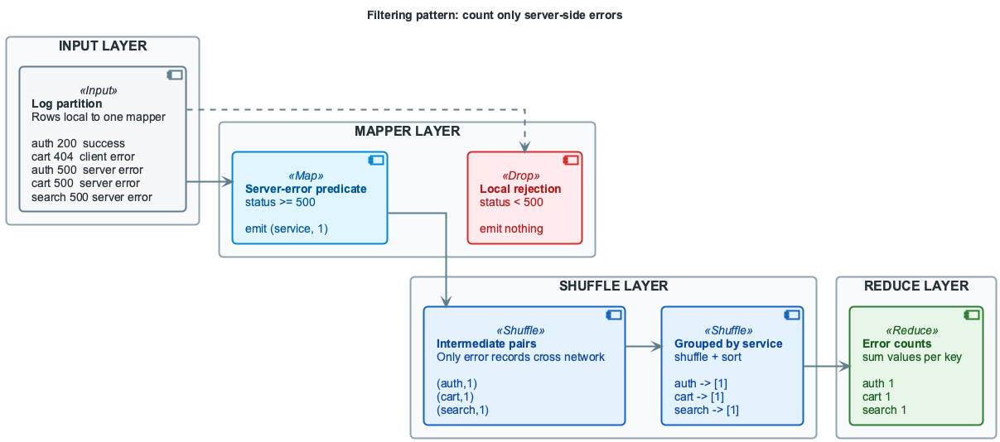
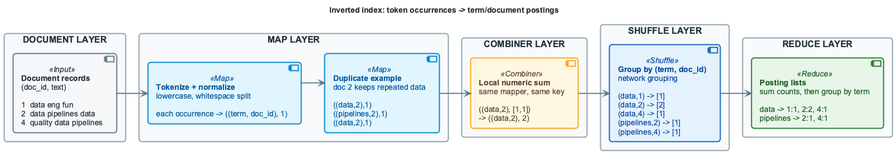
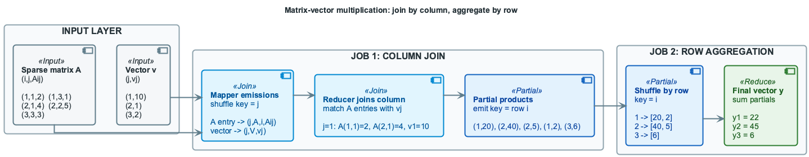
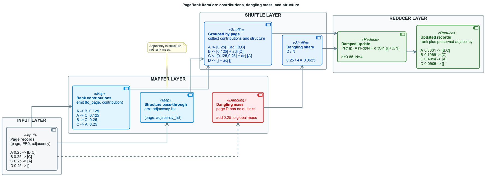

# Week 7: MapReduce Examples

## Purpose & Learning Objectives

- Demonstrate MapReduce through four canonical examples.
- From simple filtering to multi-phase joins and graph algorithms.
- Each example: problem, key/value design, flow, pseudocode, step-by-step, engineering notes.

---

## Example 1: Filtering Pattern — Count Errors by Service

## 1.1 Problem

- **Goal:** Count errors by service name; only rows with status ≥ 500 matter.
- **Input:** API request logs (timestamp, service, status, latency_ms).
- **Output:** For each service, the number of error rows (status ≥ 500).
- Filter in the mapper to avoid shuffling successful requests.

---

## 1.2 Key/Value Design (Filtering)

- **Mapper:** Emit only when status ≥ 500; non-error rows emit nothing.
- **Key:** `service` (groups errors by service).
- **Value:** `1` (one count per error row).
- **Reducer:** Group by service; sum the 1s → error count per service. Single phase; no join.

---

## 1.3 Flow (Filtering)

- **Map:** Read log rows; for each row with status ≥ 500, emit (service, 1).
- **Shuffle:** Group all pairs by key `service`.
- **Reduce:** For each service, sum values → one (service, error_count) per service.

---

## 1.4 Diagram (Filtering)

{width=78%}

---

## 1.5 Formal Pseudocode (Filtering)

```
map(record):
  if record.status < 500:
    emit nothing
  else:
    emit (record.service, 1)

reduce(key, values):
  emit (key, sum(values))
```

---

## 1.6 Step-by-Step: Input (Filtering)

| ts   | service | status | latency_ms |
|------|--------|--------|------------|
| 10:00 | auth   | 200    | 35         |
| 10:01 | auth   | 500    | 120        |
| 10:02 | cart   | 404    | 22         |
| 10:03 | cart   | 500    | 300        |
| 10:04 | search | 200    | 18         |
| 10:05 | search | 500    | 210        |

---

## 1.7 Step-by-Step: Map Output & Shuffle (Filtering)

- Rows with status &lt; 500 → **emit nothing** (filtered out).
- Rows with status ≥ 500 → emit `(service, 1)`.

**Mapper output (only error rows):** (auth, 1), (cart, 1), (search, 1).

**Shuffle — grouped by key `service`:** auth → [1], cart → [1], search → [1].

---

## 1.8 Step-by-Step: Reduce & Final Output (Filtering)

For each service key: sum all values; emit `service<TAB>error_count`.

| service | error_count |
|---------|-------------|
| auth    | 1           |
| cart    | 1           |
| search  | 1           |

---

## 1.9 Engineering Notes (Filtering)

- **Combiner:** Safe — summing counts is associative and commutative. Pre-aggregate locally (e.g. (auth, 1), (auth, 1) → (auth, 2)).
- **Why filter in map:** Reduces shuffle traffic; only error rows move.
- **Pitfall:** Wrong filter logic can silently drop data — monitor filter rates and validate with sampling.

---

## Example 2: Inverted Index — Term → Document Postings

## 2.1 Problem

- **Goal:** For each **term**, build a **posting list**: documents that contain it + **term frequency** per document.
- **Input:** Documents (doc_id + raw text).
- **Output:** For each term: `doc_id:tf, doc_id:tf, ...` (e.g. `data → 1:1,2:2,3:1,4:1`).
- Core structure for search.

---

## 2.2 Key/Value Design (Inverted Index)

- **Mapper:** Tokenize (lowercase, split on whitespace). Emit one pair per (term, doc) occurrence.
- **Key:** `(term, doc_id)` — groups all occurrences of the same term in the same document.
- **Value:** `1`.
- **Reducer:** Sum the 1s → term frequency per (term, doc). Format postings per term (emit when term changes; postings sorted by doc_id).

---

## 2.3 Flow (Inverted Index)

- **Map:** Tokenize each document; for each token emit ((term, doc_id), 1).
- **Shuffle:** Group by (term, doc_id).
- **Reduce:** Sum values → tf per (term, doc); emit term and posting list when term changes.

---

## 2.4 Diagram (Inverted Index)

{width=78%}

---

## 2.5 Formal Pseudocode (Inverted Index)

```
map(doc_id, text):
  for term in tokenize(text):   // lowercase, split on whitespace
    emit ((term, doc_id), 1)

reduce((term, doc_id), values):
  tf = sum(values)
  emit (term, "doc_id:tf" appended to postings list for term)
  // output: term \t doc1:tf1,doc2:tf2,...
```

---

## 2.6 Step-by-Step: Input (Inverted Index)

| doc_id | text                                                                 |
|--------|----------------------------------------------------------------------|
| 1      | data engineering is fun and practical                                |
| 2      | data pipelines need reliable data quality                            |
| 3      | mapreduce is practical for large scale data processing               |
| 4      | quality matters in data engineering pipelines                         |

Tokenization: lowercase, split on whitespace, keep duplicates (for term frequency).

---

## 2.7 Step-by-Step: Map Output & Shuffle (Inverted Index)

- **Map:** For each token emit **((term, doc_id), 1)**. Example: doc 2 → ((data, 2), 1) twice, ((pipelines, 2), 1), ((quality, 2), 1).
- **Shuffle:** Group by `(term, doc_id)`. Example: (data, 1)→[1], (data, 2)→[1,1], (data, 3)→[1], (data, 4)→[1]; same for other terms.

---

## 2.8 Step-by-Step: Reduce & Final Output (Inverted Index)

For each key `(term, doc_id)`: sum values → tf. Maintain current term; when term changes, emit previous term with posting list.

**Example output:** `data<TAB>1:1,2:2,3:1,4:1` and similarly for other terms (e.g. `quality<TAB>2:1,4:1`).

---

## 2.9 Engineering Notes (Inverted Index)

- **Combiner:** Safe and useful. Locally aggregate ((term, doc_id), 1) → ((term, doc_id), partial_count). Do not build final posting strings in the combiner — only counts.
- **Pitfalls:** Removing duplicates in map breaks term frequency; keying only by term (no doc_id) loses per-document counts; unclear tokenization makes results ambiguous.

---

## Example 3: Matrix–Vector Multiplication (Two-Phase)

## 3.1 Problem: Goal & Formula (Matrix–Vector)

- **Goal:** Compute $\mathbf{y} = \mathbf{A}\mathbf{v}$: score per row $i$ using sparse matrix $\mathbf{A}$ and vector $\mathbf{v}$.

**Formula (row $i$, over all columns $j$):**
$$y_i = \sum_{j} A_{i,j} \cdot v_j$$

---

## 3.2 Problem: Notation & Two Phases (Matrix–Vector)

- **Notation:** $i$ = row index (document), $j$ = column index (feature); $A_{i,j}$ = matrix entry, $v_j$ = vector entry.
- **Input:** Sparse $\mathbf{A}$ (entries $(i,j,A_{i,j})$); vector $\mathbf{v}$ (entries $v_j$).
- **Output:** Vector $\mathbf{y}$ (one value $y_i$ per row $i$).
- **Why two phases:** Join on $j$ (compute $A_{i,j} \cdot v_j$), then sum by $i$ to get $y_i$. Key by $j$ then by $i$.

---

## 3.3 Key/Value: Phase 1 (Matrix–Vector)

- **Join on $j$:** Key = $j$.
- **Value:** matrix → $(A, i, A_{i,j})$; vector → $(V, v_j)$.
- **Reducer for key $j$:** For each $(A, i, A_{i,j})$ emit $(i,\; A_{i,j} \cdot v_j)$.

---

## 3.4 Key/Value: Phase 2 (Matrix–Vector)

- **Sum by $i$:** Key = $i$; value = partial product $A_{i,j} v_j$.
- **Reducer:** Sum values → $y_i = \sum_j A_{i,j} v_j$.

---

## 3.5 Flow (Matrix–Vector)

- **Phase 1 Map:** Matrix → $(j, (A, i, A_{i,j}))$; vector → $(j, (V, v_j))$.
- **Phase 1 Shuffle/Reduce:** Group by $j$; reducer emits $(i,\; A_{i,j} v_j)$ for each matrix row at column $j$.
- **Phase 2 Map:** Identity. Shuffle by $i$; reducer sums partials → $y_i$.

---

## 3.6 Diagram (Matrix–Vector)

{width=82%}

---

## 3.7 Formal Pseudocode (Matrix–Vector)

```
// Phase 1: join on j, emit (i, a_ij * v_j)
map_phase1(record):
  if record is (i, j, A[i,j]):
    emit (j, ("A", i, A[i,j]))
  else if record is (j, v[j]):
    emit (j, ("V", v[j]))

reduce_phase1(j, values):
  v_j = value from ("V", v[j])
  for ("A", i, a_ij) in values:
    emit (i, a_ij * v_j)

// Phase 2: sum by i
map_phase2(i, partial):  emit (i, partial)   // identity
reduce_phase2(i, partials):  emit (i, sum(partials))
```

---

## 3.8 Step-by-Step: Input — Matrix (Matrix–Vector)

**Matrix $\mathbf{A}$ (sparse):**

| i (row) | j (col) | A(i,j) |
|--------:|--------:|-------:|
| 1       | 1       | 2      |
| 1       | 3       | 1      |
| 2       | 1       | 4      |
| 2       | 2       | 5      |
| 3       | 3       | 3      |

---

## 3.9 Step-by-Step: Input — Vector & Target (Matrix–Vector)

- **Vector $\mathbf{v}$:** $v_1 = 10$, $v_2 = 1$, $v_3 = 2$.
- **Target:** $y_i = \sum_j A_{i,j} v_j$ (one value per row $i$).

---

## 3.10 Step-by-Step: Phase 1 — Map & Shuffle (Matrix–Vector)

- **Map:** Matrix → $(j, (A, i, A_{i,j}))$; vector → $(j, (V, v_j))$.
- Example key $j=1$: $(1,(A,1,2))$, $(1,(A,2,4))$, $(1,(V,10))$.
- **Shuffle:** Group by key $j$. E.g. $j=1$ → [(A,1,2), (A,2,4), (V,10)]; $j=2$ → [(A,2,5), (V,1)]; $j=3$ → [(A,1,1), (A,3,3), (V,2)].

---

## 3.11 Step-by-Step: Phase 1 — Reduce Output (Matrix–Vector)

- **Reduce($j$):** Use $v_j$; for each $(A, i, A_{i,j})$ emit $(i,\; A_{i,j} \cdot v_j)$.
- $j=1$: $(1, 2\cdot 10)$, $(2, 4\cdot 10)$ → (1, 20), (2, 40); $j=2$ → (2, 5); $j=3$ → (1, 2), (3, 6).

---

## 3.12 Step-by-Step: Phase 2 — Map, Shuffle, Reduce (Matrix–Vector)

- **Phase 2 Map:** Identity — pass $(i, \text{partial})$ through.
- **Shuffle by $i$:** $i=1$ → [20, 2]; $i=2$ → [40, 5]; $i=3$ → [6].
- **Reduce($i$):** Sum values → $y_i = \sum_j A_{i,j} v_j$.

---

## 3.13 Step-by-Step: Phase 2 — Final Output (Matrix–Vector)

**Result $\mathbf{y}$:** $y_i = \sum_j A_{i,j} v_j$

| i | y_i |
|---|-----:|
| 1 | 22   |
| 2 | 45   |
| 3 | 6    |

---

## 3.14 Engineering Notes (Matrix–Vector)

- **Phase 1:** Combiner not applicable — need vector value to compute products; reducer must see both matrix and vector.
- **Phase 2:** Combiner safe — sum of partials is associative and commutative.
- **Bottleneck:** Shuffle of all matrix entries keyed by j. Mitigate with map-side broadcast of vector if it fits in memory; combiners in phase 2 to reduce network.

---

## Example 4: PageRank (Single Iteration, with Damping)

## 4.1 Problem: Goal & Notation (PageRank)

- **Goal:** One iteration of PageRank with damping; proper handling of **dangling nodes** (no outlinks).
- **Notation:** $N$ = number of pages, $d$ = damping factor (e.g. 0.85). $\mathrm{PR}_0(p) = 1/N$ initially.
- **Output:** Updated rank $\mathrm{PR}_1(p)$ per page $p$.

---

## 4.2 Problem: Update Formula (PageRank)

**Update formula:**
$$\mathrm{PR}_1(p) = \frac{1-d}{N} + d \cdot \left( \sum_{q \to p} \frac{\mathrm{PR}_0(q)}{|\Gamma(q)|} + \frac{M}{N} \right)$$

- **Terms:** $\Gamma(q)$ = out-neighbors of $q$; $|\Gamma(q)|$ = out-degree; $M$ = total rank of dangling nodes (redistributed evenly).

---

## 4.3 Key/Value: Mapper (PageRank)

- **Mapper (per page $p$):** Has current rank $\mathrm{PR}_0(p)$ and out-neighbors $\Gamma(p)$.
- For each outlink $q \in \Gamma(p)$, emit **($q$, contrib)** where
  $$\mathrm{contrib}(p \to q) = \frac{\mathrm{PR}_0(p)}{|\Gamma(p)|}$$
- If $|\Gamma(p)| = 0$ (dangling), full rank goes to “dangling mass” $M$.
- Emit **($p$, $\Gamma(p)$)** to preserve graph for next iteration.

---

## 4.4 Key/Value: Reducer (PageRank)

- **Reducer for page $p$:** Receives contributions and (once) adjacency list.
- Sum incoming contributions; add $M/N$; apply damping formula → $\mathrm{PR}_1(p)$.
- Pass adjacency list for next iteration.

---

## 4.5 Flow (PageRank)

- **Map:** Emit (to_page, contrib) for each outlink; emit (page, adj_list) to preserve structure; dangling pages add to dangling_mass.
- **Shuffle:** Group by page — contributions and (once) adjacency list.
- **Reduce:** Sum contributions; add dangling_mass/N; apply damping; emit (page, PR1).

---

## 4.6 Diagram (PageRank)

{width=78%}

---

## 4.7 Formal Pseudocode (PageRank)

```
map(page, rank, adj_list):
  if adj_list is empty:
    emit (page, [])                    // preserve structure
    dangling_mass += rank              // tracked globally for reducer
  else:
    contrib = rank / len(adj_list)
    for to_page in adj_list:
      emit (to_page, contrib)
    emit (page, adj_list)              // pass through for next iteration

reduce(page, values):
  adj_list = single value that is a list (pass through)
  sum_in = sum(numeric values in values)
  PR1 = (1-d)/N + d*(sum_in + dangling_mass/N)
  emit (page, PR1)   // and adj_list for next iteration
```

---

## 4.8 Step-by-Step: Input (PageRank)

- **Edges:** A→B, A→C, B→C, C→A. **Pages:** A, B, C, D (D dangling).
- $N = 4$, $\mathrm{PR}_0(p) = 1/N = 0.25$ for all $p$, $d = 0.85$.

---

## 4.9 Step-by-Step: Map & Shuffle (PageRank)

- **Map:** A → (B, 0.125), (C, 0.125), (A, [B,C]). B → (C, 0.25), (B, [C]). C → (A, 0.25), (C, [A]). D → (D, []); dangling mass 0.25.
- **Shuffle (e.g. key C):** [0.125 from A, 0.25 from B, adj list [A]]. Reducer separates contributions from adjacency list.

---

## 4.10 Step-by-Step: Reduce & Numeric Output (PageRank)

$$\mathrm{PR}_1(p) = \frac{1-d}{N} + d \cdot \left( \mathrm{sum\_in}(p) + \frac{M}{N} \right)$$

- Here: $(1-d)/N = 0.0375$, $M/N = 0.25/4 = 0.0625$. So $\mathrm{PR}_1(p) = 0.0375 + 0.85 \cdot (\mathrm{sum\_in}(p) + 0.0625)$.

| page p | PR_1(p) |
|------|--------|
| A    | 0.3031 |
| B    | 0.1969 |
| C    | 0.4094 |
| D    | 0.0906 |

---

## 4.11 Engineering Notes (PageRank)

- **Combiner:** Safe for **summing contributions** per key (addition is associative). Must not drop the adjacency list — pass it through; only numeric contributions are combined.
- **Dangling nodes:** If not handled, rank “leaks” and total rank shrinks each iteration. Redistributing dangling mass preserves total rank and keeps PageRank well-defined.
