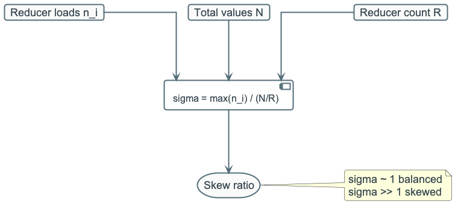
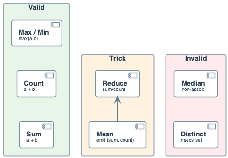
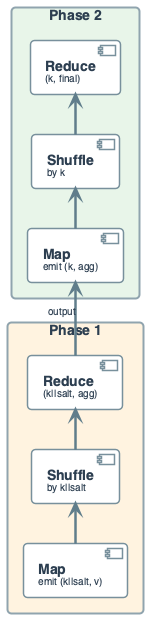
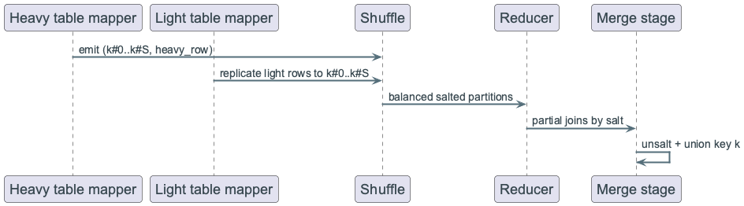
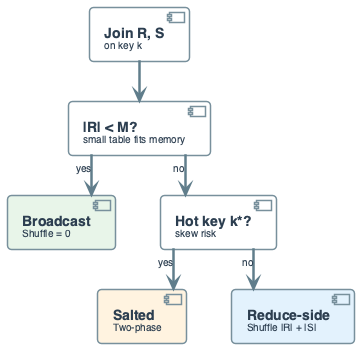
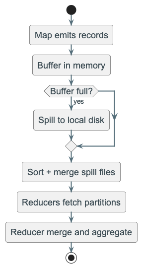
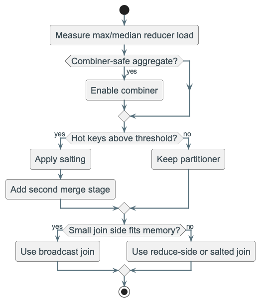

# Week 7: Advanced MapReduce — Skew, Joins, and Cost Optimization

## Purpose
- Solve real production bottlenecks in MapReduce pipelines
- Control shuffle cost and load imbalance under skewed data
- Choose join and partitioning strategies from measurable constraints

---

## Learning Objectives
- Quantify skew and estimate its runtime impact
- Apply combiner, salting, and custom partitioning correctly
- Select reduce-side vs broadcast vs salted joins
- Build operational guardrails for shuffle-heavy jobs

---

## Why This Lecture Matters
- Most failures come from skew, not map logic
- Shuffle dominates runtime and cluster cost
- "More reducers" alone does not fix hot keys
- Reliable jobs require explicit skew-aware design

---

## Core Metric: Skew Ratio
$$
\sigma = \frac{\max_i n_i}{N/R}
$$
- `N`: total values, `R`: reducers, `n_i`: reducer load
- `sigma = 1` is perfectly balanced
- High `sigma` predicts stragglers and possible OOM

{width=78%}

---

## Latency Impact of Skew
$$
T_{job} \approx \alpha \cdot \max_i n_i = \sigma \cdot T_{balanced}
$$
- Job time is driven by hottest reducer
- 20x skew can produce ~20x tail latency
- Retries do not help when skew is structural

---

## Why Skew Appears
- Real key distributions are long-tail (Zipf-like)
- Small set of keys can hold most records
- Hash partitioning keeps same key on one reducer
- Hot-key traffic concentrates compute and memory pressure

---

## Combiner: First Optimization Lever
- Local pre-aggregation before shuffle
- Reduces duplicate key emissions per mapper
- Biggest benefit on count/sum-style workloads
- Low implementation effort, high payoff

---

## Combiner Correctness Rule
- Reduce operation must be associative and commutative
- Valid: sum, count, min, max
- Invalid directly: median, naive average, exact distinct
- For averages, combine `(sum, count)` pairs

---

## Shuffle Reduction Model
$$
C_0 = E \cdot s, \quad C_1 = \left(\sum_m U_m\right) \cdot s
$$
- `E`: raw emissions, `U_m`: unique keys per mapper
- Reduction depends on duplicate density per mapper
- If duplicates are low, combiner gains are limited

---

## Salting for Hot Keys
- Split one hot key into multiple salted keys
- Example: `k -> k#0 ... k#S-1`
- First pass aggregates per salt bucket
- Second pass recombines to original key

---

## Salting Trade-off
- **Benefit:** prevents single-reducer overload
- **Cost:** extra processing stage and added complexity
- Best when hot key can cause timeout/OOM
- Tune salt bucket count from observed skew

---

## Join Strategy 1: Reduce-Side Join
- Shuffle both sides on join key
- Works for general large-large joins
- Expensive network cost (`|R| + |S|` moved)
- Highest skew risk on popular keys

---

## Join Strategy 2: Broadcast Join
- Replicate small side to mappers
- Stream large side locally, no global join shuffle
- Fast when small table fits mapper memory
- Fails if "small" side grows beyond memory

---

## Join Strategy 3: Salted Join
- For skewed join keys in reduce-side joins
- Salt heavy side; replicate matching records on light side
- Balances hot join key across reducers
- Adds controlled replication cost

{width=90%}

---

## Join Decision Heuristic
- Small side fits memory -> broadcast join
- Large-large, no major skew -> reduce-side join
- Large-large with hot keys -> salted reduce-side join
- Low-selectivity prefilter possible -> semi-join first

---

## Shuffle Internals (Operational View)
- Map output buffered, spilled, sorted, merged
- Reducers fetch partitions from all mappers
- Disk spill + network transfer + merge CPU all matter
- Optimize all three, not only network bandwidth

{width=76%}

---

## Practical Cost Estimates
$$
B_{shuffle} = N_{emit} \times s_{pair}
$$
- Estimate shuffle bytes before launching large runs
- Size reducers for expected hottest partition
- Validate memory headroom against hot-key scenarios
- Track spill rates to tune buffer/compression settings

---

## Failure Modes
- Reducer OOM from single huge key-group
- Stragglers from severe partition imbalance
- Shuffle timeout from excessive intermediate volume
- Wrong results from invalid combiner assumptions

---

## Detection Signals
- `max reducer input / median` ratio
- Reducer runtime p95/p50 spread
- Spill bytes per task and retry count
- Shuffle MB per input record trend

---

## Mitigation Playbook
- Apply combiner for valid aggregations
- Salt hot keys above skew threshold
- Repartition with custom logic for known heavy keys
- Prefer broadcast joins when memory allows

{width=74%}

---

## Engineering Checklist
- Do we know key frequency distribution before run?
- Is reducer function combiner-safe?
- Is join strategy tied to table size and skew data?
- Are skew and spill alerts in place?

---

## Recap
- Advanced MapReduce success is mostly about skew control
- Combiner reduces shuffle; salting protects hot keys
- Join choice should be data-driven, not default-driven
- Next: TF-IDF pipeline at scale and stop-word skew handling
