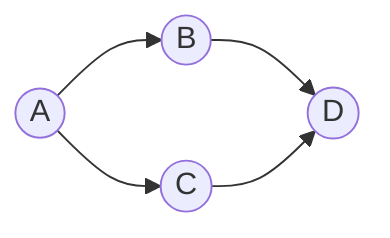
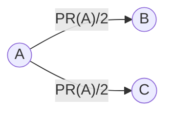
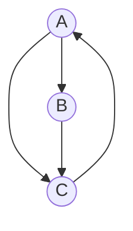

% PageRank Algorithm
% From Graphs to Markov Chains to MapReduce
% Data Engineering Course

## Learning Goal

**What this deck builds**

PageRank from the beginning: graphs, PageRank vocabulary, the first iterative
algorithm, a numerical example, the Markov-chain view, damping, and a scalable
MapReduce implementation.

---

## Roadmap

- Motivation
- Graphs
- PageRank Basics
- Numerical Example
- Markov Chains
- Damping
- MapReduce
- Wrap-Up

---

## Why PageRank Exists

Search engines face a ranking problem. Suppose many pages contain the words
"data engineering." Which page should appear first?

Text matching alone is not enough:

- A page can repeat keywords many times but still be low quality.
- A page can be useful even if it does not contain the exact query wording.
- Some pages are important because other important pages point to them.

**Core idea**

A page is important if important pages link to it.

---

## What Is a Graph?

A graph represents objects and relationships:

- **Vertices** or **nodes**: the objects.
- **Edges**: the relationships.

$$
G=(V,E)
$$



A small directed graph

---

## Directed Graphs and Web Links

- In an **undirected graph**, an edge has no direction.
- In a **directed graph**, each edge has a direction.
- A web link is directed: if page $A$ links to page $B$, it does not mean that
  page $B$ links back to page $A$.

$$
V = \{\text{pages}\}, \qquad E = \{\text{hyperlinks}\}
$$

---

## Neighbors, Inlinks, and Outlinks

For a page $p$:

- **Outlinks**: pages that $p$ links to.
- **Inlinks**: pages that link to $p$.
- **Out-degree**: the number of outlinks from $p$.
- **In-degree**: the number of inlinks into $p$.

$$
\Gamma(p)=\{q : p \rightarrow q\}, \qquad |\Gamma(p)|=\mathrm{outdeg}(p)
$$

**Important intuition**

PageRank is not just counting inlinks. A link from a strong page contributes
more, and a page that links to many pages divides its rank among them.

---

## Rank and Normalization

The PageRank score of a page $p$, written $\mathrm{PR}(p)$, represents the page's
importance in the link graph.

Ranks are usually normalized:

$$
\sum_{p \in V} \mathrm{PR}(p)=1
$$

This lets us interpret PageRank as a probability distribution over pages.

---

## Rank Flow

Each page distributes its current rank equally among its outlinks.

$$
\text{if } \mathrm{PR}(A)=0.30 \text{ and } \mathrm{outdeg}(A)=3,
\qquad
\text{each outlink receives } \frac{0.30}{3}=0.10
$$



A splits rank equally across two outlinks.

---

## Initial Rank and Convergence

**Initialization**

$$
\mathrm{PR}_0(p)=\frac{1}{N}
$$

Every page starts with equal rank.

**Stopping condition**

$$
\sum_{p \in V} |\mathrm{PR}_{t+1}(p)-\mathrm{PR}_t(p)| < \varepsilon
$$

Stop when scores change only slightly.

---

## Simple Update Rule

Start with a directed graph where every page has at least one outlink.

$$
\mathrm{PR}_{t+1}(p)
=
\sum_{q \rightarrow p}
\frac{\mathrm{PR}_t(q)}{|\Gamma(q)|}
$$

**Read the formula**

The new rank of page $p$ is the sum of all rank contributions sent by pages
that link to $p$.

---

## Simple Pseudocode

```text
initialize PR[p] = 1 / N for every page p

repeat until convergence:
    newPR[p] = 0 for every page p

    for each page q:
        contribution = PR[q] / number_of_outlinks(q)
        for each outlink p of q:
            newPR[p] += contribution

    PR = newPR
```

---

## What the Algorithm Is Doing

Each iteration has two conceptual phases:

1. **Distribute**: every page sends rank mass to its out-neighbors.
2. **Collect**: every page sums the rank mass it receives from in-neighbors.

**Data-engineering view**

This is a repeated message-passing computation over graph edges.

---

## Example Graph

Consider three pages:

$$
V=\{A,B,C\}
$$

$$
A \rightarrow B,\qquad A \rightarrow C,\qquad B \rightarrow C,\qquad C \rightarrow A
$$



---

## Out-Neighbor Sets

$$
\Gamma(A)=\{B,C\}, \qquad \Gamma(B)=\{C\}, \qquad \Gamma(C)=\{A\}
$$

$$
|\Gamma(A)|=2,\qquad |\Gamma(B)|=1,\qquad |\Gamma(C)|=1
$$

Initialization:

$$
\mathrm{PR}_0(A)=\mathrm{PR}_0(B)=\mathrm{PR}_0(C)=\frac{1}{3}
$$

---

## Iteration 1: Distribute

Page $A$ splits its rank between $B$ and $C$:

$$
A \rightarrow B: \frac{1/3}{2}=\frac{1}{6},
\qquad
A \rightarrow C: \frac{1/3}{2}=\frac{1}{6}
$$

Page $B$ sends all its rank to $C$:

$$
B \rightarrow C: \frac{1/3}{1}=\frac{1}{3}
$$

Page $C$ sends all its rank to $A$:

$$
C \rightarrow A: \frac{1/3}{1}=\frac{1}{3}
$$

---

## Iteration 1: Collect

$$
\mathrm{PR}_1(A)=\frac{1}{3},
\qquad
\mathrm{PR}_1(B)=\frac{1}{6},
\qquad
\mathrm{PR}_1(C)=\frac{1}{6}+\frac{1}{3}=\frac{1}{2}
$$

| Page | $\mathrm{PR}_0$ | Incoming contributions | $\mathrm{PR}_1$ |
|---|---:|---|---:|
| A | $1/3$ | from C: $1/3$ | $1/3 = 0.3333$ |
| B | $1/3$ | from A: $1/6$ | $1/6 = 0.1667$ |
| C | $1/3$ | from A: $1/6$, from B: $1/3$ | $1/2 = 0.5000$ |

---

## Iteration 2

Use $\mathrm{PR}_1(A)=1/3$, $\mathrm{PR}_1(B)=1/6$, and $\mathrm{PR}_1(C)=1/2$.

$$
A \rightarrow B: \frac{1}{6},
\quad
A \rightarrow C: \frac{1}{6},
\quad
B \rightarrow C: \frac{1}{6},
\quad
C \rightarrow A: \frac{1}{2}
$$

$$
\mathrm{PR}_2(A)=\frac{1}{2},
\qquad
\mathrm{PR}_2(B)=\frac{1}{6},
\qquad
\mathrm{PR}_2(C)=\frac{1}{3}
$$

---

## Reading the Result

- After the first iteration, page $C$ becomes strong because both $A$ and $B$
  link to it.
- After the second iteration, page $A$ becomes strong because the strong page
  $C$ links to it.
- The algorithm keeps moving rank through the graph until the scores
  stabilize.

---

## Random Surfer Interpretation

Imagine a user randomly surfing the web:

1. The user is currently on some page.
2. The user chooses one outgoing link uniformly at random.
3. The user moves to the linked page.
4. This repeats many times.

**Interpretation**

The PageRank score of a page is the long-run probability that the random surfer
is on that page.

---

## What Is a Markov Chain?

A Markov chain is a probabilistic process where the next state depends only on
the current state, not on the full history.

For PageRank:

- States are pages.
- Transitions are hyperlinks.
- Transition probabilities are usually uniform over outlinks.

---

## Transition Matrix

For the graph $A \rightarrow B$, $A \rightarrow C$, $B \rightarrow C$,
$C \rightarrow A$:

$$
M_{ij} =
\begin{cases}
\frac{1}{\mathrm{outdeg}(j)} & \text{if page } j \text{ links to page } i,\\
0 & \text{otherwise}
\end{cases}
$$

$$
M =
\begin{bmatrix}
0 & 0 & 1 \\
\frac{1}{2} & 0 & 0 \\
\frac{1}{2} & 1 & 0
\end{bmatrix}
$$

---

## Matrix-Vector Update

The PageRank update can be written as:

$$
\mathbf{r}_{t+1}=M\mathbf{r}_t
$$

At convergence:

$$
\mathbf{r} = M\mathbf{r}
$$

**Stationary distribution**

$\mathbf{r}$ is a stationary distribution of the Markov chain and an eigenvector
of $M$ with eigenvalue $1$.

---

## Bridge to Data Engineering

PageRank has two equivalent views:

- an iterative graph algorithm that sends messages along edges;
- repeated sparse matrix-vector multiplication.

**Why this matters**

Both views lead naturally to distributed implementations.

---

## Why the Simple Algorithm Is Not Enough

**Dangling nodes**

A dangling node has no outlinks:

$$
D \rightarrow \varnothing
$$

Its rank disappears unless handled.

**Spider traps**

A group of pages can point only to itself. Rank can get stuck permanently inside
the group.

---

## Damping

Damping modifies the random surfer model:

- With probability $d$, the surfer follows an outgoing link.
- With probability $1-d$, the surfer teleports to a random page.

$$
d=0.85
$$

The surfer follows links $85\%$ of the time and teleports $15\%$ of the time.

---

## Why Damping Helps

- Prevents rank from getting stuck permanently in spider traps.
- Gives dangling-node rank a principled way to re-enter the graph.
- Makes every page reachable with positive probability.
- Helps guarantee a unique stable PageRank vector.

---

## Damped Update Formula

Let $N$ be the number of pages, $d$ the damping factor, and $M_t$ the total
rank mass of dangling nodes at iteration $t$.

$$
\mathrm{PR}_{t+1}(p)
=
\frac{1-d}{N}
+
d \left(
\sum_{q \rightarrow p}
\frac{\mathrm{PR}_t(q)}{|\Gamma(q)|}
+
\frac{M_t}{N}
\right)
$$

1. $\frac{1-d}{N}$: teleportation mass.
2. Link-based contributions from in-neighbors.
3. $\frac{M_t}{N}$: redistributed dangling-node mass.

---

## Damped Example: Setup

$$
A \rightarrow B,\quad A \rightarrow C,\quad B \rightarrow C,\quad C \rightarrow A,
\quad D \rightarrow \varnothing
$$

$$
N=4,\qquad
\mathrm{PR}_0(A)=\mathrm{PR}_0(B)=\mathrm{PR}_0(C)=\mathrm{PR}_0(D)=0.25,\qquad
d=0.85
$$

$$
M_0=\mathrm{PR}_0(D)=0.25,
\qquad
\frac{M_0}{N}=0.0625,
\qquad
\frac{1-d}{N}=0.0375
$$

---

## Damped Example: Iteration 1

Incoming link contributions:

$$
\mathrm{in}(A)=0.25,\quad
\mathrm{in}(B)=0.125,\quad
\mathrm{in}(C)=0.375,\quad
\mathrm{in}(D)=0
$$

$$
\mathrm{PR}_1(p)=0.0375+0.85\left(\mathrm{in}(p)+0.0625\right)
$$

| Page | Link contribution | Formula | $\mathrm{PR}_1$ |
|---|---:|---|---:|
| A | 0.2500 | $0.0375+0.85(0.3125)$ | 0.3031 |
| B | 0.1250 | $0.0375+0.85(0.1875)$ | 0.1969 |
| C | 0.3750 | $0.0375+0.85(0.4375)$ | 0.4094 |
| D | 0.0000 | $0.0375+0.85(0.0625)$ | 0.0906 |

---

## PageRank as a Distributed Data Problem

The web graph is huge:

- billions of pages;
- many billions of links;
- sparse but too large for one machine;
- iterative computation: the graph is processed many times.

This makes PageRank a natural example for MapReduce and other distributed data
systems.

---

## Data Representation

Each page can be represented as:

$$
(\text{page}, \text{current rank}, \text{adjacency list})
$$

| Page | Current rank | Adjacency list |
|---|---:|---|
| A | 0.25 | [B, C] |
| B | 0.25 | [C] |
| C | 0.25 | [A] |
| D | 0.25 | [] |

---

## One Iteration as MapReduce

1. **Map**: each page emits rank contributions to its outlinks.
2. **Map**: each page also emits its adjacency list so the graph structure is
   preserved.
3. **Shuffle**: contributions are grouped by destination page.
4. **Reduce**: each page sums incoming contributions and applies damping.
5. **Repeat**: run another iteration using the new ranks.

---

## MapReduce Flow

{width=92%}

One PageRank iteration as a MapReduce dataflow.

---

## Mapper

Input:

$$
(p, \mathrm{PR}_t(p), \Gamma(p))
$$

If $p$ has outlinks:

$$
\text{for each } q \in \Gamma(p),\quad
\mathrm{emit}(q, \mathrm{PR}_t(p)/|\Gamma(p)|)
$$

Also preserve graph structure:

$$
\mathrm{emit}(p, \mathrm{AdjacencyList}(\Gamma(p)))
$$

If $p$ is dangling, add $\mathrm{PR}_t(p)$ to global dangling mass.

---

## Reducer

Input for a page $p$:

$$
(p, [\text{values grouped by key }p])
$$

The values contain numeric contributions from in-neighbors and one adjacency list.

$$
\mathrm{sum\_in}(p)=\sum \text{numeric contributions received by }p
$$

$$
\mathrm{PR}_{t+1}(p)=
\frac{1-d}{N}+d\left(\mathrm{sum\_in}(p)+\frac{M_t}{N}\right)
$$

The reducer emits $(p, \mathrm{PR}_{t+1}(p), \Gamma(p))$.

---

## Formal MapReduce Pseudocode

```text
map(page p, rank r, adjacency list L):
    emit(p, STRUCTURE(L))

    if L is empty:
        add r to DANGLING_MASS
    else:
        c = r / length(L)
        for each destination q in L:
            emit(q, CONTRIBUTION(c))

combine(page p, values):
    sum numeric CONTRIBUTION values
    pass STRUCTURE values unchanged
```

---

## Formal MapReduce Pseudocode: Reduce

```text
reduce(page p, values):
    L = adjacency list from STRUCTURE value
    s = sum all CONTRIBUTION values
    newRank = (1 - d) / N + d * (s + DANGLING_MASS / N)
    emit(p, newRank, L)
```

---

## MapReduce Example: Input

| Page | Rank | Outlinks |
|---|---:|---|
| A | 0.25 | [B, C] |
| B | 0.25 | [C] |
| C | 0.25 | [A] |
| D | 0.25 | [] |

---

## MapReduce Example: Mapper Emissions

| Source page | Emitted key | Emitted value |
|---|---|---|
| A | B | contribution 0.125 |
| A | C | contribution 0.125 |
| A | A | structure [B, C] |
| B | C | contribution 0.250 |
| B | B | structure [C] |
| C | A | contribution 0.250 |
| C | C | structure [A] |
| D | D | structure [] |
| D | global | dangling mass 0.250 |

---

## MapReduce Example: Shuffle and Reduce

**After shuffle**

| Key | Values |
|---|---|
| A | contribution 0.250, structure [B, C] |
| B | contribution 0.125, structure [C] |
| C | contribution 0.125, contribution 0.250, structure [A] |
| D | structure [] |

---

## MapReduce Example: Reducer Output

**Reducer output**

| Page | New rank | Structure |
|---|---:|---|
| A | 0.3031 | [B, C] |
| B | 0.1969 | [C] |
| C | 0.4094 | [A] |
| D | 0.0906 | [] |

---

## Engineering Notes

- **Combiner**: safe for numeric contribution sums; must preserve adjacency lists.
- **Dangling mass**: track with a counter, special key, or separate aggregation job.
- **Convergence**: reducers can emit $|\mathrm{PR}_{t+1}(p)-\mathrm{PR}_t(p)|$.
- **Cost**: each iteration scans the graph and shuffles $O(|E|)$ data.
- **Skew**: hot pages may need two-stage aggregation.

---

## Summary

- A web graph is a directed graph: pages are nodes, links are edges.
- Basic PageRank repeatedly sends each page's rank through its outgoing links.
- PageRank is also a Markov chain: ranks are long-run visit probabilities.
- Damping adds teleportation, handles dangling nodes, and prevents rank traps.
- MapReduce implements each iteration as contribution emission, shuffle,
  and reduction by summation plus damping.

---

## Practice Questions

1. Given $A\rightarrow B$, $B\rightarrow C$, $C\rightarrow A$, and
   $D\rightarrow C$, compute one simple PageRank iteration from equal initialization.
2. For the same graph, write the transition matrix $M$.
3. Add damping with $d=0.85$. If there are no dangling nodes, what changes?
4. Explain why the adjacency list must pass through mapper and reducer.
5. Suppose one page receives $40\%$ of all graph links. What MapReduce
   bottleneck might appear, and how could you reduce it?
