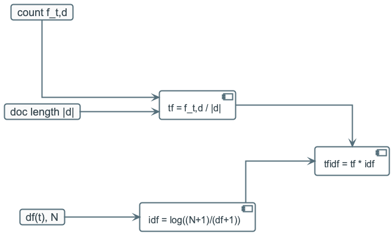
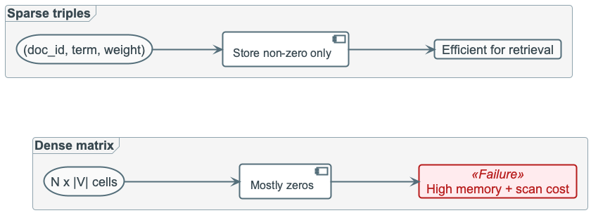
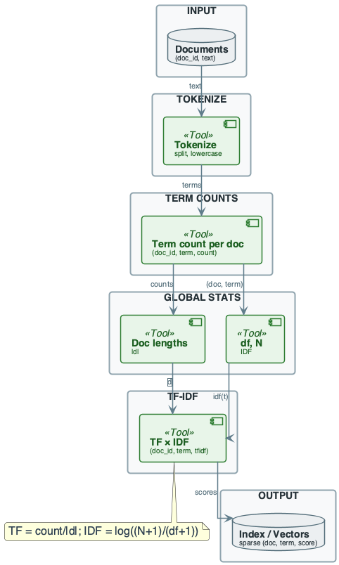
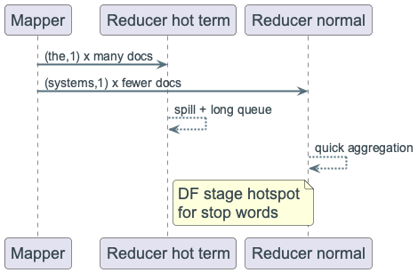
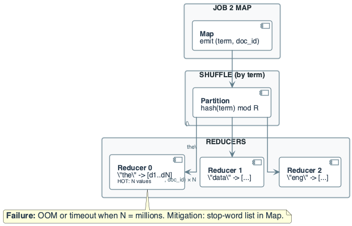
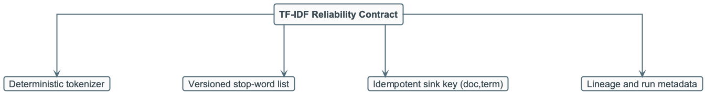

# Week 8: Text Processing at Scale — TF-IDF

## Purpose
- Build scalable term-weighting pipelines for search and ranking
- Compute TF-IDF reliably on large corpora
- Handle vocabulary growth and stop-word skew in production

---

## Learning Objectives
- Explain TF, DF, IDF, and TF-IDF from first principles
- Design a distributed TF-IDF pipeline
- Estimate sparse storage and shuffle requirements
- Mitigate hot-term skew and unstable vocab growth

---

## Why This Lecture Matters
- TF-IDF is foundational for search and retrieval systems
- At scale, global term statistics become the bottleneck
- Poor text pipeline design causes unstable relevance ranking
- Efficient storage requires sparse representations

---

## Problem Setup
- Corpus: many documents with raw text
- Goal: rank documents by term relevance
- Need both local term frequency and global rarity
- Output used by search, recommendations, and analytics

---

## TF-IDF Definition
- TF-IDF measures how relevant a term is to a document within a corpus
- It combines local term frequency with global rarity across documents

---

## TF-IDF Applications
- Information retrieval: improve document ranking for search queries
- Keyword extraction: high-scoring terms summarize document focus

---

## Core Formulas
$$
tf(t,d) = \frac{f_{t,d}}{|d|}
$$
$$
idf(t) = \log\frac{N+1}{df(t)+1}
$$
$$
tfidf(t,d) = tf(t,d) \times idf(t)
$$
- High weight = frequent in doc and rare in corpus

{width=84%}

---

## Vector Space Intuition
- Each document is a sparse term-weight vector
- Query is also represented as a vector
- Ranking can use cosine similarity
- Sparse vectors make this practical at scale

---

## Dense vs Sparse Storage
- Dense matrix is infeasible for large `N x |V|`
- Most doc-term entries are zero
- Store only non-zero triples `(doc_id, term, weight)`
- Sparse storage is mandatory, not optional

{width=88%}

---

## Mini Example (By Hand)
- D1: "data engineering data"
- D2: "engineering systems"
- D3: "data data data"
- `systems` gets higher IDF than common terms

---

## TF Computation Example
- TF(t,d) = count of term in doc / number of words in doc
- Example: "It is going to rain today" (6 words); "going" appears 1× → TF = 1/6 ≈ 0.16
- IDF penalizes terms that appear in many documents; rare terms get higher weight

---

## Distributed TF-IDF Pipeline
- **Job 1:** per-doc term counts and doc lengths
- **Job 2:** document frequency `df(term)`
- **Job 3:** join stats and compute final TF-IDF
- Store output keyed by `(doc_id, term)`

---

## Job 1: Term Counts
- Tokenize document text
- Emit `((doc_id, term), 1)`
- Use combiner for local counting
- Reduce to `(doc_id, term, count)`

---

## Job 2: Document Frequency
- Emit one `(term, 1)` per unique `(doc, term)`
- Reduce to `(term, df)`
- This step creates global hot-term pressure
- Most skew issues appear here

{width=86%}

---

## Job 3: Final Weights
- Combine term count, doc length, and `df`
- Compute `tf`, `idf`, and final weight
- Output sparse features for downstream ranking
- Keep deterministic logic for rerun consistency

---

## Cost Model (High Level)
- Job 1 shuffle ~ term occurrences
- Job 2 shuffle ~ unique doc-term pairs
- Job 3 often lightweight with broadcast dictionaries
- Overall cost dominated by global aggregation phase

---

## Main Failure: Stop-Word Skew
- Terms like "the" appear in huge fraction of docs
- Single reducer can receive massive value lists
- Causes spills, stragglers, and possible OOM
- Wastes cost for terms with near-zero IDF value

---

## Skew Mitigations
- Stop-word filtering in early tokenization
- DF threshold filtering (drop terms above high-frequency cutoff)
- Optional term capping per language/domain
- Monitor reducer imbalance continuously

---

## Vocabulary Explosion Risks
- URLs, IDs, typos, and random strings inflate vocabulary
- Large vocab increases memory and broadcast size
- Unstable tokens reduce relevance quality
- Normalize/canonicalize aggressively before counting

---

## Normalization Rules
- Lowercasing and punctuation cleanup
- Tokenization strategy versioned and reproducible
- Optional stemming/lemmatization by language
- Keep same rules across all reruns/backfills

---

## Approximation Options (When Needed)
- Sample corpus for approximate `df`
- Hashing trick for bounded feature space
- Trade some precision for predictable resource usage
- Use only when exact pipeline cost is unacceptable

---

## Reliability and Idempotency
- Write sink keyed by `(doc_id, term)` for safe upserts
- Rerunning same slice should not duplicate weights
- Version tokenizer + stop-word list with each run
- Keep lineage for reproducible search behavior

{width=76%}

---

## Monitoring Dashboard
- Job2 max/median reducer input ratio
- Vocabulary size trend over time
- Empty/invalid document rate
- Output nnz (non-zero weights) trend

---

## Engineering Checklist
- Is tokenization deterministic and versioned?
- Is stop-word handling explicit and tested?
- Are sparse outputs and key constraints enforced?
- Are skew thresholds and alerts configured?

---

## Recap
- TF-IDF is simple mathematically, hard operationally at scale
- Sparse storage and stable preprocessing are essential
- Stop-word skew is the primary production failure mode
- Next: advanced text pipelines and ranking improvements
