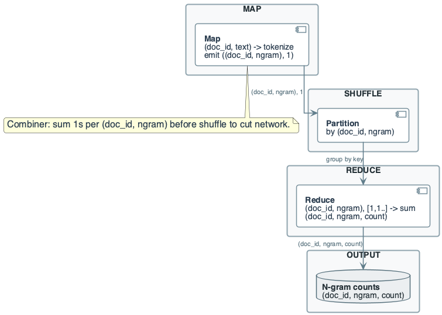
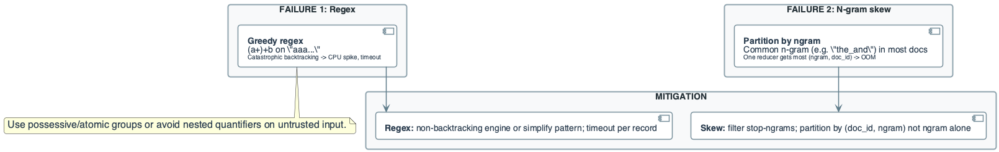
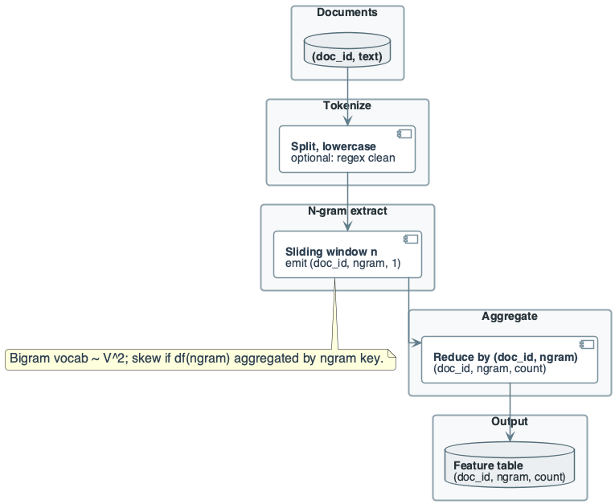

# Week 9: Advanced Text Processing — N-grams, Regex, and Embeddings

## Purpose
- Beyond TF-IDF: capture word order and context with n-grams
- Vocabulary explosion: formal bounds on n-gram space complexity
- Engineering: regex safety, embedding versioning, feature pipelines

## Learning Objectives
- Define word and character n-grams formally
- Derive vocabulary size bounds: $O(V^n)$ for word n-grams
- Analyze MapReduce cost for n-gram extraction
- Identify regex catastrophic backtracking and mitigations
- Distinguish feature computation from model training
- Design reproducible text feature pipelines

---

# Part I: The N-gram Problem

## Motivation: Word Order Matters
- TF-IDF treats documents as bags of words
- "not good" vs "good" have same unigram weights
- **N-grams:** Capture local word order

## Formal Definition: Word N-gram
- **Token sequence:** $w_1, w_2, \ldots, w_L$ (document of length $L$)
- **N-gram:** Contiguous subsequence of length $n$
$$
g_i = (w_i, w_{i+1}, \ldots, w_{i+n-1}) \quad \text{for } i \in [1, L-n+1]
$$
- **Number of n-grams per document:**
$$
|G_n(d)| = L - n + 1
$$

## Example: Bigrams
- Text: "data engineering is fun"
- Tokens: [data, engineering, is, fun], $L = 4$
- Bigrams ($n=2$): (data, engineering), (engineering, is), (is, fun)
- Count: $4 - 2 + 1 = 3$

## Formal Definition: Character N-gram
- **String:** $s = c_1 c_2 \ldots c_m$ (length $m$)
- **Character n-gram:** Substring of length $n$
$$
g_i = c_i c_{i+1} \ldots c_{i+n-1} \quad \text{for } i \in [1, m-n+1]
$$
- **Example:** "data" with $n=3$: "dat", "ata"

---

# Part II: Vocabulary Size — Complexity Analysis

## Word N-gram Vocabulary Bound
- **Unigram vocabulary:** $|V_1| = V$ distinct words
- **Bigram vocabulary (theoretical):** $|V_2| \leq V^2$
- **General bound:**
$$
|V_n| \leq V^n
$$
- **Interpretation:** Exponential growth with $n$

## Practical Vocabulary Size
- Theoretical bound is loose due to sparsity
- Not all word combinations occur
- **Observed bigrams:** Typically $|V_2| \approx 10^6$ to $10^7$
- **Theoretical max:** $V = 10^5 \Rightarrow V^2 = 10^{10}$

## Example: Vocabulary Growth

| N-gram | Theoretical Max | Typical Observed |
|--------|-----------------|------------------|
| Unigram ($n=1$) | $V = 10^5$ | $10^5$ |
| Bigram ($n=2$) | $10^{10}$ | $10^6 - 10^7$ |
| Trigram ($n=3$) | $10^{15}$ | $10^7 - 10^8$ |

- **Engineering implication:** Vocabulary must be bounded for tractability

## Character N-gram Vocabulary Bound
- **Alphabet size:** $A$ (e.g., $A = 26$ for lowercase English)
- **Character n-gram vocabulary:**
$$
|V_n^{\text{char}}| \leq A^n
$$
- **Example:** Trigrams: $26^3 = 17{,}576$
- **Much smaller** than word n-gram vocabulary

## Map Emission Analysis
- **Document length:** $L$ tokens
- **N-grams per doc:** $L - n + 1 \approx L$ for small $n$
- **Total map emissions:**
$$
E = \sum_{d \in D} (|d| - n + 1) \approx \sum_{d \in D} |d| = T
$$
- **Where $T$:** Total tokens in corpus

## Why This Matters for MapReduce
- Job emits one pair per n-gram occurrence
- Shuffle size: $E \times s$ bytes
- **Example:** $10^9$ tokens, 30 B/pair → 30 GB shuffle
- **Combiner:** Reduces to unique (doc, ngram) pairs

---

# Part III: N-gram TF-IDF — Distributed Computation

## N-gram TF-IDF Pipeline
- Same structure as unigram TF-IDF
- **Job 1:** N-gram counts per document
- **Job 2:** Document frequency per n-gram
- **Job 3:** TF-IDF computation

## Job 1: N-gram Extraction and Counting

### Map
```
map(doc_id, text):
    tokens = tokenize(text)
    for i in range(len(tokens) - n + 1):
        ngram = tuple(tokens[i:i+n])
        emit((doc_id, ngram), 1)
```

### Reduce
- Sum counts: emit $(doc\_id, ngram, count)$

### Combiner
- Valid: sum is associative + commutative

## Job 1 Cost Analysis
- **Without combiner:**
$$
C_1 = \sum_d (|d| - n + 1) \times s \approx T \times s
$$
- **With combiner:**
$$
C_1^{\text{comb}} = \sum_d |\{ngrams(d)\}| \times s
$$
- **Reduction:** Factor of average n-gram repetition per doc

## Job 2: The Hot N-gram Problem
- Common n-grams: "of the", "in the", "to the"
- Appear in nearly all documents
- **Skew:** Reducer for "of the" gets $\approx N$ values

## Example: Bigram Skew
- $N = 10^6$ documents
- "of the" in 70% → 700K documents
- Reducer memory: $700K \times 8 = 5.6$ MB
- At $N = 10^9$: 5.6 GB for one reducer

## Mitigation Strategies
1. **Stop-bigram filtering:** Skip n-grams containing stop words
2. **DF threshold:** Drop n-grams with $\text{df} > \theta N$
3. **Partition by (doc, ngram):** Avoid aggregation by ngram alone

---

# Part IV: Manual N-gram Computation

## Example Corpus

| doc_id | text |
|--------|------|
| D1 | data engineering data |
| D2 | engineering systems |
| D3 | data data data |

## Step 1: Extract Bigrams
- **D1:** (data, engineering), (engineering, data) — 2 bigrams
- **D2:** (engineering, systems) — 1 bigram
- **D3:** (data, data), (data, data) — 2 occurrences of 1 unique bigram

## Step 2: Count per (doc, bigram)

| doc | bigram | count |
|-----|--------|-------|
| D1 | data_engineering | 1 |
| D1 | engineering_data | 1 |
| D2 | engineering_systems | 1 |
| D3 | data_data | 2 |

## Step 3: Document Frequency
- df(data_engineering) = 1
- df(engineering_data) = 1
- df(engineering_systems) = 1
- df(data_data) = 1
- **All bigrams unique to one doc** → IDF = $\log(3/1) = 1.10$

## Step 4: TF and TF-IDF
- D3 has 2 bigram slots, data_data appears 2 times
- $\text{tf}(\text{data\_data}, D3) = 2/2 = 1.0$
- $\text{tfidf} = 1.0 \times 1.10 = 1.10$

---

# Part V: Regex in Data Pipelines

## Use Cases
- **Cleaning:** Strip HTML tags, normalize whitespace
- **Extraction:** Dates, phone numbers, email addresses
- **Validation:** Format checking before processing

## Regex Complexity: The Backtracking Problem
- **Greedy matching:** Try longest match first; backtrack on failure
- **Nested quantifiers:** $O(2^n)$ time for pathological cases

## Catastrophic Backtracking Example
- **Pattern:** `(a+)+b`
- **Input:** "aaaaaaaaaaaaaac" (no 'b' at end)
- **Behavior:** Engine tries all partitions of 'a's
- **Partitions:** $2^{n-1}$ for $n$ 'a's
- **n = 30:** $2^{29} \approx 500$ million backtracks

## Formal Analysis
- Pattern with nested quantifiers on input of length $n$
- **Time complexity:** $O(2^n)$ in worst case
- **Practical impact:** Single record blocks mapper for minutes/hours

## Mitigation Strategies

### 1. Timeout per Record
```python
def safe_regex(pattern, text, timeout_ms=100):
    # Kill match after timeout
    with timeout(timeout_ms):
        return re.match(pattern, text)
```

### 2. Non-Backtracking Patterns
- Replace `(a+)+` with `a+` (semantically equivalent)
- Use possessive quantifiers: `(a++)b` (no backtrack)
- Use atomic groups: `(?>a+)b`

### 3. Input Validation
- Limit input length before regex
- Reject inputs exceeding threshold

## Regex Complexity Classes

| Pattern Type | Time Complexity | Safe? |
|--------------|-----------------|-------|
| Literal match | $O(n)$ | ✓ |
| Single quantifier | $O(n)$ | ✓ |
| Alternation | $O(nm)$ | ✓ |
| Nested quantifiers | $O(2^n)$ | ✗ |
| Backreferences | NP-complete | ✗ |

---

# Part VI: Embeddings — Engineering View

## What Are Embeddings?
- **Definition:** Mapping from discrete tokens to dense vectors
$$
\text{embed}: V \rightarrow \mathbb{R}^d
$$
- **Dimension:** $d$ typically 50–300
- **Example:** "data" → [0.12, -0.45, 0.78, ...]

## Embedding Table
- **Vocabulary:** $V$ tokens
- **Matrix:** $E \in \mathbb{R}^{V \times d}$
- **Lookup:** $\vec{v}_t = E[idx(t)]$

## Storage Analysis
- $V = 10^5$ tokens, $d = 300$ dimensions
- **Size:** $10^5 \times 300 \times 4$ bytes = 120 MB
- **Fits in memory** for lookup at inference time

## Document Embedding
- **Aggregation:** Mean, sum, or weighted average of token embeddings
$$
\vec{d} = \frac{1}{|d|} \sum_{t \in d} \vec{v}_t
$$
- **Alternative:** TF-weighted average
$$
\vec{d} = \sum_{t \in d} \text{tf}(t, d) \cdot \vec{v}_t
$$

## OOV (Out-of-Vocabulary) Handling
- **Problem:** Query term not in embedding table
- **Solutions:**
  1. Skip OOV terms
  2. Use default/zero vector
  3. Character n-gram fallback (FastText)
  4. Subword tokenization (BPE, WordPiece)

---

# Part VII: Feature Pipeline vs Model Training

## The Boundary
- **Feature pipeline:** Deterministic transform; no learning
  - Input: raw text
  - Output: numerical features (TF-IDF, n-grams, embeddings)
- **Model training:** Learns parameters from data
  - Input: features + labels
  - Output: model weights

## Why Separation Matters
- **Reproducibility:** Same text → same features (deterministic)
- **Versioning:** Feature version independent of model version
- **Debugging:** Isolate feature bugs from model bugs

## Feature Pipeline Contract
```
Input: (doc_id, text)
Output: (doc_id, feature_version, feature_vector)
```
- **Idempotent:** Rerun produces identical output
- **Versioned:** Feature schema and parameters recorded

## Embedding Version Control
- **Version string:** `embedding_v2_300d_20240115`
- **Stored with features:** $(doc\_id, version, \vec{v})$
- **Model trained on:** specific feature version
- **Inference:** Must use same embedding version

---

# Part VIII: Cost Model for Text Features

## Unigram TF-IDF Cost
$$
C_{\text{unigram}} = O(T) \text{ tokens processed}
$$
$$
\text{Storage} = O(D \times \bar{u}) \text{ where } \bar{u} = \text{avg unique terms/doc}
$$

## Bigram TF-IDF Cost
$$
C_{\text{bigram}} = O(T) \text{ bigrams extracted}
$$
$$
\text{Storage} = O(D \times \bar{b}) \text{ where } \bar{b} = \text{avg unique bigrams/doc}
$$
- **Note:** $\bar{b} \approx \bar{u}$ to $2\bar{u}$ (less repetition in bigrams)

## Embedding Lookup Cost
$$
C_{\text{embed}} = O(T \times d)
$$
- Lookup: $O(1)$ per token
- Aggregation: $O(|d| \times d)$ per document

## Cost Comparison

| Feature Type | Extraction | Storage per Doc | Vocabulary |
|--------------|------------|-----------------|------------|
| Unigram TF-IDF | $O(\|d\|)$ | $O(\bar{u})$ sparse | $V$ |
| Bigram TF-IDF | $O(\|d\|)$ | $O(\bar{b})$ sparse | $V^2$ (bounded) |
| Embedding | $O(\|d\| \times d)$ | $O(d)$ dense | $V$ |

---

# Part IX: Vocabulary Bounding Strategies

## Problem: Unbounded Vocabulary
- New terms appear continuously (typos, neologisms, names)
- Vocabulary grows without bound
- **Risk:** OOM in df table; model size explosion

## Strategy 1: Frequency Threshold
- Keep only terms with $\text{df}(t) \geq k$
- **Effect:** Drops rare terms (many unique but infrequent)
- **Trade-off:** Loses long-tail information

## Strategy 2: Top-K by Document Frequency
- Keep top $K$ terms by df
- **Guarantee:** Bounded vocabulary at $K$
- **Typical $K$:** $10^4$ to $10^6$

## Strategy 3: Feature Hashing
- Hash terms to $B$ buckets: $h(t) \mod B$
- **Guarantee:** Exactly $B$ features
- **Trade-off:** Collisions merge different terms

### Collision Analysis
- $V$ terms, $B$ buckets
- Expected collisions: $V - B(1 - (1-1/B)^V) \approx V - B$ for $V \gg B$
- **For $V = 10^6$, $B = 2^{18}$:** ~750K collisions

## Strategy 4: Subword Tokenization
- BPE, WordPiece, SentencePiece
- Fixed vocabulary of subword units
- **Advantage:** Handles OOV; bounded; captures morphology

---

# Part X: Production Best Practices

## Text Processing Checklist
1. **Encoding:** Validate UTF-8; handle/reject invalid
2. **Tokenization:** Consistent rules (lowercase, stemming, stop words)
3. **Regex:** Timeout per record; avoid nested quantifiers
4. **Vocabulary:** Bound by frequency, top-K, or hashing
5. **Versioning:** Record tokenizer version with features

## N-gram Pipeline Checklist
1. Filter n-grams containing stop words
2. Use combiner (sum is associative)
3. Partition by (doc_id, ngram) for counts
4. Threshold df for TF-IDF computation
5. Store sparse: (doc_id, ngram, value)

## Embedding Pipeline Checklist
1. Load embedding table once; share across mappers
2. Handle OOV explicitly (skip, default, subword)
3. Record embedding version in output
4. Validate dimension consistency

## Monitoring

| Metric | Healthy | Investigate |
|--------|---------|-------------|
| Regex timeout rate | < 0.01% | > 0.1% |
| OOV rate | < 5% | > 20% |
| Vocabulary growth | Stable | Unbounded |
| Encoding errors | < 0.001% | > 0.01% |

---

# Summary

## Recap — Engineering Judgment
- **N-gram vocabulary:** $|V_n| \leq V^n$; exponential growth
- Practical vocabulary much smaller due to sparsity
- **Shuffle cost:** $O(T)$ n-gram occurrences; combiner essential
- **Hot n-gram skew:** Same as TF-IDF; filter stop-n-grams
- **Regex danger:** Nested quantifiers → $O(2^n)$; timeout required
- **Embeddings:** Dense $d$-dimensional; version with features
- **Feature vs model:** Pipeline is deterministic; training is not

## Pointers to Practice
- Extract bigrams by hand; count unique per document
- Estimate shuffle size for n-gram MapReduce
- Identify catastrophic backtracking pattern
- Design vocabulary bounding strategy

## Additional Diagrams
### Advanced Text Pipeline Overview


### MapReduce N-gram Flow


### Failure: Regex and N-gram Skew


### Practice: N-gram Pipeline Reasoning


