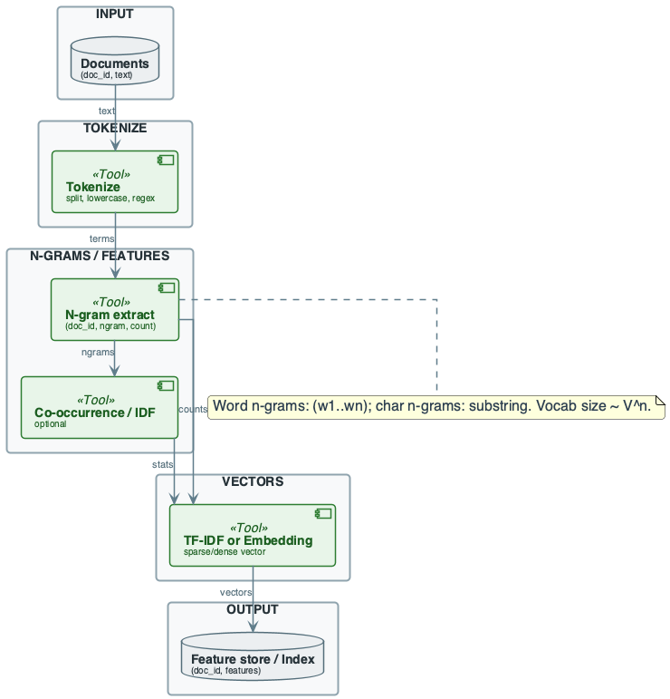
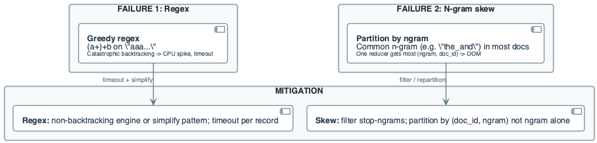
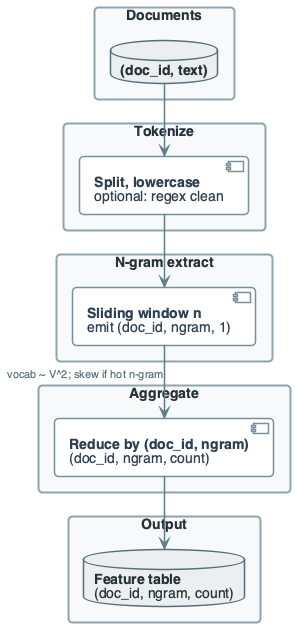

# Week 9: Advanced Text Processing Techniques

## Purpose
- Beyond TF-IDF: n-grams, regex, embeddings as features
- Engineering view: feature vs model; vocabulary growth
- Pipelines must scale to large corpora and remain reproducible

## Learning Objectives (1/2)
- Define word n-grams and character n-grams
- State vocabulary size growth: \(O(V^n)\) for word n-grams
- Use regex in pipelines for cleaning and extraction
- Know catastrophic backtracking risk

## Learning Objectives (2/2)
- Describe embeddings as dense vectors (lookup, dimension, versioning)
- Distinguish feature pipeline from model training
- Design MapReduce-style flow for n-gram extraction
- Identify failure modes: regex timeout, encoding errors, hot n-gram

## Diagram Manifest
- Slide 20 → week9_lecture_slide20_advanced_text_pipeline_overview.puml
- Slide 26 → week9_lecture_slide26_mapreduce_ngram_flow.puml
- Slide 29 → week9_lecture_slide29_failure_regex_ngram.puml

## The Real Problem This Lecture Solves

## Vocabulary and Shuffle at Scale
- N-gram vocabulary grows as \(V^n\)
- Bigrams with V=50k ⇒ up to billions of types
- Map emits (doc_id, ngram, 1) per instance
- Shuffle size and reducer load explode

## Regex in Production
- One malformed record with backtracking-prone pattern
- Can hang a mapper; CPU spike, timeout
- Pipeline blocked by single record

## Hot N-gram Key
- If job partitions by ngram for df
- Very common n-grams send most doc_ids to one reducer

## Cost of Naïve Design (Advanced Text)

## No Combiner in N-gram Job
- Emit (doc_id, ngram, 1) for every instance
- Shuffle size = total instances
- 10^6 docs × 200 terms × bigrams ⇒ ~2×10^8 pairs
- Combiner cuts to distinct (doc_id, ngram) per partition

## In-Lecture Exercise 3: Shuffle Size at Scale
- 1M docs, 200 terms/doc, bigrams
- Estimate map output pairs without combiner
- With combiner, assume 10^7 distinct (doc_id, ngram)
- Compare orders of magnitude

## In-Lecture Exercise 3: Solution (1/2)
- Without combiner: ≈ 1M × 199 ≈ 2×10^8 pairs
- Shuffle cost proportional to 2×10^8 emissions

## In-Lecture Exercise 3: Solution (2/2)
- With combiner: ≈ 10^7 distinct pairs
- ~20× reduction in shuffle volume

## In-Lecture Exercise 3: Takeaway
- Combiners turn instance counts into distinct key counts
- Bigram pipelines must minimize shuffle volume

## Partition by N-gram for Count Job
- Hot n-gram gets most doc_ids ⇒ one reducer OOM
- Partition by (doc_id, ngram) for per-doc counts
- Separate pass for df with cap or filter

## No Regex Timeout
- Complex pattern on long input ⇒ catastrophic backtracking
- One record blocks mapper
- Timeout per record and non-backtracking patterns required

## Core Concepts (1/3)
- **Word n-gram:** contiguous sequence of n tokens
- E.g. bigram: "data engineering"
- **Character n-gram:** contiguous substring of length n
- E.g. "dat", "ata" for "data"
- **Use:** word n-grams capture context; char n-grams handle typos

## Core Concepts (2/3)
- **Vocabulary size (word):** distinct n-grams ≤ \(V^n\)
- V = unigram vocabulary; bigrams ≈ \(V^2\)
- **Vocabulary size (char):** bounded by alphabet size^n
- Smaller than word n-grams for small n
- **What breaks:** very common n-grams → hot key

## Core Concepts (3/3)
- **Feature pipeline:** raw text → tokenize → n-grams / TF-IDF / embedding
- **Model:** training produces embeddings; pipeline consumes them
- **Engineering:** version tokenization and embedding table
- **Trade-off:** n-gram counts are interpretable; embeddings are opaque

## Data Context: 10-Doc Corpus
- Tokenize: lowercase, split on whitespace
- Use word bigrams (n=2) for examples
- String example: "data"

## In-Lecture Exercise 1: N-gram Basics
- Define word n-gram and character n-gram
- List character trigrams for "data"

## In-Lecture Exercise 1: Solution (1/2)
- Word n-gram: contiguous sequence of n tokens
- Character n-gram: contiguous substring of length n

## In-Lecture Exercise 1: Solution (2/2)
- "data" trigrams: "dat", "ata"

## In-Lecture Exercise 1: Takeaway
- Word n-grams capture context; char n-grams handle typos

## N-gram Definitions (Formal)
- **Word n-gram:** \(w_i \ldots w_{i+n-1}\) from token sequence
- i ∈ [1, m-n+1]
- **Character n-gram:** substring of length n
- **Sliding window:** one n-gram per position; overlapping
- **Example:** "data engineering" → bigram: ("data", "engineering")

## Data Context: Docs 1–3
- D1: "data engineering data"
- D2: "engineering systems"
- D3: "data data data"

## In-Lecture Exercise 2: Bigram Counts by Hand
- List bigrams per doc for D1–D3
- Compute count per (doc_id, ngram)
- How many distinct (doc_id, ngram) pairs?

## In-Lecture Exercise 2: Solution (1/2)
- D1 bigrams: data_engineering, engineering_data
- D2 bigram: engineering_systems
- D3 bigram: data_data (count 2)

## In-Lecture Exercise 2: Solution (2/2)
- Counts: (1,data_engineering,1), (1,engineering_data,1)
- (2,engineering_systems,1), (3,data_data,2)
- Distinct pairs: 4

## In-Lecture Exercise 2: Takeaway
- Bigrams are sliding windows over tokens
- Counts aggregate per (doc_id, ngram)

## Word vs Character N-grams

## Word N-grams
- Need tokenizer; vocab \(V^n\)
- Good for phrases and local word order

## Character N-grams
- No tokenizer; vocab ≈ 26^n (English)
- Good for prefixes/suffixes, typos
- **Storage:** word bigrams often 10^5–10^7 types
- Char trigrams 26^3 ≈ 17k

## N-gram Vocabulary Size (1/2)
- **Upper bound (word):** \(|V_n| \leq |V_1|^n\)
- In practice \(\ll |V_1|^n\) (sparsity)
- **Bigram example:** V=50k ⇒ up to 2.5×10^9 bigrams
- Actual distinct often 10^6–10^7
- **Cost:** Map emits (doc_id, ngram, 1); shuffle ∝ instances

## N-gram Vocabulary Size (2/2)
- **Character n-gram:** alphabet size A; distinct ≤ A^n
- A=26 ⇒ 26^3=17576 for trigrams
- **Engineering:** cap vocabulary (top-K by df)
- Or hash n-grams to fixed buckets
- **Reproducibility:** fix n, tokenization, and vocabulary filter

## Regex in Pipelines
- **Use:** clean (strip tags), extract (dates, IDs), validate (format)
- **Engine:** PCRE / Java regex; greedy matching and backtracking
- **Risk:** nested quantifiers (e.g. \((a+)+b\)) on long input
- ⇒ catastrophic backtracking
- **Mitigation:** non-backtracking engine; timeout per record

## Regex Catastrophic Backtracking

## Example
- **Pattern:** \((a+)+b\) expects one or more 'a' then 'b'
- **Input:** "aaaaaaaaaaaaaaaaac" (no 'b')
- Engine backtracks over all splits of 'a'+ → exponential time
- **Result:** CPU spike; job timeout; one record blocks pipeline

## Fix
- Possessive \((a++)+b\) or atomic group
- Or match \([a]+b\) and avoid nested quantifiers

## Embeddings: Engineering View (1/2)
- **Embedding:** term → fixed-size dense vector (e.g. 300 dim)
- **Lookup:** vocabulary maps term_id → vector
- Doc = aggregate (e.g. mean) of term vectors
- **Source:** pre-trained (Word2Vec, GloVe, FastText) or model output

## Embeddings: Engineering View (2/2)
- **Storage:** V × d floats; V=10^5, d=300 ⇒ 30M floats ≈ 120 MB
- **Versioning:** embedding table has version
- Feature pipeline records (doc_id, version, vector)
- **OOV:** missing term in table ⇒ use default vector or skip

## Feature vs Model
- **Feature pipeline:** deterministic transform: text → tokenize → features
- **Model training:** produces embeddings or weights; separate job
- **Boundary:** pipeline reads model artifact; does not train
- **Engineering:** same code path for batch and online

## Skip-grams and Co-occurrence

## Definitions
- **Skip-gram:** pair of terms within a window with gap
- E.g. "data" and "systems" with gap 2
- **Co-occurrence:** count (term_i, term_j) in same window
- Used for PMI or embedding training

## Engineering
- More pairs than n-grams; shuffle size grows
- Same skew risk (hot term pair)
- Use: word2vec-style training; PMI matrix

## Running Example — Data & Goal
- **Corpus:** 3 short documents
- D1: "data engineering data"
- D2: "engineering systems"
- D3: "data data data"
- **Goal:** (doc_id, ngram, count) for bigrams

## Running Example — Pipeline Overview
- Documents → tokenize → sliding window n=2 → (doc_id, ngram, 1)
- Shuffle by (doc_id, ngram); reduce sum → (doc_id, ngram, count)
- Optional: df(ngram), IDF; then TF-IDF per (doc_id, ngram)

## Running Example — Step-by-Step (1/4)
- **Step 1: Tokenize**
- D1: [data, engineering, data]
- D2: [engineering, systems]
- D3: [data, data, data]

## Running Example — Step-by-Step (2/4)
- **Step 2: Bigrams**
- D1: (data_engineering, 1), (engineering_data, 1)
- D2: (engineering_systems, 1)
- D3: (data_data, 2)
- **Convention:** ngram as "w1_w2"

## Running Example — Step-by-Step (3/4)
- **Step 3: Counts (after reduce)**
- (1, data_engineering, 1), (1, engineering_data, 1)
- (2, engineering_systems, 1), (3, data_data, 2)
- **Step 4: Document frequency (optional)**
- All bigrams in one doc only ⇒ same IDF for all

## Running Example — Step-by-Step (4/4)
- **Output:** (doc_id, ngram, count) or (doc_id, ngram, tfidf)
- **Interpretation:** D3 has repeated "data data" ⇒ high count
- **Scale:** N docs × T terms ⇒ up to N × (T-n+1) n-gram instances

## Cost & Scaling Analysis (1/3)
- **Time model:** T = T_map + T_shuffle + T_reduce
- **Map:** one pass per doc; tokenize O(|d|)
- Emit (doc_id, ngram, 1) per position
- **Shuffle:** size = total emitted
- With combiner: (doc_id, ngram, count)

## Cost & Scaling Analysis (2/3)
- **Memory (map):** per-doc token list and buffer; O(|d|)
- **Memory (reduce):** one key and list per (doc_id, ngram)
- **Storage:** output sparse; size ∝ distinct (doc_id, ngram)
- **Vocabulary:** store V_n or top-K n-grams

## Cost & Scaling Analysis (3/3)
- **Network:** shuffle dominates
- Combiner reduces (doc_id, ngram, 1) to (doc_id, ngram, count)
- **Throughput:** limited by shuffle bandwidth
- **Latency:** single job for counts; add job for df/N if TF-IDF

## Cost Example (Numeric)
- **Input:** 1M docs, 200 terms/doc avg, bigrams
- 100 mappers, 100 reducers
- **Map output (no combiner):** 1M × 199 ≈ 2×10^8 pairs
- ~16 B per pair ⇒ ~3.2 GB
- **With combiner:** distinct (doc_id, ngram) ⇒ ~1.6 GB shuffle

## MapReduce for N-gram Extraction
- **Map:** input (doc_id, text) → tokenize → emit ((doc_id, ngram), 1)
- **Combiner:** same as reduce: sum 1s
- **Partition:** by (doc_id, ngram)
- **Reduce:** sum → emit (doc_id, ngram, total_count)

## Shuffle Size (N-gram Job)
- **No combiner:** map emits one (key, 1) per instance
- Shuffle size = total instances
- **With combiner:** shuffle size = distinct (doc_id, ngram)
- **Skew:** if partition by ngram only, common n-gram → one reducer

## Pitfalls & Failure Modes (1/3)
- **Regex catastrophic backtracking:** CPU explosion, timeout
- **Encoding:** non-UTF-8 ⇒ replacement chars or crash
- **Empty or short docs:** |d| < n ⇒ no n-grams
- **OOV in embeddings:** term not in table ⇒ default or skip

## Pitfalls & Failure Modes (2/3)
- **Hot n-gram key:** if aggregating by ngram
- Very frequent n-gram → one reducer gets most pairs
- **Failure:** OOM or straggler
- **Mitigation:** filter stop-ngrams; partition by (doc_id, ngram)

## Pitfalls & Failure Modes (3/3)
- **Detection:** reducer input size variance; regex timeout metrics
- **Idempotency:** feature write keyed by (doc_id, version)
- **Tokenization drift:** change in lowercase/stem/stop list
- **Best practice:** timeout per record; encoding validation

## Failure Scenario — Regex and N-gram Skew

## Regex Failure
- \((a+)+b\) on "a" repeated 50 times + "c"
- Backtracking takes seconds or hangs
- Single record blocks mapper

## N-gram Skew
- Job partitions by ngram for df
- "the_and" in 80% of docs ⇒ one reducer gets 0.8×N doc_ids
- **Mitigation:** simplify regex; timeout; filter high-df n-grams

## Best Practices (1/2)
- Version tokenization and embedding table
- Use combiner in n-gram count job
- Partition by (doc_id, ngram) for per-doc counts
- Validate encoding (UTF-8) and input length before regex
- Cap vocabulary: top-K by df or hash to fixed buckets

## Best Practices (2/2)
- Store features keyed by (doc_id, version)
- Monitor: reducer variance, regex time, OOV rate
- Filter stop-ngrams or high-df n-grams when computing df
- Prefer non-backtracking regex for untrusted input
- Separate feature pipeline from model training

## Recap — Engineering Judgment
- **Vocabulary and partition choice:** n-gram vocab grows as V^n
- Partition by (doc_id, ngram) for counts
- Cap vocabulary for bounded size
- **Regex and encoding:** timeout per record; validate at ingest
- **Skew is the same story:** hot n-gram → one reducer
- Filter stop-ngrams; sparse (doc_id, ngram, count)
- **Feature vs model boundary:** pipeline consumes versioned artifacts

## Pointers to Practice
- Extract bigrams by hand from 3–5 docs; compute counts
- MapReduce walkthrough: 8–12 input lines
- Cost: estimate map output and shuffle size
- One failure case: hot n-gram or regex timeout; diagram mitigation

## Additional Diagrams
### Advanced Text Pipeline Overview (slide 16)

### Failure Regex N-gram (slide 33)

### Practice: N-gram Pipeline Reasoning (slide 19)

### Practice: N-gram Pipeline Reasoning (slide 22)

