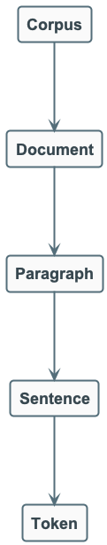
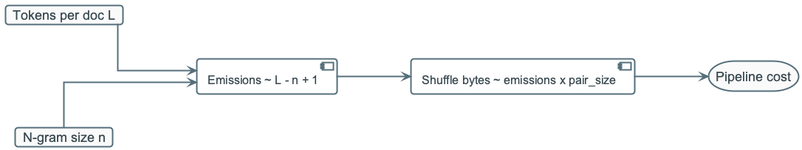
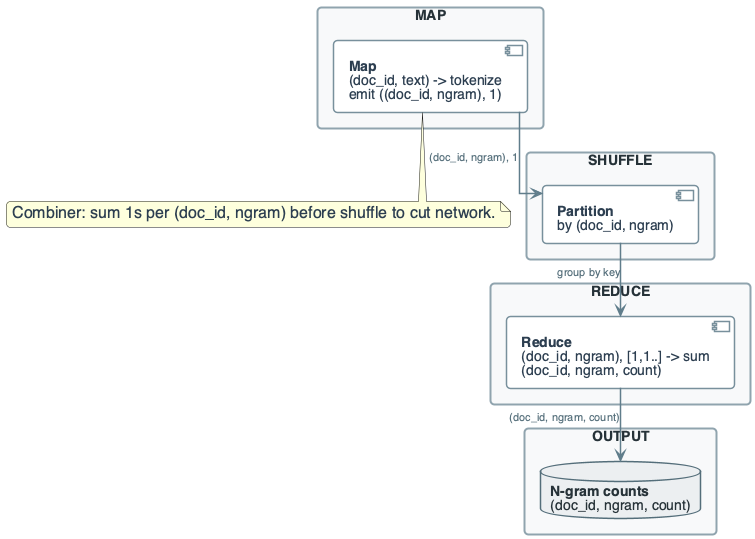
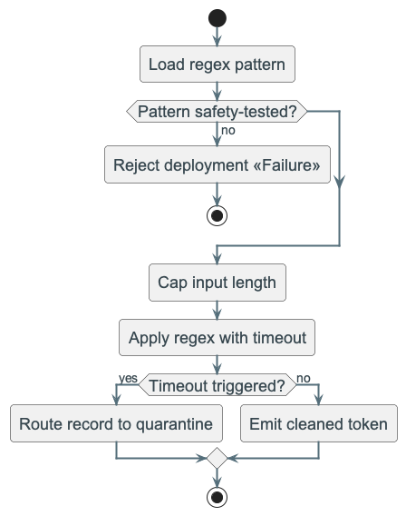
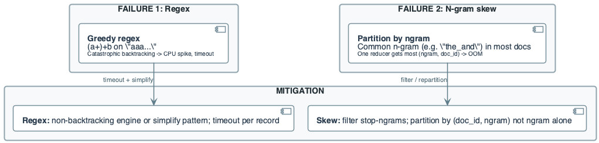
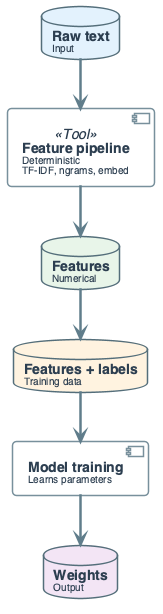
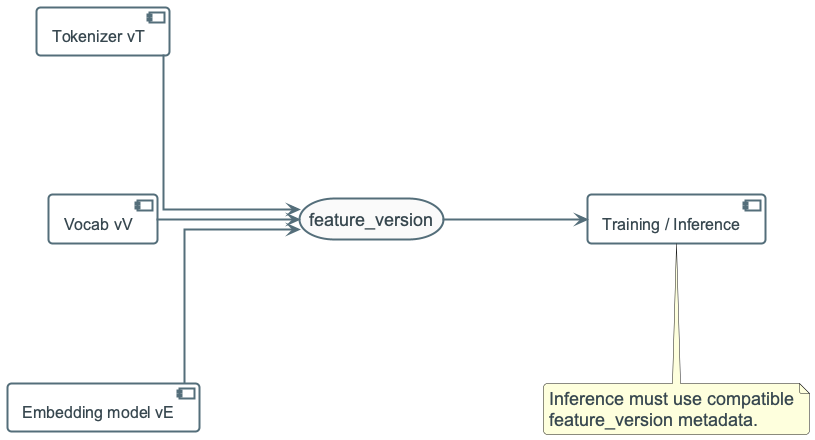

# Week 9: Advanced Text Processing — N-grams, Regex, and Embeddings

## Purpose
- Extend bag-of-words pipelines with order-aware and semantic features
- Control complexity from n-gram growth and noisy vocabularies
- Build reproducible text feature pipelines for production systems

---

## Learning Objectives
- Explain word and character n-grams and their cost
- Design scalable n-gram TF-IDF pipelines
- Identify and mitigate regex performance hazards
- Use embeddings with versioning and OOV-safe handling

---

## Why This Lecture Matters
- Unigrams miss important local context (e.g., negation)
- Naive n-gram expansion can overwhelm storage and shuffle
- Text cleaning errors silently degrade downstream relevance
- Feature reproducibility is required for stable model behavior

---

## Text Hierarchy
- **Corpus -> document -> paragraph -> sentence -> token**
- This hierarchy defines where tokenization and feature extraction happen
- **Topics/themes** are statistically significant terms within the corpus

{width=70%}

---

## Downstream Applications
- **Document clustering** groups unlabeled documents by similarity
- **Topic modeling** discovers latent themes without labeled training data
- **Recommender systems** use TF-IDF and text features for content-based ranking

---

## N-gram Basics
- Word n-gram: contiguous token sequence of length `n`
- Count per document is roughly `L - n + 1`
- Captures order without full sequence modeling
- Common choice: bigrams/trigrams for local semantics

---

## Vocabulary Growth Risk
$$
|V_n| \le V^n
$$
- Theoretical growth is exponential with `n`
- Practical observed size is smaller but still large
- Must bound vocabulary to keep costs predictable
- Character n-grams can provide tighter bounded space

---

## Cost Intuition for N-gram Pipelines
- Extraction cost scales with total tokens processed
- Shuffle cost scales with emitted `(doc, ngram)` pairs
- Repetition level determines combiner effectiveness
- Higher `n` increases sparsity and feature dimensionality

{width=86%}

---

## Distributed N-gram TF-IDF (3 Jobs)
- **Job 1:** extract/count n-grams per document
- **Job 2:** compute document frequency per n-gram
- **Job 3:** join stats and compute final TF-IDF
- Persist sparse output keyed by `(doc_id, feature)`

---

## Job 1: Extraction and Counting
- Tokenize text with deterministic rules
- Emit `((doc_id, ngram), 1)`
- Use combiner to reduce mapper-local duplicates
- Reduce to `(doc_id, ngram, count)`

---

## Job 2: Global DF (Skew Hotspot)
- Emit one `(ngram, 1)` per unique doc-ngram
- Reduce to `(ngram, df)`
- Very common n-grams cause reducer imbalance
- This stage is often the main bottleneck

---

## Job 3: Weight Computation
- Compute `tf = count / doc_len`
- Compute `idf = log((N+1)/(df+1))`
- Output `tfidf = tf * idf`
- Keep deterministic schema and feature version

---

## Common N-gram Failure Mode
- High-frequency patterns (e.g., stop-phrase variants)
- One reducer receives disproportionate term volume
- Spills and stragglers extend job latency
- Potential OOM under large corpora

---

## N-gram Mitigations
- Remove stop words/stop-phrases before n-gram generation
- Drop terms with very high document frequency
- Cap vocabulary with top-K / min-DF thresholds
- Monitor reducer max/median load ratio

---

## Regex in Data Pipelines
- Used for cleaning, extraction, and validation
- Unsafe patterns can create catastrophic backtracking
- One pathological record can stall an entire task
- Regex safety is an operational requirement

---

## Catastrophic Backtracking Pattern
- Nested quantifiers are high risk (e.g., `(a+)+b`)
- Certain non-matching inputs trigger exponential runtime
- Impact: long mapper stalls and timeout cascades
- Treat regex complexity like untrusted code

---

## Regex Safety Rules
- Prefer linear-time patterns where possible
- Enforce per-record regex timeout/guardrails
- Cap input length before heavy expressions
- Precompile and test patterns on adversarial samples

{width=74%}

---

## Embeddings (Engineering View)
- Map tokens to dense vectors of fixed dimension
- Aggregate token vectors to doc/query representations
- Require explicit OOV handling strategy
- Storage is predictable but version-sensitive

---

## OOV Handling Options
- Skip unknown tokens
- Use fallback vector (`UNK`)
- Use subword-based decomposition
- Track OOV rate as a quality signal

---

## Feature Pipeline vs Model Training
- Feature pipeline: deterministic transformation layer
- Training: learns parameters from labeled data
- Keep versions independent but linked in metadata
- Reproducibility depends on strict separation

{width=76%}

---

## Versioning Contract
- Store `tokenizer_version`, `vocab_version`, `embedding_version`
- Output includes `feature_version` with vectors
- Inference must use compatible feature version
- Backfills must remain replay-safe and auditable

{width=82%}

---

## Vocabulary Bounding Strategies
- Min document frequency threshold
- Top-K retained features by global frequency
- Hashing trick for fixed-dimensional buckets
- Subword tokenization for open vocabulary domains

---

## Monitoring Signals
- Vocabulary size growth over time
- OOV rate and invalid encoding rate
- Regex timeout rate
- Reducer skew in global DF stage

---

## Engineering Checklist
- Are tokenization/normalization rules deterministic?
- Is vocabulary bounded and versioned?
- Are regex patterns safety-tested with limits?
- Are sparse outputs keyed for idempotent writes?

---

## Recap
- N-grams add context but increase cost and skew risk
- Regex safety and normalization quality are critical
- Embeddings require explicit OOV + version governance
- Next: streaming systems and approximation algorithms
