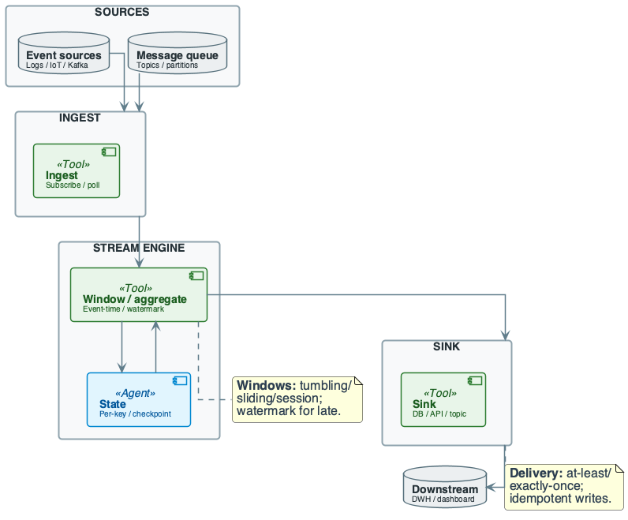
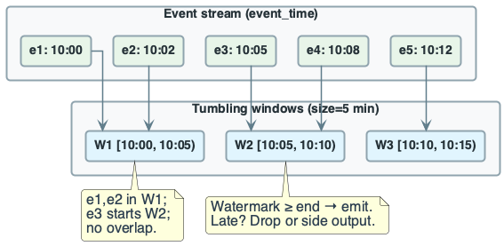
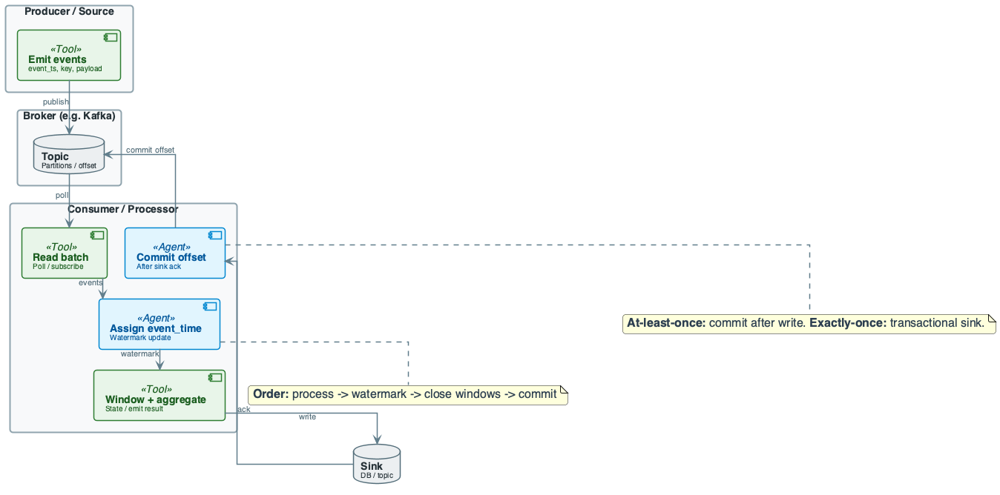
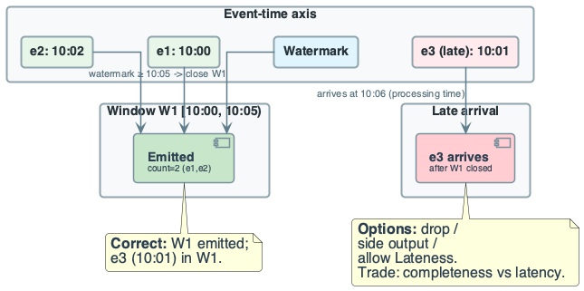
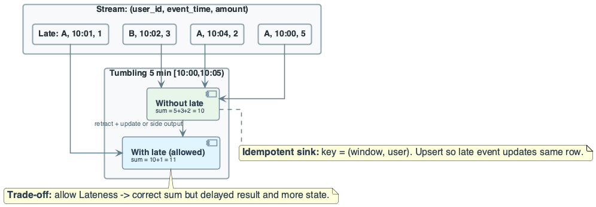

# Week 10: Streaming Data and Approximation Algorithms

## Purpose
- Streaming: unbounded data processed in one pass with bounded memory
- Exact computation is often impossible; approximation is necessary
- Core algorithms: Morris Counter, Flajolet-Martin, HyperLogLog, Count-Min Sketch

## Learning Objectives
- Define the streaming model and its constraints
- State why exact solutions fail for streaming problems
- Derive Morris Counter with expectation, variance, and error bounds
- Derive Flajolet-Martin for cardinality estimation
- Apply (ε, δ)-approximation framework
- Design streaming pipelines with windowing and watermarks

---

# Part I: The Streaming Model

## Formal Stream Definition
- **Stream:** Sequence $S = \langle a_1, a_2, \ldots, a_m \rangle$ of $m$ elements
- **Domain:** Each $a_i \in [n] = \{1, 2, \ldots, n\}$
- **Frequency:** $f_j = |\{i : a_i = j\}|$ for each $j \in [n]$
- **Constraint:** $\sum_j f_j = m$ (stream length)

## Streaming Constraints
1. **One pass:** Elements seen sequentially; no rewinding
2. **Bounded memory:** Space $s \ll m$ (typically $s = O(\log m)$ or $O(\text{poly}(\log m))$)
3. **Fast update:** $O(1)$ or $O(\log m)$ time per element
4. **Query at end:** Return estimate after stream completes

## Why Exact Solutions Fail

### Exact Counting
- **Problem:** Count elements in stream (compute $m$)
- **Exact:** Maintain counter; increment per element
- **Space:** $O(\log m)$ bits to store counter value $m$
- **For $m = 2^{64}$:** Need 64 bits = 8 bytes (seems fine)
- **But:** What if we need to count with $O(\log \log m)$ space?

### Exact Distinct Count
- **Problem:** Count distinct elements (compute $F_0 = |\{j : f_j > 0\}|$)
- **Exact:** Store all seen elements in set
- **Space:** $\Omega(n)$ bits in worst case
- **For $n = 10^9$:** Need ~1 GB minimum
- **Streaming constraint:** Space must be $o(n)$

### Exact Frequency Tracking
- **Problem:** Track $f_j$ for all $j$
- **Exact:** Array of $n$ counters
- **Space:** $\Omega(n \log m)$ bits
- **Infeasible** when $n$ is large

## The Approximation Paradigm
- **Accept:** Approximate answers within controlled error
- **(ε, δ)-approximation:**
  - Error at most $\epsilon$ with probability at least $1 - \delta$
$$
P(|\hat{X} - X| \leq \epsilon \cdot X) \geq 1 - \delta
$$
- **Trade-off:** Smaller $\epsilon, \delta$ require more space

---

# Part II: Probability Tools — Tail Inequalities

## Random Variable Basics
- $X$: Random variable
- $E[X] = \mu$: Expectation
- $Var(X) = \sigma^2 = E[(X - \mu)^2]$

## Markov's Inequality
- **Condition:** $X \geq 0$
- **Statement:** For any $t > 0$:
$$
P(X \geq t) \leq \frac{E[X]}{t}
$$
- **Rewritten:** For $\epsilon > 0$:
$$
P(X \geq (1 + \epsilon)\mu) \leq \frac{1}{1 + \epsilon}
$$

## Chebyshev's Inequality
- **Statement:** For any $t > 0$:
$$
P(|X - \mu| \geq t) \leq \frac{\sigma^2}{t^2}
$$
- **Rewritten:** For $\epsilon > 0$:
$$
P(|X - \mu| \geq \epsilon \mu) \leq \frac{\sigma^2}{\epsilon^2 \mu^2}
$$

## Using Chebyshev for (ε, δ)-Bounds
- Want: $P(|X - \mu| \geq \epsilon \mu) \leq \delta$
- Chebyshev gives: $\frac{\sigma^2}{\epsilon^2 \mu^2} \leq \delta$
- **Solve for variance requirement:**
$$
\sigma^2 \leq \delta \epsilon^2 \mu^2
$$

---

# Part III: Morris Counter — Approximate Counting

## The Problem
- **Goal:** Count stream length $n$ (number of elements)
- **Exact:** Store $n$ in $O(\log n)$ bits
- **Challenge:** Can we do better? $O(\log \log n)$ bits?

## Morris's Algorithm

### Algorithm
```
Initialize: X = 0
On each element arrival:
    Increment X with probability 2^(-X)
At query time:
    Return estimate n̂ = 2^X - 1
```

### Intuition
- Instead of counting $n$, count $\log n$ (approximately)
- $X$ tracks roughly $\log_2 n$
- Space: $O(\log X) = O(\log \log n)$ bits

## Morris Counter: Expectation

### Claim
$$
E[2^X] = n + 1
$$

### Proof Sketch (by induction)
- Base: $n = 0 \Rightarrow X = 0 \Rightarrow 2^0 = 1 = 0 + 1$ ✓
- Inductive step: After $n$ elements, $E[2^X] = n + 1$
- New element: $X$ increments with prob $2^{-X}$
$$
E[2^{X'}] = E[2^X \cdot 2^{\mathbf{1}[\text{inc}]}]
$$
$$
= E[2^X \cdot (1 + \mathbf{1}[\text{inc}])]
$$
$$
= E[2^X] + E[2^X \cdot 2^{-X}] = (n+1) + 1 = n + 2
$$

### Estimator
$$
\hat{n} = 2^X - 1
$$
$$
E[\hat{n}] = E[2^X] - 1 = n
$$
- **Unbiased estimator**

## Morris Counter: Variance

### Claim
$$
Var(2^X) = \frac{n(n-1)}{2}
$$

### Implication
$$
Var(\hat{n}) = Var(2^X - 1) = Var(2^X) = \frac{n(n-1)}{2} \approx \frac{n^2}{2}
$$

### Standard Deviation
$$
\sigma = \sqrt{Var(\hat{n})} \approx \frac{n}{\sqrt{2}}
$$
- **Problem:** Standard deviation is $O(n)$ — same order as the mean!

## Morris Counter: Error Analysis

### Applying Chebyshev
$$
P(|\hat{n} - n| \geq \epsilon n) \leq \frac{Var(\hat{n})}{\epsilon^2 n^2} = \frac{n^2/2}{\epsilon^2 n^2} = \frac{1}{2\epsilon^2}
$$

### For $\epsilon = 0.1$:
$$
P(|\hat{n} - n| \geq 0.1n) \leq \frac{1}{2 \times 0.01} = 50
$$
- **Bound is useless!** (probability > 1)

### The Problem
- Single Morris counter has too high variance
- Need variance reduction

## Morris Counter: Averaging (Morris+)

### Algorithm
- Run $k$ independent Morris counters: $X_1, \ldots, X_k$
- Return average estimate:
$$
\hat{n} = \frac{1}{k} \sum_{i=1}^{k} (2^{X_i} - 1)
$$

### Variance of Average
$$
Var(\hat{n}) = \frac{1}{k^2} \cdot k \cdot Var(2^X - 1) = \frac{Var(2^X)}{k} = \frac{n^2}{2k}
$$

### Applying Chebyshev
$$
P(|\hat{n} - n| \geq \epsilon n) \leq \frac{n^2/(2k)}{\epsilon^2 n^2} = \frac{1}{2k\epsilon^2}
$$

### Achieving (ε, δ)-approximation
- Want: $\frac{1}{2k\epsilon^2} \leq \delta$
- Solve: $k \geq \frac{1}{2\delta\epsilon^2}$

### Example
- $\epsilon = 0.05$ (5% error), $\delta = 0.01$ (99% confidence)
- $k \geq \frac{1}{2 \times 0.01 \times 0.0025} = 20{,}000$ counters
- Space: $20{,}000 \times O(\log \log n)$ bits

## Morris Counter: Summary

| Property | Value |
|----------|-------|
| Space (single) | $O(\log \log n)$ bits |
| Update time | $O(1)$ |
| Estimator | $\hat{n} = 2^X - 1$ |
| Expectation | $E[\hat{n}] = n$ (unbiased) |
| Variance | $Var(\hat{n}) \approx n^2/2$ |
| For (ε,δ) | Need $k = O(1/(\delta\epsilon^2))$ counters |

---

# Part IV: Flajolet-Martin — Distinct Element Counting

## The Problem
- **Stream:** $S = \langle a_1, \ldots, a_m \rangle$ with elements from $[n]$
- **Goal:** Estimate $F_0 = |\{j : f_j > 0\}|$ (number of distinct elements)
- **Exact:** $\Omega(n)$ space (must remember all seen elements)

## The Intuition
- Hash each element to a random binary string
- Track the maximum number of trailing zeros seen
- More distinct elements → higher chance of seeing rare patterns

## Flajolet-Martin Algorithm

### Setup
- Hash function $h: [n] \rightarrow [0, 2^L - 1]$ (uniform, random)
- Define $\rho(y)$ = number of trailing zeros in binary representation of $y$
  - $\rho(12) = \rho(1100_2) = 2$
  - $\rho(8) = \rho(1000_2) = 3$

### Algorithm
```
Initialize: R = 0
For each element a:
    R = max(R, ρ(h(a)))
At query time:
    Return estimate F̂₀ = 2^R
```

### Space
- Store only $R \in [0, L]$: $O(\log \log n)$ bits

## Flajolet-Martin: Analysis

### Key Observation
- $P(\rho(h(a)) \geq r) = 2^{-r}$ for uniform random $h$
- Binary string ends in $r$ zeros with probability $2^{-r}$

### Expectation of Maximum
- Let $Z_r$ = indicator that some element has $\rho \geq r$
- $P(Z_r = 1) = 1 - (1 - 2^{-r})^{F_0}$

### For $r = \log_2 F_0$:
- $P(Z_r = 1) \approx 1 - e^{-1} \approx 0.63$
- Expected $R \approx \log_2 F_0$

### Estimator Properties
$$
E[2^R] \approx \frac{F_0}{\phi} \quad \text{where } \phi \approx 0.77351
$$
- Need bias correction: $\hat{F}_0 = \phi \cdot 2^R$

## Flajolet-Martin: Variance

### Problem
- Single estimator has high variance
- $Var(2^R) \approx F_0^2$

### Solution: Multiple Hash Functions
- Use $k$ independent hash functions $h_1, \ldots, h_k$
- Compute $R_i = \max_a \rho(h_i(a))$ for each
- **Averaging:** $\hat{F}_0 = \frac{1}{k} \sum_i 2^{R_i}$ (reduces variance)
- **Median:** More robust to outliers

## Flajolet-Martin: (ε, δ)-Bounds

### With $k$ Independent Estimators
- $Var(\bar{X}) = \frac{Var(X)}{k}$
- Chebyshev:
$$
P(|\hat{F}_0 - F_0| \geq \epsilon F_0) \leq \frac{1}{k\epsilon^2}
$$

### Achieving Bound
- For $\frac{1}{k\epsilon^2} \leq \delta$: need $k \geq \frac{1}{\delta\epsilon^2}$

### Example
- $\epsilon = 0.1$, $\delta = 0.01$
- $k \geq \frac{1}{0.01 \times 0.01} = 10{,}000$ hash functions
- Space: $10{,}000 \times O(\log \log n)$ bits

## Flajolet-Martin: Worked Example

### Input
- Stream: $S = \langle 1, 3, 5, 7, 5, 2, 7 \rangle$
- Hash: $h(x) = (3x + 1) \mod 32$

### Computation

| Element | h(x) | Binary | ρ(h(x)) |
|---------|------|--------|---------|
| 1 | 4 | 00100 | 2 |
| 3 | 10 | 01010 | 1 |
| 5 | 16 | 10000 | 4 |
| 7 | 22 | 10110 | 1 |
| 2 | 7 | 00111 | 0 |

### Result
- $R = \max(2, 1, 4, 1, 0) = 4$
- Estimate: $\hat{F}_0 = 2^4 = 16$
- Actual: $F_0 = 5$ (distinct: 1, 2, 3, 5, 7)
- **Note:** Single estimator is noisy; need averaging

---

# Part V: HyperLogLog — Practical Cardinality Estimation

## Improvement over Flajolet-Martin
- FM: Average multiple independent estimates
- HLL: Partition elements into buckets; combine estimates

## HyperLogLog Algorithm

### Setup
- $m = 2^b$ buckets (typically $b = 10$ to $16$)
- Hash function $h: [n] \rightarrow [0, 2^L - 1]$
- Use first $b$ bits to select bucket
- Use remaining bits for trailing zero count

### Algorithm
```
Initialize: M[0..m-1] = 0  (m registers)
For each element a:
    x = h(a)
    bucket = first b bits of x
    w = remaining L-b bits of x
    M[bucket] = max(M[bucket], ρ(w) + 1)
At query time:
    Return HLL estimate (harmonic mean based)
```

### Estimator
$$
\hat{F}_0 = \alpha_m \cdot m^2 \cdot \left( \sum_{j=0}^{m-1} 2^{-M[j]} \right)^{-1}
$$
- $\alpha_m$: Bias correction constant (~0.7213 for large $m$)

## HyperLogLog: Guarantees
- **Space:** $m \cdot \log \log n$ bits (each register stores $O(\log \log n)$)
- **Error:** Standard error $\approx \frac{1.04}{\sqrt{m}}$

### For $m = 2^{10} = 1024$:
- Space: ~1.5 KB
- Error: $\frac{1.04}{\sqrt{1024}} \approx 3.25\%$

### For $m = 2^{16} = 65536$:
- Space: ~96 KB
- Error: $\frac{1.04}{\sqrt{65536}} \approx 0.4\%$

## HyperLogLog: Why It Works
- **Harmonic mean:** Less sensitive to outliers than arithmetic mean
- **Bucketing:** Implicitly averages over $m$ independent "experiments"
- **Bias correction:** Accounts for systematic estimation bias

## HyperLogLog: Summary

| Property | Value |
|----------|-------|
| Space | $O(m \log \log n)$ bits |
| Standard error | $\approx 1.04/\sqrt{m}$ |
| Update time | $O(1)$ |
| Merge | Yes (take max per register) |
| Practical use | Redis, BigQuery, Spark |

---

# Part VI: Count-Min Sketch — Frequency Estimation

## The Problem
- **Stream:** $S = \langle a_1, \ldots, a_m \rangle$
- **Query:** Estimate $f_j$ (frequency of element $j$)
- **Exact:** Store $n$ counters — $\Omega(n)$ space

## Count-Min Sketch Structure
- **Parameters:** Width $w$, depth $d$
- **Table:** $d \times w$ array of counters $C[i][j]$
- **Hash functions:** $h_1, \ldots, h_d: [n] \rightarrow [w]$ (pairwise independent)

## Count-Min Sketch Algorithm

### Update (element $a$)
```
For i = 1 to d:
    C[i][h_i(a)] += 1
```

### Query (element $j$)
```
Return min_{i=1..d} C[i][h_i(j)]
```

### Space
- $d \times w$ counters, each $O(\log m)$ bits
- Total: $O(dw \log m)$ bits

## Count-Min Sketch: Analysis

### Overestimation Property
- Counters only increase → estimate $\hat{f}_j \geq f_j$
- Collisions add extra counts → overestimate

### Error Bound
$$
\hat{f}_j \leq f_j + \epsilon \cdot \|f\|_1
$$
- Where $\|f\|_1 = \sum_k f_k = m$ (stream length)

### Probability Bound
$$
P(\hat{f}_j > f_j + \epsilon m) \leq \delta
$$

### Parameter Selection
- Width: $w = \lceil e/\epsilon \rceil$ (where $e \approx 2.718$)
- Depth: $d = \lceil \ln(1/\delta) \rceil$

## Count-Min Sketch: Derivation

### Single Row Analysis
- $C[i][h_i(j)]$ = $f_j$ + (collisions from other elements)
- Expected collision: $\frac{m - f_j}{w} \leq \frac{m}{w}$

### Using Markov
- For $w = e/\epsilon$:
$$
P(C[i][h_i(j)] > f_j + \epsilon m) \leq \frac{m/w}{\epsilon m} = \frac{1}{w\epsilon} = \frac{1}{e} \approx 0.37
$$

### Minimum over $d$ Rows
- Each row independently exceeds bound with prob $\leq 1/e$
- All $d$ rows exceed: $(1/e)^d$
- For $d = \ln(1/\delta)$: $(1/e)^{\ln(1/\delta)} = \delta$

## Count-Min Sketch: Summary

| Property | Value |
|----------|-------|
| Space | $O(\frac{1}{\epsilon} \cdot \log(1/\delta) \cdot \log m)$ bits |
| Update time | $O(d) = O(\log(1/\delta))$ |
| Query time | $O(d)$ |
| Guarantee | $\hat{f}_j \leq f_j + \epsilon m$ with prob $\geq 1-\delta$ |
| Merge | Yes (add corresponding counters) |

### Example Parameters
- $\epsilon = 0.01$ (1% of stream length error)
- $\delta = 0.01$ (99% confidence)
- $w = \lceil e/0.01 \rceil = 272$
- $d = \lceil \ln(100) \rceil = 5$
- Space: $272 \times 5 = 1360$ counters

---

# Part VII: Streaming Windowing

## Window Types

### Tumbling Windows
- Fixed, non-overlapping intervals
- Example: [10:00, 10:05), [10:05, 10:10), ...
- **State:** $O(\text{keys})$ — one aggregate per key per window

### Sliding Windows
- Fixed size, overlapping by slide amount
- Example: Size 5 min, slide 1 min
- **State:** $O(\text{keys} \times \frac{\text{size}}{\text{slide}})$

### Session Windows
- Variable size; close after gap threshold
- **State:** $O(\text{keys} \times \text{active sessions})$

## Event-Time vs Processing-Time
- **Event-time:** When event occurred (in data)
- **Processing-time:** When system processes it
- **Rule:** Use event-time for deterministic results

## Watermarks
- **Definition:** "No event with event_time < W will arrive"
- **Purpose:** Decide when to close windows
- **Trade-off:**
  - Aggressive (small delay): Fast but drops late data
  - Conservative (large delay): Complete but slow

---

# Part VIII: Streaming System Design

## Pipeline Components
1. **Source:** Kafka, Kinesis, Pub/Sub
2. **Transform:** Filter, map, window, aggregate
3. **State:** Per-key, per-window aggregates
4. **Sink:** Database, API, downstream topic

## Delivery Guarantees
- **At-most-once:** May lose; no duplicates
- **At-least-once:** No loss; may duplicate
- **Exactly-once:** No loss; no duplicates (requires transactions)

## Idempotent Sink Pattern
- **Key:** $(window\_start, key)$
- **Write:** Upsert (insert or update)
- **Effect:** Replay produces same final state
- **Enables:** At-least-once with exactly-once semantics

## State Size Formula
$$
\text{State} = O(\text{keys} \times \text{active windows} \times \text{aggregate size})
$$
- **Tumbling:** active windows = 1
- **Sliding:** active windows = $\lceil \text{size}/\text{slide} \rceil$

---

# Part IX: Algorithm Comparison

## Streaming Algorithms Summary

| Algorithm | Problem | Space | Error Type | Guarantee |
|-----------|---------|-------|------------|-----------|
| Morris | Count | $O(\log \log n)$ | Relative | $E[\hat{n}] = n$ |
| FM | Distinct | $O(\log \log n)$ | Relative | $(1 \pm \epsilon)F_0$ |
| HLL | Distinct | $O(m \log \log n)$ | Relative | $\pm 1.04/\sqrt{m}$ |
| CM Sketch | Frequency | $O(\frac{1}{\epsilon}\log\frac{1}{\delta})$ | Additive | $f_j \leq \hat{f}_j \leq f_j + \epsilon m$ |

## When to Use What
- **Counting elements:** Morris (if space critical); else exact counter
- **Distinct count:** HyperLogLog (practical); FM (theoretical baseline)
- **Heavy hitters:** Count-Min Sketch + heap
- **Frequency query:** Count-Min Sketch

---

# Part X: Production Best Practices

## Streaming Checklist
1. **Event-time windowing:** Deterministic results on replay
2. **Watermark tuning:** Balance latency vs completeness
3. **Idempotent sink:** Enable exactly-once via upsert
4. **State management:** Bound by watermark; checkpoint regularly
5. **Late data handling:** Side-output or allowed lateness

## Sketch Algorithm Checklist
1. **Choose parameters:** Based on $(\epsilon, \delta)$ requirements
2. **Verify space:** Fits in available memory
3. **Mergeability:** Sketches from different partitions can combine
4. **Monitor accuracy:** Sample and compare to exact counts

## Monitoring

| Metric | Healthy | Investigate |
|--------|---------|-------------|
| Consumer lag | < 1 min | > 5 min |
| Late event rate | < 1% | > 5% |
| State size | Stable | Growing unbounded |
| Checkpoint duration | < 10s | > 60s |

---

# Summary

## Recap — Engineering Judgment
- **Streaming constraint:** One pass, bounded memory
- **Exact is impossible:** Distinct count needs $\Omega(n)$ space exactly
- **Morris Counter:** $O(\log \log n)$ space; $k$ counters for $(\epsilon, \delta)$
- **Flajolet-Martin:** Track max trailing zeros; average for accuracy
- **HyperLogLog:** Practical distinct counting; $1.04/\sqrt{m}$ error
- **Count-Min Sketch:** Frequency estimation; additive $\epsilon m$ error
- **Event-time + watermarks:** Essential for deterministic streaming

## The (ε, δ) Framework
- All streaming algorithms provide probabilistic guarantees
- Space/accuracy trade-off: More space → better bounds
- **Engineering decision:** Choose $\epsilon, \delta$ based on requirements

## Pointers to Practice
- Trace Morris Counter on small stream (8–10 elements)
- Compute FM estimate with hash function
- Size CM Sketch for given $(\epsilon, \delta)$
- Design windowed aggregate with watermark

## Additional Diagrams
### System Overview

### Window Example

### Execution Flow

### Failure: Late Data

### Practice: Window Late Reasoning

