# Week 10: Streaming Data and Approximation Algorithms

---

## Probability for Approximation (Prerequisites)

This section reviews probability concepts used in approximation and randomization algorithms for streaming.

---

## Probability: Expectation & Variance

---

## Expectation

Let $X$ be a discrete random variable with values $x_1, x_2, \ldots, x_n$.

$$
E[X] = \sum_{i=1}^{n} x_i \cdot P(X = x_i)
$$

- **Interpretation:** weighted average of outcomes by their probability.
- **Linearity (always):** $E[X + Y] = E[X] + E[Y]$; $E[cX] = c \cdot E[X]$.

---

## Variance

Let $X$ be a discrete random variable.

$$
V[X] = E[X^2] - (E[X])^2
$$

- **Scaling:** $V[cX] = c^2 V[X]$.
- **Interpretation:** spread around the mean; used in tail bounds.

---

## Independence

$X$ and $Y$ are **independent** iff:

$$
P(X = x_i, Y = y_j) = P(X = x_i) \cdot P(Y = y_j)
$$

- **Consequence:** $E[XY] = E[X]E[Y]$; variances of sums add when independent.

---

## Probability: Tools & Bounds

---

## Union Bound

For events $E_1, E_2, \ldots, E_n$:

$$
P(E_1 \cup E_2 \cup \cdots \cup E_n) \le P(E_1) + P(E_2) + \cdots + P(E_n)
$$

- **Interpretation:** upper bound on "at least one event happens"; no independence required.

---

## Bernoulli and Series (Useful Bounds)

- **Bernoulli's inequality:** $(1+x) \le e^x$ for real $x$ — used to bound collision probabilities.
- **Sum of arithmetic series:** $S_n = \frac{n}{2}(a_1 + a_n)$ — used in collision bound $1+2+\cdots+(m-1) = \frac{(m-1)m}{2}$.

---

## Tail Inequalities: Markov

Let $X \ge 0$ with $E[X] = \mu$. For any $\epsilon > 0$:

$$
P(X > (1+\epsilon)\mu) \le \frac{1}{1+\epsilon}
$$

- **Interpretation:** bounds probability of exceeding mean by a factor; no variance needed.

---

## Tail Inequalities: Chebyshev

Let $X$ have $E[X] = \mu$ and $\mathrm{Var}(X) = \sigma^2$. For any $\epsilon > 0$:

$$
P(|X - \mu| \ge \epsilon\mu) \le \frac{\sigma^2}{\mu^2 \epsilon^2}
$$

- **Interpretation:** uses variance to bound deviation from mean; used to analyze approximation error.

---

## Collision Probability

---

## Collision Probability: Motivation

- Using hash functions in streaming algorithms requires **collision analysis**.
- **Model:** $m$ balls, $n$ bins; each step one ball is thrown into a bin.
- **Goal:** bound probability that no bin gets more than one ball (no collision).
- Bernoulli's inequality $(1+x) \le e^x$ is used for the bound.

---

## Collision Probability: Events

- $m$ balls, $n$ bins; each step one ball goes to a bin.
- **Events:** $A_i$ = no collision when the $i$-th ball is thrown.
- $P(A_1) = 1$; $P(A_2 \mid A_1) = 1 - \frac{1}{n}$; $P(A_3 \mid A_2, A_1) = 1 - \frac{2}{n}$.
- **Goal:** probability of no collision = $A_1 \cap A_2 \cap \cdots \cap A_m$.

---

## Collision Probability: General Formula

Chain rule:

$$
P(A_1 \cap \cdots \cap A_m) = \prod_{i=1}^{m-1} \left(1 - \frac{i}{n}\right)
$$

- **Interpretation:** each new ball must avoid all previously occupied bins.

---

## Collision Probability: Bernoulli Bound

Using $(1+x) \le e^x$:

- $1 - \frac{1}{n} \le e^{-1/n}$, $1 - \frac{2}{n} \le e^{-2/n}$, $\ldots$
- So the product is at most:
$$
e^{-\frac{1}{n} - \frac{2}{n} - \cdots - \frac{m-1}{n}}
$$

---

## Collision Probability: Final Bound

Arithmetic series: $1 + 2 + \cdots + (m-1) = \frac{(m-1)m}{2}$.

$$
P(\text{no collision}) \le e^{-\frac{m(m-1)}{2n}}
$$

- **Interpretation:** enables choosing $n$ (e.g., number of bins/hash buckets) to minimize collisions in hash-based designs.

---

## Approximation and Randomization

---

## Why Approximation and Randomization?

- Many quantities are hard to compute **exactly** over a stream (e.g., "same count in two streams?").
- **Approximation:** answer correct within some factor (e.g., within 10%).
- **Randomization:** allow a small probability of failure (e.g., correct except with probability 1/10,000).

---

## $(\epsilon, \delta)$-Approximations

- **Approximation:** answer within $(1 \pm \epsilon)$ factor of the true value.
- **Randomization:** success with probability $(1 - \delta)$.
- **Goal:** develop **$(\epsilon, \delta)$-approximation** algorithms.

---

## Approximation Formalism

$$
\text{True answer} \le \text{output} \le \alpha \cdot \text{True answer}
$$

- **Goal:** minimize $\alpha$ (best is $\alpha = 1 + \epsilon$ for $\epsilon > 0$).
- Holds with probability $1 - \delta$.
- **Example:** $\epsilon = \frac{1}{3}$, $\delta = 0.01$ → error &gt; 33% only 1% of the time.

---

## Streaming Model (Main Content)

---

## Purpose

- Design real-time pipelines for unbounded event streams.
- Use sketch/approximation methods when exact state is too expensive.
- Balance accuracy, latency, and resource usage in production.

---

## Learning Objectives

- Explain stream-processing constraints and window semantics.
- Choose approximation algorithms for count/distinct/frequency queries.
- Size sketch parameters from error requirements.
- Build reliable event-time pipelines with watermarks and idempotent sinks.

---

## Why This Lecture Matters

- Stream systems cannot rely on full-history scans.
- Exact answers are often too costly in memory/time.
- Approximation gives controlled error with strong efficiency gains.
- Correctness depends on time semantics and replay safety.

---

## Basic Stream Data Model

- A **stream** is a sequence arriving one by one: $\langle x_1, x_2, x_3, \ldots \rangle$.
- **Constraints:** data read sequentially in one pass; bounded storage; fast per-element processing.
- **Goal:** maintain a **sketch** that captures properties we care about.

---

## Sketch

- A small summary of a large data set that (approximately) captures statistics we care about.
- **Desirable:** easy to add an element; **mergeable** (combine sketches from disjoint sets); optional deletions; flexible query types.

---

## Streaming Model (Diagram)

- Data arrives continuously and may be out of order.
- Processing must be online (single pass).
- Memory is bounded relative to stream size.
- Per-event update cost must stay low.

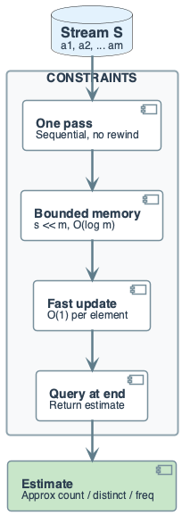

---

## Batch vs Stream

- **Batch:** finite input, full recomputation possible.
- **Stream:** unbounded input, incremental state updates.
- Batch optimizes throughput; stream optimizes freshness.
- Many systems combine both modes.

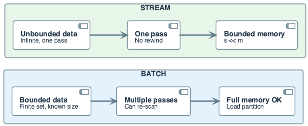

---

## Why Approximation Is Needed

- Exact distinct counting requires large state at scale.
- Exact per-key frequency for huge domains is expensive.
- Latency targets conflict with heavy exact structures.
- Approximate sketches trade tiny error for major savings.

---

## Error Framework & Counting

---

## Simple Counting

- **Naïve:** `counter += 1` for each element → space $O(\log n)$ bits for count $n$.
- For very large $n$, even $O(\log n)$ may not fit.
- Need **approximate counting** with smaller state.

---

## Error Framework

$$
P(|\hat{X} - X| \le \epsilon X) \ge 1-\delta
$$

- **$\epsilon$:** error tolerance.
- **$\delta$:** failure probability.
- Smaller error / tighter confidence → more memory.
- Core tuning contract for sketches.

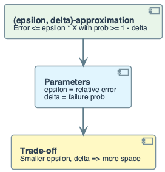

---

## Morris Counter

---

## Algorithm 1: Morris Counter — Goal & Idea

- **Goal:** Given stream $a_1, a_2, \ldots, a_n$, estimate $n$ with sub-linear space.
- **Idea:** Track $\log n$ instead of $n$ → use $O(\log\log n)$ bits instead of $O(\log n)$.

---

## Morris Counter: Algorithm

- Initialize $X = 0$.
- When item arrives: increment $X$ by 1 with **probability** $2^{-X}$.
- **Output:** $\hat{n} = 2^X - 1$.
- **Key:** $E[2^X] = n + 1$ (unbiased in log space).

---

## Morris Counter: Properties & Trace

- **Variance:** $V[2^X] = n^2$ (high — single estimator is noisy).
- **Memory:** $X \approx \log n$ → $O(\log\log n)$ bits.
- **Trace example:** Stream of eight 1's → $X$ evolves 0→1→1→2→2→2→2→3, estimate $2^3-1=7$.

---

## Morris Counter: Why Naïve Version Fails

- Chebyshev: $P(|X - \mu| \ge \epsilon n) \le \frac{\sigma^2}{\mu^2\epsilon^2} = \frac{n^2}{\epsilon^2 n^2} = \frac{1}{\epsilon^2}$.
- For $(\epsilon,\delta)$-approximation we need $\frac{1}{\epsilon^2} < \delta$.
- Example: $\epsilon = 0.1$ ⇒ $\delta > 100$ (impossible).
- **Single estimator has too high variance** → need multiple estimators.

---

## Morris Counter: Beta Version — Idea & Algorithm

- **Idea:** Maintain $s$ independent counters; average results to reduce variance.
- Initialize each $X_i = 0$.
- On arrival: increment each $X_i$ by 1 independently with probability $2^{-X_i}$.
- **Output:** $\frac{1}{s} \sum_i (2^{X_i} - 1)$.

---

## Morris Counter: Beta Version — Variance & Sizing

- **Variance reduction:** $V[\text{avg}] = \frac{n^2}{s}$ (by independence).
- Chebyshev: $P(|\hat{n} - n| \ge \epsilon n) \le \frac{1}{s\epsilon^2}$.
- For probability $< \delta$: need $s \ge \frac{1}{\delta\epsilon^2}$.
- **Example:** $\epsilon = \frac{1}{4}$, $\delta = 0.01$ ⇒ $s = 1600$ counters.

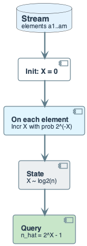

---

## Distinct Count ($F_0$)

---

## Data Streams and Frequency Moments

- Stream of $m$ elements from domain $\{1,2,\ldots,n\}$: $\langle x_1, x_2, \ldots, x_m \rangle$.
- **Frequency:** $f_a$ = number of times $a$ appears.
- **Moments:** $F_0$ = distinct count; $F_1 = \sum_a f_a$ = total count; $F_2 = \sum_a f_a^2$ (not covered here).

---

## Counting Distinct Elements ($F_0$)

- **Use case:** How many unique rows? (DISTINCT in SQL.)
- **Exact:** Hash table → size $\Omega(n)$ for $n$ distinct elements.
- **Goal:** Small sketch with approximate distinct count.

---

## Algorithm 2: Flajolet-Martin — Idea & Example

- **Idea:** Hash elements; count **trailing zeros** in binary hash; max relates to distinct count.
- For each element $a$: compute $h(a)$, count trailing zeros $r_i$.
- **Output:** $2^{\max_i r_i}$.
- **Example:** Stream $\langle 1,3,5,7,5,2,7 \rangle$; $h(x)=3x+1 \bmod 5$ → hashes 4,0,1,2,1,2,2 → max trailing zeros = 2 → estimate $2^2 = 4$ (true distinct = 5).

---

## Flajolet-Martin: Single Estimator Problem

- **Single estimator:** $E[X] = \frac{1}{n+1}$, $V[X] = \frac{n}{(n+1)^2(n+2)}$ — too noisy.
- Need multiple hashes and averaging (like Morris Beta).

---

## Flajolet-Martin: Final Version (Multiple Hashes)

- Run FM with $q$ independent random hash functions → $X_1,\ldots,X_q$.
- $Z = \frac{1}{q}\sum_i X_i$; output $\frac{1}{Z} - 1$.
- **Variance:** $V[Z] = \frac{1}{q} \cdot \frac{n}{(n+1)^2(n+2)}$.
- For $(\epsilon,\delta)$: need $q \ge \frac{1}{\delta\epsilon^2}$.
- **Example:** $\epsilon=0.01$, $\delta=0.1$ ⇒ $q > 100{,}000$.

---

## Algorithm 3: HyperLogLog (Practical Distinct)

- Uses many registers + harmonic mean estimator.
- **Mergeable** across partitions.
- Memory-efficient and production-proven.
- Relative error roughly $1.04 / \sqrt{m}$.

---

## Algorithm 4: Count-Min Sketch (Frequency)

- Estimates **per-key counts** with bounded additive error.
- Fast updates and queries.
- Overestimates due to hash collisions.
- Great for heavy-hitter and traffic monitoring.

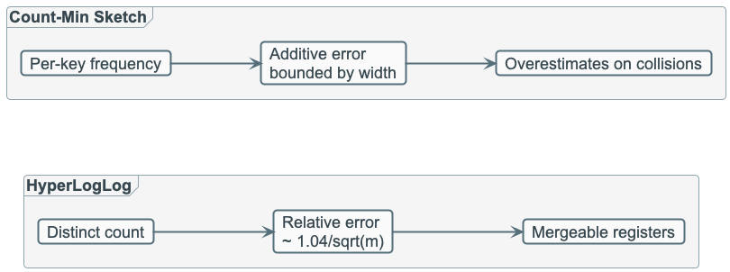{width=88%}

---

## Sketch Selection Guide

- Need **distinct count** → HyperLogLog.
- Need **per-key frequency** → Count-Min Sketch.
- Need **tiny-memory rough count** → Morris-style.
- Need **mergeability** across shards → HLL or CMS.

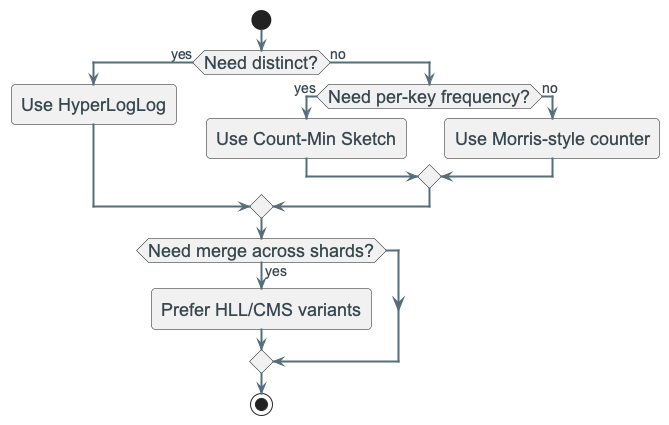{width=74%}

---

## Windows & Time Semantics

---

## Window Semantics

- **Tumbling:** fixed non-overlapping windows.
- **Sliding:** overlapping windows with finer cadence.
- **Session:** user/activity gap-based windows.
- Window choice defines state size and business meaning.

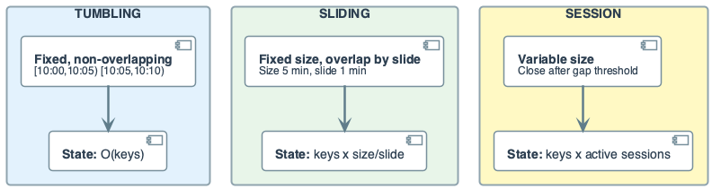

---

## Event Time vs Processing Time

- **Event time:** when the event actually happened.
- **Processing time:** when the system saw it.
- Event time yields **replay-stable** results.
- Processing time is simpler but less deterministic.

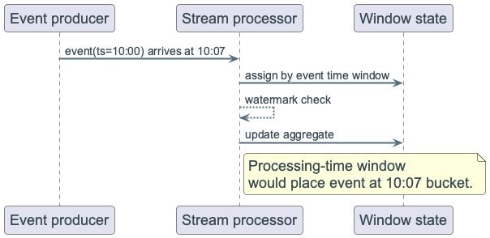{width=86%}

---

## Watermarks and Late Data

- **Watermark:** approximates "no more data before this time."
- **Aggressive** watermark → lower latency, more late data dropped.
- **Conservative** watermark → better completeness, more delay.
- Tune from SLA and lateness distribution.

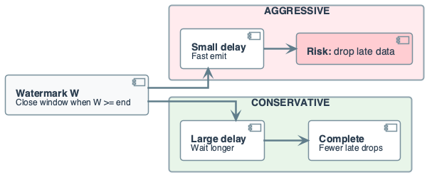

---

## Reliability & Production

---

## Delivery Guarantees

- **At-most-once:** may lose; no duplicates.
- **At-least-once:** no loss; duplicates possible.
- **Exactly-once:** strongest semantics; more complexity.
- Most systems use at-least-once + **idempotent sink** logic.

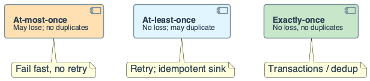

---

## Idempotent Sink Pattern

- Sink key includes **window + business key**.
- Writes are upserts/merge-safe.
- Retries replay safely without double counting.
- Essential for reliable production reprocessing.

---

## State Sizing Intuition

- State grows with **keys × active windows × value size**.
- Sliding/session windows can grow state quickly.
- Watermark and TTL policies bound state.
- Monitor checkpoint duration and state growth trends.

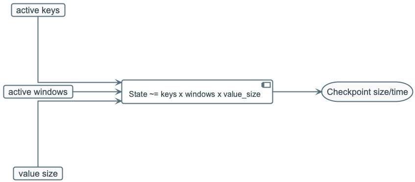{width=82%}

---

## Failure Modes

- Unbounded late data inflates state.
- Incorrect watermark drops valid events.
- Consumer lag causes stale outputs.
- Sketch parameter mis-sizing causes poor accuracy.

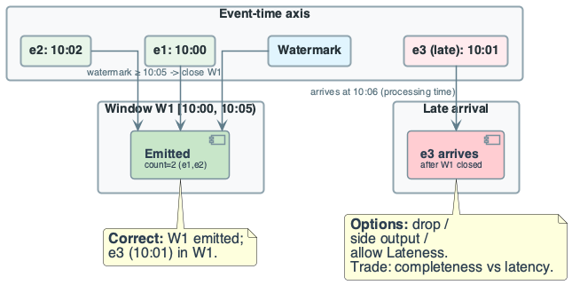

---

## Monitoring Signals

- Consumer lag and throughput.
- Late event percentage.
- State size and checkpoint time.
- Accuracy drift from sampled exact comparisons.

---

## Engineering Checklist

- Are event-time and watermark policies explicit?
- Is sink idempotent under retries?
- Are sketch params derived from $\epsilon$/$\delta$ goals?
- Are state growth and lag alerts configured?

---

## Recap

- Streaming systems optimize freshness under bounded resources.
- Approximation algorithms make large-scale queries feasible.
- Correctness depends on windowing, time semantics, and idempotency.
- Next: feature engineering pipelines for ML and analytics.

---

## Instructor Notes: Flow & Common Mistakes

- **Flow:** Probability prerequisites (expectation, variance, tail bounds, collision) → approximation formalism → stream model → Morris → Flajolet-Martin → HLL/CMS → windows & time → delivery & idempotency → failure modes & checklist.
- **Common mistakes:** Confusing event time vs processing time; ignoring variance when sizing Morris/FM; treating sketches as exact; forgetting idempotent sink for exactly-once semantics.

---

## Instructor Notes: Blackboard Flow

1. Derive collision bound from balls-and-bins + Bernoulli.
2. Walk Morris: single counter (high variance) → average of $s$ counters (sizing $s \ge 1/(\delta\epsilon^2)$).
3. Sketch FM idea (trailing zeros → distinct estimate); then HLL/CMS selection.
4. Draw event time vs processing time; watermark tradeoff; idempotent sink key (window + business key).
