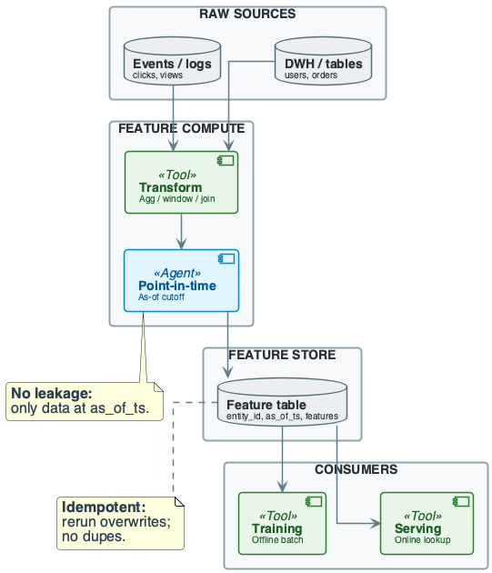
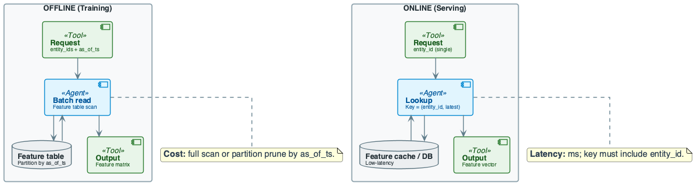
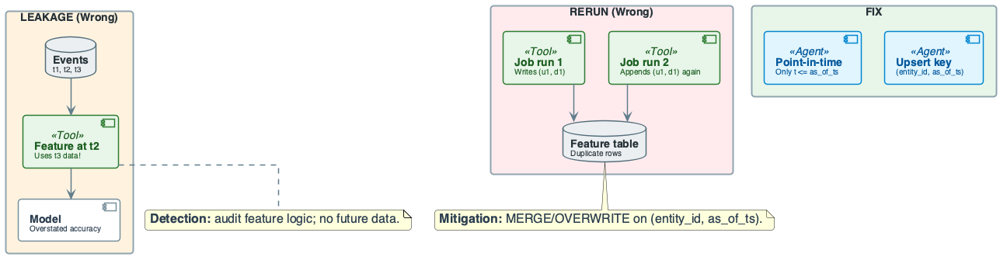
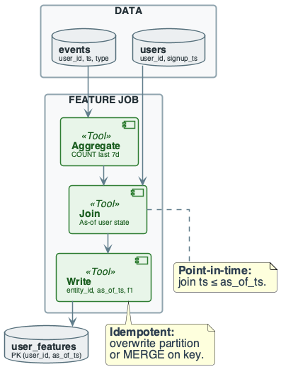

# Week 11: Feature Engineering for Data Systems

## Purpose
- Features are derived inputs for models and analytics
- Pipelines must be correct at scale
- Leakage and train/serve skew cause silent failures

## Learning Objectives
- Define feature, feature pipeline, and feature store
- Apply point-in-time correctness: no future data for given timestamp
- Distinguish offline (batch) vs online (serving) feature computation
- Design idempotent feature jobs: key = (entity_id, as_of_ts)
- Identify and mitigate data leakage and train/serve skew
- Reason about cost: compute, storage, freshness, join size

## The Real Problem This Lecture Solves

## Model Accuracy Collapse
- Team trained model on "clicks in last 7 days" without as_of_ts
- Each row used all events up to "today"
- At serving time, only past data was available

## Root Cause
- Train had future data; serve sees past only
- **Data leakage:** no point-in-time correctness
- **Takeaway:** bad feature pipelines break production models

## The System We Are Building

## Domain Overview
- **Domain:** user engagement features for recommender
- Clicks, views feeding training and online serving
- **Raw source:** events (event_id, user_id, event_ts, event_type)
- Partitioned by date; ~100M rows/day

## Pipeline Design
- **Feature compute:** point-in-time aggregation
- E.g. clicks_7d per user per as_of_ts
- Key = (user_id, as_of_ts)
- **Target:** user_features (user_id, as_of_ts, clicks_7d, …)
- **Consumers:** training (batch); serving (lookup)

## Point-in-Time Correctness
- Feature for entity \(e\) at time \(t\) uses only historical data
$$
f(e,t) = g(\{x \mid x.\text{entity}=e,\ x.\text{ts} \le t\})
$$
- Interpretation: no future leakage into features
- Engineering implication: joins must use as_of_ts filters
- Training and serving should match
$$
f_{\text{train}}(e,t) = f_{\text{serve}}(e,t)
$$
- Interpretation: same definition across offline and online
- Engineering implication: shared feature definitions prevent skew

## Formal Aggregation at Scale
- Windowed count feature for entity \(e\) at time \(t\)
$$
\text{count}_{w}(e,t) = \sum_{x \in D} \mathbf{1}[x.e=e,\ t-w < x.\text{ts} \le t]
$$
- Interpretation: aggregation over a bounded time window
- Engineering implication: window size controls cost and freshness

## Approximate Aggregation and Error Trade-offs
- For large \(D\), sample with rate \(p\) to estimate counts
$$
\widehat{\text{count}}_{w}(e,t) = \frac{1}{p} \sum_{x \in S} \mathbf{1}[x.e=e,\ t-w < x.\text{ts} \le t]
$$
- Interpretation: unbiased estimate; variance grows as \(1/p\)
- Engineering implication: lower cost, higher noise; pick \(p\) by SLA

## Diagram Manifest
- Slide 15 → week11_lecture_slide08_feature_pipeline_overview.puml
- Slide 21 → week11_lecture_slide12_execution_flow.puml
- Slide 23 → week11_lecture_slide16_failure_leakage_rerun.puml

## Core Concepts (1/2)
- **Feature:** numeric or categorical input derived from raw data
- Consumed by model or analytics
- **Feature pipeline:** raw sources → transform → feature table
- **Point-in-time (as-of):** for given as_of_ts, use only data with ts ≤ as_of_ts

## Core Concepts (2/2)
- **Offline features:** batch-computed; stored with (entity_id, as_of_ts)
- Used for training
- **Online features:** low-latency lookup by entity_id
- Often latest snapshot or real-time compute
- **Train/serve consistency:** same definition and data availability

## Data Context: Events → User Features
- events: (user_id, event_ts, event_type)
- user_features key = (user_id, as_of_ts)
- Goal: clicks_7d, views_7d per as_of_ts

## In-Lecture Exercise 1: Point-in-Time Correctness
- Define point-in-time correctness
- Why does it prevent data leakage?

## In-Lecture Exercise 1: Solution (1/2)
- Use only events with event_ts ≤ as_of_ts
- Feature value reflects knowledge at that time

## In-Lecture Exercise 1: Solution (2/2)
- Prevents future events from leaking into training
- Keeps train and serve distributions aligned

## In-Lecture Exercise 1: Takeaway
- Point-in-time filtering is non-negotiable for features

## What Breaks at Scale
- **Leakage at scale:** large event tables joined without as_of_ts
- Accidental use of future data; hard to audit
- **Duplicate rows:** append-only writes on rerun
- **Schema drift:** new features added; old consumers expect old schema

## Cost of Naïve Design (Feature Engineering)

## No as_of_ts in Joins
- "Clicks in last 7 days" computed with all events up to today
- Train sees future; serve sees past only
- Model accuracy collapses in production
- **Cost:** silent wrong predictions

## Append-only on Rerun
- Job writes (user_id, as_of_ts, clicks_7d) with INSERT
- Rerun appends same keys ⇒ duplicate rows
- ⇒ wrong aggregates and broken backtests
- **Sink must MERGE or partition overwrite**

## Train/Serve Skew
- Offline definition differs from online
- Different window or different source
- Model sees different distribution at serve time

## Engineering Rule
- Key = (entity_id, as_of_ts)
- Every join filtered by ts ≤ as_of_ts
- MERGE or overwrite so rerun does not duplicate

## In-Lecture Exercise 3: Incremental Feature Job
- Read last_as_of_ts from control table
- Compute features for next as_of_ts only
- MERGE into user_features
- Update control only after success

## In-Lecture Exercise 3: Solution (1/2)
- last_as_of_ts = control.last_as_of_ts
- new_as_of_ts = last_as_of_ts + 1 day
- Compute features with ts ≤ new_as_of_ts

## In-Lecture Exercise 3: Solution (2/2)
- MERGE on (user_id, as_of_ts)
- Update control after commit to avoid gaps

## In-Lecture Exercise 3: Takeaway
- Incremental runs reduce cost and avoid reprocessing
- Control tables must advance only on success

## Formal Model: Feature as Function
- Let x = f(raw; t): feature value at time t
- Depends only on raw data up to t
- **No leakage:** f must not use any event with timestamp > t
- **Idempotent write:** writing twice yields one row
- Key = (entity_id, as_of_ts)

## Leakage as Assumption Violation
- Assumption: all feature inputs satisfy ts ≤ as_of_ts
- Leakage occurs if any input violates this constraint
- Interpretation: model sees future evidence during training
- Engineering implication: treat leakage as a correctness bug

## Architectural Fork: Offline vs Online

## Offline Features
- Batch job computes for many (entity_id, as_of_ts)
- Write to feature table
- Training reads by as_of_ts range

## Online Features
- Serving requests one entity_id
- Lookup (entity_id, latest) or compute in real time
- Latency ms
- **Decision rule:** use offline for training; online for real-time APIs

## Architectural Fork: MERGE vs Append

## MERGE/OVERWRITE
- On (entity_id, as_of_ts): rerun overwrites same key
- One row per key; idempotent

## Append-only
- Rerun inserts again; duplicate rows per key
- Training and joins wrong
- **Decision rule:** always key by (entity_id, as_of_ts); use MERGE

## In-Lecture Exercise 2: Idempotent Feature Write
- Feature rows with key (user_id, as_of_ts)
- Write to user_features without duplicates on rerun
- What MERGE behavior is required?

## In-Lecture Exercise 2: Solution (1/2)
- MERGE on (user_id, as_of_ts) as the key
- When matched: update clicks_7d, views_7d

## In-Lecture Exercise 2: Solution (2/2)
- When not matched: insert new row
- Rerun writes overwrite the same key

## In-Lecture Exercise 2: Takeaway
- Idempotent writes are mandatory for backtests and reruns

## Running Example — Data & Goal
- **Source:** events (event_id, user_id, event_ts, event_type)
- **Sample:** (1, 101, '2025-12-01 10:00', 'click')
- (2, 101, '2025-12-02 14:00', 'view')
- (3, 102, '2025-12-01 09:00', 'click')
- **Goal:** one row per (user_id, as_of_ts) with clicks_7d

## Running Example — Step-by-Step (1/4)
- **Step 1:** For each (user_id, as_of_ts)
- Select events where event_ts ≤ as_of_ts AND event_ts > as_of_ts - 7d
- Filter event_type = 'click'; count per user_id

## Running Example — Step-by-Step (2/4)
- **Step 2:** Generate (user_id, as_of_ts) grid
- Join to event counts; fill 0 where no clicks
- Point-in-time count for each (user_id, as_of_ts)
- Ensures every combination has a row

## Running Example — Step-by-Step (3/4)
- **Step 3:** Write to feature table
- (user_id, as_of_ts, clicks_7d); key = (user_id, as_of_ts)
- MERGE INTO user_features ON (user_id, as_of_ts)
- WHEN MATCHED THEN UPDATE
- WHEN NOT MATCHED THEN INSERT
- Partition by as_of_ts for efficient reads

## Running Example — Step-by-Step (4/4)
- **Output:** feature table with one row per (user_id, as_of_ts)
- clicks_7d correct as of that time
- **Trade-off:** full scan of events per as_of_ts window
- Optimize with partitioned reads and incremental aggregation
- **Conclusion:** point-in-time filter + key gives correct features

## Cost & Scaling Analysis (1/3)
- **Time model:** T ∝ |events| × |as_of_ts grid| for naive
- Reduce by partition pruning on event_ts and as_of_ts
- **Incremental:** recompute only new as_of_ts dates
- **Example:** 100M events/day × 365 as_of_ts → naive 36.5B scans

## Cost & Scaling Analysis (2/3)
- **Memory / storage:** feature table size ≈ N_entity × N_as_of × bytes/row
- Partition and compress
- **Retention:** keep as_of_ts range needed for training backtest
- Archive old partitions
- **Example:** 10M users × 365 days × 100 B ≈ 365 GB

## Cost & Scaling Analysis (3/3)
- **Request flow:** offline = batch read by (entity_ids, as_of_ts range)
- Online = key lookup (entity_id, latest)

- **Latency:** offline dominated by scan; online requires index/cache

## Pitfalls & Failure Modes (1/3)
- **Leakage:** using future data when computing feature for as_of_ts
- Model sees "answer" in training
- **Detection:** audit feature SQL/logic
- No table joined without ts ≤ as_of_ts filter

## Pitfalls & Failure Modes (2/3)
- **Rerun duplicates:** job writes with INSERT; rerun appends same keys
- Training sees double rows
- **Failure:** duplicate rows per (entity_id, as_of_ts)
- ⇒ wrong aggregates and broken backtests

## Pitfalls & Failure Modes (3/3)
- **Mitigation:** write with MERGE/OVERWRITE on (entity_id, as_of_ts)
- Or partition overwrite per as_of_ts
- **Schema drift:** new feature column; old jobs still write old schema
- Detection: schema checks and lineage; version feature definitions

## Monitoring Signals for Leakage and Drift
- **Train/serve parity:** compare feature distributions by time
- **Future leakage test:** shift as_of_ts forward and re-run
- **Freshness lag:** now − latest as_of_ts in table
- **Duplicate key rate:** violations per (entity_id, as_of_ts)
- **Null spike:** sudden rise in missing feature values

## Best Practices (1/2)
- Always key feature table by (entity_id, as_of_ts)
- Enforce as_of_ts in every join and filter
- Use partition overwrite or MERGE for idempotency
- Document feature definitions and lineage
- Test with known dates and spot-check for leakage
- Separate offline and online paths; align definitions

## Best Practices (2/2)
- Retain as_of_ts range needed for backtests
- Archive old partitions to control storage cost
- Validate schema and nullability when adding features
- Monitor feature freshness and job success
- Alert on duplicate key violations
- Prefer incremental feature compute when event volume is large

## Recap — Engineering Judgment
- **Point-in-time is non-negotiable:** no data with ts > as_of_ts
- Leakage breaks production models
- Audit every feature SQL for as_of_ts
- **Key = (entity_id, as_of_ts):** MERGE or partition overwrite
- Append-only ⇒ duplicates ⇒ wrong training
- **Offline vs online:** same definition in both paths
- Train/serve skew ⇒ silent drift
- **Failure modes:** leakage, rerun duplicates, schema drift

## Pointers to Practice
- Compute features from events table with point-in-time aggregation
- Write SQL for feature table and idempotent upsert
- Reason about rerun and leakage
- Cost: estimate feature table size and join/scan cost

## Additional Diagrams
### Practice: Reasoning Feature Flow

