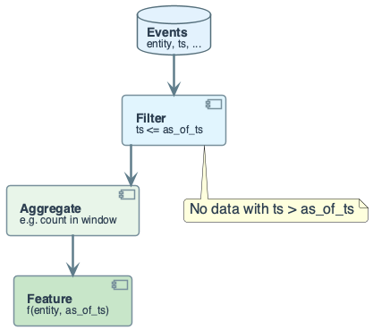
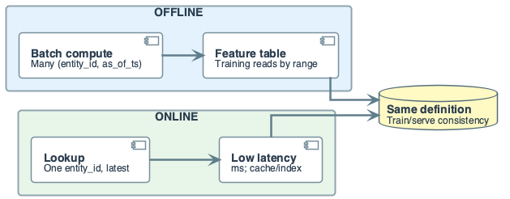
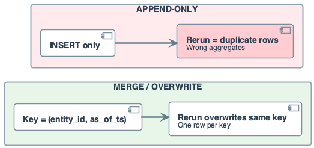
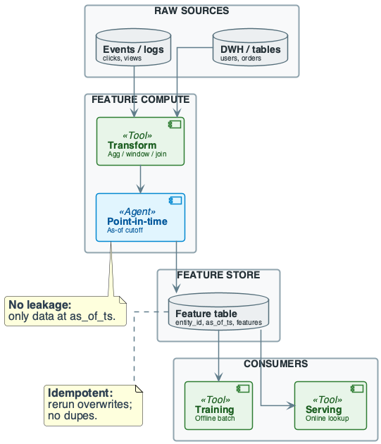
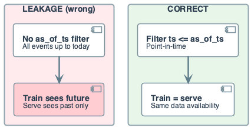

# Week 11: Feature Engineering for Data Systems

## Purpose
- Build reliable features for training and real-time inference
- Prevent leakage and train/serve mismatch
- Scale feature computation with reproducible, idempotent pipelines

## Learning Objectives
- Define feature entities, feature tables, and point-in-time joins
- Design offline and online feature paths with shared logic
- Implement idempotent writes using stable feature keys
- Detect leakage, skew, freshness gaps, and schema drift

## Why This Lecture Matters
- Feature bugs often look like model problems
- Leakage can inflate offline metrics and fail in production
- Train/serve mismatch causes silent quality degradation
- Correctness must be enforced at data-pipeline level

## Core Feature Contract
- Feature row must include entity key + `as_of_ts`
- Feature values can only use events at or before `as_of_ts`
- Writes must be idempotent for reruns and backfills
- Definitions must be versioned and discoverable

## Point-in-Time Correctness
$$
f(e,t)=g(\{x \mid x.entity=e,\ x.ts \le t\})
$$
- No future data beyond feature timestamp
- Same rule for training and serving
- Violations are correctness bugs, not minor quality issues

## Train/Serve Consistency Rule
$$
f_{train}(e,t)=f_{serve}(e,t)
$$
- Shared definitions prevent distribution mismatch
- Different windows/sources create skew immediately
- Keep one source of truth for feature logic

## Feature Architecture
- Raw events/logs in historical store
- Batch jobs build offline feature table by `(entity_id, as_of_ts)`
- Online store serves latest/nearline values by `entity_id`
- Feature registry tracks definitions and versions

## Running Domain
- Events: `(event_id, user_id, event_ts, event_type)`
- Feature target: `(user_id, as_of_ts, clicks_7d, views_7d, ...)`
- Typical volume: large append-only event stream
- Use date partitioning for scan control

## Running Example: clicks_7d
- For each `(user_id, as_of_ts)`, count clicks in `(t-7d, t]`
- Filter with `event_ts <= as_of_ts`
- Persist one row per feature key
- Fill missing aggregates with defaults (e.g., 0)

## Feature Key and Write Semantics
- Primary key: `(entity_id, as_of_ts)`
- Use `MERGE`/upsert or partition overwrite
- Never plain append on reruns
- Enforce uniqueness checks in pipeline tests

## Pipeline Steps
- Build as-of grid (entities x timestamps)
- Compute windowed aggregates from events
- Join aggregates back to as-of grid
- Write idempotently to feature table

## Main Failure Mode: Leakage
- Feature query omits `event_ts <= as_of_ts`
- Training uses future events unintentionally
- Offline metrics look great; production drops
- Often missed without explicit leakage tests

## Main Failure Mode: Duplicate Rows
- Rerun appends same keys again
- Downstream joins/aggregations double-count
- Backtests become unreliable
- Fix with merge semantics and uniqueness constraints

## Main Failure Mode: Train/Serve Skew
- Different code paths or source timing
- Online features lag while offline is fresh
- Model input distribution diverges
- Requires parity monitoring and shared definitions

## Schema Drift Risks
- New column added without consumer coordination
- Old jobs continue writing incompatible schema
- Missing/null features increase unexpectedly
- Use versioned schemas and contract checks

## Cost and Scaling Intuition
- Naive recomputation scans too much history
- Partition prune by event date and as-of date
- Incremental as-of updates reduce daily cost
- Storage grows with entities x as-of timestamps

## Storage Sizing Formula
$$
\text{feature\_storage} \approx N_{entities} \times N_{asof} \times bytes\_per\_row
$$
- Retention policy controls cost
- Keep only history needed for training windows

## Incremental Compute Pattern
- Track latest completed `as_of_ts` in control table
- Process new timestamps only
- Update control table after successful write
- Backfills run explicit ranges separately

## Monitoring Signals
- Duplicate key violations
- Train-vs-serve feature distribution drift
- Freshness lag: now minus latest `as_of_ts`
- Null-rate spikes by feature

## Quality Guardrails
- Unit tests for feature SQL logic
- Leakage tests with shifted timestamps
- Replay tests for idempotent reruns
- Contract tests for schema/version compatibility

## Engineering Checklist
- Is every feature keyed by entity + `as_of_ts`?
- Does every join enforce point-in-time filter?
- Are writes merge-safe under retries?
- Are train and serve definitions generated from same source?

## Best Practices
- Treat feature engineering as data product development
- Centralize feature definitions and lineage
- Prefer deterministic transforms with explicit windows
- Make failure detection automatic, not manual

## Recap
- Point-in-time correctness is non-negotiable
- Feature key + idempotent writes prevent corruption
- Train/serve parity is as important as model quality
- Next: advanced multi-step feature DAGs and backfills
