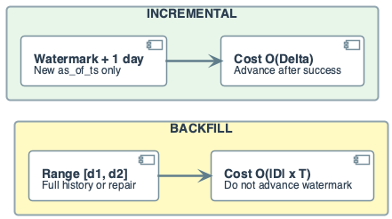
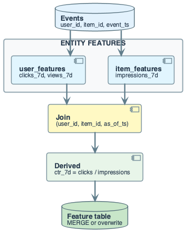
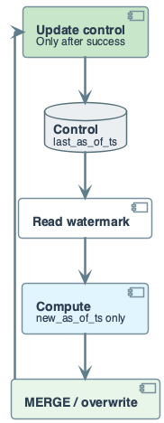
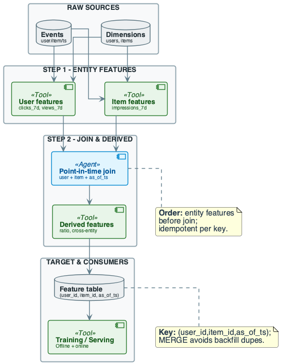
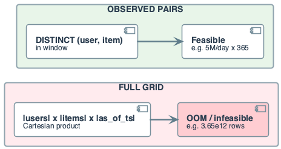
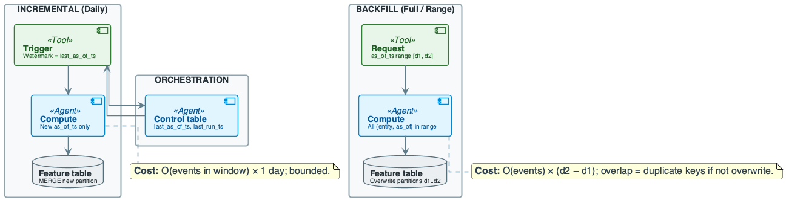
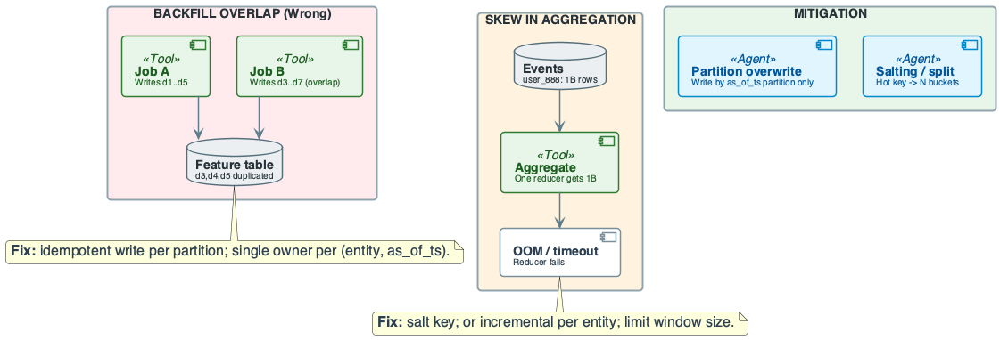
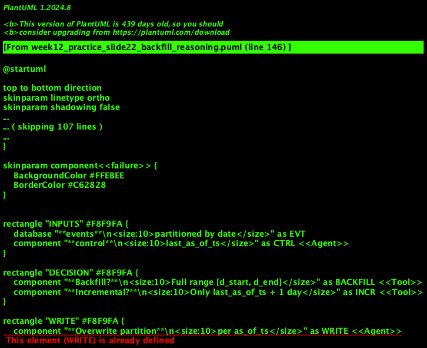

# Week 12: Advanced Feature Engineering Pipelines

## Purpose
- Multi-step feature pipelines (DAGs) are the norm in production
- Ordering and idempotency matter
- Backfill vs incremental trade-offs drive cost and correctness

## Learning Objectives
- Define advanced feature pipeline: multi-step DAG
- Distinguish backfill from incremental; state when to use each
- Design idempotent writes for backfill: partition overwrite or MERGE
- Reason about cost: full recompute vs incremental; join cardinality
- Identify failure modes: backfill overlap, aggregation skew
- Apply orchestration rules: control table updated only after success

## The Real Problem This Lecture Solves

## Production Failure
- Two teams ran backfills for same as_of_ts range
- Both used INSERT ⇒ duplicate rows per (user_id, item_id, as_of_ts)
- Training saw double counts; model metrics invalid

## Root Cause
- Backfill overlap without partition overwrite or MERGE
- Full (user × item × as_of_ts) grid join ⇒ OOM
- Hot entity in aggregation ⇒ straggler

## Takeaway
- Advanced pipelines multiply failure modes
- Idempotent backfill and single owner per partition

## The System We Are Building

## Domain Overview
- **Domain:** multi-entity feature table (user × item × as_of_ts)
- Entity features (user clicks_7d, item impressions_7d)
- → join → derived (ctr_7d)
- Same lineage as Week 11, now with multiple entities

## Pipeline Design
- **Sources:** events (user_id, item_id, event_ts)
- user_features and item_features (point-in-time)
- **Compute:** entity features per (entity_id, as_of_ts)
- Join; derived ctr_7d; MERGE or partition overwrite
- **Orchestration:** incremental = watermark; backfill = explicit range

## Backfill vs Incremental Cost
- Let \(|D|\) be data per day, \(T\) days in a backfill
$$
\text{Work}_{\text{backfill}} = O(|D| \cdot T)
$$
- Interpretation: cost grows linearly with history length
- Engineering implication: schedule backfills off-peak
- Incremental load on new data \(|\Delta|\)
$$
\text{Work}_{\text{incr}} = O(|\Delta|)
$$
- Interpretation: steady-state cost depends on new data only
- Engineering implication: incremental is the production default

## Core Concepts
- **Advanced feature pipeline:** DAG of steps
- Raw → entity features (user, item) → join → derived → feature table
- **Entity feature:** computed per (entity_id, as_of_ts)
- E.g. user clicks_7d, item impressions_7d
- **Derived feature:** computed from other features
- E.g. ratio, cross-entity signal

## Core Concepts
- **Backfill:** compute features for a range of as_of_ts
- Full history or [d_start, d_end]; one-time or repair
- **Incremental:** compute only new as_of_ts
- E.g. last_as_of_ts + 1 day; daily job
- Watermark in control table

## Core Concepts
- **Idempotent backfill:** writing same range twice yields one row per key
- Use partition overwrite or MERGE
- **Single owner per partition:** only one job writes a given as_of_ts
- Prevents duplicate keys from overlapping backfills
- **What breaks:** backfill overlap → duplicates; skew → OOM

## Data Context: User–Item Features
- Key = (user_id, item_id, as_of_ts)
- Backfill = range of as_of_ts; incremental = next day
- Writes via MERGE or partition overwrite

## Cost of Naïve Design (Advanced Pipelines)

## Backfill with INSERT
- Two jobs write same as_of_ts range
- ⇒ duplicate rows per (user_id, item_id, as_of_ts)
- ⇒ wrong aggregates and broken training

## No Partition Overwrite
- Incremental and backfill both write same partition without overwrite
- ⇒ overlap ⇒ duplicates
- **Single owner per partition and MERGE are non-negotiable**

## Full Grid Join
- |users| × |items| × |as_of_ts| rows
- E.g. 10M × 1M × 365 ⇒ 3.65e12 rows ⇒ OOM
- **Restrict grid to observed (user, item) pairs in window**

## Hot Entity in Aggregation
- One user or item gets most events
- ⇒ one partition/reducer overloaded
- **Mitigation:** salt hot keys or limit window

## Watermark and Control Table

## Watermark
- last_as_of_ts stored in control table
- Incremental job computes only as_of_ts > last_as_of_ts
- E.g. +1 day

## Update Rule
- Update last_as_of_ts **only after** successful write
- Otherwise next run skips that as_of_ts (gap)
- **Backfill:** does not advance watermark

## Partition Overwrite Semantics
- Write step writes only to partition p = as_of_ts
- Rerun overwrites same partition p
- **Idempotent:** same partition overwritten; no append
- **Overlap fix:** two backfill jobs both overwrite
- Final state = second run (deterministic if same logic)

## Formal Model: Pipeline as DAG
- Steps S_1, ..., S_k; each reads from sources or prior steps
- Outputs to next step or feature table
- **Ordering:** entity features before join; join before derived
- **Correctness:** every step respects point-in-time
- Write key = (entity_id, as_of_ts) or composite

## Formal Model: Idempotent Write
- **Idempotent:** writing for key k twice yields one row for k
- **MERGE:** ON target.key = source.key
- WHEN MATCHED UPDATE; WHEN NOT MATCHED INSERT
- **Partition overwrite:** write only to partition p; rerun overwrites p

## Running Example — Schema & Sample

## Schema
- **events:** event_id, user_id, item_id, event_ts, event_type
- Partitioned by date(event_ts)
- **user_features:** user_id, as_of_ts, clicks_7d, views_7d
- **item_features:** item_id, as_of_ts, impressions_7d
- **feature_table:** user_id, item_id, as_of_ts, ..., ctr_7d

## Sample Events
- (1, 101, 201, '2025-12-01 10:00', 'click')
- (2, 101, 201, '2025-12-02 14:00', 'view')
- (3, 102, 201, '2025-12-01 09:00', 'click')

## Running Example — Data & Goal
- **Sources:** events (event_id, user_id, item_id, event_ts, event_type)
- users (user_id, signup_ts); items (item_id, created_ts)
- **Goal:** feature table (user_id, item_id, as_of_ts, ..., ctr_7d)
- **Engineering objective:** point-in-time; idempotent backfill/incremental

## Running Example — Step-by-Step
- **Step 1:** Compute user features
- (user_id, as_of_ts, clicks_7d, views_7d) from events
- event_ts ≤ as_of_ts and 7d window
- **Step 2:** Compute item features
- (item_id, as_of_ts, impressions_7d); same point-in-time

## Running Example — Step-by-Step
- **Step 3:** Generate (user_id, item_id, as_of_ts) grid
- From distinct user-item pairs and as_of_ts dates
- Join user features and item features
- On (user_id, as_of_ts) and (item_id, as_of_ts)
- Fill 0 for missing; compute ctr_7d = clicks_7d / NULLIF(impressions_7d, 0)

## Running Example — Step-by-Step
- **Step 4:** Write to feature table
- Key = (user_id, item_id, as_of_ts)
- **Idempotent:** MERGE ON key
- WHEN MATCHED UPDATE; WHEN NOT MATCHED INSERT
- Or overwrite partition by as_of_ts

## Running Example — Step-by-Step
- **Output:** one row per (user_id, item_id, as_of_ts)
- With clicks_7d, views_7d, impressions_7d, ctr_7d
- **Trade-off:** join size can explode; restrict grid to observed pairs
- **Conclusion:** multi-step pipeline with entity → join → derived → MERGE

## Running Example — Idempotent Write
- **MERGE:** ON (user_id, item_id, as_of_ts)
- WHEN MATCHED UPDATE all feature columns
- WHEN NOT MATCHED INSERT; rerun overwrites same key
- **Partition overwrite:** write only rows for as_of_ts = '2025-12-02'
- Overwrite that partition; rerun overwrites again

## When to Use Backfill vs Incremental

## Incremental
- Daily (or hourly) pipeline; new as_of_ts only
- Low cost; use control table and watermark

## Backfill
- One-time full load; repair after bug
- New feature definition for history; explicit range
- **Rule:** incremental for steady state; backfill for bootstrap/repair

## Backfill vs Incremental Summary

| Aspect | Incremental | Backfill |
|--------|-------------|----------|
| Trigger | Watermark (last + 1 day) | Explicit range [d1, d2] |
| Cost | O(events in window) × 1 day | O(events) × (d2 − d1) |
| Watermark | Advance after success | Do not advance |
| Write | MERGE or overwrite partition | Overwrite partitions d1..d2 |
| Use case | Daily pipeline | Bootstrap, repair |

## Cost & Scaling Analysis
- **Time model (naive):** T ∝ |events| × |as_of_ts| per entity type
- Multiplied by number of entity feature steps
- **Backfill:** T ∝ |events| × (d2 - d1)
- **Incremental:** T ∝ |events in window| × 1; bounded by one day

## Cost & Scaling Analysis
- **Memory / storage:** feature table size ≈ N_user × N_item × N_as_of × bytes
- Often reduced by storing only observed (user, item) per as_of_ts
- **Join cardinality:** grid of all (user, item, as_of_ts) can be huge
- Prefer join only pairs that appear in events for that window

## Join Size Reasoning
- **Full grid:** |users| × |items| × |as_of_ts|
- E.g. 10M × 1M × 365 = 3.65e12 rows (infeasible)
- **Observed pairs:** restrict grid to (user, item) that appear in events
- Typically ≪ full Cartesian product
- **Engineering rule:** build grid from SELECT DISTINCT in window

## Quantitative Cost Comparison
- **Example:** 100M events/day, 365 as_of_ts, 10M users, 1M items
- Naive backfill: 100M × 365 ≈ 36.5B row scans per entity step
- **Incremental (1 day):** 100M × 1 ≈ 100M row scans
- **Join:** full grid 3.65e12; observed pairs ~5M/day × 365 ≈ 1.8e9 (feasible)

## Cost & Scaling Analysis
- **Execution flow (incremental):**
- Read watermark → compute new as_of_ts → MERGE → update watermark
- **Backfill flow:** request range → compute all → overwrite partitions
- No watermark advance

## Pitfalls & Failure Modes
- **Backfill overlap:** two jobs write same as_of_ts range
- Both use INSERT → duplicate rows
- **Impact:** training sees double counts; joins wrong
- **Prevention:** single owner per partition; MERGE or overwrite

## Pitfalls & Failure Modes
- **Aggregation skew:** one entity has orders of magnitude more events
- Single reducer gets 1B rows → OOM or timeout
- **Failure:** job fails or straggler; pipeline blocked

## Pitfalls & Failure Modes
- **Detection:** duplicate key violations; reducer input sizes; duration spikes
- **Mitigation (overlap):** MERGE or overwrite; control table after success
- Backfill jobs use explicit range and overwrite only that range
- **Mitigation (skew):** salt hot keys; limit window; incremental per entity

## Schema Version and Drift
- **Schema drift:** new feature column added; old job writes old schema
- Consumers expect new column → null or mismatch
- **Detection:** schema checks; lineage and version tags
- **Mitigation:** version feature definitions; backfill with new schema

## Best Practices
- Design pipeline as DAG: entity features first, then join, then derived
- Document dependencies
- Key feature table by (entity_id, as_of_ts) or (user_id, item_id, as_of_ts)
- Always MERGE or partition overwrite for idempotency
- Use control table: update only after successful write

## Best Practices
- Limit join size: build grid from observed pairs
- Profile for skew: monitor reducer sizes; add salting for hot entities
- Version feature definitions and schema; validate on write
- Retain as_of_ts range needed for training
- Document backfill and incremental runbooks

## Orchestration Order
- **Step order:** read control → compute entity features → join → derived → write → update control
- **Critical:** update control only after write succeeds
- Otherwise next run skips as_of_ts (gap)
- **Backfill:** no control read; compute range; overwrite partitions

## Detection and Mitigation Summary
- **Overlap:** detection = duplicate key violations
- Mitigation = MERGE or overwrite; single owner per partition
- **Skew:** detection = reducer input size profile
- Mitigation = salting, split hot keys, limit window
- **Gap:** detection = missing as_of_ts in feature table
- Mitigation = update control only after successful write

## Recap — Engineering Judgment
- **Backfill vs incremental:** incremental for steady state; backfill for bootstrap
- Single owner per partition—never two jobs writing same as_of_ts without overwrite
- **Idempotent write is non-negotiable:** MERGE or partition overwrite
- Backfill overlap with INSERT ⇒ duplicates ⇒ wrong training
- **Control table:** update only after successful write
- **Cost levers:** backfill O(events × range); incremental O(events in window)
- Join size = limit grid to observed pairs

## Pointers to Practice
- Build multi-step feature pipeline from events
- Point-in-time aggregation and MERGE
- Design incremental vs backfill: control table, watermark, partition overwrite
- Challenge: backfill overlap scenario and idempotent fix

## Additional Diagrams
### Practice: Backfill Reasoning

