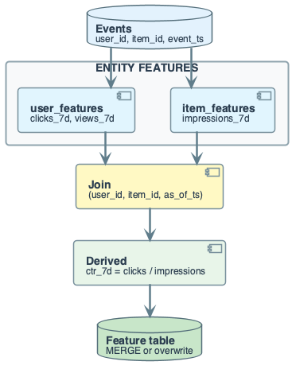
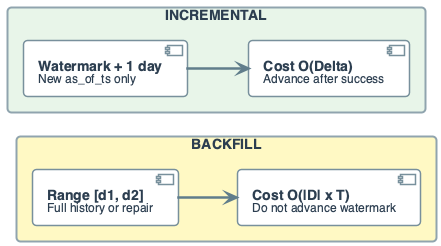
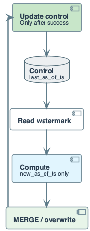
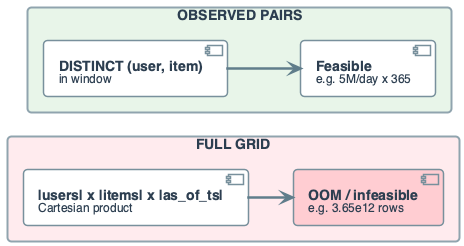
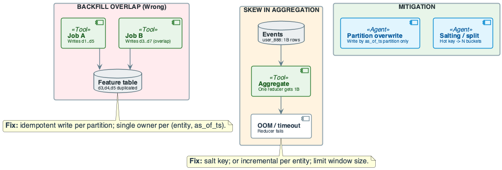
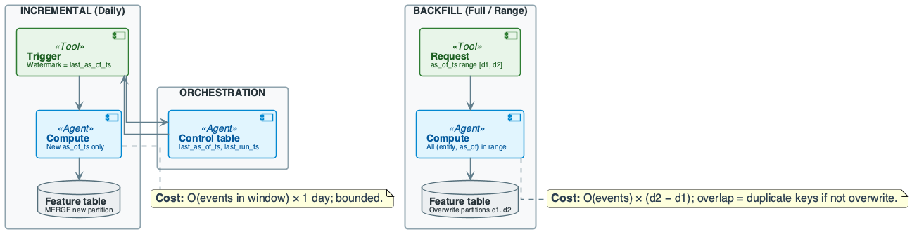

# Week 12: Advanced Feature Engineering Pipelines

## Purpose
- Operate multi-step feature DAGs safely at scale
- Balance backfills, incremental runs, and cost
- Prevent overlap, skew, and orchestration-induced corruption

## Learning Objectives
- Design advanced feature DAGs across multiple entities
- Choose backfill vs incremental execution modes
- Enforce partition ownership and idempotent writes
- Control join explosion and hot-key skew in derived features

## Why This Lecture Matters
- Real pipelines involve many dependent feature steps
- Operational mistakes can corrupt weeks of training data
- Backfills are high-risk without strict write discipline
- Orchestration correctness is as important as SQL logic

## Advanced Pipeline Pattern
- Step A: compute user-level features
- Step B: compute item-level features
- Step C: join entities at aligned `as_of_ts`
- Step D: derive cross-entity features and publish

## Feature Key Strategy
- Composite keys for joined entities
- Typical key: `(user_id, item_id, as_of_ts)`
- Stable key required for idempotent updates
- Partition by `as_of_ts` for replay and pruning

## Backfill vs Incremental
- **Incremental:** process newest timestamp slice only
- **Backfill:** recompute explicit historical range
- Incremental is default for steady-state ops
- Backfill is for bootstrap, repair, or logic changes

## Work Model
$$
Work_{backfill}=O(|D|\cdot T),\quad Work_{incremental}=O(|\Delta|)
$$
- Backfill cost grows with historical range `T`
- Incremental cost tied to new data volume
- Schedule backfills carefully to avoid cluster contention

## Control Table Contract
- Stores last successful incremental watermark
- Read before run, update only after successful publish
- Backfill should not advance incremental watermark
- Gaps appear if control table updates too early

## Idempotent Publish Options
- `MERGE` on composite feature key
- Partition overwrite for targeted `as_of_ts`
- Never append-only for backfills
- Enforce single-writer ownership per partition

## Critical Failure: Overlapping Backfills
- Two jobs write same date range concurrently
- Append semantics create duplicate feature keys
- Training data double-counts and drifts
- Fix via ownership lock + overwrite/merge semantics

## Critical Failure: Join Explosion
- Full Cartesian user-item grid is infeasible
- Costs and memory blow up rapidly
- Build grid from observed pairs only
- Use event-derived candidate sets per window

## Critical Failure: Hot-Entity Skew
- One user/item dominates event volume
- Reducer/partition straggler delays full DAG
- Can trigger spill storms or OOM
- Mitigate with salting and adaptive partitioning

## Running Example
- Sources: events with `user_id`, `item_id`, `event_ts`, type
- User features: `clicks_7d`, `views_7d`
- Item features: `impressions_7d`
- Derived: `ctr_7d = clicks_7d / impressions_7d`

## Pipeline Execution Order
- Load run config (`mode`, range, watermark)
- Build entity features point-in-time
- Join on composite keys + aligned `as_of_ts`
- Publish idempotently, then update control state

## Backfill Safety Rules
- Explicit start/end range required
- Partition lock per `as_of_ts` range
- Dry-run cardinality estimate before execution
- Write verification before marking complete

## Incremental Safety Rules
- Process only timestamps after last successful watermark
- Support replay for failed latest slice
- Keep writes idempotent under retried orchestration
- Alert on missing or duplicated slices

## Cost Levers
- Restrict candidate join set to observed interactions
- Pre-aggregate before entity joins
- Partition-aware scheduling and resource classes
- Limit backfill concurrency by partition groups

## Schema and Version Governance
- Version feature definitions for each DAG release
- Track lineage from raw events to published features
- Compatibility checks before consumer rollout
- Backfill when schema/logic changes historical meaning

## Monitoring Signals
- Duplicate composite key rate
- Partition completion and missing-slice alerts
- Join cardinality trend vs baseline
- Straggler ratio and spill volume by stage

## Operational Checklist
- Is run mode (incremental/backfill) explicit?
- Is partition ownership enforced?
- Are publish steps idempotent?
- Is control-state update post-commit only?

## Best Practices
- Keep DAG modular: entity -> join -> derived -> publish
- Separate orchestration metadata from feature data
- Test overlap and retry scenarios in staging
- Prefer smaller, restartable partitions over giant runs

## Recap
- Advanced feature pipelines fail mostly from ops discipline gaps
- Backfill overlap and join explosion are top risks
- Idempotent publishes + partition ownership are mandatory
- Next: DataOps and production reliability for data platforms
