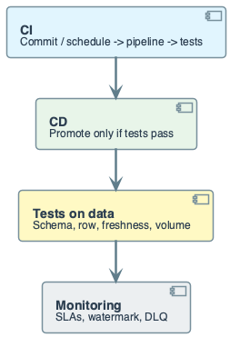
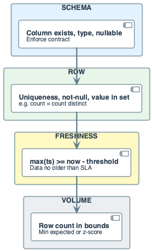
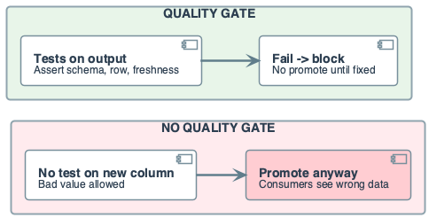
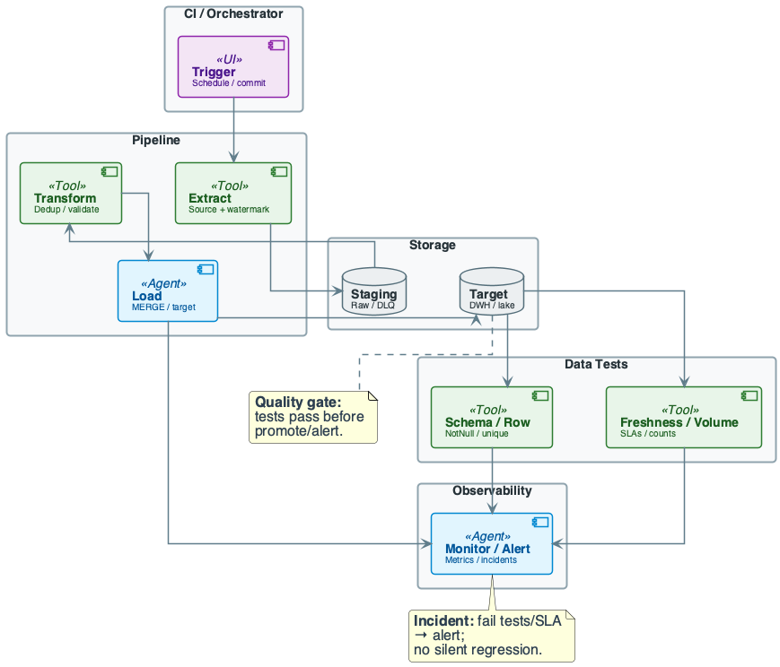
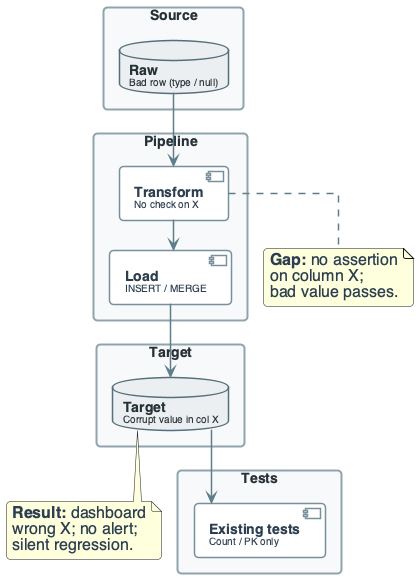
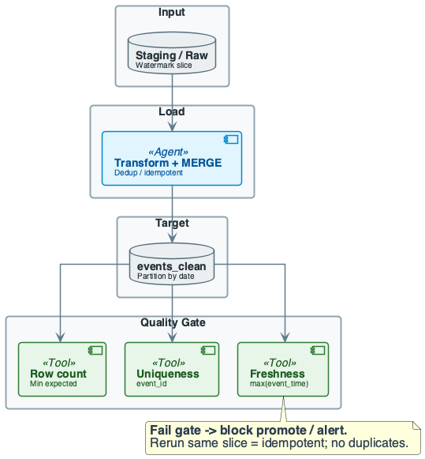

# Week 13: DataOps, Testing, and Data Quality

## Purpose
- DataOps applies DevOps practices to data pipelines
- CI/CD, tests, monitoring
- Bad data or silent regressions break trust

## Learning Objectives
- Define DataOps and its role in data engineering
- Classify data tests: schema, row, freshness, volume
- Design a quality gate: validate output before promote
- Apply idempotency and partition-level resume in tested pipelines
- Reason about cost: test runtime, storage, alert fatigue
- Identify failure modes: silent regression, test gap, flaky test

## The Real Problem This Lecture Solves

## Silent Regression
- New column or source; no test on it
- Bad value reaches dashboards and models
- Trust collapses

## No Quality Gate
- Pipeline "succeeds" but output is wrong
- Promote happens; consumers see bad data

## Alert Fatigue
- Too many alerts or noisy metrics
- Real incidents ignored; on-call burns out

## The System We Are Building
- Same event pipeline as Weeks 4, 6, 10
- raw_events → staging → events_clean
- **This week:** add CI/CD, data tests, quality gate before promote
- **Observability:** row counts, watermark lag, test pass/fail, DLQ size
- **Goal:** catch schema drift, duplicates, and freshness before consumers

## Formal Quality Metrics
- Freshness lag for partition \(t\)
$$
L_t = \text{now} - \max(\text{event\_ts}_t)
$$
- Interpretation: how stale the newest data is
- Engineering implication: alert when \(L_t\) exceeds SLA
- Volume anomaly with expected \(\mu\) and std \(\sigma\)
$$
z_t = \frac{|N_t - \mu|}{\sigma}
$$
- Interpretation: statistical deviation in row count
- Engineering implication: gate promotion on large \(z_t\)

## Core Concepts
- **DataOps:** CI/CD, automated tests, and monitoring for pipelines
- **Data tests:** assertions on output (schema, rows, freshness, volume)
- **Quality gate:** block promote or alert when tests fail
- No silent bad data

## Core Concepts
- **Guarantees:** tests give confidence output meets criteria
- **At scale:** test runtime grows; flaky tests and alert fatigue hurt
- **Incident thinking:** detect, triage, fix; post-mortem to close gaps

## Data Context: events_clean Pipeline
- raw_events → events_clean (event_id primary key)
- etl_control stores last_watermark
- Tests run on events_clean partitions

## DataOps Definition
- Borrow from DevOps: version control, automated build, test, deploy
- For data: pipeline as code; tests on **data** not only code
- Monitor SLAs
- **Goal:** catch schema drift, bad rows, duplicates, freshness issues

## CI/CD in Data Context
- **CI:** on commit or schedule, run pipeline, then run data tests
- **CD:** promote only if tests pass; idempotent deploy
- **Difference from app CI:** data volume and freshness matter
- Tests may be slow

## Data Testing Types
- **Schema tests:** column exists, type, nullable
- Enforce contract
- **Row tests:** uniqueness (PK), not-null, value in set, regex
- **Referential:** FK present in dimension

## Data Testing Types
- **Freshness:** max(timestamp) ≥ now − threshold
- E.g. data no older than 24 h
- **Volume / row count:** count between bounds or min expected
- **Custom:** SQL assertion (e.g. revenue = sum(quantity × price))

## Quality Dimensions
- **Accuracy:** values correct (no wrong cast, no duplicate keys)
- **Completeness:** no missing partitions or rows; freshness within SLA
- **Consistency:** same semantics across runs; idempotent rerun
- **Timeliness:** data available within latency budget

## What Breaks at Scale
- **Test runtime:** full-table assertions on 1B rows can timeout
- **Flaky tests:** ordering or clock skew cause intermittent failure
- **Alert fatigue:** too many alerts → ignored incidents
- **Test gap:** new column not covered → silent regression

## Cost of Naïve Design (DataOps)

## No Tests on New Columns
- Schema allows null; source sends null
- Dashboard shows "unknown"; no pipeline failure
- **Silent regression**

## No Quality Gate
- Load "succeeds"; bad data promoted
- Analysts and models consume wrong data
- Trust and SLA break

## Too Many Alerts
- Every minor drift triggers alert; team mutes or ignores
- Real incident missed
- **Cost:** lost trust and firefighting

## Full-Table Tests at Scale
- Uniqueness on 1B rows every run ⇒ timeout
- CI blocks; team disables test
- Gap remains

## DataOps Pipeline Overview
- Trigger → Extract (watermark) → Staging → Transform → Load → Target
- After load: run data tests on target
- Monitor: row counts, watermark lag, test results, DLQ size

## Running Example — Data & Goal
- **Source:** raw_events (event_id, user_id, event_type, event_timestamp)
- **Sample:** (1,101,'click','2025/12/01 08:00:00','{...}'); duplicate event_id 1
- **Target:** events_clean (event_id PK, user_id, event_type, event_time)
- **Goal:** load with dedup and MERGE; run tests

## Running Example — Step-by-Step
- **Step 1: Extract** — read raw_events with watermark
- Filter event_type IN ('click','view','purchase')
- Cast event_timestamp → event_time (TIMESTAMP)
- Invalid rows → DLQ
- Output: staging rows; DLQ rows for audit

## Running Example — Step-by-Step
- **Step 2: Transform and dedup** — one row per event_id
- ROW_NUMBER() OVER (PARTITION BY event_id ORDER BY event_time)
- Keep WHERE rn = 1; drop rest
- Ensures no duplicate keys in target

## Running Example — Step-by-Step
- **Step 3: Load (MERGE)** — MERGE INTO events_clean ON event_id
- WHEN NOT MATCHED THEN INSERT
- WHEN MATCHED AND source newer THEN UPDATE (optional)
- Update watermark in control table only after commit
- Idempotent: rerun same slice changes nothing

## Running Example — Step-by-Step
- **Step 4: Data tests** — run assertions on events_clean
- Row count: e.g. count ≥ min_expected for partition
- Uniqueness: count(*) = count(DISTINCT event_id)
- Freshness: max(event_time) ≥ now − 24 h
- **Result:** pass → promote; fail → block and alert

## Running Example — Engineering Conclusion
- Tests catch duplicates, missing partitions, stale data
- **Trade-off:** test runtime vs coverage
- Sample or partition-level tests to bound time
- **Cost:** test queries add I/O; run after load

## Cost & Scaling Analysis
- **Time model:** T_pipeline + T_tests
- T_tests ≈ sum of assertion query times
- Full-table uniqueness on 1B rows can be minutes
- Partition-level tests faster

## Cost & Scaling Analysis
- **Memory / storage:** test results stored for audit
- Assertion definitions (dbt tests, Great Expectations) versioned
- DLQ and control table grow with failures
- Retain policy needed

## Cost & Scaling Analysis
- **Network / throughput:** tests read from target
- Avoid tests that scan full table every run
- Use partition pruning or incremental checks
- **Alerting:** message volume scales with pipelines

## Cost Intuition: What Changes at 10× Scale
- 10× rows ⇒ 10× scan time for full-table tests
- Use partition-level or sampled tests
- 10× pipelines ⇒ 10× test runs; parallelize and cache
- **Rule of thumb:** keep test suite under SLA (e.g. < 15 min)

## Execution Flow: Trigger to Tests
- Trigger → Extract (watermark) → Transform → Load → update watermark
- After load: run data tests on target (or new partition only)
- Pass: done (or promote)
- Fail: block deploy, alert, do not advance watermark

## Control Table and Watermark
- Columns: job_key, last_watermark, last_run_ts, status
- Read watermark before run; update only after successful commit
- If tests run after load: fail tests ⇒ do not consider "promote"
- Rerun same slice is idempotent

## Pitfalls & Failure Modes
- **Silent regression:** new column; no test on it; bad value reaches consumers
- **Test gap:** tests only PK and count; wrong value slips through
- **Flaky test:** timing causes intermittent failure; team disables

## Pitfalls & Failure Modes
- **Alert fatigue:** too many alerts or low signal → real incidents missed
- **Watermark skew:** watermark updated but data not visible
- E.g. replication lag; next run skips rows
- **Rerun without idempotency:** duplicate rows

## Pitfalls: Detection
- Monitor: row counts (in vs out), watermark lag, test pass/fail, DLQ count
- Alert: test failure; duration spike; zero rows; DLQ growth
- Metrics: per-partition counts; last successful run; test runtime trend

## Pitfalls: Mitigation Summary
- Add tests for every new column or contract that matters
- Close test gaps after incidents
- Idempotent write (MERGE/ON CONFLICT)
- Update watermark only after success
- Staging + dedup + DLQ; partition-level tests

## Failure Story 1: Silent Regression

## Incident
- Source started sending null in column X for one partner
- Schema allowed null
- Dashboard showed "unknown" for X; analysts complained

## Root Cause and Fix
- No test on "X not null" or "X in allowed set"
- **Fix:** add assertion on X; backfill or fix source
- Post-mortem to add tests for similar columns

## Failure Story 2: Test Passes but Data Wrong

## Incident
- Transform bug: wrong join key; revenue doubled for one region
- Row count and uniqueness passed
- sum(revenue) was wrong

## Root Cause and Fix
- No custom test on revenue consistency
- **Fix:** add business-rule test (revenue within range)
- Fix transform; rerun idempotently

## Failure Story 3: Silent Regression (Test Gap)

## Incident
- New column X added; pipeline wrote it; no test on X
- Bad values in X (type cast error, null where not expected)
- Consumers saw wrong data

## Root Cause and Fix
- Tests covered only PK and count; column X untested
- **Fix:** add schema and row tests for X
- Document "test for every critical column"

## Pitfalls & Failure Modes
- **Detection:** test results, row counts, watermark lag, DLQ size
- **Mitigation:** close test gaps; idempotent writes; partition-level resume
- **Incident:** fail fast, alert, block promote; post-mortem and add tests

## Best Practices
- Version pipeline and tests together
- Run tests on every run or at least before promote
- Test schema, uniqueness, freshness, and critical business rules
- Keep test suite fast: partition-level or sampled assertions
- Avoid full-table scan every time
- Update watermark only after successful load; use MERGE

## Best Practices
- Route bad rows to DLQ; do not fail entire batch; monitor DLQ
- Document expected schema, keys, and SLAs
- Review tests when schema or sources change
- Tune alerts: avoid noise; aggregate so real incidents get attention
- After every incident: post-mortem; add test that would have caught it

## Recap — Engineering Judgment
- **Quality gate before promote is non-negotiable:**
- No silent bad data; block deploy when tests fail
- **Test every critical column and contract:**
- New column ⇒ add test; test gap is main cause of silent regression
- **Incident → post-mortem → close gap:**
- Formalize what "good" means; enforce it; avoid repeat failures
- **Partition-level or sampled tests** to bound runtime
- **Tune alerts:** signal over noise; real incidents must get attention

## Pointers to Practice
- Write assertions for row count, uniqueness, freshness
- Reason about rerun: job fails after 2/3 partitions; ensure no duplicates
- Design a minimal test set (schema + row + freshness) and where to run it

## Additional Diagrams
### Practice: Quality Gate Flow

