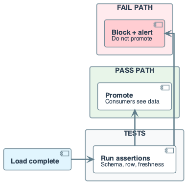
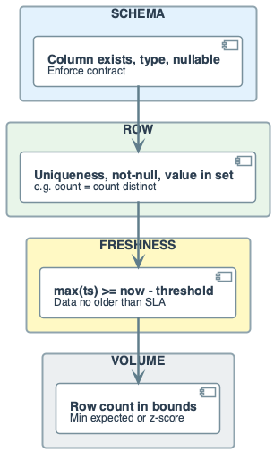
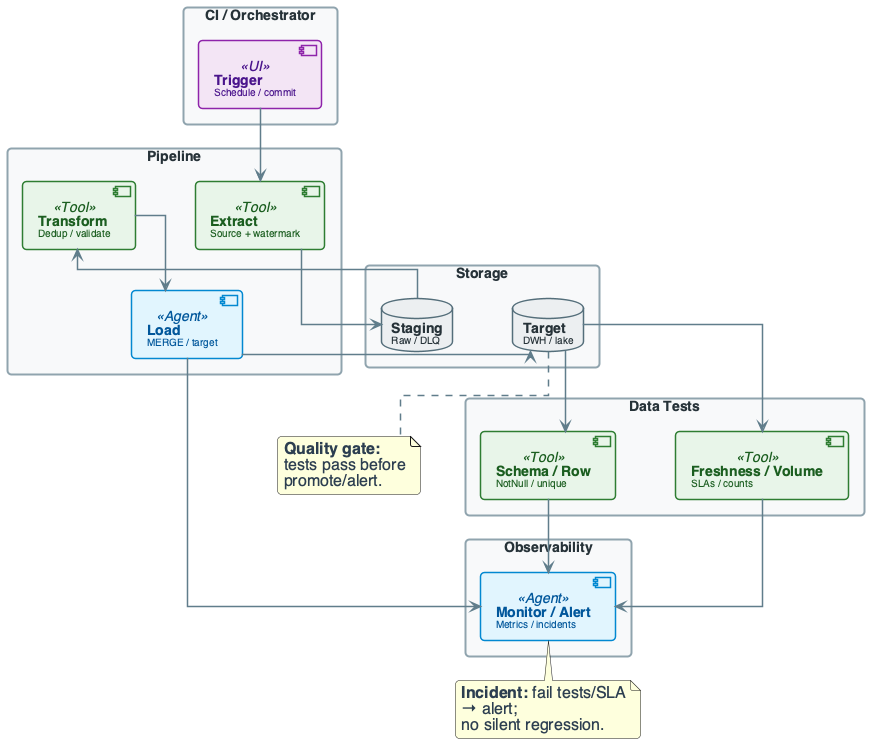
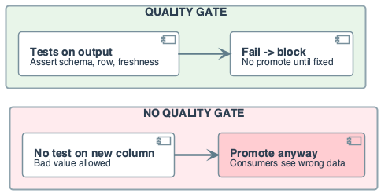

# Week 13: DataOps, Testing, and Data Quality

## Purpose
- Apply software-engineering rigor to data pipelines
- Prevent silent data regressions before consumers are affected
- Operate pipelines with reliable testing and observability

## Learning Objectives
- Define DataOps and quality-gate architecture
- Design fast, meaningful data test suites
- Implement promotion gates for schema/quality/freshness
- Detect and mitigate flaky tests and alert fatigue

## Why This Lecture Matters
- Pipeline success status does not guarantee data correctness
- Untested changes can silently corrupt dashboards/models
- Too many noisy alerts make real incidents invisible
- Trust depends on consistent data quality controls

## KPIs and Business Alignment
- Data pipelines serve **Key Performance Indicators (KPIs)** that measure business outcomes
- Quality gates should align with business goals: what metrics must be correct for decisions?
- CRISP-DM and similar frameworks start with business understanding before technical design
- Data engineers must connect technical quality (freshness, uniqueness) to business impact

## DataOps Core Loop
- Build pipeline changes as code
- Run automated tests in CI/CD
- Promote only if quality gate passes
- Monitor production and close gaps after incidents

## Core Quality Dimensions
- **Schema validity:** columns, types, nullability, contracts
- **Row quality:** uniqueness, ranges, allowed values
- **Freshness:** latest data within SLA window
- **Volume sanity:** row counts within expected bounds

## Quality Metrics
$$
L_t = now - max(event\_ts_t)
$$
$$
z_t = \frac{|N_t-\mu|}{\sigma}
$$
- Use freshness lag and volume anomaly scores in gates
- Block promotion when thresholds are violated

## DataOps Architecture
- Ingest -> transform -> load target table
- Run data tests on newly produced partition/slice
- Promote if gate passes, otherwise block + alert
- Persist test results and lineage for auditability

## Running Pipeline Context
- `raw_events -> staging -> events_clean`
- Key column: `event_id`
- Control table stores watermark/state
- DLQ captures invalid rows for triage

## Test Types (Practical)
- Schema contract tests
- Primary-key uniqueness tests
- Freshness and volume tests by partition
- Business-rule assertions (domain invariants)

## Quality Gate Rule
- All required tests must pass for publish/promote
- Failures block downstream exposure
- Alert includes failing assertions + sample evidence
- Gate is policy, not optional best-effort

## Running Example Flow
- Extract incrementally by watermark
- Deduplicate and `MERGE` into `events_clean`
- Run post-load tests on affected partition
- Promote only when tests pass

## Failure Mode: Silent Regression
- New/changed field has no assertion coverage
- Pipeline completes but semantics drift
- Consumers get wrong outputs without hard failure
- Fix: expand contract tests before deploy

## Failure Mode: Test Gap
- Only row count + PK tests exist
- Business logic bug passes basic checks
- Metric-level correctness breaks downstream
- Fix: add domain-specific assertions

## Failure Mode: Flaky Tests
- Time-sensitive or nondeterministic assertions fail intermittently
- Teams start ignoring failures
- Quality gate loses credibility
- Fix: deterministic fixtures and stable time boundaries

## Failure Mode: Alert Fatigue
- Too many low-signal alerts
- Important incidents buried in noise
- On-call response degrades
- Fix: severity tiers, deduping, actionable alerts only

## Performance Strategy for Test Suites
- Prefer partition-scope tests over full-table scans
- Run heavy checks on schedule, light checks per run
- Cache intermediate stats when feasible
- Keep gate runtime within operational SLA

## Watermark + Gate Interaction
- Update watermark only after successful load + gate pass
- Failed tests should not advance promoted state
- Rerun same slice must remain idempotent
- Prevents skipped or partially trusted partitions

## Monitoring Dashboard Signals
- Test pass/fail trend by pipeline
- Freshness lag and late partition counts
- Duplicate-key violations and DLQ growth
- Test runtime trend and flake rate

## Incident Response Pattern
- Detect via failed gate or anomaly alert
- Contain by blocking promote
- Fix pipeline/test gap and rerun idempotently
- Add permanent regression test (postmortem action)

## Engineering Checklist
- Does every critical column have explicit assertions?
- Are business invariants tested, not just schema?
- Is promotion blocked on gate failure?
- Are alerts high-signal and ownership-routed?

## Best Practices
- Version tests with pipeline code
- Treat test coverage as data-contract coverage
- Keep gates strict but runtime-aware
- Turn every incident into new automated protection

## Recap
- DataOps is how data teams keep trust in production
- Quality gates prevent silent bad-data releases
- Good testing needs both correctness and operability
- Next: full-course synthesis and exam readiness
