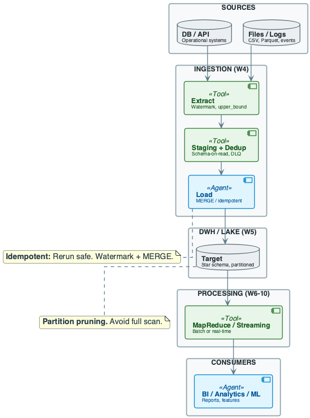
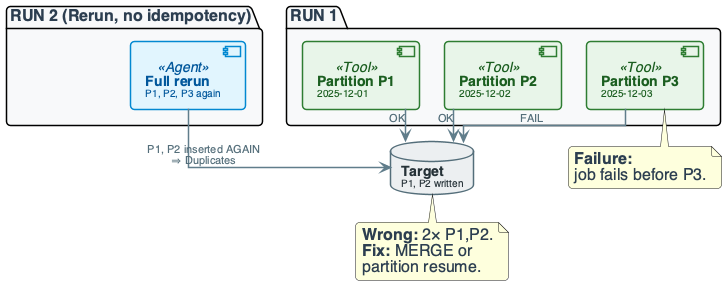
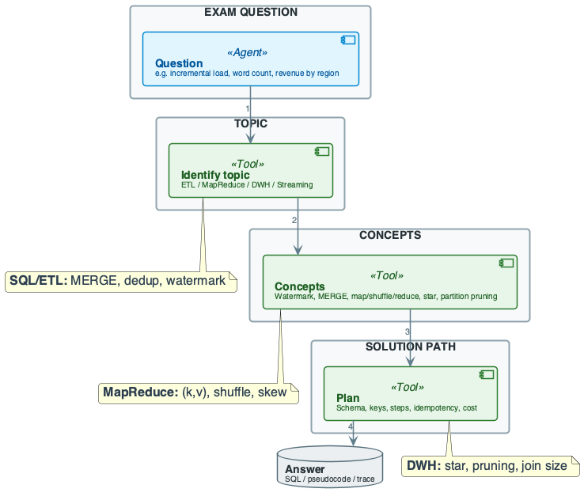
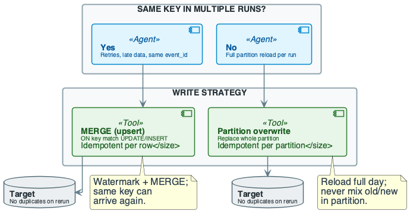

# Week 14: Course Review and Exam Preparation

## Purpose
- Synthesize data engineering concepts across the full course
- Connect theory, cost models, and failure modes
- Engineering: decisions under constraints, trade-offs, correctness

## Learning Objectives
- Map exam-style questions to course topics
- Apply cost models: time, memory, network, shuffle
- Design idempotent pipelines: watermark, MERGE, dedup
- Trace MapReduce: map, shuffle, reduce; identify skew
- Reason about DWH: star schema, partition pruning, join cost
- Identify failure modes: duplicate on rerun, skew OOM, late data
- State trade-offs: ETL vs ELT, batch vs streaming

## Review: Pipeline Cost Model
- Batch pipeline stages on the critical path
$$
T_{\text{total}} = T_{\text{extract}} + T_{\text{transform}} + T_{\text{load}}
$$
- Interpretation: end-to-end latency is the sum of stage runtimes
- Engineering implication: optimize the slowest stage first
- MapReduce communication cost
$$
\text{Comm} = O(|\text{shuffle output}|)
$$
- Interpretation: network dominates when shuffle is large
- Engineering implication: use combiners and balanced keys

## Diagram Manifest
- Slide 11 → week14_lecture_slide11_course_pipeline_overview.puml
- Slide 19 → week14_lecture_slide19_failure_rerun.puml
- Slide 21 → week14_lecture_slide21_exam_request_flow.puml

## The Real Problem This Course Solved

## End-to-End Pipeline
- Ingestion, storage, compute, streaming, features, operations
- Must work together
- Failure at any stage breaks the system

## Engineering Judgment
- Decisions under constraints
- Trade-offs: ETL vs ELT, batch vs streaming, consistency vs latency
- Cost and failure intuition

## Production Mindset
- How systems behave at scale
- Incident-driven; quality gates and observability

## What We Built End-to-End
- **One system:** raw_events → extract → staging → MERGE → events_clean → star → BI
- **Weeks 4-6-10-13:** same event pipeline
- Ingestion, MapReduce, streaming, DataOps
- **Levers:** partition pruning, combiner, salting, event-time windows
- **Non-negotiables:** idempotent write; watermark only after success

## Core Concepts (1/2)
- **Data engineering:** collect, store, process data at scale
- Output for analytics/ML/BI
- **Pipeline:** source → extract → staging → transform → load → target
- Idempotency required
- **Distributed:** partitioning, replication; CAP trade-offs

## Core Concepts (2/2)
- **MapReduce:** map (emit (k,v)) → shuffle (group by k) → reduce
- Shuffle cost and skew
- **DWH/Lake:** star schema, partition pruning
- Schema-on-read vs schema-on-write
- **Streaming:** event-time, watermark, windows; at-least-once + idempotent sink

## Data Context: Review Tables
- sales_fact partitioned by date_key
- raw_events has duplicate event_id sample
- MapReduce input: 4 lines ("a b a", "b a c", "a c", "b b a")

## In-Lecture Exercise 1: DWH Key Check
- What is the partition key of sales_fact?
- What is the primary key of sales_fact?
- Why must BI queries filter by date_key?

## In-Lecture Exercise 1: Solution (1/2)
- Partition key: date_key
- Primary key: sale_id

## In-Lecture Exercise 1: Solution (2/2)
- date_key filter enables partition pruning
- Without it, full scans cause slow, costly queries

## In-Lecture Exercise 1: Takeaway
- Partition filters are essential for OLAP performance

## Formal Formulas to Recall
- **Partition:** partition_id = hash(k) mod R
- Same k ⇒ same reducer
- **Shuffle size:** sum over all map output (k,v) pairs
- Combiner reduces before shuffle
- **IDF:** \(\log\frac{N}{df}\); TF-IDF = TF × IDF
- **Join size:** |A ⋈ B| ≤ |A| × |B|; with FK often ≈ fact rows

## In-Lecture Exercise 2: MapReduce Trace
- Map outputs for 4 lines ("a b a", "b a c", "a c", "b b a")
- Shuffle groups per key
- Reduce outputs for a, b, c

## In-Lecture Exercise 2: Solution (1/2)
- Map: a emits 5, b emits 4, c emits 2 total
- Shuffle: a→[1,1,1,1,1], b→[1,1,1,1], c→[1,1]

## In-Lecture Exercise 2: Solution (2/2)
- Reduce: (a,5), (b,4), (c,2)

## In-Lecture Exercise 2: Takeaway
- Map outputs define shuffle size and reducer load

## Course Map: Weeks 1–5
- **W1:** Intro — scale, pipeline, DE vs DS vs analytics
- **W2:** Distributed DB — SQL vs NoSQL, partitioning, CAP
- **W3:** Parallelism — divide and conquer, functional primitives
- **W4:** ETL/Ingestion — batch vs incremental, MERGE, watermark, DLQ
- **W5:** DWH/Lake — star schema, partitioning, pruning

## Course Map: Weeks 6–10
- **W6–7:** MapReduce — map/shuffle/reduce, combiner, skew, salting
- **W8–9:** Text — TF-IDF, n-grams, indexing at scale
- **W10:** Streaming — windows, event-time, watermark, delivery semantics

## Course Map: Weeks 11–13
- **W11–12:** Feature engineering — point-in-time, leakage, offline vs online
- **W13:** DataOps — CI/CD, data tests, quality gates, monitoring

## Running Example — Data & Goal
- **Domain:** event analytics; raw events → clean table → star schema
- **Source:** raw_events (event_id, user_id, event_type, event_timestamp)
- ~100M rows/day
- **Target:** events_clean (PK event_id); then sales_fact + dimensions
- **Goal:** end-to-end with watermark, dedup, MERGE; OLAP with pruning

## Running Example — Sample Rows
- **raw_events:** (1,101,'click','2025/12/01 08:00:00','{}')
- (2,102,'view','2025-12-01T09:00:00','{}')
- (1,101,'click','2025/12/01 08:00:00','{}') — duplicate
- **events_clean:** one row per event_id; duplicate deduped
- **sales_fact + dim_customer:** join on customer_id; filter date_key

## In-Lecture Exercise 3: Partition Pruning Cost
- Filter date_key IN (20251201, 20251202)
- Each partition ≈ 27K rows; full table ≈ 10M rows
- Compute rows scanned with and without filter
- Compute reduction factor

## In-Lecture Exercise 3: Solution (1/2)
- With filter: 2 × 27K ≈ 54K rows
- Without filter: ≈ 10M rows

## In-Lecture Exercise 3: Solution (2/2)
- Reduction factor: 10,000,000 / 54,000 ≈ 185×
- Pruning drastically reduces scan cost

## In-Lecture Exercise 3: Takeaway
- Pruning is the dominant lever for DWH query cost

## Running Example — Step-by-Step (1/4)
- **Step 1 — Extract:** read raw_events where event_timestamp > watermark
- Upper bound: NOW() − 5 min (safety buffer)
- **Watermark:** stored in metadata table
- Updated only after successful load

## Running Example — Step-by-Step (2/4)
- **Step 2 — Staging and dedup:** load into staging (schema-on-read)
- Filter event_type IN ('click','view','purchase')
- **Dedup:** ROW_NUMBER() PARTITION BY event_id; keep rn = 1
- **Invalid rows:** → DLQ; pipeline does not crash

## Running Example — Step-by-Step (3/4)
- **Step 3 — Load:** MERGE INTO events_clean USING deduped_staging ON event_id
- WHEN MATCHED AND source.event_timestamp > target.last_updated THEN UPDATE
- WHEN NOT MATCHED THEN INSERT
- Idempotent: rerun yields same result

## Running Example — Step-by-Step (4/4)
- **Step 4 — OLAP:** query revenue by region for December 2025
- **Join:** sales_fact → dim_customer (region)
- **Filter:** date_key in December partition only
- **Engineering:** partition pruning limits scan

## Cost of Naïve Design — Course Summary

## Ingestion
- Plain INSERT ⇒ duplicate revenue, lost trust
- No watermark ⇒ full scan on rerun

## DWH/Lake
- No partition key ⇒ full scan; broken dashboards

## MapReduce
- No combiner ⇒ huge shuffle
- Default partition on skewed key ⇒ OOM

## Streaming
- Processing-time windows ⇒ non-deterministic
- No idempotent sink ⇒ double-count

## Features
- No as_of_ts ⇒ leakage; append on rerun ⇒ duplicates

## DataOps
- No tests on new columns ⇒ silent regression
- No quality gate ⇒ bad data promoted

## How All Pieces Connect
- **Incident-driven:** one bad pipeline can break dashboards and trust
- **Observability at each stage:** row counts, watermark lag, reducer variance
- **Quality gates:** block promote when tests fail
- Idempotent write so rerun is safe
- **System-wide thinking:** ingestion feeds DWH and streaming
- Feature pipelines feed models; DataOps validates before consumers

## Cost & Scaling Analysis (1/3)
- **Time model:** T ∝ (data size / parallelism) + shuffle + reduce
- Shuffle often dominates
- **MapReduce:** shuffle size = sum of map output
- Reducer input = group size per key
- **Skew:** max reducer input ≫ mean ⇒ OOM or timeout

## Cost & Scaling Analysis (2/3)
- **Memory/storage:** staging holds one batch; target grows
- Partition count affects metadata
- **DWH:** scan cost ∝ partitions read × rows per partition
- Pruning = skip partitions
- **Join size:** |A ⋈ B| ≤ |A| × |B|; with FK often ≈ fact rows

## Cost & Scaling Analysis (3/3)
- **Network:** shuffle = all map output over network
- Combiner reduces bytes per key
- **Throughput:** events/sec limited by slowest operator
- Backpressure in streaming
- **Latency:** watermark delay + processing; buffer trades latency for consistency

## Pitfalls & Failure Modes (1/3)
- **Duplicate on rerun:** job fails after partial insert
- Rerun without MERGE or watermark ⇒ 2× data
- **Full scan:** query without partition filter ⇒ timeout
- **Skew:** one key has most values ⇒ OOM

## Pitfalls & Failure Modes (2/3)
- **Late data:** watermark too tight ⇒ events dropped
- Too loose ⇒ long delay and state growth
- **Silent regression:** new column not covered by tests
- **Leakage:** feature uses future data for training

## Pitfalls & Failure Modes (3/3)
- **Detection:** row counts, watermark lag, reducer variance, test results
- **Mitigation:** idempotent MERGE; partition-level resume
- Watermark with buffer; salting for skew
- **Quality gate:** block promote on test failure; DLQ for invalid rows

## Exam Readiness: Question → Topic
- **SQL/ETL:** joins, aggregations, window functions, MERGE, dedup
- **MapReduce:** map/shuffle/reduce trace, word count, skew, combiner
- **DWH:** star schema, partition pruning, join cost

## Exam Readiness: Question Types

## Design Questions
- "Design an idempotent incremental load"
- → watermark, staging, MERGE, partition resume

## Trace Questions
- "Show map outputs, shuffle, reduce for this input"
- → list (k,v), then groups, then aggregates

## Query Questions
- "Revenue by region for date range"
- → star join, partition filter, GROUP BY

## Reasoning Questions
- "Why did the job fail?" / "How to mitigate skew?"
- → identify cause, propose fix

## Exam Readiness: Concepts to Recall
- **Definitions:** idempotency, watermark, partition key, shuffle, event-time
- **Formulas:** shuffle size; partition(k,R)=hash(k) mod R; IDF = log(N/df)
- **Trade-offs:** ETL vs ELT; batch vs streaming; at-most/at-least/exactly-once

## Best Practices (1/2)
- Design for idempotency: MERGE or partition overwrite; watermark
- Use staging and DLQ: schema-on-read for landing; isolate invalid rows
- Partition fact tables and require partition filter
- In MapReduce: balance keys; use combiner; salt hot keys

## Best Practices (2/2)
- In streaming: event-time windows; watermark with buffer; idempotent sink
- Feature pipelines: point-in-time correctness; key = (entity_id, as_of_ts)
- DataOps: schema and row tests; freshness checks; quality gate before promote
- Trade-off table: ETL vs ELT; choose by engine and governance

## Recap — Engineering Judgment (1/2)
- **Pipeline:** extract → staging → transform/dedup → MERGE → target
- Tests after load; quality gate before promote
- **MapReduce:** same key → same reducer
- Shuffle and skew are first-class failure modes
- Combiner and salting are non-negotiable at scale
- **DWH:** star schema, partition pruning, join size
- Partition filter required to avoid full scan

## Recap — Engineering Judgment (2/2)
- **Failure modes:** duplicate on rerun, skew OOM, late data, silent regression
- Each has a mitigation (idempotency, salting, watermark, tests)
- **Trade-offs:** ETL vs ELT, batch vs streaming, consistency vs latency
- Choose by engine, governance, and latency budget
- **System-wide:** one pipeline break can break consumers
- Observability and quality gates at each stage

## Pointers to Practice
- Solve SQL on concrete tables: joins, MERGE, dedup, incremental load
- Trace MapReduce: 8–12 input records; map, shuffle, reduce; skew and salting
- DWH: star schema query with partition filter; join size and scan cost
- Combine topics: ingestion + idempotency + DWH query end-to-end

## Additional Diagrams
### Practice: Reasoning Pipeline Choice

