# Week 16: Distributed Systems + Parallelism (Conceptual Overview)

## Purpose
- Explain why single machines and single workers fail at scale
- Connect data distribution (databases) with parallel execution (processing)
- Build intuition for trade-offs without heavy software detail

---

## Learning Objectives (1/2)
- Describe why we partition data and work across many machines
- Explain SQL vs NoSQL using ACID/BASE and CAP vocabulary
- Distinguish parallelism vs concurrency, and process vs thread (conceptual)

---

## Learning Objectives (2/2)
- Use divide–conquer–combine to reason about scalable jobs
- Recognize common failure modes: hot keys, skew, and stale reads

---

## Flow for Today
- The scaling problem: data and work outgrow one machine
- Distributed data: partitioning, replication, and consistency trade-offs
- Distributed work: parallelism, divide-and-conquer, and bottlenecks
- Practical examples and decision checklist

---

## The Scaling Problem (Big Picture)
- One machine has limits in storage, speed, and uptime
- As volume grows, delays and downtime become business risk
- Solution: **distribute** both data storage and computation

---

## Two Sides of the Same Coin
- **Distributed data**: many nodes store one logical database
- **Parallel compute**: many workers process one logical job
- The goal: same user experience, higher scale and resilience

---

## Why Single-Node Databases Break
- Storage runs out faster than expected (data + indexes)
- Throughput saturates during peak demand
- Maintenance windows hurt service availability
- Risk increases as the business depends on real-time data

---

## Why Single-Node Databases Break (Visual)

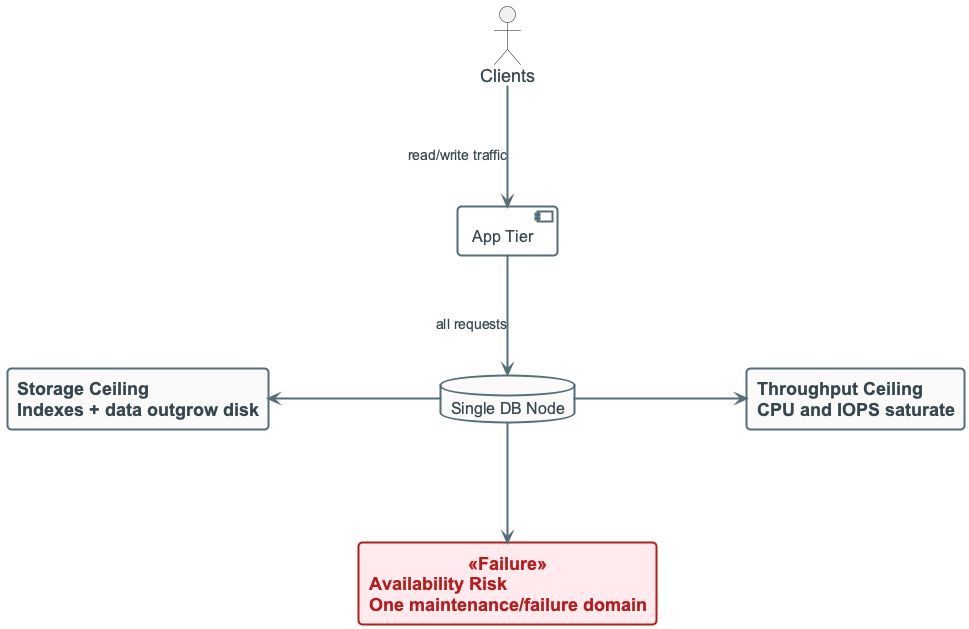{width=90%}

---

## Distributed Databases: Core Ideas
- **Partitioning** splits data across nodes to scale
- **Replication** copies data for availability and durability
- Network failures are normal, not exceptional

---

## Distributed Databases: Architecture

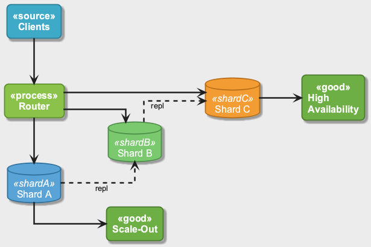{width=90%}

---

## Distributed Databases: Logical vs Physical View

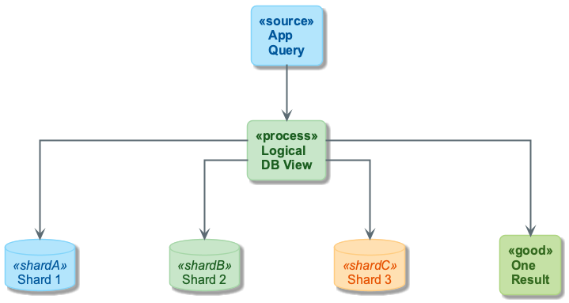{width=90%}

---

## Partitioning + Replication (Intuition)
- Per-node storage roughly scales with data / nodes
- Replication raises availability but increases write cost
- Choose replication level based on risk tolerance and budget

---

## Partitioning + Replication (Model)

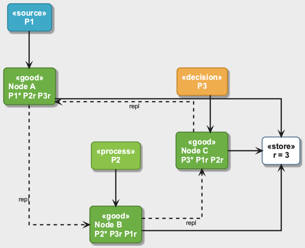{width=90%}

---

## Partition Keys: Good vs Bad
- Good keys match dominant access patterns
- Bad keys create **hot partitions** and bottlenecks
- Example:
  - Good: `user_id` for user feed
  - Bad: `country` when only a few values dominate

---

## Partition Keys: Good vs Bad (Visual)

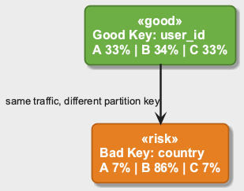{width=90%}

---

## Replication Trade-Offs
- Reads can be served by replicas (faster, scalable)
- Writes must be coordinated (slower, more cost)
- Replica lag can cause **stale reads**

---

## Replication: Read/Write Path

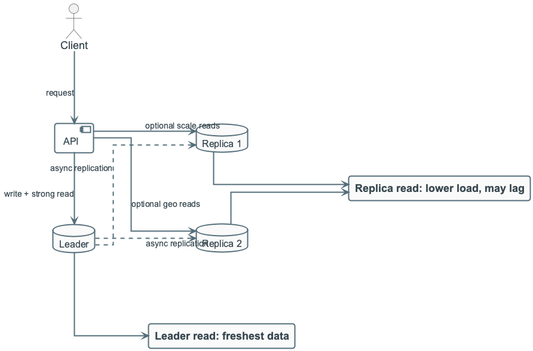{width=90%}

---

## Replication: Stale Read Sequence

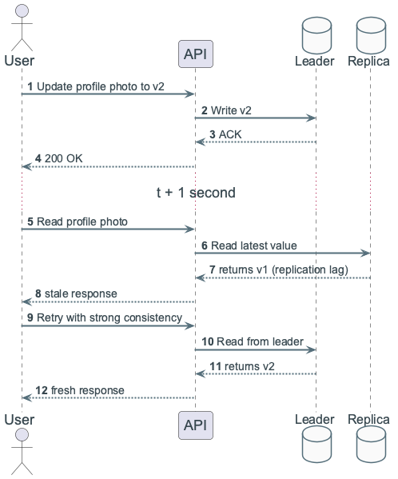{width=88%}

---

## SQL vs NoSQL: Simple Decision Lens
- **SQL**: strong integrity and joins; best for correctness-critical workflows
- **NoSQL**: fast key-based access; best for high-throughput serving paths
- Many real systems are **hybrid**: NoSQL for serving + SQL for analytics

---

## SQL vs NoSQL: Access Patterns

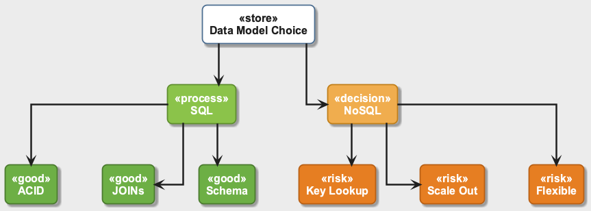{width=90%}

---

## SQL vs NoSQL: Hybrid Architecture

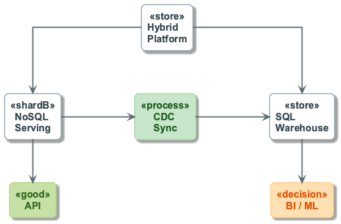{width=90%}

---

## ACID, BASE, and CAP (Key Terms)
- **ACID**: atomicity, consistency, isolation, durability
- **BASE**: basically available, soft state, eventual consistency
- **CAP**: under network partition, choose **consistency** or **availability**

---

## ACID, BASE, and CAP (Comparison)

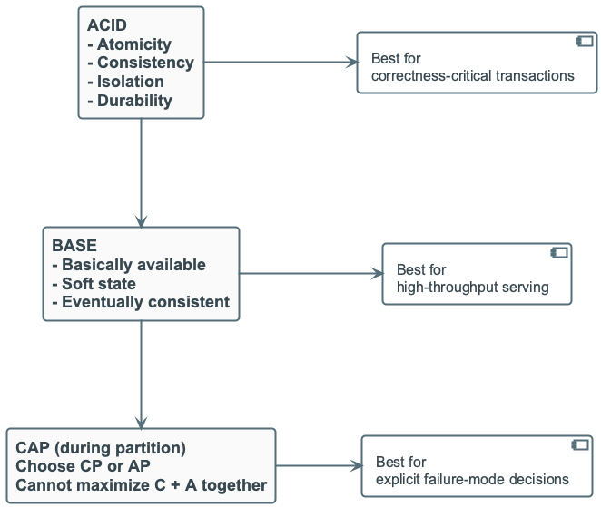{width=88%}

---

## Example: Activity Log Service
- 100M events/day
- Query A: user feed by `user_id`
- Query B: analytics by `item_id`
- Serving latency target under 50 ms
- Typical answer: NoSQL for the feed, SQL for analytics, sync in between

---

## Transition: Data Distribution → Work Distribution
- Storing data across nodes is only half the story
- You must also process data **in parallel** to meet time limits

---

## Parallelism vs Concurrency (Plain Language)
- **Parallelism**: tasks run at the same time (speed)
- **Concurrency**: tasks overlap in time (utilization)

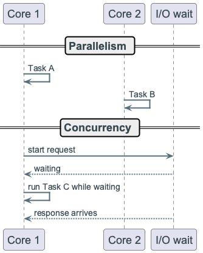{width=82%}

---

## Process vs Thread (Conceptual)
- **Process**: isolated memory and resources (safer)
- **Thread**: shared memory (faster coordination, higher risk)

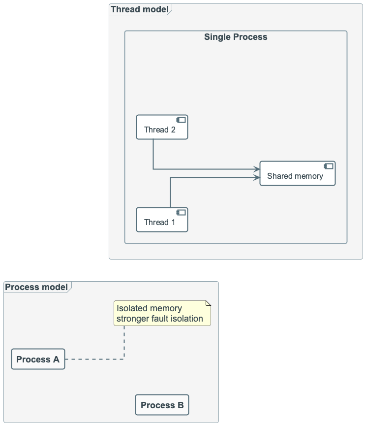{width=82%}

---

## Divide–Conquer–Combine (Core Pattern)
- **Divide**: split input into independent chunks
- **Conquer**: run the same logic per chunk
- **Combine**: merge partial results
- This is the shape behind MapReduce and Spark

---

## Divide–Conquer–Combine (Overview)

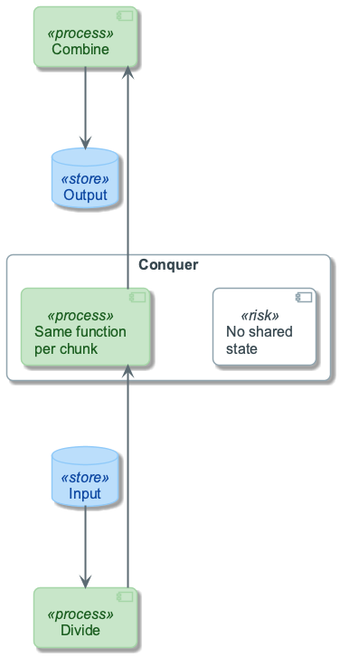{width=76%}

---

## Divide–Conquer–Combine (Execution Flow)

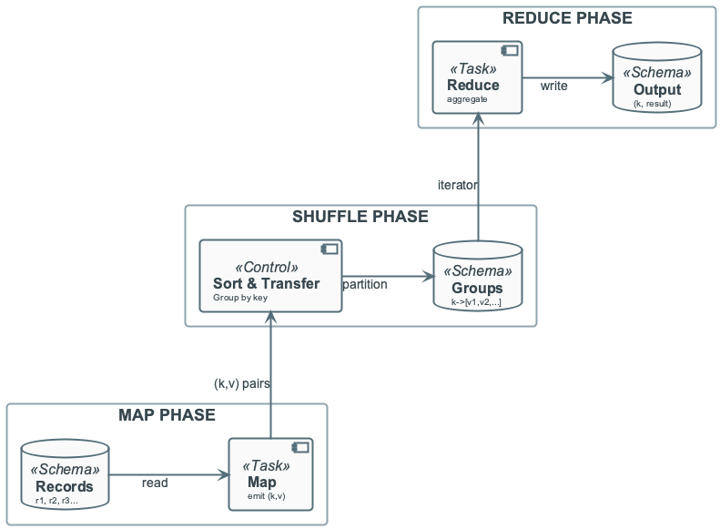{width=76%}

---

## Example: Merge Sort (Concept)
- **Divide**: split array in half until each chunk has 0–1 elements
- **Conquer**: each single-element chunk is “sorted”; then sort each half recursively
- **Combine**: **merge** two sorted halves into one sorted array (linear scan)

---

## Example: Merge Sort (Numerical Demo)

Input: `[38, 27, 43, 3, 9, 82, 10]`

| Level | Divide | Conquer (after sort) | Combine |
|-------|--------|----------------------|---------|
| 1 | `[38,27,43,3]` and `[9,82,10]` | — | — |
| 2 | `[38,27]` and `[43,3]`; `[9,82]` and `[10]` | — | — |
| 3 | single elements | `[27,38]`, `[3,43]`, `[9,82]`, `[10]` | merge pairs → `[3,27,38,43]`, `[9,10,82]` |
| 4 | — | — | merge → **`[3, 9, 10, 27, 38, 43, 82]`** |

---

## Example: Merge Sort (Takeaway)
- Each “merge” step does one pass over two sorted lists.
- Total work across levels is **O(n log n)**.

---

## Example: Quick Sort (Concept)
- **Divide**: choose a **pivot** (e.g. last element); partition into “≤ pivot” and “> pivot”
- **Conquer**: recursively quick-sort each partition
- **Combine**: concatenate (left, pivot, right) — no merge step

---

## Example: Quick Sort (Numerical Demo)

Input: `[38, 27, 43, 3, 9, 82, 10]`, pivot **10**

1. **Partition**: `[3, 9]` ≤ 10, `[10]`, `[38, 27, 43, 82]` > 10  
2. **Conquer**: sort `[3,9]` → `[3,9]`; sort right side (pivots 82, 43) → `[27,38,43,82]`  
3. **Combine**: `[3,9]` + `[10]` + `[27,38,43,82]` = **`[3, 9, 10, 27, 38, 43, 82]`**

---

## Example: Quick Sort (Takeaway)
- Same divide–conquer idea; “combine” is trivial (concat).
- **Parallelism**: left and right partitions can be sorted on different workers.

---

## Example: Product Frequency Count
- Input: `order_id, product_id`
- Divide: split log files into blocks
- Conquer: each worker emits `(product_id, 1)`
- Combine: reducers sum counts per `product_id`

---

## Example: Product Frequency Count (Local Aggregation)

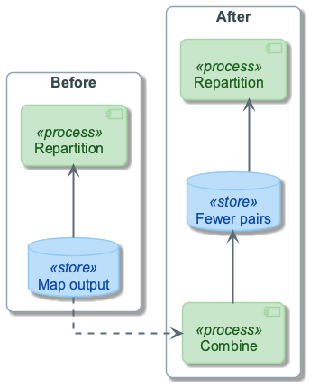{width=76%}

---

## Performance Reality: The Slowest Worker Wins
- End-to-end time is bounded by the **slowest partition**
- Skewed data causes long-tail delays
- One hot key can stall the entire job

---

## Performance Reality: Straggler Effect

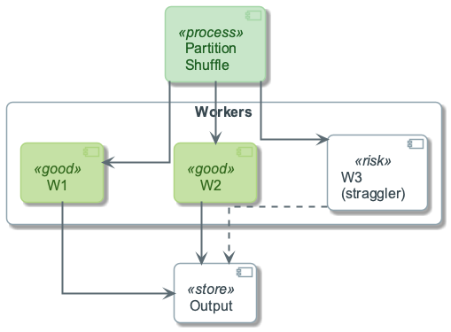{width=74%}

---

## Skew Mitigation (Simple Tools)
- **Local aggregation**: pre-sum identical keys before shuffle
- **Key salting**: split hot keys into subkeys, merge later
- **Custom partitioning**: intentionally route heavy keys

---

## Skew Mitigation: Activity View

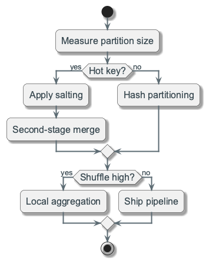{width=76%}

---

## Skew Mitigation: Patterns

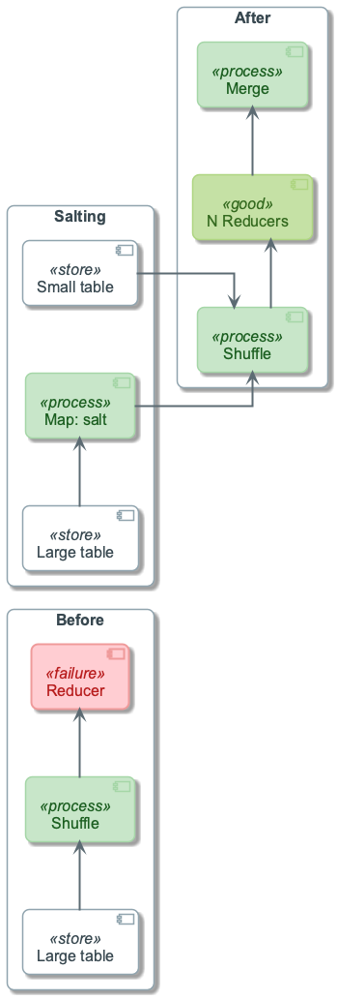{width=76%}

---

## Reliability Rules (Production Mindset)
- Make transformations deterministic (same input → same output)
- Keep outputs idempotent for safe retries
- Monitor p95/p99 task times, skew, and replica lag

---

## Combined Design Checklist (1/2)
- What are the top 3 read/write paths?
- Which operations require strict consistency?
- What is the acceptable stale-read window?

---

## Combined Design Checklist (2/2)
- Are partitions balanced for real key distributions?
- Can local aggregation reduce shuffle volume?

---

## Recap (1/2)
- Scaling requires distributing **data** and **work**
- SQL vs NoSQL is a trade-off between correctness and scale

---

## Recap (2/2)
- Divide–conquer–combine is the backbone of parallel jobs
- Skew, hot keys, and stale reads are the main operational risks
