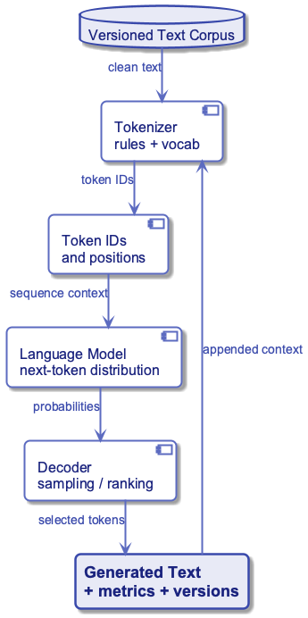
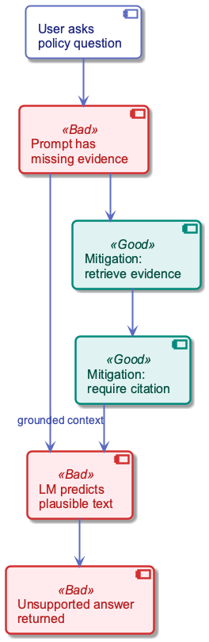

# Week 17: Language Models and End-to-End RAG

---

## Purpose

- Define what a language model is.
- Show how language models generate text.
- Explain why language models need external evidence.
- Build a complete Retrieval-Augmented Generation pipeline.
- Compute chunking, similarity, scoring, ranking, and retrieval metrics.

---

## Learning Objectives

- Define a language model as a probability model over token sequences.
- Explain tokenization, next-token prediction, and generation.
- Distinguish language models, embeddings, search, and databases.
- Define RAG and explain when it is useful.
- Design a RAG pipeline from documents to grounded answers.
- Compute cosine similarity, BM25, and hybrid retrieval scores.
- Choose chunk size, overlap, top-k, and context budget.
- Evaluate retrieval with precision, recall, and evidence checks.

---

## Sources Used (Reference Only)

- lectures/18-llm-systems-rag-agents/lecture.md
- lectures/17-language-models/lecture.md
- lectures/09-text-advanced/lecture.md
- lectures/08-text-tfidf/lecture.md
- sources/text1.md
- sources/text2.md

---

## Diagram Manifest

- week17_lecture_slide21_lm_pipeline.puml -> language-model data pipeline.
- week17_lecture_slide38_hallucination_failure.puml -> unsupported-answer failure path.
- week18_lecture_slide08_rag_agent_stack.puml -> RAG system stack.
- week18_lecture_slide18_retrieval_flow.puml -> retrieval execution flow.

---

## Why This Lecture Was Refocused

- Previous lectures already covered TF-IDF, n-grams, embeddings, and text pipelines.
- This lecture uses those ideas instead of reteaching them.
- The new center is language models plus RAG.
- The goal is an end-to-end system students can build and test.

---

## What We Will Not Repeat

| Already covered | Used here as |
|---|---|
| TF-IDF | lexical retrieval signal |
| N-grams | historical baseline for sequence modeling |
| Embeddings | dense vectors for semantic retrieval |
| Feature pipelines | ingestion pattern for RAG corpora |

---

## Part 1: What Is a Language Model?

- A language model assigns probabilities to text.
- It predicts likely next tokens from previous tokens.
- Generation repeats prediction, selection, and appending.
- The output is probabilistic, not guaranteed truth.

---

## Formal Definition

- Let a token sequence be $w_{1:T}$.
- A language model assigns a probability to the sequence.
- The probability decomposes into next-token conditionals.

$$
P(w_{1:T})=\prod_{t=1}^{T}P(w_t \mid w_{1:t-1})
$$

---

## Simple Example

Given:

```text
The final project is due
```

A language model estimates:

| next token | probability |
|---|---:|
| tomorrow | 0.34 |
| Friday | 0.27 |
| next | 0.13 |
| late | 0.04 |

---

## Tokenization

- Models do not directly process words.
- Text is split into tokens.
- Tokens can be words, word pieces, punctuation, or spaces.
- Tokenization controls cost, context length, and reproducibility.

| text | possible tokens |
|---|---|
| `homework deadline` | `home`, `work`, ` deadline` |
| `RAG pipeline` | `R`, `AG`, ` pipeline` |

---

## Sequence Probability Example

Assume these next-token probabilities:

| step | token | probability |
|---:|---|---:|
| 1 | `homework` | 0.50 |
| 2 | `is` | 0.40 |
| 3 | `due` | 0.25 |
| product | sequence probability | `0.50 * 0.40 * 0.25 = 0.05` |

---

## Cross-Entropy and Perplexity

- Cross-entropy measures average surprise per token.
- Perplexity converts surprise into an effective branching factor.
- These are language-model metrics, not answer-quality guarantees.

$$
H=-\frac{1}{T}\sum_{t=1}^{T}\log_2P(w_t \mid w_{<t})
$$

$$
PP=2^H
$$

---

## Perplexity Mini-Calculation

If four correct tokens each receive probability $0.5$:

$$
H=-\frac{1}{4}\log_2(0.5^4)=1
$$

$$
PP=2^1=2
$$

- The model behaves like choosing between two equally likely options.
- Good perplexity does not prove factual correctness.

---

## Generation Loop

1. Read prompt tokens.
2. Estimate next-token distribution.
3. Select a token by greedy decoding, sampling, or beam search.
4. Append the token to the context.
5. Repeat until stop condition or token budget.

- This is why prompt wording changes outputs.

---

## Language-Model Pipeline

- Text becomes tokens using a versioned tokenizer.
- Tokens become IDs and vectors.
- Model returns next-token probabilities.
- Decoding creates a final text sequence.
- Diagram: week17_lecture_slide21_lm_pipeline.puml

{width=82%}

---

## What Makes an LLM Different?

| Dimension | Meaning |
|---|---|
| scale | many parameters and training examples |
| context | can condition on long prompts |
| instruction tuning | follows natural-language tasks better |
| tool ecosystem | can be wrapped with retrieval, tools, and policy |

---

## Language Model vs Other Components

| Component | Main job | Does it know private data? |
|---|---|---|
| language model | generate likely text | only if in prompt or training |
| embedding model | map text to vectors | no, it maps meaning-like position |
| vector index | retrieve similar chunks | only what was indexed |
| database | store source-of-truth records | yes, if connected and queried |

---

## Critical Limitation

- A language model completes text.
- It does not automatically verify truth.
- It may answer from outdated training data.
- It may invent a plausible rule when evidence is missing.
- Factual tasks need evidence outside the model.

---

## Unsupported Answer Failure

- User asks about a course policy.
- Prompt lacks the policy text.
- Model completes with a plausible policy.
- System returns an uncited answer.
- Diagram: week17_lecture_slide38_hallucination_failure.puml

{width=82%}

---

## Part 2: What Is RAG?

- RAG means Retrieval-Augmented Generation.
- Retrieve relevant evidence from a trusted corpus.
- Augment the prompt with that evidence.
- Generate an answer grounded in retrieved sources.

$$
answer = LM(query, retrieved\_evidence, instructions)
$$

---

## Why RAG Exists

| Problem with LM alone | RAG response |
|---|---|
| training data may be old | retrieve current documents |
| private data is absent | index internal corpus |
| answer is hard to verify | cite evidence IDs |
| context window is limited | retrieve only relevant chunks |

---

## RAG Answer Contract

A good RAG answer should include:

- direct answer to the user question.
- source chunk IDs or citations.
- uncertainty when evidence is incomplete.
- refusal or escalation when evidence is missing.
- no unsupported claims beyond the retrieved context.

---

## RAG and System Stack

- Application receives the user question.
- Orchestration retrieves evidence.
- Semantic layer defines trusted meaning.
- Data layer stores governed source records.
- LLM writes the final response from selected context.
- Diagram: week18_lecture_slide08_rag_agent_stack.puml

{width=82%}

---

## Running Case: Course Policy Assistant

User asks:

```text
Can I submit homework late, and what is the penalty?
```

The assistant must answer only from course documents.

| requirement | reason |
|---|---|
| cite evidence | student can verify |
| use current policy | course rules change |
| avoid guessing | grading policy is high-impact |

---

## Source Documents

| doc_id | title | text snippet |
|---|---|---|
| D1 | Homework Policy | Late homework is accepted for 48 hours with a 10 percent penalty per day. |
| D2 | Grading | Homework is 30 percent, project is 20 percent, exam is 50 percent. |
| D3 | Office Hours | Teaching staff answer questions on Monday and Wednesday. |

---

## Step 1: Ingest and Clean

- Collect PDFs, slides, markdown files, and policy pages.
- Extract text with page, section, and document metadata.
- Remove boilerplate, broken headers, and duplicated footers.
- Normalize whitespace and encoding.
- Store the original source reference.

---

## Step 2: Chunk the Corpus

- A chunk is a small passage used for retrieval.
- Chunking makes long documents searchable.
- Too large: expensive and noisy.
- Too small: loses context.
- Overlap protects information near boundaries.

---

## Chunking Calculation

Let:

- document length $T=1000$ tokens.
- chunk size $s=200$ tokens.
- overlap $o=40$ tokens.
- step size $s-o=160$ tokens.

$$
N=1+\left\lceil\frac{T-s}{s-o}\right\rceil
=1+\left\lceil\frac{800}{160}\right\rceil=6
$$

---

## Chunking Example

| chunk_id | token span | content |
|---|---:|---|
| D1-C1 | 1-200 | homework submission rules |
| D1-C2 | 161-360 | late policy and penalty |
| D1-C3 | 321-520 | resubmission and grading notes |

---

## Step 3: Store Chunk Metadata

| field | example |
|---|---|
| chunk_id | D1-C2 |
| doc_id | D1 |
| source_title | Homework Policy |
| section | Late Submissions |
| text | Late homework is accepted... |
| token_count | 188 |
| updated_at | 2026-05-08 |
| permissions | students |

---

## Step 4: Embed and Index

- Each chunk is converted to an embedding vector.
- Store vectors in a vector index.
- Store text and metadata beside the vector.
- Version the embedding model.
- Rebuild embeddings when the model or source text changes.

$$
chunk\ text \rightarrow embedding\ model \rightarrow \mathbf{c_i}
$$

---

## Step 5: Query-Time Retrieval

- Embed the user question into query vector $\mathbf{q}$.
- Filter chunks by permissions, course, and date.
- Retrieve top candidates by similarity score.
- Optionally rerank candidates.
- Pass selected evidence to the LLM.
- Diagram: week18_lecture_slide18_retrieval_flow.puml

{width=82%}

---

## Formal Retrieval Model

- Corpus chunks are $c_1,\ldots,c_N$.
- Query embedding is $\mathbf{q}$.
- Chunk embeddings are $\mathbf{c_i}$.
- Retrieval returns top-$k$ chunks by score.

$$
R_k(q)=top_k(score(\mathbf{q},\mathbf{c_i}))
$$

---

## Cosine Similarity

- Cosine similarity measures vector direction.
- It is common for dense semantic retrieval.
- Scores near 1 are more aligned.

$$
\cos(\mathbf{q},\mathbf{c})=
\frac{\mathbf{q}\cdot\mathbf{c}}{\|\mathbf{q}\|\|\mathbf{c}\|}
$$

---

## Worked Example: Candidate Vectors

Query:

```text
q = (0.8, 0.6, 0.0)
```

| chunk | meaning | vector |
|---|---|---|
| C1 | late homework penalty | `(0.9, 0.5, 0.1)` |
| C2 | office hours | `(0.1, 0.2, 0.9)` |
| C3 | homework grading weight | `(0.6, 0.7, 0.2)` |

---

## Similarity Calculation for C1

$$
\mathbf{q}\cdot\mathbf{C1}=0.8\cdot0.9+0.6\cdot0.5+0.0\cdot0.1=1.02
$$

$$
\|\mathbf{q}\|=\sqrt{0.8^2+0.6^2}=1.00
$$

$$
\|\mathbf{C1}\|=\sqrt{0.9^2+0.5^2+0.1^2}=1.034
$$

$$
\cos(q,C1)=1.02/(1.00\cdot1.034)=0.986
$$

---

## Similarity Ranking

| chunk | cosine score | rank |
|---|---:|---:|
| C1 | 0.986 | 1 |
| C3 | 0.954 | 2 |
| C2 | 0.216 | 3 |

---

## Lexical and Semantic Retrieval

| Method | Strength | Weakness |
|---|---|---|
| lexical search | exact terms and rare names | misses paraphrases |
| dense vectors | semantic similarity | can retrieve vague matches |
| hybrid retrieval | combines both | requires score calibration |

---

## Why BM25 Appears in RAG

- RAG often starts with a search problem.
- Dense vectors find semantic similarity.
- BM25 finds exact lexical evidence.
- Policy, names, IDs, codes, and rare terms need lexical matching.
- A good retriever often combines dense and lexical scores.

---

## BM25 Core Idea

BM25 rewards a document when:

- query terms appear in the document.
- rare terms appear.
- terms appear enough times, but not endlessly.
- the document is not only long because it contains many words.

This improves over raw word counts.

---

## BM25 Formula

For query $q$ and document or chunk $d$:

$$
BM25(q,d)=\sum_{t\in q}IDF(t)\cdot
\frac{f(t,d)(k_1+1)}
{f(t,d)+k_1(1-b+b\frac{|d|}{avgdl})}
$$

Common defaults:

- $k_1=1.2$ controls term-frequency saturation.
- $b=0.75$ controls document-length normalization.

---

## BM25 Symbols

| symbol | meaning |
|---|---|
| `t` | query term |
| `f(t,d)` | frequency of term `t` in chunk `d` |
| `|d|` | chunk length in tokens |
| `avgdl` | average chunk length |
| `IDF(t)` | rarity weight of term `t` |
| `k1` | saturation strength |
| `b` | length-normalization strength |

---

## IDF: Rarity Weight

Rare query terms should matter more than common terms.

$$
IDF(t)=\log\left(1+\frac{N-df(t)+0.5}{df(t)+0.5}\right)
$$

| variable | meaning |
|---|---|
| `N` | number of chunks |
| `df(t)` | chunks containing term `t` |

---

## IDF Example

Assume $N=1000$ chunks.

| term | df | IDF intuition | IDF value |
|---|---:|---|---:|
| `penalty` | 10 | rare | 4.56 |
| `homework` | 500 | common | 0.69 |
| `the` | 900 | very common | 0.11 |

---

## Term Frequency Saturation

BM25 does not reward repeated words linearly.

Assume $k_1=1.2$ and average-length chunks.

| term count | BM25 tf weight |
|---:|---:|
| 1 | 1.00 |
| 2 | 1.38 |
| 5 | 1.77 |
| 10 | 1.96 |

---

## Document Length Normalization

Long chunks naturally contain more words.

$$
length\_norm=1-b+b\frac{|d|}{avgdl}
$$

Assume $b=0.75$ and $avgdl=200$.

| chunk length | length norm |
|---:|---:|
| 80 | 0.55 |
| 200 | 1.00 |
| 400 | 1.75 |

---

## BM25 Mini-Corpus

Query:

```text
late homework penalty
```

| chunk | text summary | length |
|---|---|---:|
| C1 | late homework penalty policy | 8 |
| C2 | office hours schedule | 5 |
| C3 | homework grading weight | 6 |

---

## BM25 Example Settings

Assume $avgdl=6$, $k_1=1.2$, $b=0.75$.

| setting | value | meaning |
|---|---:|---|
| `avgdl` | 6 | average chunk length |
| `k1` | 1.2 | tf saturation |
| `b` | 0.75 | length normalization |

---

## BM25 Term Statistics

| term | df | IDF |
|---|---:|---:|
| `late` | 1 | 0.981 |
| `homework` | 2 | 0.470 |
| `penalty` | 1 | 0.981 |

---

## C1 Term Frequencies

For C1:

- all three terms appear once.
- chunk length is 8 tokens.

---

## BM25 Worked Example: C1

Length normalization:

$$
1-0.75+0.75\cdot\frac{8}{6}=1.25
$$

Term weight for each one-time term:

$$
\frac{1(1.2+1)}{1+1.2(1.25)}=\frac{2.2}{2.5}=0.88
$$

---

## BM25 Worked Score: C1

C1 contains `late`, `homework`, and `penalty`.

$$
BM25(C1)=0.88(0.981+0.470+0.981)
$$

$$
BM25(C1)=0.88\cdot2.432=2.140
$$

- C1 receives a strong lexical score.

---

## BM25 Ranking Example

| chunk | matched query terms | raw BM25 |
|---|---|---:|
| C1 | late, homework, penalty | 2.140 |
| C3 | homework | 0.470 |
| C2 | none | 0.000 |

---

## Normalizing BM25

BM25 is not naturally bounded like cosine similarity.

Before mixing scores:

$$
BM25_{norm}(d)=\frac{BM25(d)-min(BM25)}{max(BM25)-min(BM25)}
$$

| chunk | raw BM25 | normalized |
|---|---:|---:|
| C1 | 2.140 | 1.00 |
| C3 | 0.470 | 0.22 |
| C2 | 0.000 | 0.00 |

---

## BM25 vs Dense Similarity

| Case | BM25 helps | dense similarity helps |
|---|---|---|
| exact policy phrase | yes | sometimes |
| synonym or paraphrase | no | yes |
| product code or ID | yes | often no |
| broad semantic question | weak | yes |

---

## Hybrid Score

Let $BM25_{norm}$ be a normalized lexical score.

$$
score(q,c)=0.7\cos(q,c)+0.3BM25_{norm}(q,c)
$$

- Dense score captures semantic similarity.
- Lexical score rewards exact policy words.
- Weights should be tested on real queries.

---

## Hybrid Score Calculation

| chunk | cosine | BM25 norm | final score |
|---|---:|---:|---:|
| C1 | 0.986 | 1.00 | 0.990 |
| C3 | 0.954 | 0.22 | 0.734 |
| C2 | 0.216 | 0.00 | 0.151 |

---

## Hybrid Score Arithmetic

- C1: `0.7 * 0.986 + 0.3 * 1.00 = 0.990`.
- C3: `0.7 * 0.954 + 0.3 * 0.22 = 0.734`.
- C2: `0.7 * 0.216 + 0.3 * 0.00 = 0.151`.
- Final ranking remains C1, C3, C2.

---

## Filters Before Scoring

- Do not retrieve documents the user cannot access.
- Filter by course, semester, language, and document status.
- Prefer active policy versions over archived versions.
- Apply filters before generation, not only in the prompt.

```sql
WHERE course_id = 'data-engineering'
  AND visibility = 'students'
  AND status = 'active'
```

---

## Step 6: Select Context

- Choose top-$k$ chunks after filtering and scoring.
- Remove near-duplicates.
- Keep source titles and chunk IDs.
- Keep enough surrounding text for interpretation.
- Reserve token budget for the final answer.

| selected | reason |
|---|---|
| C1 | direct late-policy answer |
| C3 | homework grading context |

---

## Context Budget

| component | tokens |
|---|---:|
| system rules | 450 |
| user question | 25 |
| task instructions | 120 |
| chunk C1 | 180 |
| chunk C3 | 160 |
| answer budget | 250 |
| total | 1185 |

---

## Step 7: Build the Prompt

```text
System:
Answer only from the provided evidence.
If evidence is insufficient, say so.
Cite chunk IDs.

User:
Can I submit homework late, and what is the penalty?

Evidence:
[C1] Late homework is accepted for 48 hours...
[C3] Homework contributes 30 percent...
```

- The prompt contract limits unsupported claims.

---

## Step 8: Generate a Grounded Answer

Example answer:

```text
Yes. According to the homework policy, late homework is accepted
for up to 48 hours, with a 10 percent penalty per day [C1].
The policy evidence does not say that submissions after 48 hours
are accepted [C1]. Homework counts for 30 percent of the course
grade [C3].
```

- The answer cites evidence and marks limits.

---

## Step 9: Log the Trace

| trace field | example |
|---|---|
| query | late homework penalty |
| retrieved chunks | C1, C3 |
| similarity scores | 0.986, 0.954 |
| prompt version | rag_prompt_v3 |
| model version | lm_2026_05 |
| final answer | answer text |
| evidence coverage | cited all factual claims |

---

## Retrieval Evaluation

- Retrieval quality is measured before generation.
- A fluent answer can hide bad retrieval.
- Build a small gold set of realistic questions.
- Label which chunks are relevant for each question.

| query | relevant chunks |
|---|---|
| late homework penalty | C1 |
| homework grading weight | C3 |
| office hours | C2 |

---

## Precision and Recall

$$
Precision@k=\frac{relevant\ retrieved}{k}
$$

$$
Recall@k=\frac{relevant\ retrieved}{all\ relevant}
$$

Example:

- relevant chunks for query: C1 and C3.
- top-3 retrieved: C1, C2, C3.
- $Precision@3=2/3=0.667$.
- $Recall@3=2/2=1.0$.

---

## Choosing Top-k

| top-k | advantage | risk |
|---:|---|---|
| 1 | cheap and focused | misses supporting evidence |
| 3 | good default for short answers | may include distractors |
| 10 | higher recall | context cost and confusion |

---

## Reranking

- First-stage retrieval gets many candidates quickly.
- Reranking reorders a smaller candidate set.
- Reranker can inspect query and chunk together.
- Use reranking when top candidates are close or noisy.

$$
final\_rank = rerank(q,\ top\_m\ candidates)
$$

---

## RAG Failure Modes

| failure | cause | mitigation |
|---|---|---|
| no relevant chunk | bad chunking or stale index | improve ingestion and recall tests |
| wrong chunk | weak scoring | hybrid retrieval and reranking |
| unauthorized evidence | missing filter | permission filters before retrieval |
| unsupported answer | prompt ignores evidence | citation contract and validation |
| outdated answer | stale corpus | source freshness checks |

---

## Minimal Implementation Shape

```python
chunks = chunk_documents(docs, size=200, overlap=40)
vectors = embed([c.text for c in chunks])
index.upsert(chunks, vectors)

q_vec = embed([user_question])[0]
candidates = index.search(q_vec, top_k=20, filters=policy_filters)
ranked = rerank(user_question, candidates)
context = select_context(ranked, token_budget=1200)
answer = lm.generate(prompt(user_question, context))
log_trace(user_question, ranked, context, answer)
```

---

## Build Checklist

- Define answer contract and evidence requirement.
- Prepare clean source documents.
- Chunk with tested size and overlap.
- Store metadata and permissions.
- Embed chunks with versioned model.
- Retrieve, filter, score, rerank, and select context.
- Generate with citation instructions.
- Evaluate retrieval and answer support.
- Monitor cost, latency, freshness, and unsupported claims.

---

## Student Mini-Exercise

Given three course-policy chunks:

1. Compute cosine similarity to the user query.
2. Combine cosine with a lexical score.
3. Select top-2 chunks.
4. Build the final prompt.
5. Write an answer with chunk citations.
6. Compute precision@2 and recall@2.

- The exercise follows the same pipeline as production RAG.

---

## Recap

- A language model predicts token sequences.
- It generates plausible text, not verified truth.
- RAG adds retrieved evidence from trusted documents.
- A RAG system requires ingestion, chunking, embeddings, retrieval, scoring, context selection, generation, and evaluation.
- The best RAG systems are measurable data systems.

---

## Pointer to Week 18

- Week 17 builds LM and RAG foundations.
- Week 18 can focus on agents, tools, authority, HITL gates, guardrails, and audit.
- RAG answers questions from evidence.
- Agents decide when to retrieve, call tools, or ask for approval.
