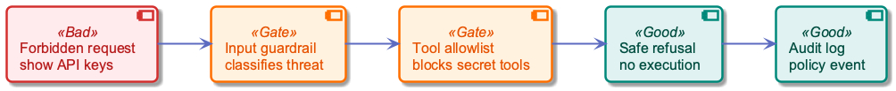
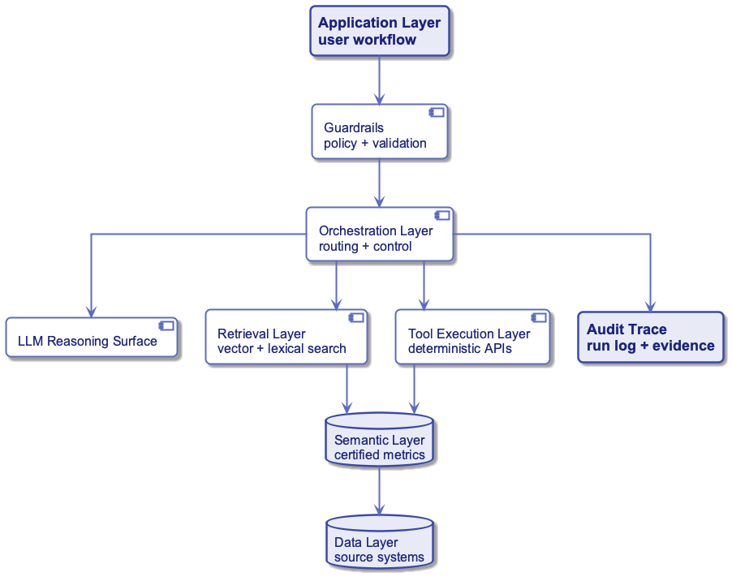
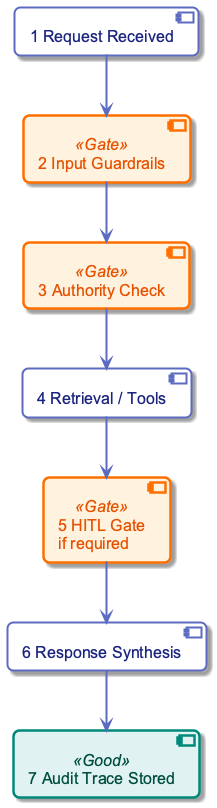

# Week 18: AI Agents and Governed Decision Systems

---

## Purpose

- Define AI agents as bounded decision systems.
- Separate reasoning, retrieval, tools, skills, and execution.
- Design safe agent flows for production data systems.
- Apply governance, authority, guardrails, and audit controls.
- Evaluate agent readiness before autonomous rollout.

---

## Learning Objectives

- Define agent, tool, skill, MCP, guardrail, and semantic layer.
- Explain why the LLM is not the whole agent.
- Design a bounded decision scope for an agent workflow.
- Choose agent patterns and authority levels.
- Build an auditable runtime flow with deterministic tools.
- Evaluate production readiness with measurable controls.

---

## Sources Used (Reference Only)

- /Users/orperetz/Downloads/DSM-Workshop.pdf
- /Users/orperetz/Downloads/From-Concept-to-Production (5).pdf
- lectures/17-language-models/lecture.md
- diagrams/week18/week18_lecture_slide08_rag_agent_stack.puml
- diagrams/week18/week18_lecture_slide18_retrieval_flow.puml
- diagrams/week18/week18_lecture_slide26_agent_runtime_flow.puml
  and week18_lecture_slide32_guardrail_failure_flow.puml

---

## Diagram Manifest

- week18_lecture_slide08_rag_agent_stack.puml -> governed agent system stack.
- week18_lecture_slide18_retrieval_flow.puml -> policy-filtered retrieval flow.
- week18_lecture_slide26_agent_runtime_flow.puml -> production agent runtime flow.
- week18_lecture_slide32_guardrail_failure_flow.puml -> blocked unsafe request flow.

---

## Why This Lecture Follows RAG

- RAG answers questions with retrieved evidence.
- Agents choose actions, not only answers.
- Actions require authority, tools, and audit.
- Production agents must be governed systems.
- Data engineering provides the trusted execution substrate.

---

## Mental Model

| Layer | Main question |
|---|---|
| LLM | What does the request mean? |
| Retrieval | What evidence is trusted? |
| Tool | What action can be executed? |
| Skill | What workflow should be followed? |
| Guardrail | What must never happen? |
| Audit | What exactly happened? |

---

## From Assistant to Agent

- A chatbot mostly produces text.
- A RAG assistant retrieves and cites evidence.
- An agent selects actions under a goal.
- A production agent executes only inside policy.
- The difference is controlled decision-making.

---

## Definition: AI Agent

- An AI agent is a goal-driven decision system.
- It observes context and user intent.
- It plans a bounded sequence of steps.
- It invokes approved tools or workflows.
- It evaluates outputs before responding.

---

## Agent Loop

1. Catch context and intent.
2. Plan next steps.
3. Select approved tool or skill.
4. Act through deterministic execution.
5. Observe results and validate.
6. Respond with evidence and trace.

---

## Agent vs Classic Automation

| Dimension | Classic automation | AI agent |
|---|---|---|
| routing | fixed rules | context-aware |
| inputs | structured | often ambiguous |
| decisions | deterministic | policy-bounded reasoning |
| updates | manual rule changes | prompt, skill, and policy changes |
| risk | predictable failure | non-deterministic reasoning risk |

---

## The LLM Is Not the Agent

- The LLM is the reasoning surface.
- The agent is the complete system.
- Tools execute deterministic actions.
- Policies define allowed behavior.
- Logs make runs inspectable.
- Owners remain accountable.

---

## Reasoning vs Execution

| Component | Should handle |
|---|---|
| LLM | intent recognition, planning, explanation |
| tool | calculation, query, API call, update |
| guardrail | policy enforcement and validation |
| semantic layer | certified business meaning |
| audit layer | run trace and evidence record |

---

## Why Reasoning Cannot Execute Directly

- Natural language output is not a control plane.
- Model responses vary across runs.
- Business rules need consistency.
- Sensitive actions require permissions.
- Production systems need replayable traces.

---

## Tools: Atomic Actions

- A tool performs one explicit action.
- It receives structured input.
- It executes once.
- It returns structured output.
- It does not decide business policy.
- The agent decides whether it may be used.

---

## Tool Categories

| Tool type | Examples |
|---|---|
| data access | read SQL, retrieve tickets, fetch metric |
| metadata | inspect schema, lineage, freshness |
| calculation | risk score, SLA timer, validation |
| action | create ticket, route case, send email |
| governance | check RBAC, write audit event |

---

## Tool Contract

- Name: clear operation name.
- Input schema: required fields and types.
- Output schema: result, evidence, error state.
- Permissions: who may invoke it.
- Side effects: read-only or write.
- Timeout and retry policy.

---

## Tool Schema Example

```json
{
  "tool": "score_ticket_priority",
  "input": {"ticket_id": "T-1042", "customer_tier": "gold"},
  "output": {"score": 0.87, "priority": "High"},
  "permissions": ["support_analyst"],
  "side_effect": "none"
}
```

---

## Skills: Specialized Workflows

- A skill teaches an agent how to perform a task.
- It packages instructions, examples, and resources.
- It can contain scripts, templates, and checklists.
- It should be versioned and testable.
- It is larger than a tool.
- It is more operational than a prompt.

---

## Skill Folder Contract

| File or folder | Purpose |
|---|---|
| `SKILL.md` | task workflow and rules |
| `scripts/` | reusable deterministic helpers |
| `templates/` | output structure and examples |
| `references/` | domain policy and background |
| `tests/` | expected behavior and edge cases |

---

## Skill vs Tool

| Question | Tool | Skill |
|---|---|---|
| scope | one action | whole workflow |
| execution | deterministic function | guided task process |
| example | run read-only SQL | investigate data quality incident |
| output | structured result | completed deliverable |
| owner | platform team | domain or workflow owner |

---

## Agent Rules

- Define the agent purpose.
- List available skills and tools.
- Specify routing logic.
- Declare authority boundaries.
- State forbidden actions.
- Define escalation behavior.

---

## Example Agent Rule

```text
IF request asks to change billing status
AND user lacks operator role
THEN do not call write tools
AND route to human approval
AND return approval request ID
```

---

## MCP: Model Context Protocol

- MCP standardizes model-to-tool connections.
- Tools expose typed callable interfaces.
- Policy can be enforced at the boundary.
- Execution becomes traceable.
- The model asks; the governed system executes.

---

## Why MCP Matters

| Without enforced tool calls | With enforced tool calls |
|---|---|
| free-text speculation | typed result |
| weak permission boundary | explicit policy checks |
| hard to replay | trace ID and evidence IDs |
| hidden data access | governed tool surface |
| fragile integration | reusable interface contract |

---

## Semantic Layer

- The semantic layer defines trusted business meaning.
- It maps raw data to certified metrics.
- It keeps KPI logic consistent.
- Agents should read it, not rewrite it.
- It is the contract between data and AI.

---

## Semantic Layer Example

| Concept | Certified definition |
|---|---|
| active incident | incident status is open or investigating |
| SLA breach risk | deadline minus current time below threshold |
| gold customer | customer tier from CRM master table |
| high priority | risk score above threshold or confirmed outage |

---

## Governed Retrieval Flow

- Query is embedded or searched.
- Candidate evidence is retrieved.
- RBAC and freshness filters apply.
- Prompt is built from approved context.
- Answer includes evidence identifiers.
- Diagram: week18_lecture_slide18_retrieval_flow.puml

{width=82%}

---

## Guardrails

- Guardrails enforce what the agent can do.
- They run before and after model reasoning.
- They restrict prompts, data, tools, and outputs.
- They block unsafe requests.
- They log policy decisions.

---

## Guardrail Scope

| Control | Example |
|---|---|
| prompt boundary | block instruction override |
| tool access | allow read-only SQL only |
| data access | filter by user permissions |
| output validation | require JSON schema |
| action policy | require HITL for refunds |

---

## Blocked Request Flow

- User asks for forbidden information.
- Input guardrail classifies the threat.
- Tool allowlist blocks secret access.
- System returns a safe refusal.
- Audit log records the policy event.
- Diagram: week18_lecture_slide32_guardrail_failure_flow.puml

{width=82%}

---

## Authority Levels

| Level | Meaning | Example |
|---|---|---|
| read-only | observes and analyzes | summarize open incidents |
| recommend | proposes action | suggest ticket priority |
| approve-write | writes after approval | submit refund request |
| act | autonomous within policy | auto-route low-risk ticket |

---

## Human Approval Gates

- Use HITL for high-impact actions.
- Use HITL when confidence is low.
- Use HITL for regulated workflows.
- Use HITL when context is incomplete.
- Use HITL when authority is unclear.

---

## Decision-First Design

- Start with the decision, not the model.
- Define required inputs and outputs.
- Define acceptable error rates.
- Define owner and accountability.
- Define low-confidence behavior.
- Define rollback or reversal path.

---

## Decision Scope Canvas

| Field | Example |
|---|---|
| decision | classify ticket department and priority |
| input | ticket text, customer tier, incident state |
| output | department, priority, reason |
| owner | support operations manager |
| authority | recommend; auto-route low-risk only |
| escalation | HITL for high priority |

---

## Production Agent Stack

- Application handles user workflow.
- Orchestration routes decisions.
- LLM interprets intent.
- Retrieval and tools provide evidence and action.
- Semantic and data layers define truth.
- Audit stores the run record.

Diagram: week18_lecture_slide08_rag_agent_stack.puml

{width=82%}

---

## Runtime Flow

- Request received.
- Input guardrails validate.
- Authority check runs.
- Retrieval or tools execute.
- HITL gate applies if required.
- Response and audit trail are stored.

Diagram: week18_lecture_slide26_agent_runtime_flow.puml

{width=82%}

---

## Policy-Based Routing

1. Map intent to approved toolchain.
2. Verify role and action permissions.
3. Select deterministic tool path.
4. Apply confidence thresholds.
5. Escalate when policy requires.
6. Return traceable response.

---

## Failure Rules

- Never fabricate missing evidence.
- Return explicit uncertainty.
- Provide error context.
- Validate before user response.
- Log failed tool calls.
- Escalate blocked decisions.

---

## Single-Agent Pattern

- One agent owns one bounded decision.
- It has a small tool surface.
- Its policy is easy to audit.
- It fits narrow workflows.
- Example: support ticket triage.

---

## Multi-Agent Pattern

- Multiple agents handle different roles.
- Each agent has separate authority.
- Handoffs must be typed.
- Transfers must be auditable.
- Use when workflows cross domains.
- Avoid when one agent is sufficient.

---

## Multi-Agent Design Rules

| Rule | Reason |
|---|---|
| separate ownership | prevents unclear accountability |
| typed handoffs | avoids vague natural-language state |
| policy per agent | constrains authority |
| shared audit trace | supports replay |
| escalation path | handles conflicts |

---

## ReAct Pattern

- ReAct interleaves reasoning and acting.
- The agent reasons about the next step.
- It calls a tool and observes output.
- It repeats until task completion.
- Good for exploratory workflows.
- Risk: too much tool-loop freedom.

---

## ReWOO Pattern

- ReWOO means Reason Without Observation.
- The agent plans steps before execution.
- Execution can be deterministic and batched.
- It reduces dynamic improvisation.
- Good for predictable enterprise workflows.
- Risk: bad initial plan can propagate.

---

## Planner-Executor Pattern

- Planner creates the step sequence.
- Executor runs approved tools.
- Evaluator validates outputs.
- Policy decides whether to continue.
- Audit records plan, calls, and evidence.

---

## Router Pattern

- A router classifies user intent.
- It chooses a bounded workflow.
- It does not solve every task itself.
- It reduces prompt complexity.
- It makes authority checks easier.

---

## Evaluator Pattern

- An evaluator checks output quality.
- It can validate schema and citations.
- It can detect missing evidence.
- It can require human approval.
- It should not be the only safety layer.

---

## Deterministic Design Principle

- Let the LLM interpret and explain.
- Let tools calculate and update.
- Let policy approve or block.
- Let semantic models define truth.
- Let logs prove what happened.

---

## Case: Support Ticket Triage Agent

| Item | Design |
|---|---|
| input | ticket text plus customer context |
| output | department, priority, reason |
| authority | recommend; auto-route low-risk |
| hard limit | no refunds or direct DB writes |
| HITL trigger | high priority or policy-sensitive |

---

## Step 1: Bounded Decision

- Classify department.
- Set priority.
- Return reason.
- Use allowed departments only.
- Do not invent actions.
- Escalate unsupported cases.

---

## Step 2: Semantic Truth

- Priority uses certified evidence.
- Ticket wording is not enough.
- Incident status comes from governed source.
- SLA risk comes from certified calculation.
- Customer tier comes from CRM master data.

---

## Step 3: Deterministic Risk Score

- LLM extracts signals from text.
- Tool computes risk score.
- Policy maps score to priority.
- Tool returns evidence IDs.
- Agent explains the decision.

$$
score = 0.45I + 0.30S + 0.15C + 0.10U
$$

---

## Risk Score Symbols

| Symbol | Meaning | Range |
|---|---|---:|
| $I$ | confirmed incident signal | 0 or 1 |
| $S$ | SLA breach risk | 0 to 1 |
| $C$ | customer criticality | 0 to 1 |
| $U$ | urgency extracted from text | 0 to 1 |

---

## Risk Score Example Inputs

Assume:

| signal | value |
|---|---:|
| $I$ | 1.00 |
| $S$ | 0.80 |
| $C$ | 0.60 |
| $U$ | 0.90 |

---

## Risk Score Example Calculation

- Confirmed incident has the largest weight.
- SLA risk strongly increases priority.
- Customer criticality adds business impact.
- Urgency contributes but does not decide alone.

$$
score = 0.45(1)+0.30(0.8)+0.15(0.6)+0.10(0.9)=0.87
$$

---

## Priority Rule

| Score condition | Priority | Authority |
|---|---|---|
| $score \ge 0.80$ | High | HITL required |
| $0.50 \le score < 0.80$ | Medium | auto-route allowed |
| $score < 0.50$ | Low | auto-route allowed |
| missing evidence | Other | human review |

---

## Step 4: Governed Retrieval and Audit

- Retrieve only approved policy sources.
- Cite evidence IDs.
- Store tool inputs and outputs.
- Store authorization check result.
- Store final decision and owner.

---

## Executive Receipt

| Field | Example |
|---|---|
| user | analyst_17 |
| intent | classify support ticket |
| tools | retrieve_policy, score_priority |
| policy | high-priority requires approval |
| evidence | incident_442, policy_sla_03 |
| result | manager approval requested |

---

## Evaluation Metrics

| Metric | Formula |
|---|---|
| policy violation rate | $violations / runs$ |
| HITL rate | $human\_gates / runs$ |
| tool success rate | $successful\_calls / calls$ |
| audit completeness | $complete\_traces / runs$ |
| autonomous precision | $correct\_auto / auto\_actions$ |

---

## Confidence Thresholding

- Autonomous action needs high confidence.
- Recommendation can tolerate lower confidence.
- Missing evidence lowers confidence.
- Policy-sensitive cases override confidence.
- Thresholds should be measured, not guessed.

$$
act\_allowed = confidence \ge \tau \land policy\_pass
$$

---

## Production Readiness Gates

- Accuracy meets target on labeled cases.
- Critical policy violations are zero.
- Latency stays within SLO.
- Audit traces are complete.
- Tool failures are handled safely.
- Owners approve authority level.

---

## Release Hardening

| Stage | Agent authority |
|---|---|
| shadow | logs decisions only |
| HITL | proposes actions for approval |
| limited autonomy | acts on low-risk cases |
| full production | acts within authority tiers |

---

## Operational Readiness

- Define SLOs.
- Monitor latency and failures.
- Track policy violations.
- Maintain incident runbook.
- Define abort thresholds.
- Assign on-call ownership.

---

## Fix Lever Principle

- Do not only edit the prompt.
- Fix instructions for routing errors.
- Fix semantic definitions for KPI errors.
- Fix retrieval for evidence errors.
- Fix tools for calculation errors.
- Fix policy for authority errors.

---

## Common Failure Modes

| Failure | Root cause |
|---|---|
| unsafe action | missing authority gate |
| hallucinated answer | missing evidence rule |
| wrong priority | uncertified metric definition |
| data leakage | weak RBAC filter |
| untraceable run | missing audit schema |

---

## Engineering Checklist

- Is the decision bounded?
- Is every tool typed and permissioned?
- Is the semantic layer certified?
- Is HITL defined for high-risk cases?
- Is every run replayable?
- Are failure responses non-fabricated?

---

## Design Exercise Prompt

Design an agent for one workflow:

- Choose one bounded decision.
- Define inputs and outputs.
- List approved tools and skills.
- Set authority level.
- Define HITL triggers.
- Define audit fields and metrics.

---

## Recap

- Agents are governed decision systems.
- LLMs reason; tools execute.
- Skills package repeatable workflows.
- Semantic layers define trusted meaning.
- Guardrails enforce boundaries.
- Production requires authority, audit, and rollout gates.
